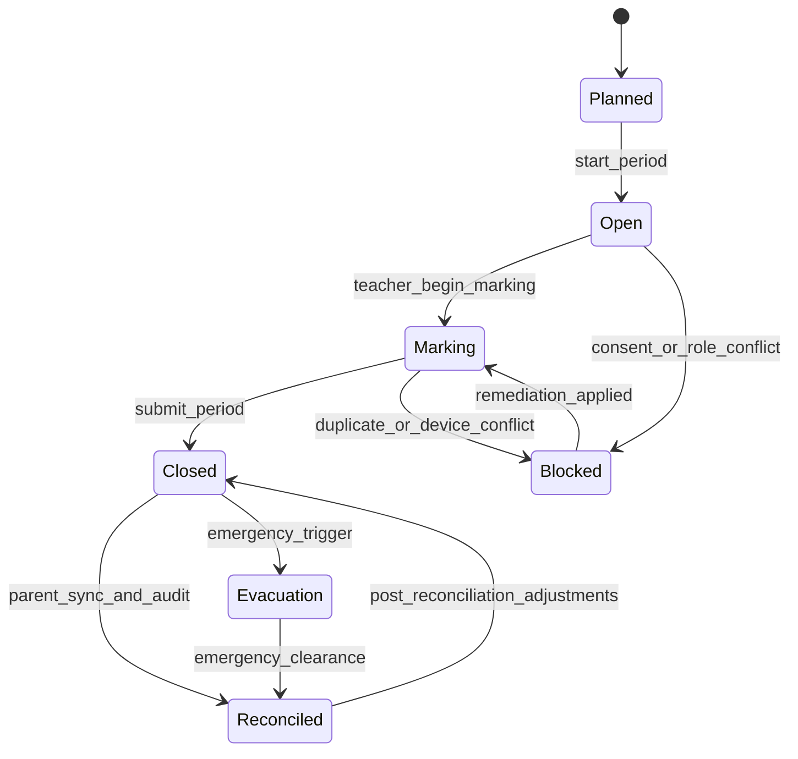
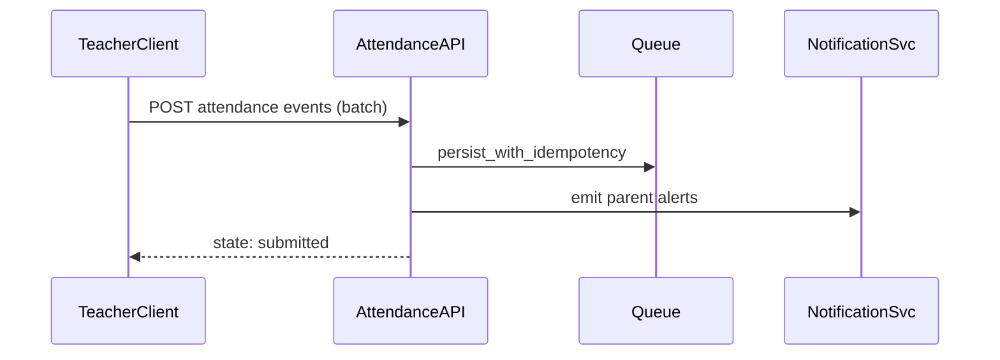

# ADR-095: Attendance and Duty of Care Execution Package

## Metadata
- **status**: accepted
- **decision-date**: 2026-03-02
- **scope**: attendance + visitor management + welfare-triggered continuity
- **source-artifact**: [USER_JOURNEY_EXECUTION_GOVERNANCE.md](../platform/USER_JOURNEY_EXECUTION_GOVERNANCE.md), [attendance_exception_catalogue.md](attendance_exception_catalogue.md), [kiosk_and_integrity_model.md](kiosk_and_integrity_model.md), [visitor_emergency_state_model.md](visitor_emergency_state_model.md)
- **status-gate**: planning corpus + ADR governance review

## Context
Attendance and duty of care failures are the highest-risk user-facing operational defects because they involve child safety, legal evidence, and parent trust.

## Decision
Implementation of Attendance/Duty of Care is blocked until a complete journey and prototype package is approved and covers:
- live class/period state,
- exception capture,
- visitor handling,
- parental visibility with consent-aware redaction.

## Persona Journeys
1. **Teacher Marking**
   - Teacher opens live roster → marks period attendance → posts exception reasons.
2. **Staff Duty Snapshot**
   - Admin/staff executes school-wide day-close sweep and exception exports.
3. **Parent Acknowledgement**
   - Parent/carer views absence, adds explanation, and acknowledges with identity proof.
4. **Kiosk Workflow**
   - Device/offline capture, duplicate prevention, verification reconciliation.
5. **Evacuation Roll**
   - All active attendance states transition to `evacuation`; after clearance, transition to rejoin reconciliation state.

## Required Prototype Package
- Required screens:
  - `/attendance/period/:id/roster`
  - `/attendance/staff`
  - `/attendance/exceptions`
  - `/attendance/visitor-log`
  - `/attendance/evacuation`
- Failure simulations:
  - consent revoked mid-run,
  - partial sync after network drop,
  - duplicate kiosk scans,
  - visitor access expiry conflict,
  - offline batch replay rejection.

## Required Diagrams

## Acceptance Criteria
- 5 positive + 5 negative cases for period marking and exception handling.
- No route allows parent visibility on sensitive attendance metadata beyond permitted scope.
- Day-close pipeline must be replay-safe and idempotent.
- Evacuation state is auditable by actor, timestamp, and school action chain.

## API and UI Impacts
- Required APIs:
  - `POST /attendance/events/batch`
  - `POST /attendance/evacuation/start`
  - `POST /attendance/visitor/register`
- UI requirements:
  - mandatory offline indicator and conflict resolution panel,
  - explicit reason codes on denied saves,
  - bulk exception bulk-acknowledge with audit trail export.

## Owners
- Domain Owner: Attendance and Student Wellbeing
- Review Owner: Trust + Security + QA
