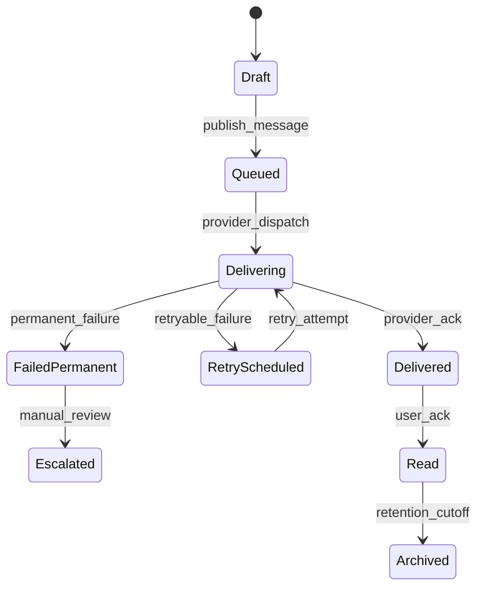
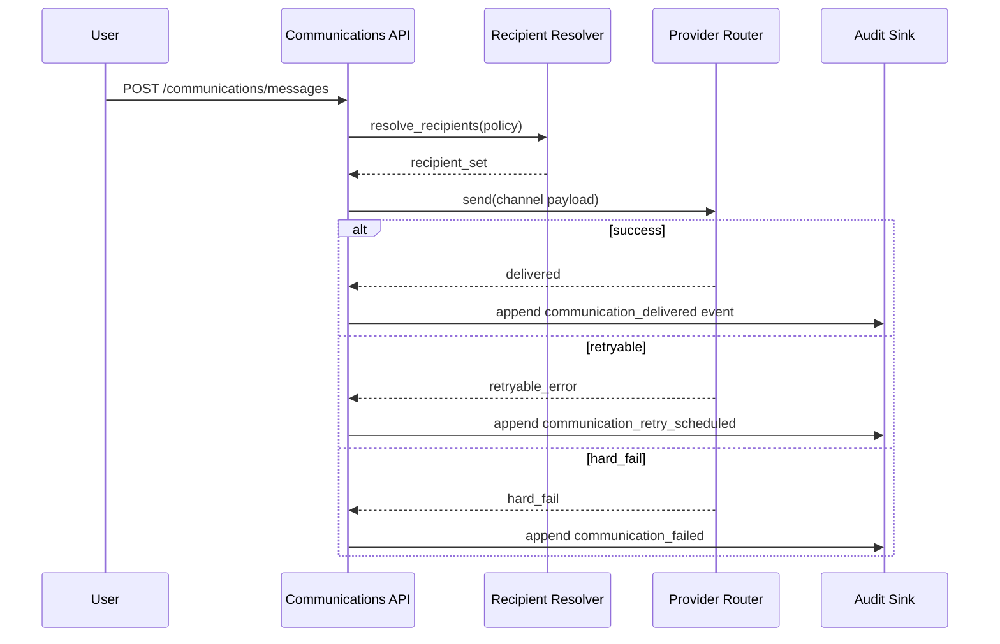

# ADR-100: Communications Execution Package

## Metadata
- **status**: accepted
- **decision-date**: 2026-03-02
- **scope**: notices, secure messaging, notification delivery, and communication auditability
- **source-artifact**: [USER_JOURNEY_EXECUTION_GOVERNANCE.md](../platform/USER_JOURNEY_EXECUTION_GOVERNANCE.md), [web_journey_map_and_navigation_matrix.md](web_journey_map_and_navigation_matrix.md), [communication_privacy_routing.md](communication_privacy_routing.md), [message_audit_and_retention.md](message_audit_and_retention.md), [notification_timing_and_retry.md](notification_timing_and_retry.md), [personas_and_route_matrix.md](personas_and_route_matrix.md), [OPENAUSLMSK12_MASTER_PLAN.md](../../OPENAUSLMSK12_MASTER_PLAN.md)
- **status-gate**: planning corpus + ADR governance review

## Context
Communication is the highest-touch surface for parents, carers, and staff and contains multiple compliance risk points: privacy leakage, consent mismatch, undelivered alerts, and opaque retry behavior. These are not optional refinements; they are part of baseline safety.

## Decision
Introduce a single communications execution package with shared contracts for 1) notices, 2) secure conversations, 3) notification channels, and 4) delivery auditability. Communication features must use a common delivery policy object and be consent-aware before sending to recipients.

## Persona Journeys
1. **Parent Attendance Exception Acknowledgement**
   - Parent receives explanation push/SMS/email, acknowledges in portal, and status is recorded against the underlying incident.
2. **Teacher-Class Notice Dispatch**
   - Teacher drafts a notice for a class cohort, previews recipients by role/consent, sends, and monitors delivery state.
3. **Emergency Broadcast with Scope**
   - Admin selects school/campus subset and sends priority notice; message has immutable audit trail and timed escalation if undelivered.
4. **Case-Linked Messaging**
   - Staff creates case-linked thread (wellbeing/incident/timetable) and keeps visible participants in sync with permissions and custody boundaries.
5. **Interview/Meeting Coordination**
   - Parent and staff coordinate interview scheduling with reminders, consent checks, and cancellation propagation.

## Required Prototype Package
- Route sketches: 
  - `/communications/notices`
  - `/communications/messages`
  - `/communications/messages/:id`
  - `/communications/threads/:id`
  - `/communications/preferences`
  - `/communications/notifications`
- Failure simulations:
  - duplicate send while user retries,
  - consent revoked mid-delivery,
  - notification provider outage and retry fallback,
  - tenant mismatch for message routing,
  - partial recipient set due to family relation constraints.

## Required Diagrams

## Acceptance Criteria
- Every communication action emits immutable communication/audit events with actor and scope claims.
- Consent and household constraints are re-evaluated at both compose-time and send-time.
- All notification channels implement idempotency, dead-letter state, and bounded retries.
- Route-level UX exposes explicit states: pending, delivered, failed, escalated, and acknowledged.
- A minimum of one parent/carer and one staff journey include successful and failed delivery assertions.

## API and UI Impacts
- Required endpoints:
  - `POST /communications/messages`
  - `PATCH /communications/messages/{id}/recall`
  - `GET /communications/messages/{id}`
  - `POST /communications/notifications/{id}/acknowledge`
  - `GET /communications/notifications/delivery`
- Required UI components:
  - message composer with policy preview,
  - thread timeline with actor and visibility badges,
  - notification panel with retry/escalation details.

## Data Model Impact
- Canonical table additions:
  - `message`, `message_recipient`, `message_visibility_scope`, `message_delivery_attempt`, `notification_preference`
- Ensure every row has tenant and household scope and redaction flags for shared-family recipients.
- Add immutable attachment hashes for message files and anti-malware reference states.

## Owners
- Domain Owner: Communications
- Review Owner: Security + Trust + QA
