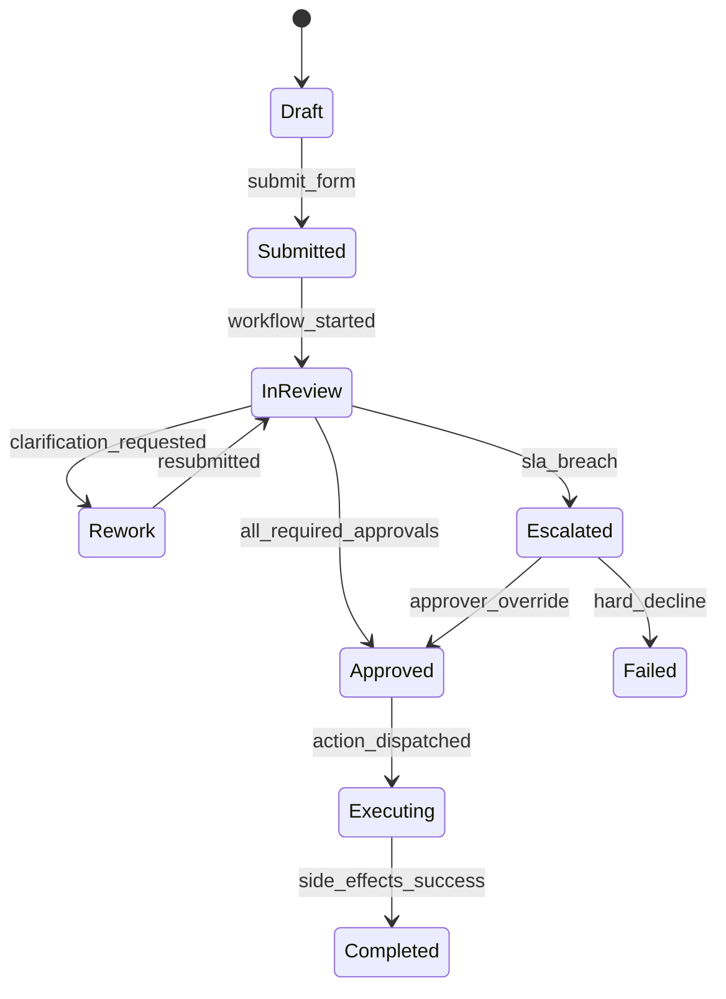
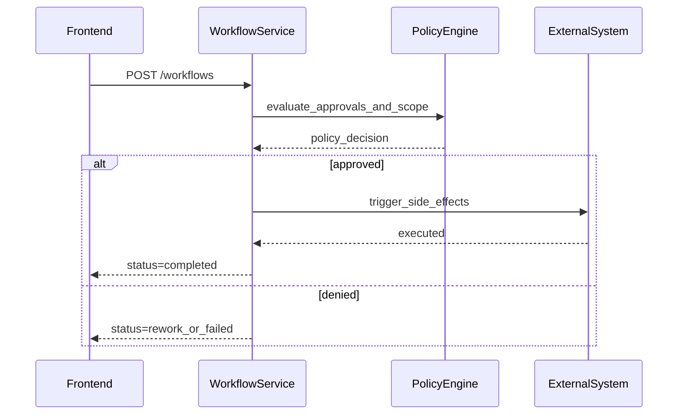

# ADR-101: Forms And Workflow Execution Package

## Metadata
- **status**: accepted
- **decision-date**: 2026-03-02
- **scope**: form templates, form workflows, approvals, and automated process orchestration
- **source-artifact**: [FORM_SCHEMA_REFERENCE.md](../learning/form_schema_reference.md), [workflow_escalation_formalization.md](../operations/workflow_escalation_formalization.md), [saga_and_compensation_behavior.md](../operations/saga_and_compensation_behavior.md), [OPERATIONS_EVENTS_EXECUTION_PACKAGE.md](../operations/OPERATIONS_EVENTS_EXECUTION_PACKAGE.md), [OPENAUSLMSK12_MASTER_PLAN.md](../../OPENAUSLMSK12_MASTER_PLAN.md)
- **status-gate**: planning corpus + ADR governance review

## Context
Most school workflows require approvals plus record linkage (forms -> incidents -> finance/health entries). Without a single forms and workflow execution model, teams create divergent approval behavior and lose audit traceability.

## Decision
Form and workflow execution must be a single cross-domain package with explicit process state machines, approval roles, escalation timers, and provenance linking to source records (enrolment, wellbeing, operations, finance).

## Persona Journeys
1. **Enrollment Compliance Intake**
   - Support staff creates application/consent form, routes for admin/legal approval, and links artifacts to student profile.
2. **Parent Approval Loop**
   - Parent submits a form and can track status changes plus request clarifications.
3. **Incident Action Workflow**
   - Staff opens incident response form, auto-generates task assignments, and escalates if overdue.
4. **Supplier/Field Request Workflow**
   - Admin submits workflow with attachments, approver updates state, procurement/HR receives downstream events.
5. **Template Revision and Versioning**
   - Domain owner edits active form template while keeping old submissions valid under original schema.

## Required Prototype Package
- Route sketches:
  - `/forms/templates`
  - `/forms/templates/:id`
  - `/forms/:id/submit`
  - `/workflows`
  - `/workflows/:id`
  - `/workflows/:id/activity`
- Failure simulations:
  - invalid schema submission,
  - approver role mismatch,
  - template changed mid-submission,
  - SLA timeout and automatic escalation,
  - compensating action for declined workflow.

## Required Diagrams

## Acceptance Criteria
- Every form schema version can be rendered and submitted without breaking already-submitted records.
- Workflow transitions must include approver identity, action reason, timestamp, and correlation ID.
- SLA timer transitions and escalations are machine-enforced, testable, and auditable.
- Workflow action side effects are idempotent and recorded as compensation-capable events when required.

## API and UI Impacts
- Required endpoints:
  - `POST /forms/templates`
  - `PATCH /forms/templates/{id}`
  - `POST /forms/submissions`
  - `GET /forms/submissions/{id}`
  - `POST /workflows`
  - `POST /workflows/{id}/transition`
  - `POST /workflows/{id}/cancel`
- UI requirements:
  - workflow inspector with timeline,
  - template version indicator,
  - clear action buttons for rework/escalate/close.

## Data Model Impact
- Canonical additions:
  - `form_template`, `form_schema_version`, `form_submission`, `workflow_definition`, `workflow_execution`, `workflow_transition`, `workflow_task`
- Store all field-level values as encrypted-at-rest values where flagged in policy.
- Preserve immutable linkage from `form_submission` to downstream domain entities (wellbeing, events, finance, admissions).

## Owners
- Domain Owner: Platform Operations + Cross-domain Product
- Review Owner: Security + Compliance + QA
