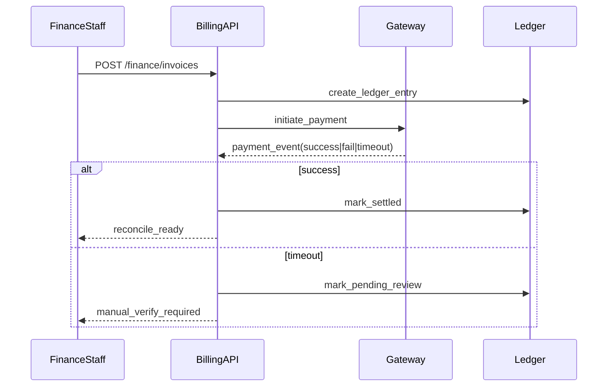
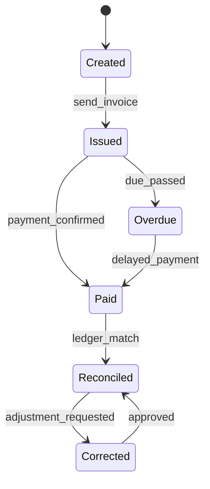

# ADR-097: Finance and Services Execution Package

## Metadata
- **status**: accepted
- **decision-date**: 2026-03-02
- **scope**: billing, payments, services, contributor flows
- **source-artifact**: [USER_JOURNEY_EXECUTION_GOVERNANCE.md](../platform/USER_JOURNEY_EXECUTION_GOVERNANCE.md), [LOW_FIDELITY_PROTOTYPING_STANDARD.md](../platform/LOW_FIDELITY_PROTOTYPING_STANDARD.md), [finance_billing_state_machine.md](finance_billing_state_machine.md)
- **status-gate**: planning corpus + ADR governance review

## Context
Finance defects have high legal, trust, and reconciliation impact. The domain is implemented only after journey-level approval for invoicing, payment, and audit continuity.

## Decision
Finance work is split into three required journeys:
- invoice generation,
- payment collection,
- reconciliation/dispute.
Each journey must include a prototype, diagram, and explicit exception handling before coding.

## Persona Journeys
1. **Billing Issuance**
   - Admin/finance staff creates invoice from class enrollment and service events.
2. **Family Self-Service**
   - Parent/carer views outstanding items and payment methods.
3. **Payment Settlement**
   - Payment callback, timeout, retry, success, and reversal handling.
4. **Dispute and Correction**
   - Finance staff issues correction ledger entries with reason and approver.
5. **Gift/Donation/Wallet Add**
   - Optional service charges and credits with source trace.

## Required Prototype Package
- Required pages:
  - `/finance/invoices`
  - `/finance/invoices/:id`
  - `/finance/payments`
  - `/finance/reconciliation`
  - `/finance/disputes`
- Failure simulations:
  - duplicate payment callback,
  - webhook timeout,
  - partial-refund conflict,
  - consent/role denial in payment details,
  - retention lock preventing correction.

## Required Diagrams

## Acceptance Criteria
- Every payment path writes immutable financial audit event with actor + external reference.
- Reconciliation must be reproducible from events and invoice states.
- Reversal and correction actions must never mutate past audit records, only append compensating ledger events.
- Parent-facing balance view must use privacy-safe redaction for shared families.

## API and UI Impacts
- Required endpoints:
  - `POST /finance/invoices`
  - `POST /finance/payments/{id}/webhook`
  - `GET /finance/reconciliation/exports`
  - `POST /finance/corrections`
- UI requirements:
  - explicit financial impact before action,
  - clear retry/manual-review states,
  - printable audit pack from each terminal finance state.

## Owners
- Domain Owner: Finance and Services
- Review Owner: Compliance + Security + QA
