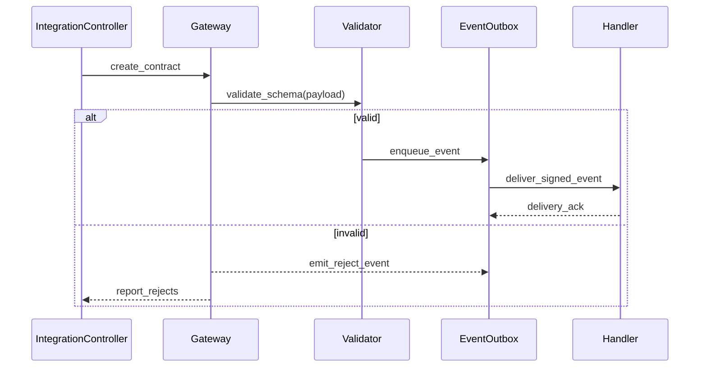

# ADR-103: Integration Fabric Execution Package

## Metadata
- **status**: accepted
- **decision-date**: 2026-03-02
- **scope**: integration clients, app registry, outbound webhooks, imports/exports, and contract governance
- **source-artifact**: [api_contract_registry.md](../integration/api_contract_registry.md), [api_and_webhook_contract_register.md](api_and_webhook_contract_register.md), [api_versioning_and_backward_compatibility.md](api_versioning_and_backward_compatibility.md), [webhook_reliability_contracts.md](webhook_reliability_contracts.md), [integration_and_webhook_contracts.md](integration_and_webhook_contracts.md), [COMPREHENSIVE_IMPLEMENTATION_ARTIFACT.md](../platform/COMPREHENSIVE_IMPLEMENTATION_ARTIFACT.md)
- **status-gate**: planning corpus + ADR governance review

## Context
Open integration points (SSO, payment, reporting, HR, LMS, SIS sync) are where data quality, tenancy, and security failures surface first. A single runtime abstraction is required to avoid protocol drift.

## Decision
Build a dedicated integration fabric with: 
- registered clients and credentials,
- stable API contracts,
- webhook delivery policies with retries/dead-letter,
- import/export pipelines with schema validation and reconciliation,
- observability for contract drift and replay handling.

## Persona Journeys
1. **Tenant Connector Provisioning**
   - Security lead creates connector record, sets scopes, rotates secret, validates callback URL.
2. **Inbound Import Validation**
   - External feed imports enrolment and attendance updates with schema validation and conflict report.
3. **Payment Event Relay**
   - External gateway sends callback; callback is idempotent and replay-safe.
4. **Outbound Event Subscription**
   - Downstream data consumers receive signed events with stable event IDs and version tags.
5. **Integration Incident Recovery**
   - Failed event retries, dead-letter review, and manual replay from checkpoint.

## Required Prototype Package
- Route sketches:
  - `/integrations/clients`
  - `/integrations/tokens`
  - `/integrations/contracts`
  - `/integrations/webhooks`
  - `/integrations/import-jobs`
  - `/integrations/export-jobs`
- Failure simulations:
  - connector secret leak/rotation during active traffic,
  - webhook replay and duplicate callback,
  - callback signature mismatch,
  - schema breaking update,
  - long-running import timeout.

## Required Diagrams

## Acceptance Criteria
- All integration clients require least-privilege scopes and explicit expiry policy.
- Contract upgrades are staged via versioned registry with deprecation path.
- External callback handlers are idempotent and support retry-safe deduplication.
- Import pipelines produce reconciliation reports and unresolved item queues.

## API and UI Impacts
- Required endpoints:
  - `POST /integrations/clients`
  - `PATCH /integrations/clients/{id}`
  - `POST /integrations/clients/{id}/rotate-secret`
  - `POST /integrations/contracts/{id}/publish`
  - `POST /integrations/webhooks/{id}/replay`
  - `POST /integrations/import-jobs`
  - `POST /integrations/export-jobs`
- UI requirements:
  - integration health panel,
  - contract and version viewer,
  - webhook delivery timeline and DLQ actions.

## Data Model Impact
- Canonical additions:
  - `integration_client`, `integration_token`, `integration_contract`, `integration_event`, `import_job`, `export_job`, `integration_error_log`
- Event delivery and connector secret operations are retained in immutable audit streams with tenant and actor context.

## Owners
- Domain Owner: Platform Integration
- Review Owner: Security + Reliability + QA
