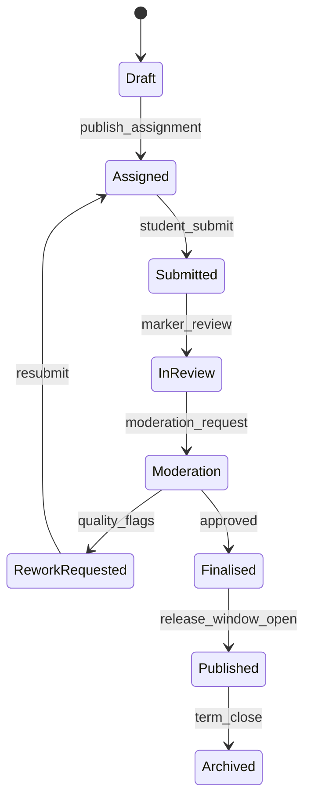
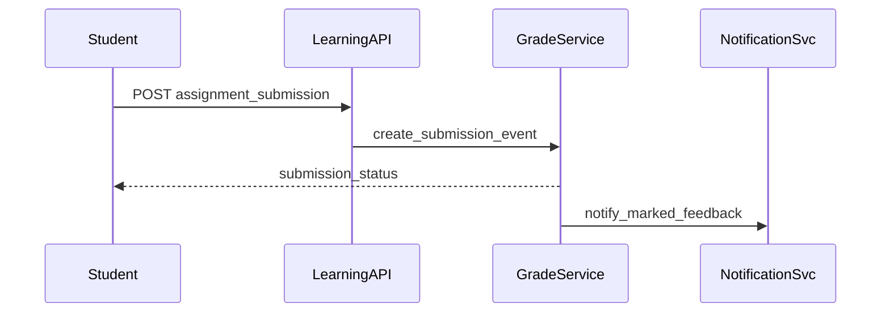

# ADR-096: Learning and Assessment Execution Package

## Metadata
- **status**: accepted
- **decision-date**: 2026-03-02
- **scope**: class content + assignment + grade publication
- **source-artifact**: [USER_JOURNEY_EXECUTION_GOVERNANCE.md](../platform/USER_JOURNEY_EXECUTION_GOVERNANCE.md), [LOW_FIDELITY_PROTOTYPING_STANDARD.md](../platform/LOW_FIDELITY_PROTOTYPING_STANDARD.md), [route_structure_and_component_contracts.md](../platform/route_structure_and_component_contracts.md)
- **status-gate**: planning corpus + ADR governance review

## Context
Learning and assessment touch students, teachers, and parents with high expectations for data accuracy and timeline correctness. Delayed grade publication or wrong visibility is a direct educational and governance defect.

## Decision
Core teaching journeys cannot begin before:
- class and lesson page prototypes are approved,
- assignment and moderation journeys include negative paths,
- assessment state transitions and visibility controls are explicitly modeled.

## Persona Journeys
1. **Teacher Class-Launch**
   - Create class, publish lessons and assignment templates, allocate cohort.
2. **Student Work Submission**
   - Student drafts offline, submits, receives validation and status.
3. **Teacher Grading**
   - Marker review → rubric feedback → moderation path → final mark.
4. **Parent Progress Viewing**
   - Parent sees allowed grades/progress based on consent + role.
5. **Rework Loop**
   - Rejected submission triggers resubmission with reason and deadline.

## Required Prototype Package
- Required pages:
  - `/learning/classes/:id`
  - `/learning/assignments/:id`
  - `/learning/assignments/:id/submit`
  - `/assessment/markbook/:classGroupId`
  - `/assessment/reports/:studentId`
- Required UX checks:
  - rubric scoring visibility before moderation,
  - parent-facing redaction for sensitive notes,
  - submission expiry and late rules clearly explained.

## Required Diagrams

## Acceptance Criteria
- Teachers can publish, amend, and retract assignment instructions with version history.
- Every submitted item has at least one immutable audit event (submit/edit/resubmit/grade).
- Moderation/rework transitions must preserve prior grade state for traceability.
- No grade or feedback appears to a parent without positive permission scope.

## API and UI Impacts
- Required endpoints:
  - `POST /learning/assignments`
  - `POST /learning/assignments/{id}/submit`
  - `PATCH /assessment/markbook/{id}`
  - `POST /assessment/moderation/{id}/decision`
- UI requirements:
  - explicit "submission locked" state for closed windows,
  - accessible score display and rubric expansion state,
  - safe rework flow for students and teachers.

## Owners
- Domain Owner: Learning and Assessment
- Review Owner: QA + Trust + Product
