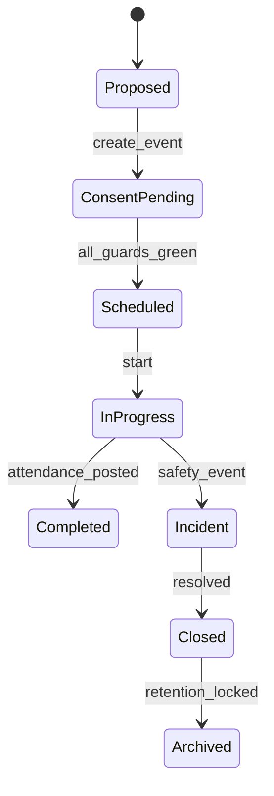
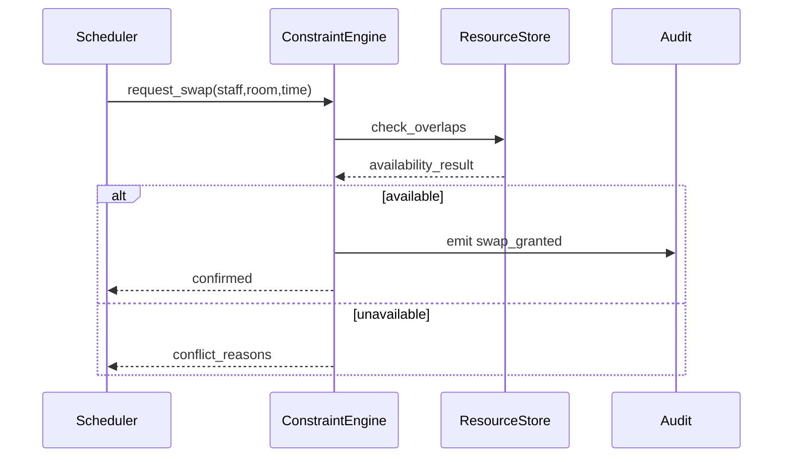

# ADR-098: Operations and Events Execution Package

## Metadata
- **status**: accepted
- **decision-date**: 2026-03-02
- **scope**: substitutions, scheduling operations, excursions, visitor operations
- **source-artifact**: [USER_JOURNEY_EXECUTION_GOVERNANCE.md](../platform/USER_JOURNEY_EXECUTION_GOVERNANCE.md), [route_structure_and_component_contracts.md](../platform/route_structure_and_component_contracts.md), [event_risk_and_consent_model.md](event_risk_and_consent_model.md), [constraint_resolution_policy.md](constraint_resolution_policy.md)
- **status-gate**: planning corpus + ADR governance review

## Context
Operations flows are concurrency-heavy and fail in edge conditions. The domain needs clear conflict-resolution behavior before development, especially substitutions, excursions, and consent-driven attendance during events.

## Decision
No operational schedule/visitor/event flow can be implemented until accepted prototypes define:
- conflict resolution behavior,
- consent expiry and revocation policy,
- handover and substitution state transitions.

## Persona Journeys
1. **Substitution Dispatch**
   - Lead teaches, substitute assigned, conflict checks pass, handover note captured.
2. **Resource and Room Allocation**
   - Timetable slot requests room/equipment with overlap detection.
3. **Excursion Lifecycle**
   - Proposal, consent, risk review, roll call, completion, incident flag.
4. **Visitor Access**
   - Pre-registered vs manual visitor, check-in, badge/QR path, expiry.
5. **Facility Incident Capture**
   - Work-order creation, priority routing, closure evidence.

## Required Prototype Package
- Required pages:
  - `/timetable/substitutions`
  - `/timetable/rooms`
  - `/events`
  - `/events/:id/consent`
  - `/operations/facility-incidents`
- Failure simulations:
  - concurrent booking collision,
  - substitution mismatch with staff unavailability,
  - consent revoked before excursion start,
  - visitor expired pass at entry,
  - incident escalated beyond SLA.

## Required Diagrams

## Acceptance Criteria
- Route-level prototypes prove deterministic behavior for at least one conflict per domain.
- All operations exceptions must record severity and response SLA state.
- Event attendance data and class attendance data must reconcile into a shared timeline for auditing.
- Manual overrides require approval trail and expiry.

## API and UI Impacts
- Required endpoints:
  - `POST /operations/schedules/substitutions`
  - `POST /operations/resources/allocate`
  - `POST /events/consent`
  - `POST /operations/facility-incidents`
- UI requirements:
  - conflict list prioritized by severity/time,
  - substitution handoff notes mandatory before active switch,
  - consent timeline visibility for event staff and admin.

## Owners
- Domain Owner: Operations and Scheduling
- Review Owner: Trust + Operations + QA
