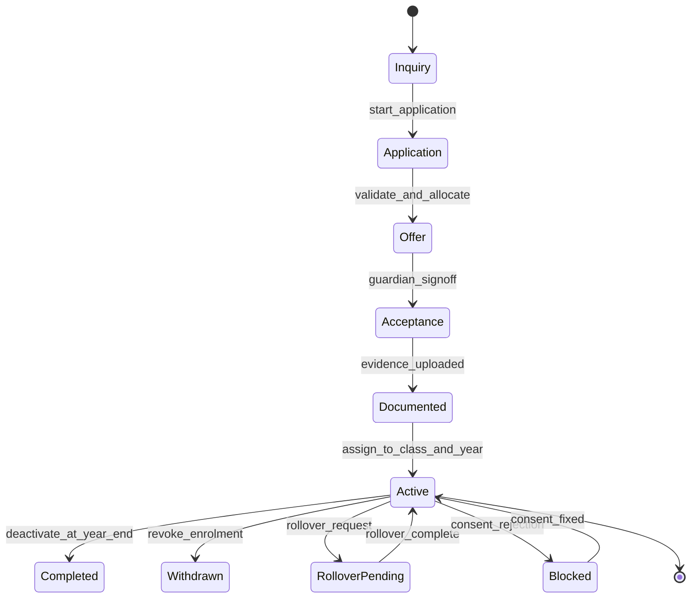
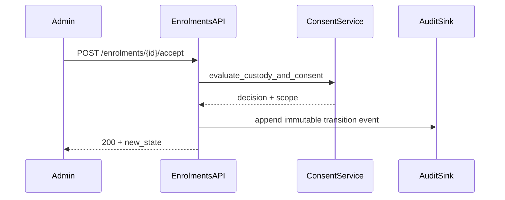

# ADR-094: Admissions and Enrolment Execution Package

## Metadata
- **status**: accepted
- **decision-date**: 2026-03-02
- **scope**: core operations + trust + people domain
- **source-artifact**: [USER_JOURNEY_EXECUTION_GOVERNANCE.md](../platform/USER_JOURNEY_EXECUTION_GOVERNANCE.md), [LOW_FIDELITY_PROTOTYPING_STANDARD.md](../platform/LOW_FIDELITY_PROTOTYPING_STANDARD.md), [ADMISSIONS_LIFECYCLE_erd.md](admissions_lifecycle_erd.md), [enrolment_lifecycle_state_machine.md](enrolment_lifecycle_state_machine.md)
- **status-gate**: planning corpus + ADR governance review

## Context
Admissions and enrolment are first-write domains that every other domain depends on. Any ambiguity here creates irreversible identity, household, and audit defects.

## Decision
Admit/rollback/review journeys in Admissions and Enrolment are mandatory gates for Release Cohort 1.
The workflow must ship with:
- approved low-fidelity route prototypes,
- state transition diagrams,
- explicit data migration and custody handling paths.

## Persona Journeys (Cohort 1)
1. **Prospect Intake**
   - Roles: `support_staff`, `admin`.
   - Path: prospect import -> duplicate resolution -> inquiry -> application.
   - Outputs: pending application event + validation summary.
2. **Offer and Acceptance**
   - Roles: `admin`, `principal`, `support_staff`, `parent_carer`, `student`.
   - Path: offer -> guardian auth -> compliance checks -> acceptance -> documented.
3. **Enrolment Creation**
   - Roles: `admin`, `principal`.
   - Path: documented -> class/year assignment -> active -> portal invite.
4. **Household and Custody Linkage**
   - Roles: `admin`, `support_staff`.
   - Path: person create/merge -> caregiver links -> consent model -> visibility scope.
5. **Rollover/Transfer**
   - Roles: `principal`, `admin`, `support_staff`.
   - Path: year-end transfer -> historical state lock -> carry-forward + exception ledger.

## Required Prototype Package
- Route sketches for:
  - `/enrolments/inquiries/new`
  - `/enrolments/applications/:id`
  - `/enrolments/:id/custody`
  - `/enrolments/:id/rollover`
- Prototype tests must show:
  - consent block vs allow for separated households,
  - duplicate merge conflict UI,
  - offline draft persistence for incomplete applications.
- Mandatory failure states:
  - invalid documents,
  - duplicate child identity,
  - failed consent capture,
  - duplicate or stale transition.

## Required Diagrams

## Acceptance Criteria
- Journey coverage:
  - 3 positive and 3 negative tests per persona in the package.
- Audit coverage:
  - all terminal transitions emit immutable events with actor + reason.
- Privacy coverage:
  - no admissions/household read by role without active scope claim.
- Rollback coverage:
  - application rollback does not erase evidence, only status and visibility state.

## API and UI Impacts
- New contract requirements:
  - application conflict endpoint,
  - household merge endpoint with manual override reason,
  - rollover endpoint with audit trail.
- UI requirements:
  - one-step undo for UI staging fields only (never for persisted evidence),
  - explicit consent visibility chips on all enrolment pages.

## Owners
- Domain Owner: People + Trust
- Review Owner: Compliance + Security + QA

