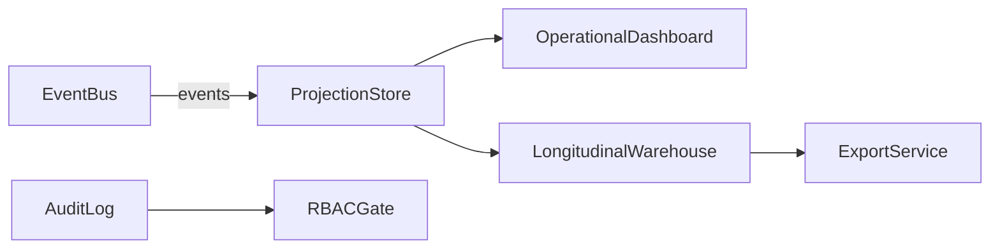
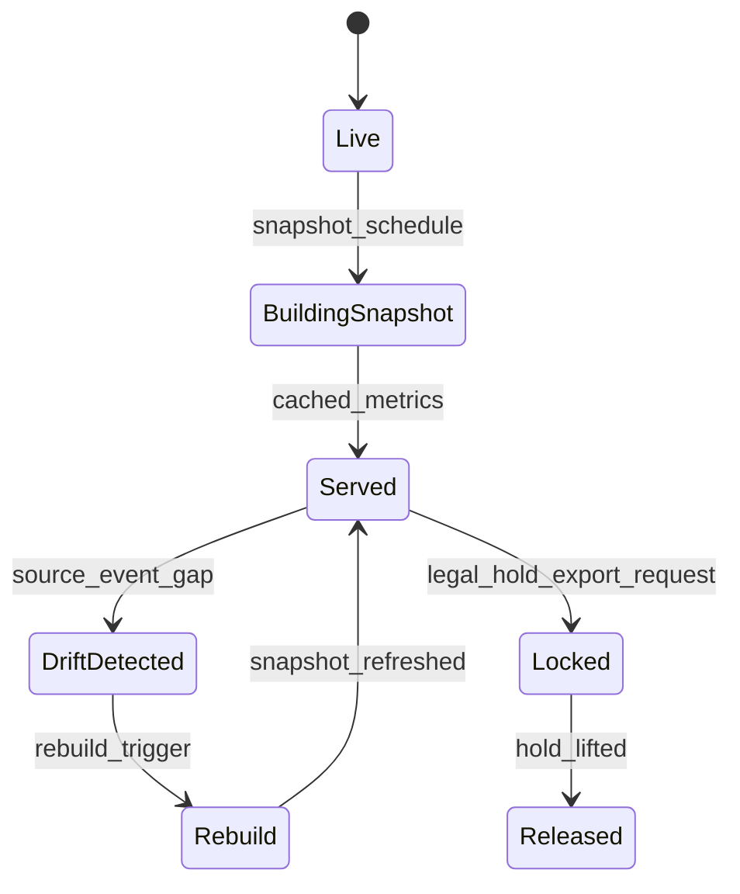

# ADR-104: Analytics Execution Package

## Metadata
- **status**: accepted
- **decision-date**: 2026-03-02
- **scope**: dashboards, longitudinal analytics, BI extracts, and KPI governance
- **source-artifact**: [ERD_AND_DATA_MODEL.md](../platform/ERD_AND_DATA_MODEL.md), [OPENAUSLMSK12_SYSTEM_BLUEPRINT.md](../platform/OPENAUSLMSK12_SYSTEM_BLUEPRINT.md), [QUALITY_AND_TEST_STRATEGY_MATRIX.md](../platform/QUALITY_AND_TEST_STRATEGY_MATRIX.md), [domain_state_machines.md](../platform/domain_state_machines.md), [IMPLEMENTATION_ROADMAP.md](../platform/IMPLEMENTATION_ROADMAP.md)
- **status-gate**: planning corpus + ADR governance review

## Context
Executive and operational decision-making requires low-latency operational views plus long-horizon trend analytics. Analytics must not degrade transactional throughput and must preserve consent boundaries.

## Decision
Implement analytics as a read-model-first subsystem fed by domain events with explicit tenant isolation, metric definitions, and export controls. Never query operational OLTP tables directly for high-volume reporting dashboards.

## Persona Journeys
1. **Leadership KPI Snapshot**
   - Principal checks attendance risk, incidents, and staffing coverage before morning briefing.
2. **Teacher Progress Dashboard**
   - Teacher reviews assignment completion and intervention trend.
3. **Wellbeing Watchlist Monitoring**
   - Support staff monitors aggregated student wellbeing risk indicators and action completion rates.
4. **Finance Health Review**
   - Finance views payment aging and reconciliation exceptions by family profile.
5. **Compliance Audit Export**
   - Admin triggers exports by date window and tenant policy for legal review.

## Required Prototype Package
- Route sketches:
  - `/analytics/overview`
  - `/analytics/kpis`
  - `/analytics/longitudinal/student`
  - `/analytics/export`
  - `/analytics/governance/traces`
- Failure simulations:
  - stale projection rebuild,
  - unauthorized field access,
  - export on legal-hold restricted tenant,
  - large event gap causing metric drift,
  - failed retention filter.

## Required Diagrams

## Acceptance Criteria
- Dashboards have sub-second response for frequently viewed leadership views under expected load.
- Export jobs include signed lineage metadata and source-event replay position.
- All computed indicators are traceable to event sources and governance policy.
- Analytics roles can read only fields permitted by the same RBAC/consent policy system used by core modules.

## API and UI Impacts
- Required endpoints:
  - `GET /analytics/dashboard/summary`
  - `GET /analytics/dashboard/:id`
  - `POST /analytics/snapshots`
  - `POST /analytics/exports`
  - `GET /analytics/exports/{id}/manifest`
- UI requirements:
  - drill-down with source correlation IDs,
  - role-sensitive metric visibility,
  - explainable metric definitions and refresh timestamp.

## Data Model Impact
- Canonical additions:
  - `analytics_snapshot`, `analytics_metric_definition`, `analytics_export_job`, `analytics_trace`, `analytics_projection_offset`
- Keep long-lived aggregates append-only where feasible; avoid in-place overwrites for auditability.
- Segregate operational event log, read model, and export cache by tenant and policy profile.

## Owners
- Domain Owner: Analytics and Reporting
- Review Owner: SRE + Trust + QA
