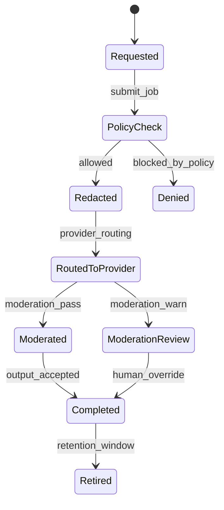

# ADR-105: AI Governance Execution Package

## Metadata
- **status**: accepted
- **decision-date**: 2026-03-02
- **scope**: optional AI feature enablement, provider routing, safety controls, and policy-driven governance
- **source-artifact**: [ai_data_classification_and_retention.md](../trust/ai_data_classification_and_retention.md), [ai_moderation_telemetry_plan.md](../trust/ai_moderation_telemetry_plan.md), [ai_policy_and_tenancy_model.md](../trust/ai_policy_and_tenancy_model.md), [ADMISSIONS_ENROLMENT_EXECUTION_PACKAGE.md](../people/ADMISSIONS_ENROLMENT_EXECUTION_PACKAGE.md)
- **status-gate**: planning corpus + ADR governance review

## Context
AI is requested as an optional capability across learning and operations, but ungoverned usage creates irreversible policy risk: unsafe student exposure, logging leaks, and untraceable generation workflows.

## Decision
Ship AI only via an opt-in tenant policy engine. Every AI request must pass redaction policy, prompt/response logging controls, moderation checks, and scoped tenant/model selection before execution.

## Persona Journeys
1. **AI Lesson Planning Assist (Teacher)**
   - Teacher requests lesson draft, reviews proposed content, applies edits, and publishes.
2. **AI Moderation Assist (Community/Comms)**
   - Message content is scanned for moderation risk and flagged before wider distribution.
3. **Image/Content Generation Approval**
   - User requests generated visual asset, admin policy determines allowed providers and storage policy.
4. **Incident Summary Generation**
   - Authorized staff requests draft wellbeing or incident summary; sensitive fields are redacted by policy.
5. **Safety Incident Review**
   - AI output is denied or downgraded by telemetry policy and manually reviewed.

## Required Prototype Package
- Route sketches:
  - `/ai/policies`
  - `/ai/jobs`
  - `/ai/providers`
  - `/ai/jobs/:id`
  - `/ai/settings`
- Failure simulations:
  - policy revoked mid-job,
  - redaction failure, retry,
  - prompt injection pattern blocked,
  - provider outage and fallback,
  - denied output due to sensitive category.

## Required Diagrams

## Acceptance Criteria
- Zero AI request executes without tenant policy resolution.
- All prompts and outputs are logged with tenant, actor, prompt hash, decision outcome, and retention state.
- Moderation controls include both automated and manual override paths with full audit.
- AI requests do not bypass route-level RBAC/consent checks or field visibility rules.

## API and UI Impacts
- Required endpoints:
  - `GET /ai/policies`
  - `PATCH /ai/policies/{id}`
  - `POST /ai/jobs`
  - `GET /ai/jobs/{id}`
  - `POST /ai/jobs/{id}/override`
- UI requirements:
  - per-role AI enablement controls,
  - clear policy rationale before each request,
  - visible redaction and moderation status.

## Data Model Impact
- Canonical additions:
  - `ai_policy`, `ai_model_registry`, `ai_job`, `ai_job_event`, `ai_moderation_result`
- All stored outputs can be masked or purged according to classification and retention schedules.

## Owners
- Domain Owner: Trust and Product Platform
- Review Owner: Security + Compliance + QA
