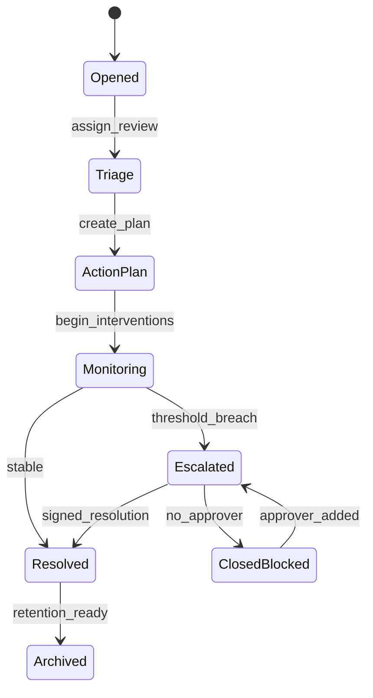
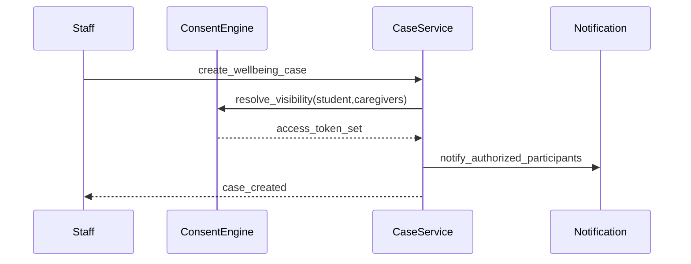

# ADR-099: Wellbeing and Guardianship Execution Package

## Metadata
- **status**: accepted
- **decision-date**: 2026-03-02
- **scope**: wellbeing, custody, health notes, incident reporting
- **source-artifact**: [USER_JOURNEY_EXECUTION_GOVERNANCE.md](../platform/USER_JOURNEY_EXECUTION_GOVERNANCE.md), [household_access_model.md](household_access_model.md), [consent_and_household_access_matrix.md](consent_and_household_access_matrix.md), [wellbeing_privacy_and_redaction_model.md](wellbeing_privacy_and_redaction_model.md)
- **status-gate**: planning corpus + ADR governance review

## Context
Wellbeing and guardian boundaries are cross-cutting and legally sensitive. Incorrect visibility or delayed escalation paths can cause safety or compliance incidents.

## Decision
No wellbeing/health route enters implementation unless this package is signed:
- guardian/access boundary matrix is explicit in UI and API,
- incident paths have escalation and escalation-stop controls,
- health data redaction is visible as a product behavior.

## Persona Journeys
1. **Incident Intake**
   - Staff logs wellbeing/health incident, assigns severity, creates follow-up actions.
2. **Case Continuity**
   - Student plan and interventions persist across custody and class changes.
3. **Consent and Access Arbitration**
   - System computes who can read/write based on custody + emergency contacts + active policies.
4. **Parent/Student Acknowledgement**
   - Limited parent status and action updates with explicit redaction where required.
5. **Escalation to Leadership**
   - Triggered escalation when thresholds breached; evidence package created.

## Required Prototype Package
- Required pages:
  - `/wellbeing/incidents/new`
  - `/wellbeing/cases/:id`
  - `/wellbeing/plans/:id`
  - `/people/household/:id/access`
  - `/wellbeing/privacy/audit`
- Failure simulations:
  - redaction mismatch between staff and parent views,
  - custody conflict after case creation,
  - emergency override expiry,
  - incident reopening after closure,
  - denied escalation due to missing approver role.

## Required Diagrams

## Acceptance Criteria
- Case transitions include immutable actor/action metadata and justification reason.
- Visibility matrix errors surface as explicit UI messages, never silent redactions.
- Custody/guardian disputes require manual override workflow with logged reason.
- Every escalation path terminates with either closure or open incident with timeout.

## API and UI Impacts
- Required endpoints:
  - `POST /wellbeing/cases`
  - `PATCH /wellbeing/cases/{id}/status`
  - `POST /wellbeing/cases/{id}/escalate`
  - `GET /wellbeing/access-check`
- UI requirements:
  - per-view privacy labels ("visible to all", "selected carers", "staff only"),
  - explicit "scope lost" banner when consent changes mid-session,
  - safe export with redaction filters.

## Owners
- Domain Owner: Trust and Wellbeing
- Review Owner: Security + Compliance + QA
