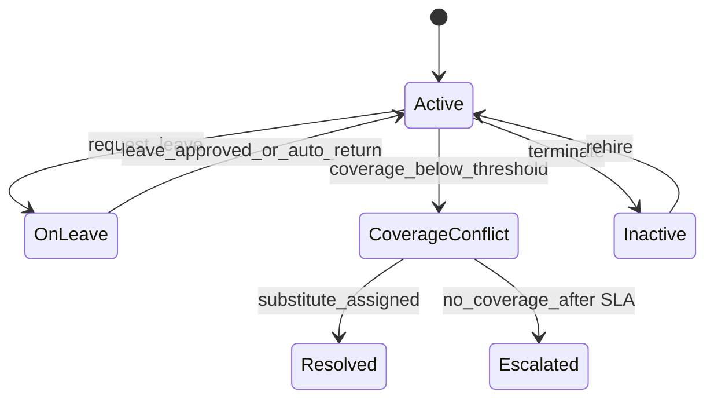

# ADR-102: Workforce Execution Package

## Metadata
- **status**: accepted
- **decision-date**: 2026-03-02
- **scope**: staff lifecycle, roster/leave conflicts, timecard baseline, and workforce self-service
- **source-artifact**: [leave_roster_conflict_rules.md](../workforce/leave_roster_conflict_rules.md), [workforce_lifecycle_spec.md](../workforce/workforce_lifecycle_spec.md), [payroll_integration_boundary.md](../finance/payroll_integration_boundary.md), [ADMISSIONS_ENROLMENT_EXECUTION_PACKAGE.md](../people/ADMISSIONS_ENROLMENT_EXECUTION_PACKAGE.md)
- **status-gate**: planning corpus + ADR governance review

## Context
Workforce correctness affects operations continuity and legal compliance. Roster inaccuracies directly affect coverage, attendance integrity, and incident response quality.

## Decision
Ship workforce as a dedicated execution stream with explicit conflict rules, coverage calculation, and audit-sealed state changes for staff events.

## Persona Journeys
1. **Leave Request and Coverage Check**
   - Staff submits leave; system checks class/staff coverage; conflict path auto-opens substitute workflow when required.
2. **Timecard and Attendance Sync**
   - Staff check-ins/outs persist to workforce record and feed roster capacity calculations.
3. **Staff Profile Transfer and Role Change**
   - Staff role changes cascade to assignment visibility, roster rules, and notification scopes.
4. **Rostering and Relief Coverage**
   - Principal reviews coverage gaps and approves roster adjustments.
5. **Payroll-Ready Snapshot**
   - Finance consumes approved workforce periods for payroll/export snapshots.

## Required Prototype Package
- Route sketches:
  - `/workforce/staff`
  - `/workforce/staff/:id`
  - `/workforce/rosters`
  - `/workforce/leave`
  - `/workforce/coverage`
- Failure simulations:
  - overlapping leave + assignment,
  - unbounded roster conflict,
  - coverage gap not approved,
  - timecard missing check-out,
  - role change mid-roster period.

## Required Diagrams

## Acceptance Criteria
- Every leave transaction has deterministic resolution and one of: approved, rejected, escalated.
- Coverage conflict states are visible to Principal/Admin routes in under 5 seconds.
- Timecard edits create versioned events and do not overwrite prior attestations.
- Payroll boundary exports are reproducible from event snapshots and immutable audit logs.

## API and UI Impacts
- Required endpoints:
  - `POST /workforce/staff`
  - `PATCH /workforce/staff/{id}`
  - `POST /workforce/leave-requests`
  - `POST /workforce/rosters/{id}/coverage-refresh`
  - `GET /workforce/coverage`
- UI requirements:
  - role-aware self-service leave entry,
  - conflict indicators with replacement suggestions,
  - signoff trail for roster approvals.

## Data Model Impact
- Canonical additions:
  - `staff_employment`, `staff_position`, `work_shift`, `leave_request`, `leave_coverage`, `roster_slot`, `timecard_entry`
- Keep payroll-facing exports separated from mutable workforce source rows via immutable payroll event snapshots.

## Owners
- Domain Owner: Workforce and HR
- Review Owner: Operations + Compliance + QA
