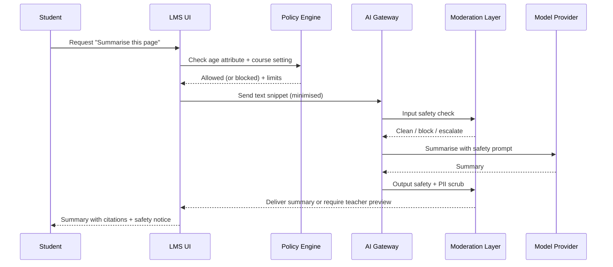

# AI Features in Australian K–12 Learning Platforms and Vendors

## Executive summary

Across Australian K–12, AI capabilities in learning platforms have converged on six practical use-cases: lesson-planning assistance, summarisation/feedback, text generation, image generation, moderation/safety tooling, and administrative governance. The most mature, policy-rich implementations currently sit in the two “productivity suite” ecosystems: **Google Workspace for Education** (Gemini / NotebookLM) and **Microsoft 365 for Education** (Copilot / Copilot Chat), where AI is paired with enterprise controls such as retention policies, eDiscovery, role-based administration, and tenant-level policy enforcement. citeturn31view1turn33view1turn30view0turn30view1

In “core LMS” platforms, AI is expanding rapidly but remains uneven across features and—critically—across transparency about data handling per feature. Canvas’ IgniteAI programme includes instructor-facing summarisation, discussion analysis, rubric generation, and translation features that are explicitly **disabled by default** and controlled via feature options, with some models stated (for example Claude 3 Haiku for discussion translations and AWS Translate for inbox translations). citeturn8view2turn14search8turn18search20 By contrast, Moodle’s approach is explicitly **provider-agnostic**: it introduces an AI subsystem (placements/actions/providers) intended to let organisations choose providers (including OpenAI, Azure AI, Bedrock, and other plugins), control where AI appears in the UI, and enforce per-role/per-course constraints, including first-use acceptance of an AI usage policy. citeturn27view0turn29search1turn29search0turn29search2turn29search4

In K–12-specific classroom apps, AI is commonly packaged as teacher productivity tooling with clear “teacher-in-control” messaging. Seesaw presents a distinct “AI hub” and teacher workflows (lesson generation, announcement drafting, auto-graded/differentiated activity creation, literacy assessment) and publicly identifies several underlying services (e.g., OpenAI/ChatGPT for generative text, Amazon Transcribe for reading fluency workflows, and Google Translate for translation). citeturn34search22turn34search14turn34search4turn34search7 ClassDojo discloses that some AI tooling uses OpenAI and Anthropic, and provides explicit retention language indicating that inputs/outputs are kept only transiently by those providers and deleted upon output creation, with ClassDojo retention governed by its own policy and user actions. citeturn34search0turn34search20turn34search16

A key governance implication for Australian K–12 is that “AI in the classroom” is no longer one product decision: it is a **distributed control problem** spanning (1) what end users can do in the UI, (2) which model providers are permitted for each action, (3) what data flows are allowed (student content, staff content, uploaded files, images), (4) what is logged and retained (and for how long), and (5) what safety/misuse controls exist, especially for minors. This report therefore pairs a vendor capability inventory with a feature-based risk matrix and a policy-controlled reference architecture (“OpenAusLMSK12”) designed to make governance enforceable rather than aspirational. citeturn31view1turn33view0turn33view1turn30view0turn25view2

## Scope, method, and regulatory context

This research is scoped to **K–12 schooling in Australia**, focusing on AI features embedded in, or commonly deployed alongside, learning platforms and classroom apps. The analysis emphasises: lesson-planning assistance, summarisation/feedback tools, text generation, image generation, moderation tools, and admin controls (roles, auditability, and policy enforcement). Where vendor documentation does not specify a requested attribute (e.g., model provider, retention duration, human review), it is recorded as **unspecified** rather than inferred.

Assumptions applied throughout:
- Budget and hosting constraints are not specified; the recommended architecture supports mixed deployment (cloud/on‑prem) and mixed model providers.
- K–12 governance must support **age-based controls** and **teacher-in-the-loop** safeguards, since multiple vendors explicitly vary capability by age band (for example Google’s under‑18 constraints for image generation and “distinct product experience” for minors). citeturn33view0turn33view2turn33view1
- Many Australian schools operate in environments where third‑party services may be hosted offshore; this increases the importance of explicit data flow mapping, retention controls, and contract terms that address training, human review, and sub-processing.

Because vendor AI features evolve quickly, this report prioritises sources with explicit “last updated” dates and operational controls. For example, Google’s “Generative AI in Google Workspace Privacy Hub” (updated January 22, 2026) provides a structured retention view differentiating Gemini in Workspace, the Gemini app, and NotebookLM. citeturn31view1

## Vendor AI feature inventory

The table below compares representative platforms (including those explicitly requested) and highlights the specific attributes most relevant to Australian K–12 governance: workflow/UI integration, model/provider posture, data flow & retention, privacy/consent mechanisms, student safety controls, and admin governance.

### AI feature inventory table

| Vendor / platform | AI features in scope (lesson planning, summarise/feedback, text gen, image gen) | UI / workflow integration | Model provider(s) and deployment posture | Data flows and retention (as stated) | Privacy controls, consent mechanisms, student safety controls | Admin governance, auditability, moderation capabilities | Primary sources |
|---|---|---|---|---|---|---|---|
| Canvas (IgniteAI) | Discussion summaries; discussion “insights”/evaluation notes; rubric generation; translations (Inbox + discussions/announcements). Lesson planning not positioned as a primary native feature in cited docs; content authoring exists (e.g., quiz question authoring) but not fully analysed here. | Feature Options in account/course settings; instructor workflows embedded in existing tools (e.g., rubric creation; discussion UI; SpeedGrader context for insights). Discussion Insights inaccessible to students. | Some features explicitly identify models (e.g., discussion translations use Claude 3 Haiku; inbox translations use AWS Translate). Broader IgniteAI programme positions “AI Nutrition Facts” transparency and opt‑in controls. | Feature-level retention is not uniformly specified in accessible primary docs; program-level claim: institutional/student data is not used to train models without explicit permission. Risk noted in vendor community: “PII is not intentionally sent” but text content may contain PII; “PII is not exposed” does not guarantee it cannot appear without additional guardrails beyond prompting. | Student safety primarily via role restriction (e.g., students cannot access discussion insights). Moderation guardrails can be feature-specific and should not be assumed; vendor clarification indicates limited protection “outside of the prompt” for PII in outputs. | Admins enable/disable features; some features are disabled/locked by default and can be unlockable by admins; subaccount configuration varies by feature. Governance is centred on feature flags and role permissions; moderation tooling is feature-dependent. | citeturn8view2turn14search8turn18search8turn18search20 |
| Moodle (AI subsystem + providers) | Built-in placement patterns enable summarise/explain text and generate text/images (where configured). Extensible via provider plugins (e.g., OpenAI, Bedrock, Gemini provider plugins). | AI appears via “placements” such as text editor (generate text/image) and course assistance (summarise/explain). First use requires acceptance of AI usage policy. Teachers can control AI tools at course/activity level in newer versions (noted in docs). | Provider-agnostic “AI subsystem” allows multiple provider instances (e.g., cheaper model for summarisation; larger model for generation), ordering/fallback, and site-level configuration. OpenAI provider doc defaults to GPT‑4o but is configurable. | Data flows depend on chosen provider(s). Moodle’s subsystem design includes storing action call results (developer docs), implying the need to treat AI interactions as auditable records in governance design. Provider-level retention must be validated per provider contract. | Explicit consent mechanism: AI usage policy acceptance on first use. Role/capability controls can restrict which roles can use which actions; course-level enablement can narrow exposure. | Admin console path for AI settings; provider instances support rate limiting and action-level enablement. Moodle’s architecture supports auditability (policy acceptance reporting/usage reporting exist in the subsystem index), but the strength of moderation depends on the configured provider and any added guardrails. | citeturn29search1turn29search0turn29search2turn29search3turn29search4turn27view0turn27view3 |
| Google Classroom + Google Workspace for Education (Gemini, NotebookLM) | Lesson planning (explicitly marketed), summarisation, drafting, differentiation, assessments; writing feedback; image generation; (NotebookLM additionally positions “grounded” summarisation/lesson plans/quizzes from uploaded sources). | Gemini for Education is a “core service” experience; admins control access via Admin console/OUs/groups; Gemini app + NotebookLM availability differs by education level and age. NotebookLM and Gemini app positioned as education tools; Gemini for Education page lists “teach/learn/work” use cases. | Google operates services as “core services” under Workspace terms; teen users get a distinct experience; under-18 feature access varies. Image generation in Gemini app is “powered by Nano Banana” and is expanded to all ages with restrictions for under‑18s (no direct editing or upload for image generation). | Google’s privacy hub differentiates retention: Gemini in Workspace prompts/responses not retained after session; Gemini app prompts/responses up to 36 months as set by admins; NotebookLM prompts/responses not retained after session (files/notebooks follow CDPA deletion rules). Admin help specifies conversation history controls and 72‑hour storage when history is off. | Strong admin controls: turn Gemini app on/off; manage conversation history retention; Vault can search Gemini conversations (explicitly stated). Under‑18 guardrails: under‑18 users can refine generated images but cannot edit directly or use uploaded images; Google describes content filters and guardrails and warns they are not perfect. | Governance: Admin console privileges; OU/group scoping; explicit age-based feature access table; compliance artefacts listed (e.g., GDPR, ISO, SOC, COPPA/FERPA references). Moderation described via “content filters/guardrails” for youth and policy-based access control; audit via Vault searches and usage reporting. | citeturn31view0turn31view1turn33view1turn33view0turn33view2turn31view2turn32search9 |
| Microsoft Teams/OneNote Class Notebook + Microsoft 365 Copilot / Copilot Chat | Educator content creation case: lesson plans, rubrics, quiz generation, suggested feedback, and LMS-integrated workflows via Microsoft 365 LTI. Teen availability and education positioning explicitly noted (13+). | AI is presented through Copilot app and integrations; Microsoft 365 LTI claims streamlined LMS access and “AI-powered features” for assignments (rubric/instructions generation, suggested feedback, Forms quiz generation). | Microsoft’s Copilot privacy doc positions Copilot as orchestration across LLMs + Microsoft Graph + apps; states prompts/responses are not used to train foundation LLMs and that Copilot uses Azure OpenAI rather than publicly available OpenAI services. It also notes Anthropic models in some Copilot experiences and states Anthropic became a subprocessor starting January 7, 2026. | Microsoft states it stores “content of interactions” (prompt + response + citations) in Copilot activity history; admins can use Content search / Microsoft Purview and set retention policies; users can delete activity history via My Account portal. | Protections explicitly include blocking harmful content, detecting protected material, and blocking prompt injections; abuse monitoring/human review in Azure OpenAI is described as opted out for Microsoft 365 Copilot services. Teen availability is explicitly described in education blog messaging. | Governance: Admins can manage retention through Purview; control feedback settings; manage agents and integrated apps (admin centre shows permissions/terms; admin allow‑listing). Moderation depends on Microsoft controls plus organisational policies; audit tooling leverages existing compliance stack (Purview, export APIs for Teams chats with Copilot). | citeturn30view1turn30view0 |
| Seesaw | “AI hub” includes teacher tools for lesson planning and grading; lesson generator; announcement writing assistant; activity/quiz generation; reading fluency assessment. Translation features are also explicitly described, and Seesaw lists both “traditional AI” and “generative AI” applications. | Seesaw AI is accessed via left-hand panel (“AI Hub”) with teacher-facing tools. AI Announcement Assistant drafts announcements before sending; lesson generator positioned as reducing lesson creation time. | Seesaw publicly lists model/service dependencies for several features: Google Translate (translation), Amazon Transcribe (reading fluency assessment), OpenAI/ChatGPT (question assistant / generative functions noted). | Retention for AI interactions is not specified in the cited AI philosophy page; data flow is partially inferable (external services are used), but storage/retention should be treated as vendor- and feature-specific until confirmed via contract/DPA. | Seesaw frames AI as teacher time-saving and accessibility; safety controls are not fully enumerated in the cited pages. Where Seesaw uses external services, K–12 governance should require explicit contractual commitments (no training, retention bounds, region). | Admin controls include district-wide settings and (in other help articles) opt‑out mechanisms for AI features; detailed audit logging and moderation features are not fully specified in the cited pages. | citeturn34search22turn34search14turn34search18turn34search4turn34search7turn34search13turn4view2 |
| ClassDojo | Teacher-facing AI tools (e.g., “Sidekick” positioning) and internal AI productivity tools; also AI used in Parent contexts and tutoring contexts in some disclosures. | AI is positioned as assisting teachers/parents; transparency notes describe what inputs are sent to which providers and who can see outputs (in parent tooling). | Model providers explicitly listed in transparency notes: OpenAI and Anthropic. | Providers: inputs/prompts/outputs retained only transiently and deleted immediately upon output creation (per transparency note). ClassDojo retention can extend for enforcing policies, improving product (as allowed by law), or security, and may be deleted upon user direction/account inactivity (wording varies by context). | Child privacy terms include specific retention limits for certain classroom data (e.g., feedback points older than 12 months deleted or de-identified/aggregated). Safety controls are referenced as “trust and safety purposes” in AI retention language, but detailed moderation guardrails are not fully enumerated in cited pages. | Governance and transparency: feature-level AI transparency notes; retention and deletion pages; moderation controls are not comprehensively described in the cited docs and should be validated (especially for under‑13 student exposure pathways). | citeturn34search0turn34search20turn34search16turn34search3 |
| Smart Sparrow | Primary positioning is adaptive eLearning authoring and analytics. No explicit, current generative-AI lesson planning, summarisation, text generation, or image generation features were found in the cited Smart Sparrow pages; treat as unspecified for “generative AI inventory” until vendor documentation confirms otherwise. | Platform/studio model focused on creating adaptive courseware and analysing learning outcomes. | Not specified in cited materials. | Not specified in cited materials. | Not specified in cited materials. | Not specified in cited materials. | citeturn34search5turn34search27turn34search2turn34search31 |

image_group{"layout":"carousel","aspect_ratio":"16:9","query":["Google Gemini for Education screenshot lesson planning","Moodle AI generate text icon screenshot","Microsoft Teams Classwork Copilot lesson plan screenshot","Seesaw AI Hub screenshot"],"num_per_query":1}

## Cross-feature risk assessment matrix

The matrix below treats risk by **AI feature class** (rather than by vendor) so schools can implement consistent controls even when multiple vendors are in use. Likelihood and impact use a simple L/M/H scale for K–12 environments with mixed student ages, typical school device management, and routine teacher use.

| AI feature class | Key risks (examples) | Likelihood | Impact | Recommended mitigations (technical + policy) | Residual risk |
|---|---|---:|---:|---|---|
| Lesson-planning assistance | Incorrect or “hallucinated” content; misalignment to curriculum/standards; biased or culturally inappropriate examples; accidental inclusion of student data in prompts (e.g., class profiles). | M | H | Require teacher approval before publish; default to “draft-only” output; constrain with organisation-approved curriculum sources (RAG with citations); block student-identifying data in prompts via PII detection/redaction; training on “AI as copilot not authority”. | M |
| Summarisation tools | Misleading summaries (omissions, incorrect emphasis); privacy leakage (summaries may restate PII present in source text); over-reliance causing missed safeguarding signals in student writing/discussions. Canvas’ community guidance indicates PII may appear without guardrails beyond prompting in some contexts. | M | H | Scope summarisation to least-privilege roles (teachers; not students for sensitive contexts); provide “show sources”/citations; add PII redaction in outputs; require “regenerate with safety prompt” option; log usage for audit. | M |
| Feedback/grading assistance | Fairness and bias in evaluative text; inconsistent marking; automation bias (teacher rubber-stamps model output); retention of student work in AI logs; storing prompts/responses as records (Microsoft explicitly stores Copilot interaction content). | M | H | “Human-in-the-loop” required by design (no auto-release); show rubric alignment and rationale; enable easy override and require acknowledgement; restrict to age-appropriate contexts; implement retention policies for AI interaction logs (e.g., via Purview-like governance); periodic bias/quality audits. | M |
| Text generation | Academic integrity issues (student plagiarism); copyright/IP contamination; unsafe content generation; policy breaches (e.g., generating personal data, defamatory text). | H | H | Student feature gating by age/year level; watermarking/AI disclosure where feasible; “allowed purposes” policy and classroom guidance; content filters; block prompts involving personal data; provide safe templates for teachers; maintain provenance metadata (who generated what, when, with which model). | M–H |
| Image generation | Generation of inappropriate imagery; bullying/harassment via generated images; potential creation of look-alike images of real students; copyright risks; under‑18 safety gaps. Google’s education messaging highlights youth-specific guardrails and content filters but also states filters are not perfect. | M | H | Disable image generation for younger cohorts by default; enforce guardrails (block sexual content, violence, self-harm, hate, drugs); for minors, restrict image editing and ban uploading personal photos for generation (a pattern Google applies for under‑18s); require disclosure labels on generated images; moderation queue for classroom publishing. | M |
| Moderation tools (AI-assisted) | False positives (blocking benign content); false negatives (missing grooming/self-harm/hate); opaque moderation rationale; chilling effect on student expression; over-collection of student behavioural data. | M | H | Use layered moderation: rules + ML + human review; publish student/parent-facing transparency; allow appeals; minimise data stored; separate “safeguarding escalation” from “discipline enforcement”; test moderation thresholds on local context (Australian slang, local issues). | M |
| Admin controls (governance) | Misconfiguration (features enabled for wrong cohort); inability to prove what happened (no audit trail); excessive retention of conversations; weak third‑party/agent governance; subprocessor changes (Microsoft notes Anthropic as a subprocessor from Jan 2026). | M | H | Centralise policy at tenant/domain level; least privilege admin roles; mandatory audit logs; retention-by-policy (different for staff vs students); explicit allow‑listing of agents/integrations; contractual change notification; quarterly access reviews; incident response playbooks. | M |

Key cross-cutting constraint: if your AI feature uses a hosted model layer, verify whether the platform **stores prompts/outputs** (and for how long). This varies materially by architecture: AWS Bedrock states it does not store prompts/completions and does not train or distribute them to model providers, whereas other platforms may store conversation history for months as an admin-controlled setting. citeturn25view2turn31view1turn33view1turn30view0

## OpenAusLMSK12 policy-controlled architecture

“OpenAusLMSK12” is a reference architecture for an Australian K–12 LMS environment in which AI is **policy-driven**, **auditable**, and **safe-by-default**. The central design principle is: **no AI capability is “just a feature”**; every AI request must traverse governance controls before it reaches a model provider, and every output must be attributable, reviewable, and retainable (or deletable) under policy.

### Architecture diagram

```mermaid
flowchart LR
  %% Actors
  T[Teacher] --> UI[LMS / Platform UI]
  S[Student] --> UI
  A[Admin] --> AC[Admin Console]
  P[Parent/Carer] --> UI

  %% Core platform
  UI --> CORE[Core LMS Services/n(content, assignments, discussions, messaging)]
  CORE --> IDP[Identity & Access/n(SSO, roles, age attributes)]
  AC --> IDP

  %% Policy plane
  AC --> POL[Policy Engine/n(policy-as-code, feature flags)]
  IDP --> POL
  CONS[Consent & Notices सेवा/n(parent consent, student notices)] --> POL
  POL --> UI

  %% AI control plane
  UI --> GATE[AI Request Gateway/n(standardised API)]
  GATE --> MIN[Data Minimisation & Redaction/n(PII detection, DLP)]
  MIN --> MODIN[Input Moderation/n(toxicity, self-harm, sexual, hate, drugs)]
  MODIN --> ROUTE[Model Router/n(provider selection by policy)]
  ROUTE -->|Cloud| CLOUD[Approved Cloud Models/n(e.g., Bedrock / Azure OpenAI / vendor-hosted)]
  ROUTE -->|On-prem| LOCAL[Local/Open Models/n(on-prem or sovereign cloud)]
  CLOUD --> MODOUT[Output Moderation/n(policy filters, PII scrub, citation checks)]
  LOCAL --> MODOUT

  %% Knowledge grounding
  KB[Curriculum & School Knowledge Base/n(approved resources, citations)] --> ROUTE

  %% Human-in-the-loop
  MODOUT --> HIL[Human Review Queue/n(required for high-risk contexts)]
  HIL --> UI

  %% Logging & audit
  GATE --> LOG[Immutable Audit Log/n(who/what/when/model/policy)]
  MODOUT --> LOG
  POL --> LOG

  %% Retention & eDiscovery
  LOG --> RET[Retention & eDiscovery/n(retention labels, legal hold)]
  CORE --> RET
```

### Workflow diagrams

Teacher lesson-planning workflow (with mandatory controls):

```mermaid
sequenceDiagram
  participant Teacher
  participant UI as LMS UI
  participant Policy as Policy Engine
  participant Gateway as AI Gateway
  participant Model as Model Provider
  participant Review as Human-in-Loop

  Teacher->>UI: Open "Plan lesson" assistant
  UI->>Policy: Check role (teacher), cohort, feature enabled
  Policy-->>UI: Allowed + constraints (no student PII; citations required)
  UI->>Gateway: Submit prompt + curriculum context (minimised)
  Gateway->>Model: Generate lesson draft (policy-scoped)
  Model-->>Gateway: Draft output
  Gateway-->>UI: Return draft + provenance (model ID, time)
  UI->>Review: If high-risk flags: queue for review
  Review-->>Teacher: Approve/edit/refuse
  Teacher->>UI: Publish to class (teacher decision)
```

Student summarisation/feedback workflow (age-gated and moderated):



### Recommended controls mapped to real vendor behaviours

The architecture’s controls are not theoretical; they align to patterns already present in major vendors:

- **Admin-level enable/disable and OU/group scoping** maps to how Google enables Gemini access and image generation controls via Admin console, including age-based feature access tables. citeturn33view1turn33view0  
- **Retention-by-policy** reflects that some services store interaction content (Microsoft Copilot activity history) while others can be configured not to retain prompts/responses after session (Google Gemini in Workspace; NotebookLM prompts/responses), and therefore requires deliberate, per-feature retention design. citeturn30view0turn31view1  
- **Provider contract posture** must be enforced. For example, AWS Bedrock states it does not store prompts/completions, does not train on them, and model providers cannot access customer prompts/completions. citeturn25view2turn25view1  
- **Youth guardrails for image generation** should adopt restrictions similar to Google’s under‑18 constraints (no uploaded images for generation; guardrails and filters; explicit warning that filters are not perfect). citeturn33view0turn33view1  
- **Transparency and feature-level disclosure** should emulate the most concrete disclosures seen in K–12 apps: ClassDojo’s provider-level retention statements and Seesaw’s explicit listing of underlying services. citeturn34search0turn34search4

## Recommendations and implementation roadmap

### Concise recommendations

Adopt a single governance stance: **safe-by-default, teacher-in-control, auditable-by-design**.

1. **Establish a minimum AI control standard across all vendors**: role-based access, age gating, explicit retention policy per feature, and an exportable audit trail. Use vendor-native controls where possible (e.g., Google Admin console / Vault; Microsoft Purview / retention; LMS feature flags). citeturn33view1turn31view1turn30view0turn8view2  
2. **Separate “AI for teachers” from “AI for students”** contractually and technically. Under‑18 feature sets should be narrower, with additional guardrails for image generation and reduced data sharing. citeturn33view0turn33view2turn30view1  
3. **Standardise data minimisation and redaction** before any prompt is sent to a model provider. This reduces the probability that “student PII inside free text” is relayed and regenerated. citeturn18search20  
4. **Treat AI interaction logs as regulated records**. Where vendors store prompts/responses and citations (e.g., Microsoft Copilot), define retention labels and deletion pathways up-front; do not leave it to defaults. citeturn30view0turn31view1turn33view1  
5. **Use provider contracts that guarantee non-training and bounded retention**, and prefer architectures with strong isolation guarantees for K–12 workloads. AWS Bedrock’s stated non-storage/non-training posture is an example of the type of infrastructure-level guarantee to seek. citeturn25view2turn25view1  
6. **Implement layered moderation with human escalation** for high-risk contexts (self-harm, sexual content, hate, bullying). Vendor filters are explicitly imperfect; schools must add process controls (teacher review queues, safeguarding escalation). citeturn33view0turn30view0

### Implementation roadmap with milestones and effort

| Milestone | Outcomes | Estimated effort |
|---|---|---|
| Baseline governance and configuration | Define approved AI use-cases by year level (teacher vs student); configure admin controls (enablement by OU/group, default-off for younger cohorts); publish student/parent notices; create a retention schedule for AI interaction data; establish an incident response playbook. | Medium |
| Vendor hardening and evidence capture | For each platform: document data flows (what is sent, where processed), confirm retention settings, confirm model providers/subprocessors, and enable audit/export pathways (e.g., Vault searches; Purview retention; LMS feature flags). | Medium |
| OpenAusLMSK12 controls layer | Deploy an AI request gateway (or equivalent controls layer) that enforces policy-as-code, PII minimisation, and moderation before model calls; integrate with identity/age attributes; implement immutable audit logging and retention controls. | High |
| Classroom rollout and change management | Pilot with selected schools/year bands; teacher training focused on verification, safety, and academic integrity; student AI literacy; parent communication; iterate based on usage analytics and incidents. | Medium |
| Continuous assurance | Quarterly model/provider review (including subprocessor changes); red-team testing (prompt injection, unsafe outputs); audit log review; refresh moderation thresholds and curriculum grounding corpus. | Medium |

This roadmap is designed to remain valid whether a school system standardises on a single vendor ecosystem (e.g., Google-only or Microsoft-only) or operates a heterogeneous environment (e.g., Moodle + Google Workspace + Seesaw), because the control intent is enforced at the policy layer rather than being scattered across product defaults. citeturn27view0turn33view1turn30view0turn34search22


