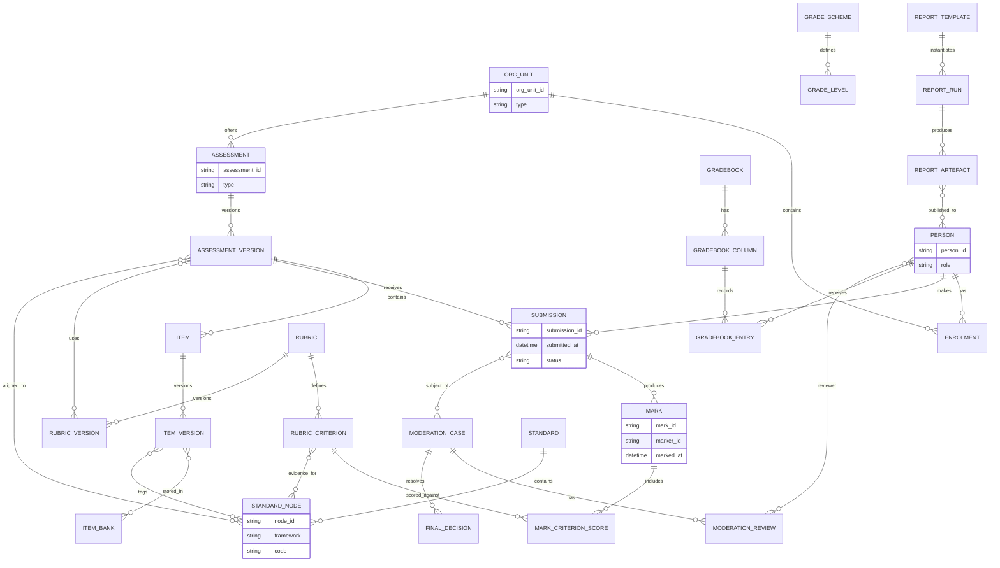

# Comparing Assessment and Reporting Capabilities Across Major LMS and Assessment Platforms

## Executive summary

Across mainstream learning management systems (LMS) and specialist assessment platforms, “assessment + reporting” capability tends to split into two patterns: (a) **LMS-first workflows** optimised for continuous coursework (assignments, rubrics, speed-grading UIs, gradebooks, and basic analytics) and (b) **assessment-platform-first workflows** optimised for secure, high-stakes delivery and psychometrics with exports back to the LMS/SIS for reporting. Examples of strong LMS-first stacks include Canvas (moderated grading, rubric/outcomes alignment, Common Cartridge/QTI exports) and Brightspace (multi-evaluator workflows, competency alignment, Insights dashboards and report builder), while Inspera and ExamSoft illustrate strong assessment-platform-first stacks (grader collaboration workflows, results exports in CSV/JSON, QTI interoperability claims, longitudinal exports). citeturn2search3turn2search9turn24search14turn21search3turn17search0turn17search4turn17search1turn17search29turn18search4turn18search6

For Australian K–12, the **formal reporting problem** (semester reports, A–E or other scales, achievement-standard alignment, parent-facing distributions, and inclusion of external measures such as NAPLAN) is often only partially met by LMS gradebooks. NAPLAN reporting notably changed from 2023 to four proficiency levels (and a reset scale), and results from 2023 onward are not directly comparable to 2008–2022; this materially affects longitudinal dashboards and report-card fields. citeturn6search10turn6search11turn6search21

A recurring enterprise risk is **interoperability and evidence traceability**: item banks, rubric criterion evidence, and outcomes alignments do not consistently round-trip across systems. While Common Cartridge and LTI are widely supported for packaging/launch, QTI support is uneven in practice (e.g., limited QTI question-type coverage in some LMS exports/imports; Brightspace also supports CSV-based question import; Inspera positions QTI as its interchange). citeturn18search4turn19search2turn26search2turn5search19turn17search1turn17search17

## Method and scope

This report compares assessment and reporting capabilities using **primary/official product documentation** wherever possible, supplemented by **Australian education authority sources** for reporting expectations. Platforms included (as requested) were major LMS and assessment ecosystem vendors: entity["company","Instructure","canvas lms company"] (Canvas), entity["organization","Moodle","learning platform"], entity["company","Anthology","blackboard owner"] (Blackboard), entity["company","D2L","brightspace vendor"] (Brightspace), entity["company","Google","alphabet subsidiary"] (Google Classroom), entity["company","Microsoft","software company"] (Teams Assignments), entity["company","Turnitin","similarity and feedback vendor"], entity["company","Inspera","assessment platform vendor"], and entity["company","ExamSoft","assessment analytics vendor"]. citeturn15search3turn26search1turn22search0turn24search14turn20search4turn13view2turn17search7turn17search0turn17search2turn16search19

Important constraints for interpretation:

* **Licence tiering / feature flags**: several capabilities are explicitly documented as requiring activation (e.g., Inspera rubrics and results exports). Where documentation indicates conditional availability, it is treated as an enterprise dependency and flagged as such. citeturn16search9turn17search4  
* **Version drift**: documentation sometimes refers to specific versions (e.g., Moodle’s “Assignment settings” page includes features such as anonymous marking and marking workflow; even where stable conceptually, implementation details may differ by release). citeturn27view0turn26search1  
* **“Reporting” definition**: the report distinguishes (1) **operational grading outputs** (gradebook calculations and exports) from (2) **formal reporting artefacts** (templated report cards, scheduled publication to portals) and (3) **longitudinal analytics** (cohort trends, mastery over time). citeturn21search3turn17search29turn6search12

## Assessment lifecycle capability comparison

### Workflow diagrams

The diagram below normalises the end-to-end workflow most platforms must support, with optional paths for plagiarism/originality and multi-marker moderation.

```mermaid
flowchart LR
  A[Define assessment intent/n(outcomes/standards, conditions)] --> B[Author task/n(assignment/quiz/exam)]
  B --> C[Assemble items/n(item bank/question library)]
  C --> D[Attach rubric & mappings/n(rubric criteria, outcomes)]
  D --> E[Publish & schedule/n(due/close windows, accommodations)]
  E --> F[Student submission/attempt/n(files, text, quiz responses)]
  F --> G{Integrity checks?}
  G -->|Similarity/originality| H[Run check/n(report + flags)]
  G -->|None| I[Marking workspace]
  H --> I[Marking workspace]
  I --> J{Moderation model}
  J -->|Single marker| K[Finalise mark + feedback]
  J -->|Multi-marker| L[Second marking / co-marking]
  L --> M[Reconcile / publish final]
  K --> N[Post grades to gradebook]
  M --> N[Post grades to gradebook]
  N --> O[Release feedback to learners]
  N --> P[Export/sync/n(LMS↔SIS, CSV/XML/JSON)]
  N --> Q[Analytics & dashboards/ncohort trends, mastery]
```

Key multi-marker variants are explicitly supported in several systems: Canvas “moderated grading” enables multiple reviewers with a final grade publication step, Moodle supports marking workflow + marking allocation to coordinate multiple markers, Blackboard supports delegated/parallel grading with reconciliation, and Brightspace supports multi-evaluator workflows (co-marking vs multiple individual evaluations). citeturn2search3turn2search9turn27view0turn23search4turn23search5turn24search14turn24search0

High-stakes assessment platforms often insert additional “delivery controls” (secure browser/proctoring/locked-down settings) and export richer per-question analytics for psychometrics; Inspera documents grader collaboration workflows and export mechanisms (CSV and JSON, with feature enablement conditions). citeturn16search4turn17search0turn17search4turn21search10

```mermaid
flowchart TB
  A[Item authoring + approval/n(question bank governance)] --> B[Secure delivery configuration/n(test window, device controls)]
  B --> C[Candidate sitting/n(online/offline/resilience)]
  C --> D[Auto-score where possible]
  C --> E[Manual marking workspace/n(rubrics/annotations)]
  D --> F[Moderation & overrides/n(re-score, reconciliation)]
  E --> F
  F --> G[Publish results]
  G --> H[Export results/n(CSV/JSON) + LMS grade passback (LTI)]
  H --> I[School reporting & analytics/n(SIS/report cards/cohort trends)]
```

This “assessment-platform-first” pattern aligns closely with Inspera’s documented grading workflows, exports, and LTI integration framing; ExamSoft similarly positions a create–administer–analyse loop with LMS sync and longitudinal exports. citeturn16search4turn17search0turn17search5turn17search9turn16search19turn17search25turn17search29

### Comparative capability table

Legend: ✅ native; ◐ via integration/adjacent product; ◑ limited/partial; ❌ not evident in reviewed docs; ? unspecified in reviewed docs (treat as unknown).

| Dimension (normalised) | Canvas | Moodle | Blackboard | Brightspace | Google Classroom | Teams Assignments | Turnitin | Inspera | ExamSoft |
|---|---:|---:|---:|---:|---:|---:|---:|---:|---:|
| Task authoring + item banks / question libraries | ✅ | ✅ | ✅ | ✅ | ◑ | ◑ | ◑ | ✅ | ✅ |
| Versioning / reuse semantics for banked items | ◑ | ✅ | ? | ◑ | ? | ? | ? | ? | ? |
| Rubrics (criteria-level scoring; rubric→grade mapping) | ✅ | ✅ | ✅ | ✅ | ✅ | ✅ | ✅ | ◐/✅* | ? |
| Group submission workflow (one submission for group) | ✅ | ✅ | ✅ | ? | ◑ | ✅ | ◑ | ❌ | ❌ |
| Anonymous / blind marking | ✅ | ✅ | ✅ | ✅ | ? | ? | ✅ | ? | ? |
| Inline annotation / in-browser marking UI | ✅ | ✅ | ✅ | ✅ | ◑ | ◑ | ✅ | ✅ | ? |
| Multi-marker moderation with reconciliation | ✅ | ✅ | ✅ | ✅ | ❌/? | ❌/? | ❌/? | ✅ | ? |
| Integrity checking (plagiarism/originality) | ✅◐ | ◐ | ✅◐ | ✅◐ | ✅ | ? | ✅ | ✅ | ? |
| Outcomes / standards mapping & alignment | ✅ | ◑ | ✅ | ✅ | ◑ | ? | ◑ | ? | ✅ |
| Gradebook calculation / weighting | ✅ | ✅ | ✅ | ✅ | ◑ | ✅ | ◑ | ◑ | ◑ |
| Report-builder / scheduled dashboard reporting | ◑ | ◐ | ◐ | ✅ | ◑ | ◑ | ◑ | ◑ | ✅ |

*Inspera rubrics are documented as requiring activation; treat as a deployment dependency. citeturn16search9turn16search14

**Evidence notes for key rows**

Task authoring + item banks: Canvas New Quizzes supports item banks and explicitly supports sharing item banks with users/courses/accounts; Moodle supports shared question banks accessible from other courses (“switch bank”); Brightspace Question Library is a central repository with CSV question import; Blackboard supports question banks and the ability to copy questions into banks; Inspera and ExamSoft explicitly describe question types / banking and authoring workflows. citeturn26search0turn26search1turn26search25turn26search2turn5search4turn5search8turn16search12turn16search19

Versioning / reuse semantics: Moodle’s question bank reuse implies propagation of changes (“If I change a question in the question bank, will it be changed in all the quizzes it appears? Yes.”), whereas Brightspace notes that importing questions from Question Library into a quiz duplicates them (creating a “copy” in the quiz, not a live link). This difference is central to governance, auditability, and controlled versions for high-stakes tasks. citeturn26search28turn26search11turn26search25

Rubrics: Canvas can create rubrics (including point ranges), attach them to assignments, use them for grading, and align outcomes with rubric criteria; Moodle rubrics describe criterion/level scoring with grade calculation; Brightspace rubrics can be created and used for assignment evaluation with scores transferring into the evaluation panel/grades; Classroom can create/reuse/export rubrics; Teams provides rubric creation/management; Turnitin provides rubric/grading-form scoring affecting the assignment grade; Blackboard allows rubric creation and goal alignment at the criterion level. citeturn15search3turn15search18turn15search29turn14search2turn24search15turn15search0turn14search9turn14search0turn10search3turn15search31turn15search2

Group submissions: Canvas group assignments support “one submission counts for the entire group” with documented constraints (e.g., limitation with External Tool assignments); Moodle Assignment settings include “group submission settings” and “require all group members submit”; Teams group assignments explicitly support groups turning in one copy; Blackboard supports grading group assignments. Google Classroom has “student groups” for organisation/targeting but group submission-as-one-copy is not established in the reviewed official docs (treated as limited/unspecified). citeturn7search21turn27view0turn13view1turn22search25turn7search25turn7search32

Anonymous/blind marking: Canvas documents anonymous grading (and hiding student names in SpeedGrader); Moodle documents “anonymous marking / blind marking”; Blackboard documents “Hide student names” and constraints; Brightspace documents anonymous marking and reveal-on-publish behaviour; Turnitin documents anonymous marking for classic Standard Assignments. Teams “anonymous grading” for assignments is not confirmed in reviewed Microsoft Support docs and is therefore treated as unspecified. citeturn11search5turn10search2turn27view0turn22search0turn24search1turn9search2

Marking UI: Canvas DocViewer supports annotated comments in SpeedGrader; Moodle documents in-browser annotation of uploaded files and feedback modalities; Brightspace supports annotation tools and an Evaluate Submission workflow; Blackboard’s Bb Annotate supports in-browser annotation across many file types; Inspera Marking 2.0 supports annotations and page notes (with PDF-only annotations for “Upload Assignment”); Teams supports document-level commenting via editing attached documents in Office apps rather than a dedicated in-app annotation tool (as documented in its grading flow). citeturn8search0turn27view0turn9search11turn8search2turn22search4turn16search1turn13view2

Moderation/reconciliation: Canvas supports moderated grading and publishing final grades; Moodle supports marking workflow states and marking allocation for distributing marking/review; Blackboard supports delegated grading, parallel grading (two graders per student), and reconciliation; Brightspace supports multiple evaluators and grade synchronisation for multi-evaluator workflows; Inspera documents multiple grader collaboration workflows. citeturn2search3turn2search9turn27view0turn23search5turn23search4turn24search14turn24search0turn16search4

Integrity/plagiarism: Canvas provides a plagiarism framework used by tools such as Turnitin; Classroom supports originality reports; Brightspace documents Turnitin integration setup; Blackboard documents SafeAssign behaviour interactions with anonymous grading; Inspera documents Inspera Originality as an originality reporting feature; Turnitin documents its LTI 1.3 integration posture and anonymous marking workflow. citeturn0search7turn1search13turn17search3turn22search0turn21search7turn17search7turn9search2

## Reporting and longitudinal analytics comparison

Operational reporting strengths vary significantly by platform. In the LMS space, the core is typically a gradebook with weighting/aggregation controls and export options. Canvas supports weighting via assignment groups and export of gradebook CSV. Moodle supports grade aggregation modes (natural aggregation functioning as sum or mean under weighting configurations) and grade export options, including an XML export path designed to export only “new or updated” grades after enabling a specific method. Brightspace supports multiple gradebook types (weighted, points, formula) and explicit grade export to CSV/TXT. Teams supports weighted grading categories and provides grade export to Excel. Classroom supports “Download all grades as CSV” and, separately, SIS export features. citeturn25search2turn18search3turn25search0turn25search1turn3search2turn19search1turn14search25turn14search15turn20search4turn20search22

Longitudinal reporting and trend analysis often requires either (a) a dedicated analytics product, (b) enhanced LMS analytics modules, or (c) exports into external BI. Brightspace explicitly positions Insights dashboards (built on a data platform) and an Insights Report Builder with scheduling (refreshed reports emailed to stakeholders). Blackboard’s broader portfolio includes Illuminate reporting artefacts for performance/grades reporting. Canvas provides an Analytics API for Canvas Analytics data access (useful for institutional BI, subject to governance and permissions). ExamSoft explicitly supports longitudinal grade exports (by posted dates/users/courses) and positions reporting/analytics as a core benefit; Inspera documents multiple export/report mechanisms (CSV export of marks and a JSON results export feature requiring enablement). citeturn21search3turn21search26turn23search20turn21search16turn17search29turn16search2turn17search0turn17search4

For formal report templates (PDF/HTML “report cards”) and scheduled publishing to parent/caregiver portals, the reviewed LMS documents focus more on grading and dashboards than on semester-report templating. This aligns with common enterprise practice: **LMS gradebook → SIS/reporting system**. Classroom’s explicit “SIS export” workflow and import of grading categories/periods/rosters illustrates this “LMS-to-SIS hand-off” orientation. citeturn20search22turn18search3turn19search1

## Australian K–12 reporting expectations and implications

Australian reporting expectations are anchored in reporting against curriculum achievement standards and in national assessment reporting (NAPLAN), with meaningful variation by jurisdiction.

At the national authority level, entity["organization","Australian Curriculum, Assessment and Reporting Authority","national education authority"] frames teaching, assessing and reporting around curriculum achievement standards and associated guidance. citeturn1search30

NAPLAN reporting is now structurally different: from 2023, the numerical bands and national minimum standards were replaced with **four proficiency levels** (Exceeding, Strong, Developing, Needs additional support), and results from 2023 onward cannot be directly compared to results from 2008–2022 due to the reset in standards and timing. Any longitudinal reporting design in AU schools needs to accommodate (at least) a **break in time series** and potentially dual reporting regimes in historical views. citeturn6search10turn6search11

NAPLAN is also explicitly positioned as one aspect of broader school assessment and reporting, and questions “assess content linked to the Australian Curriculum in English and Mathematics.” This makes curriculum alignment metadata (learning outcomes/standards) a practical requirement for coherent reporting narratives, not just a higher-ed accreditation feature. citeturn6search21

State and territory expectations introduce additional constructs:

* entity["state","New South Wales","state, australia"] uses an A–E common grade scale (and explicitly defines grade meanings) in its published curriculum guidance. citeturn1search35  
* entity["state","Victoria","state, australia"] reporting guidance references minimum requirements for reporting against achievement standards at each learning stage, with links to VCAA reporting guidelines. citeturn6search12turn6search23turn6search30  
* entity["state","Queensland","state, australia"] guidance materials describe A–E as a five-point scale and provide reporting principles (e.g., reporting must be based on evidence and against intended curriculum/standards). citeturn1search23  
* entity["state","Australian Capital Territory","territory, australia"] guidance explicitly states reporting to parents/carers should occur **twice per year** and includes the use of A–E or other agreed scales, with teacher judgment against achievement standards. citeturn1search31  
* entity["state","Western Australia","state, australia"] mandates a curriculum outline that explicitly includes support for teaching, learning, assessment and reporting of achievement (though specific A–E policy details vary by sector and are not fully enumerated in the sources reviewed here). citeturn6search24  

Implications for platform selection and data modelling in AU K–12:

1. **Multi-scale grading** is required: A–E (five-point) scales are common, but NAPLAN proficiency reporting is a separate four-level scheme from 2023 onward; a reporting system must support both without forcing a lossy mapping. citeturn1search23turn6search10turn6search11  
2. **Achievement-standard alignment** should be first-class: outcomes/standards mapping features (e.g., Canvas outcomes in rubrics; Brightspace competencies/learning outcomes; Blackboard goal alignment) materially reduce manual effort in evidence-based reporting narratives. citeturn15search14turn14search5turn14search1turn15search31  
3. **Longitudinal reporting must handle discontinuities**: NAPLAN’s 2023 reset creates a structural break; dashboards that assume continuous scaling across years will mislead unless explicitly segmented. citeturn6search10turn6search15  

Any K–12 “report card” solution also typically requires non-assessment fields (effort/appearance/behaviour/attendance/wellbeing notes) which are not uniformly expressed in LMS schemas; where those fields are required, treat them as **SIS/reporting-system responsibilities** unless the LMS explicitly documents them (unspecified in reviewed LMS docs). citeturn6search12

## Interoperability, normalised data model, and feature tiers

### Normalised data model

The following ER diagram provides a **normalised assessment + reporting data model** intended to support: item banks, rubric scoring at criterion level, moderation workflows, standards alignment, gradebook aggregation, publishing, and longitudinal analytics. It is vendor-neutral and designed to map to LTI/OneRoster-style ecosystem integration points at the boundaries (rosters from SIS; assignments and grades passback; exports). citeturn17search17turn17search5



### Export format matrix

The matrix below summarises *documented* export/interoperability formats. Where a cell is “?”, the detail is **unspecified in reviewed docs** and should be validated in procurement/technical discovery.

| Platform | CSV | Excel | XML | JSON | QTI | IMS Common Cartridge (IMSCC) | LTI |
|---|---:|---:|---:|---:|---:|---:|---:|
| Canvas | ✅ (gradebook) | ? | ? | ✅ (APIs) | ✅ (quiz export) | ✅ (course export) | ✅ (ecosystem; also tool links in packages may vary) |
| Moodle | ✅ (grades; via exports) | ? | ✅ (grade export) | ? | ❌/? (question exports in reviewed docs are non-QTI) | ✅ (IMSCC 1.1 export via backup) | ◐ (via plugins/tools; unspecified in reviewed docs) |
| Blackboard | ✅/✅ (CSV/XLS grade downloads) | ✅ (XLS tab-delimited option) | ? | ? | ✅ (limited QTI pool/test export types) | ✅ (Common Cartridge 1.0/1.1/1.2 export) | ✅ (LTI items in gradebook; broader LTI support implied) |
| Brightspace | ✅ (grade export) | ? | ? | ? | ◐ (IMS QTI imports used in practice; not fully specified here) | ✅ (standards-compliant export packages) | ✅ (supports LTI 1.3 migrations) |
| Google Classroom | ✅ (download grades) | ◐ (Sheets workflows) | ? | ✅ (APIs; SIS export not specified as JSON) | ❌/? | ❌/? | ❌/? |
| Teams Assignments | ◐ (export to Excel documented) | ✅ | ? | ? | ❌/? | ❌/? | ◐ (Microsoft 365 LTI uses LTI Assignments & Grades service) |
| Turnitin | ✅ (some workflows allow CSV download) | ? | ? | ? | ❌/? | ❌/? | ✅ (LTI 1.3 integration guidance) |
| Inspera | ✅ (marks/grades export) | ? | ? | ✅ (results export feature) | ✅ (positions QTI import/export) | ❌/? | ✅ (LTI integration described) |
| ExamSoft | ◐ (export grades) | ? | ? | ? | ? | ❌/? | ◐ (LMS sync; technical interface unspecified here) |

Supporting sources: Canvas exports course packages as IMSCC and exports quiz content as QTI zip; Canvas gradebook exports CSV. citeturn18search4turn18search6turn18search3  
Moodle supports IMS Common Cartridge import/export and documents XML grade exports and grade aggregation methods. citeturn18search16turn25search1turn25search0  
Blackboard supports Common Cartridge export and documents gradebook downloads with CSV/XLS options; Blackboard QTI export has limits on supported question types. citeturn19search2turn19search17turn5search19  
Brightspace documents grade export and “standards-compliant export packages” via Import/Export/Copy Components; it also documents LTI 1.1→1.3 migration tooling. citeturn19search1turn26search6turn17search15  
Classroom documents “Download all grades as CSV” and introduces SIS export flows; rubric export/import is supported via Sheets. citeturn20search4turn20search22turn14search9turn14search14  
Teams documents grade export to Excel, weighted categories, and rubric tooling; Microsoft 365 LTI describes use of the LTI Assignments and Grades service for grade sync. citeturn14search15turn14search25turn14search0turn9search3  
Turnitin documents LTI 1.3 integration guidance and CSV download for certain workflows; it also documents rubric/grading-form export/import continuity for migrations. citeturn17search7turn17search11turn17search30  
Inspera documents CSV export of marks/grades and a JSON results export feature (both may require enablement), plus LTI integration concepts and QTI interoperability positioning. citeturn17search0turn17search4turn17search5turn17search1  
ExamSoft documents LMS integrations and longitudinal grade export in its support materials. citeturn17search2turn17search29turn17search6

### Must-have vs enterprise feature tiers

The following tiers are intended for procurement and architecture decisions (AU K–12 inclusive). They are framed as capabilities, not vendor promises.

**Must-have (baseline for credible assessment + reporting)**  
Teachers can create tasks and collect submissions; rubrics can be created/reused and used for criterion-level scoring; marking UI supports efficient per-submission navigation and at least one in-context feedback mechanism (document commenting or annotation); gradebook supports weighting/aggregation and exports (minimum CSV); and the ecosystem support includes at least one practical integration path to school reporting/SIS (CSV, or SIS export, or LTI-based grade passback). citeturn15search18turn27view0turn8search0turn18search3turn19search1turn20search22turn9search3

**Enterprise (required when scale, integrity, or compliance is material)**  
Multi-marker workflows with reconciliation (Canvas moderated grading; Blackboard parallel/delegated grading; Brightspace multi-evaluator; Moodle marking allocation/workflow); anonymous/blind marking controls; formal integrity tooling (Turnitin/Originality reports or equivalents) with audit trails; outcomes/standards alignment with organisational sharing and standards import; advanced analytics (dashboards/report builders with scheduling); and standards-based interoperability (Common Cartridge for course packaging, QTI where item migration is required, LTI Advantage for launch and grade passback). citeturn2search3turn23search4turn24search14turn27view0turn22search0turn21search3turn21search26turn17search1turn18search4turn17search17

### Gaps and risks to explicitly manage

1. **Item-bank portability risk (QTI reality vs marketing)**: Blackboard’s QTI export documentation highlights that Common Cartridge/QTI do not support all question types/attributes, and QTI exports may omit incompatible questions—this creates migration risk for sophisticated item types. citeturn19search2turn5search19  
2. **Reuse semantics risk (live-linked vs duplicated questions)**: Moodle’s “changes propagate” behaviour and Brightspace’s “duplicate into quiz” behaviour represent different governance models; without explicit version policies, this can break auditability and lead to inconsistent re-use across classes/terms. citeturn26search28turn26search11  
3. **Moderation as workflow, not a checkbox**: systems differ in whether moderation is (a) explicit reconciliation (Blackboard, Canvas moderated grading) or (b) coordination states/allocation (Moodle) or (c) co-marking / evaluator workflows (Brightspace). Procurement should require demonstrable support for your institution’s exact moderation pattern (e.g., second marking with blind independence, or co-marking with publisher gate). citeturn2search3turn23search4turn27view0turn24search14  
4. **Australian longitudinal reporting discontinuity**: NAPLAN’s 2023 shift to a new proficiency model breaks time-series comparability. Any school or system claiming “trend analysis across many years” must segment pre/post 2023 or explain methodologically valid transformations. citeturn6search10turn6search11  
5. **Formal report-card templating is often external**: Classroom explicitly adds SIS export flows; many LMS documents focus on gradebook exports and dashboards rather than parent-facing report cards. In AU K–12, ensure SIS/reporting tooling is included in the architecture scope even if the LMS is strong. citeturn20search22turn18search3turn19search1


