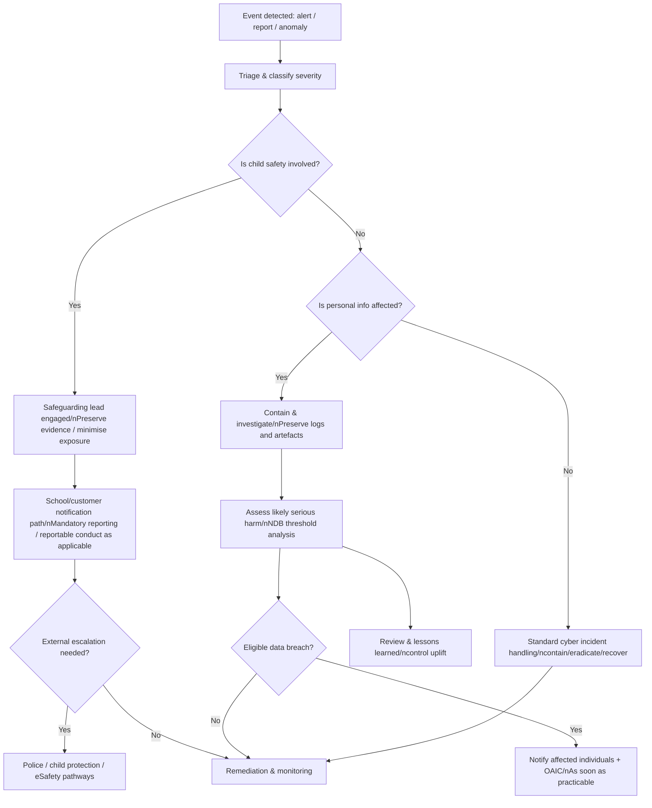

# Compliance and Governance Map for an Australian K–12 Learning Platform: OpenAusLMSK12

## Executive summary

OpenAusLMSK12 is best treated as a **regulated “student data and child‑safety critical system”**: it processes children’s personal information (often including sensitive welfare/health data), stores education records that may be public records, and provides communications and content features that can create online‑harm pathways. The compliance and governance map therefore needs to integrate **privacy, child safeguarding, records management, accessibility, cybersecurity, and public‑sector procurement controls** as one coherent control system rather than separate checklists. citeturn12search12turn12search8turn30view0turn35view0turn20search0

Across Australia, the **federal Privacy Act 1988 and Australian Privacy Principles (APPs)** set baseline obligations for “APP entities” (many vendors and some schools), including **security (APP 11), purpose limitation, transparency, access/correction, and controlled overseas disclosures**. The **Notifiable Data Breaches (NDB) scheme** adds mandatory notification when an eligible breach is likely to result in serious harm, and requires prompt assessment (supported by audit logging and incident processes). citeturn12search12turn12search8turn12search5turn12search6turn16search1

Public schools are typically governed by **state/territory privacy regimes** (or equivalent policies), and multiple states add **organisation‑level child safeguarding schemes** (e.g., reportable conduct/child safe standards) and **records/archives statutes** that can override “destroy when no longer needed” privacy norms through mandatory retention schedules. This is especially consequential for an LMS that becomes the system of record for attendance, assessment, wellbeing interventions, behaviour incidents, and staff–student communications. citeturn20search1turn20search4turn20search6turn21search0turn23search6

Three fast‑moving regulatory fronts materially affect a 2026 rollout roadmap:
- **Western Australia’s Privacy and Responsible Information Sharing Act 2024 (PRIS Act)** substantially commences **1 July 2026**, with a **notifiable information breach scheme from 1 January 2027** (public sector plus some contracted providers). citeturn37search0turn37search2turn37search5  
- **Queensland’s Child Safe Organisations Act 2024** establishes Child Safe Standards from **1 October 2025** and brings the **Reportable Conduct Scheme for all organisations from 1 July 2026**. citeturn16search3  
- Victorian government web accessibility guidance sets an expectation of **WCAG 2.2 Level AA** (raising the bar above legacy WCAG 2.1 procurement baselines used elsewhere). citeturn10search4

From a cyber‑governance standpoint, the Australian Signals Directorate’s **Essential Eight** and ASD/ACSC incident and logging guidance provide an implementable baseline for school‑sector platforms: MFA, patching, privileged access control, backups, and robust monitoring/logging with retention sufficient to investigate long‑dwell attacks. citeturn41search2turn41search7turn30view0turn30view1turn16search0

Cross‑vendor comparisons show a recurring risk pattern: major platforms frequently claim **certifications (ISO/SOC) and privacy compliance support**, but **log retention, data residency granularity, and “shared responsibility” gaps** must be contractually and technically addressed to avoid schools mis‑interpreting vendor marketing as end‑to‑end compliance. For example, Google Workspace Admin audit log retention is commonly **6 months by default**, which does not meet ASD/ACSC guidance to retain logs in a searchable manner for **at least 12 months** unless exported to a SIEM/log store. citeturn29view3turn30view0

## Scope and assumptions

This report assumes OpenAusLMSK12 is a **cloud‑hosted, multi‑tenant K–12 learning platform** used by schools across multiple jurisdictions in entity["country","Australia","country"], covering student accounts (including minors), staff accounts, parent/guardian access, integrations (SSO/SIS), and communications (messaging, comments, submissions). It assumes no single jurisdiction is specified; therefore, the map is “national” and must be tailored at procurement time per deploying school system. citeturn12search12turn35view0turn20search0

**Key regulators and authorities referenced** include the entity["organization","Office of the Australian Information Commissioner","privacy regulator, australia"], entity["organization","eSafety Commissioner","online safety regulator, au"], entity["organization","Australian Signals Directorate","signals intelligence agency, au"] and its entity["organization","Australian Cyber Security Centre","national cyber centre, au"], the entity["organization","National Archives of Australia","federal archives, au"], and state/territory privacy/records bodies including the entity["organization","Information and Privacy Commission NSW","privacy regulator, nsw, au"], entity["organization","Office of the Information Commissioner Western Australia","privacy regulator, wa, au"], entity["organization","State Records NSW","archives authority, nsw, au"], entity["organization","Public Record Office Victoria","archives authority, vic, au"], entity["organization","Queensland State Archives","archives authority, qld, au"], entity["organization","State Records of South Australia","archives authority, sa, au"], entity["organization","State Records Office of Western Australia","archives authority, wa, au"], entity["organization","Office of the State Archivist","tas records authority, tas, au"], and the entity["organization","Territory Records Office","act records authority, act, au"]. citeturn12search8turn35view0turn21search19turn20search1turn37search0

Child‑safeguarding systems referenced include the entity["organization","National Office for Child Safety","australian govt child safety"] (National Principles), the entity["organization","Office of the Children's Guardian","child safety regulator, nsw, au"], the entity["organization","Commission for Children and Young People","child safety regulator, vic, au"], the entity["organization","Queensland Family and Child Commission","child safety regulator, qld, au"], and the entity["organization","ACT Ombudsman","oversight agency, act, au"]. citeturn36view0turn17search0turn17search1turn16search3turn17search3

Vendor comparisons are based on public documentation from entity["company","Google","technology company"], entity["company","Microsoft","technology company"], entity["company","Instructure","edtech company"], and entity["company","Moodle Pty Ltd","learning platform company"] (and associated product documentation), without assuming specific editions or deployment configurations. citeturn11search0turn11search2turn11search3turn24search4

## Federal privacy obligations

### Privacy Act coverage and practical implications for an LMS vendor

The **Privacy Act 1988** applies to Australian Government agencies and many private sector organisations (“APP entities”), with the **Australian Privacy Principles (APPs)** in Schedule 1 as the core operational rules. For OpenAusLMSK12, the practical working assumption in procurement should be that the platform operator is an **APP entity** and must implement APP‑aligned controls even when serving state schools (because state contracts commonly flow privacy obligations to contractors). citeturn12search12turn12search8turn12search13

From an LMS perspective, the most “load‑bearing” APP obligations map to system features and evidence as follows:
- **APP 1 (governance/transparency):** publish a clear privacy policy; maintain internal privacy governance, PIAs, and training artefacts. citeturn12search8turn12search20  
- **APP 3–6 (collection and notice):** collection notices in product UX (student, parent, staff); strict purpose limitation; manage unsolicited information. citeturn12search12turn12search20  
- **APP 11 (security and disposal):** “reasonable steps” to secure personal information and to destroy/de‑identify when no longer needed, subject to exceptions (notably recordkeeping laws). citeturn12search6turn12search10turn20search1  
- **APP 8 (overseas disclosures):** technical and contractual controls over hosting, support access, and subprocessors outside Australia. (This is a frequent “hidden spike” for SaaS support models.) citeturn12search12turn12search20

### Notifiable Data Breaches scheme

Where the Privacy Act applies, the **Notifiable Data Breaches scheme** requires notifying affected individuals and the OAIC when an **eligible data breach** is likely to result in serious harm (e.g., unauthorised access/disclosure or loss). A defensible OpenAusLMSK12 posture requires the ability to *detect*, *assess*, *contain*, and *evidence* breaches quickly, which directly drives audit logging, incident response playbooks, and contractual notification SLAs. citeturn12search5turn16search1turn16search5

The OAIC’s guidance frames response as **contain → assess → notify → review**, and expects an organisation‑specific response plan. This process should be embedded into the platform’s operational controls (including incident ticketing, legal review gates, and customer communications templates). citeturn16search1turn16search5turn16search9

### Emerging federal child privacy: Children’s Online Privacy Code

A forward‑looking compliance map should track the OAIC’s **Children’s Online Privacy Code** work (mandated by amendments in 2024), because it may introduce heightened, child‑specific expectations for online services likely to be accessed by children (potentially including services within scope definitions aligned to the Online Safety Act). Even before a final code applies, procurement teams may demand “code‑readiness” as a risk control. citeturn12search7turn12search15turn33search14

## State and territory privacy and child‑protection obligations

### Comparative jurisdiction map

The table below is designed as a **deployment scoping tool**: it identifies which privacy instrument, child protection duties, and recordkeeping statute are likely to drive procurement and implementation requirements in each jurisdiction (public schools), plus key “near‑term changes” that affect a 2026 rollout.

| Jurisdiction | Public‑sector privacy instrument | Child safeguarding: mandatory reporting and institutional schemes | Worker screening | Records management statute |
|---|---|---|---|---|
| entity["state","New South Wales","australia"] | Privacy and Personal Information Protection Act 1998 (IPP framework) citeturn0search2 | Mandatory reporting of risk of significant harm in Children and Young Persons (Care and Protection) Act 1998; NSW Reportable Conduct Scheme under Children’s Guardian Act 2019 citeturn15search0turn17search0turn17search16 | Working With Children Check (WWCC) via OCG/Service NSW citeturn18search0turn18search8 | State Records Act 1998; cloud/recordkeeping guidance emphasises obligations on public offices citeturn20search4turn20search0 |
| entity["state","Victoria","australia"] | Privacy and Data Protection Act 2014 (Information Privacy Principles) citeturn0search3 | Mandatory reporting guidance and Reportable Conduct Scheme requirements (CCYP oversight) citeturn15search1turn17search1 | Working with Children Check (Victoria) citeturn18search1 | Public Records Act 1973; PROV guidance ties privacy retention/disposal to records law citeturn20search5turn20search1 |
| entity["state","Queensland","australia"] | Information Privacy Act 2009 (Queensland Privacy Principles) with OIC guidance for security (QPP 11) citeturn1search0turn12search18 | Mandatory reporting under Child Protection Act 1999 (government guidance); Child Safe Organisations Act 2024: Reportable Conduct Scheme for all organisations from 1 July 2026 citeturn15search2turn15search10turn16search3 | Blue Card (Working with Children Check) citeturn18search2 | Public Records Act 2023 commenced 5 Dec 2024; Queensland guidance on the Act citeturn20search6turn20search10 |
| entity["state","South Australia","australia"] | Premier & Cabinet Circular PC012 (Information Privacy Principles Instruction)—policy binding on SA public sector citeturn38search1turn38search2 | Mandatory notification under Children and Young People (Safety) Act 2017 (government procedures/booklets) citeturn39search0turn39search10 | SA Working with Children Check (continuous monitoring) citeturn18search3 | State Records Act 1997 (agency duties described by State Records SA) citeturn21search0turn21search4 |
| entity["state","Western Australia","australia"] | PRIS Act 2024 creates WA public‑sector privacy framework; substantive privacy provisions commence 1 July 2026; notifiable information breach scheme from 1 Jan 2027 (per WA OIC) citeturn37search0turn37search2turn37search5 | Mandatory reporting of child sexual abuse for certain professionals (WA Government guidance) citeturn15search3 | Working with Children Check (WA) citeturn19search0 | State Records Act 2000; record keeping plans required (State Records Office WA guidance) citeturn21search1turn22search7 |
| entity["state","Tasmania","australia"] | Personal Information Protection Act 2004 (PIPPs) citeturn1search1 | Children, Young Persons and Their Families Act 1997 provides reporting pathways; Reportable Conduct Scheme under Child and Youth Safe Organisations Act 2023 (Independent Regulator oversight) citeturn39search1turn17search2 | Registration to Work with Vulnerable People (RWVP) citeturn19search1 | Archives Act 1983; State Archivist can issue guidelines, compliance required citeturn21search6turn21search2 |
| entity["state","Australian Capital Territory","australia"] | Information Privacy Act 2014 (territory privacy principles) citeturn1search2 | Reporting child abuse: ACT government guidance; Reportable Conduct Scheme (ACT Ombudsman) requires reporting allegations and maintaining preventive policies citeturn39search2turn17search3 | Working with Vulnerable People (Background Checking) Act 2011 scheme citeturn19search2turn19search6 | Territory Records Act 2002 + cloud recordkeeping advice citeturn22search2turn20search3 |
| entity["state","Northern Territory","australia"] | Information Act 2002 (privacy + FOI + public records framework) citeturn23search6turn23search10 | Care and Protection of Children Act 2007: NT “every person” reporting duty (guides emphasise offence for non‑reporting) citeturn39search3turn39search9 | Working with Children Clearance (Ochre Card) citeturn19search3 | Records/archives functions under NT framework (official guidance references standards and transfer/access under Information Act) citeturn23search0turn23search3 |

### Child safety expectations that must be “built into” the platform

Child safety is not only a school policy issue; platform design affects the school’s ability to comply with **mandatory reporting**, institutional reporting schemes (where applicable), and online safety expectations.

Nationally, the **National Principles for Child Safe Organisations** articulate a consistent baseline for a child‑safe culture and practices across organisations working with children, reflecting Royal Commission recommendations. For OpenAusLMSK12, these principles should be operationalised into governance (roles, training, reporting) and product controls (safe defaults, reporting tools, audit trails). citeturn36view0

Under the **Online Safety Act 2021**, the eSafety Commissioner administers schemes addressing cyberbullying of Australian children, image‑based abuse, and broader online content safety. If OpenAusLMSK12 includes features that could place it in scope as a relevant electronic service or similar category, procurement may demand BOSE‑style controls (safe design, reporting mechanisms, minimising unlawful/harmful material, transparency). Even where not directly in scope, eSafety’s **school‑facing guidance** sets strong expectations around reporting and evidence preservation. citeturn35view0turn31search1turn16search2turn31search3

A practical child‑safety compliance map for an LMS should therefore treat the following as **non‑optional design objectives**:
- **Rapid user reporting** of harmful content within the platform, aligned to eSafety’s guidance to report first to the service/platform and escalate to eSafety where appropriate. citeturn16search2turn16search6  
- **Evidence preservation** workflows (secure snapshotting of content/metadata with tightly controlled access) to support school safeguarding and possible police/eSafety escalation, as reflected in eSafety incident response materials for schools. citeturn16search10turn31search3  
- **Minimised exposure** to potentially illegal content (e.g., deepfake intimate imagery): limit re‑sharing, restrict downloads, and create “quarantine” handling for moderators/safeguarding teams. citeturn31search3turn31search11  

## Records management and data retention

### Why an LMS becomes a records system

For government schools, OpenAusLMSK12 will function as a **recordkeeping system**: it captures decisions and actions about students’ learning and welfare, communications, and administrative processes. This triggers statutory recordkeeping duties under each jurisdiction’s records/archives laws and standards, and drives procurement requirements for data export, immutable retention, and lawful disposal. citeturn20search0turn20search5turn20search6turn21search4turn23search0

The key governance conflict to resolve is: **privacy “destroy when no longer needed”** vs **records “retain per schedule (and do not destroy unlawfully)”**. Victorian guidance explicitly highlights that privacy retention/disposal obligations must be understood alongside the Public Records Act 1973. NSW guidance similarly frames recordkeeping requirements as originating from legislation, whole‑of‑government standards, and contracts. citeturn12search6turn20search1turn20search0

### Cloud and records management expectations

Records authorities increasingly provide cloud‑specific advice/checklists, indicating that cloud adoption is compatible with recordkeeping **only if** agencies ensure records remain accessible, protected, and disposable according to authorised schedules, and that contracts preserve audit/access rights for the records authority where relevant. For example, ACT cloud recordkeeping advice explicitly flags privacy, security, and recordkeeping risks (including storage location and control) that must be assessed and mitigated. citeturn20search3turn20search7

ASD/ACSC logging guidance also links log retention to record classes and explicitly references minimum retention requirements set by the National Archives’ disposal authority frameworks (AFDA Express). This is a strong signal that event logs can themselves be treated as records with minimum retention requirements, not purely technical artefacts. citeturn30view0

### Records requirements that procurement will test

Public‑sector buyers typically expect evidence that the platform can:
- **Export records** in usable formats (including metadata) for archiving, FOI discovery, or litigation holds. citeturn20search0turn20search1  
- **Apply retention schedules** at category level (e.g., attendance vs wellbeing notes vs system logs) with defensible disposal workflows. citeturn12search6turn21search13turn22search14  
- **Preserve integrity** (tamper evidence, audit trails) for records that may become evidence in child‑safety, disciplinary, or legal processes. citeturn30view0turn17search0turn17search1  

## Cybersecurity, audit logging and incident response

### Baseline cybersecurity posture for school platforms

Australia’s ASD positions **Essential Eight** as a baseline set of mitigation strategies, and provides a maturity model for staged implementation. For a K–12 platform, Essential Eight concepts should be implemented across both the SaaS provider environment and, where applicable, customer‑managed endpoints/integrations (shared responsibility). citeturn41search2turn41search7turn41search0

At minimum, OpenAusLMSK12’s security requirements should align to:
- Essential Eight controls (MFA, patching, privilege restriction, backups, macro hardening where relevant to client tooling). citeturn41search7turn41search6  
- ACSC incident response planning guidance, which expects a cyber incident response plan (CIRP/CSIRP) covering reporting pathways and legal/contractual obligations. citeturn16search0turn16search8  
- OAIC’s data breach response steps (contain/assess/notify/review) integrated with cyber incident response. citeturn16search1turn16search5  

### Audit logging requirements specific to an LMS

ASD/ACSC system monitoring guidance specifies both **what event log detail must include** and **minimum retention expectations**. In particular: capture date/time, relevant user/process, relevant filename, event description, and equipment involved; protect logs from unauthorised access/modification; and retain logs in a searchable manner for **at least 12 months**. citeturn30view0turn30view1

For an LMS, OpenAusLMSK12 should treat the following as a minimum **security‑relevant event taxonomy** (because each category maps to child safety, privacy, academic integrity, or breach investigations):
- Identity and access: account lifecycle events, SSO assertions, MFA changes, failed logins, session creation/termination. citeturn30view0turn29view0  
- Privileged actions: role changes, permission grants, API token creation, integration configuration, impersonation, data export/bulk downloads. citeturn30view0turn29view0  
- Student data access: read/export of sensitive fields (wellbeing notes, incident reports), file access, message access by administrators. citeturn12search6turn30view0  
- Content and assessment integrity: changes to grades, submissions, feedback, assessment settings, moderation actions, restored/deleted objects. citeturn30view0turn29view1  
- Safety workflows: reports of harmful content, moderator actions, evidence preservation actions, escalation notes. citeturn31search3turn16search10  

### Incident response timeline

OpenAusLMSK12 should run an integrated incident response flow that branches for (a) cyber incidents, (b) privacy breaches/NDB, and (c) child safety incidents, while maintaining shared evidence handling and communications governance.



This flow is grounded in OAIC’s four‑step data breach response model and ACSC incident response planning expectations, and should be extended with jurisdiction‑specific reporting obligations (e.g., state cyber reporting rules for agencies) per customer contract. citeturn16search1turn16search0turn6search9

## Accessibility and procurement expectations

### Accessibility requirements and Australian public‑sector expectations

The global baseline for web accessibility is the W3C’s **WCAG 2.1** and **WCAG 2.2** recommendations, which specify testable success criteria for perceivable/operable/understandable/robust content. citeturn13search13turn10search0

Australian procurement expectations commonly require suppliers to demonstrate compliance (or disclose exceptions understandibly) using established artefacts such as VPAT/ACR‑style conformance reports. NSW procurement guidance for ICT explicitly calls for suppliers to detail accessibility and nominate the accessibility standard used (including WCAG 2.1 or AS EN 301 549). citeturn10search22turn13search1turn13search21

Victoria’s government accessibility guidance indicates an expectation that web content meets **WCAG 2.2 AA** (as reflected in Victorian “make content accessible” guidance), which effectively means that WCAG 2.2 AA should be treated as the **national “safe target”** if OpenAusLMSK12 aims to be broadly procurable across jurisdictions without per‑state forks. citeturn10search4turn10search22turn13search13

### Accessibility in practice for an LMS

For OpenAusLMSK12, accessibility is not limited to the core UI; it includes:
- Authoring workflows (teachers creating accessible content, templates, alt text prompts). citeturn13search2turn10search22  
- Media (captioning/transcripts, keyboard navigation, screen reader compatibility). citeturn13search13turn10search0  
- Third‑party integrations (LTI tools) that may break accessibility unless governed. citeturn13search7turn13search11  

## Procurement and probity expectations for NSW, QLD and VIC

Government school systems often procure LMS platforms through whole‑of‑government arrangements, with probity requirements and cloud policies that shape what evidence must be supplied and what contractual clauses are non‑negotiable.

In **NSW**, the Procurement Policy Framework sets the baseline procurement objectives and NSW Procurement Board requirements; NSW also has a dedicated Cloud Policy describing procurement considerations and a requirement to use whole‑of‑government contracts where applicable (unless exempt), supporting a cloud adoption trajectory. citeturn40search4turn40search12turn40search0

In **Queensland**, the Queensland Procurement Policy 2023 articulates procurement principles including ethical behaviour, integrity, probity, and accountability; Queensland also publishes a Cloud Strategy (QGEA directions/guidance) framing cloud adoption as part of transitioning to ICT‑as‑a‑service, and provides guidance for managing information in the cloud. citeturn40search1turn40search2turn40search14

In **Victoria**, the Victorian Government Purchasing Board sets procurement policies for non‑construction goods/services across departments and specified entities; Victoria also maintains the eServices register for ICT suppliers (a procurement pathway that influences how SaaS vendors package assurance evidence). citeturn40search15turn40search7

Across all three, procurement teams will typically test for: security assurance (ISO/SOC/IRAP where required by the buyer), data residency posture, subcontractor controls, audit rights, breach notification SLAs, exit/portability plans, and accessibility evidence. These expectations align with cloud policy/procurement guidance and integrity/probity emphases. citeturn40search12turn40search1turn9search14turn10search22

## Vendor claims cross‑check and OpenAusLMSK12 deliverables

### Comparative table of public vendor compliance claims and potential gaps

The table below summarises *publicly stated* compliance and control claims and flags areas where those claims can be **insufficient, conditional, or easily mis‑interpreted** in Australian K–12 procurement.

| Vendor (examples) | Public security / privacy assurance claims | Data residency signals relevant to AU schools | Audit logging retention signals | Accessibility signals | Likely gaps/overclaims risk in AU K–12 procurement |
|---|---|---|---|---|---|
| Google (Workspace for Education) | Google Workspace for Education security/privacy FAQs cite ISO standards and independent audits (marketing positioning as compliance support). citeturn11search0 | Workspace “data region” tooling (admin help) indicates covered data region options are US/EU or “no preference” for covered data, which may not satisfy strict “Australia‑only” data residency procurement without compensating controls or different product choices. citeturn24search13turn24search1 | Google Admin reporting “data retention” guidance shows many audit log categories retained ~6 months (Vault logs indefinite), implying SIEM export is needed to meet 12‑month searchable retention expectations. citeturn29view3turn30view0 | Google provides accessibility conformance reports (VPAT/ACR approach) at an ecosystem level. citeturn13search12 | Risk of assuming “ISO/audits” equals full compliance; audit log retention and AU data residency may fail buyer requirements unless architected/exported. citeturn29view3turn24search13 |
| Microsoft (Microsoft 365 / education stack) | Microsoft Trust/Compliance materials position platform as supporting compliance and provides audit/accessibility artefacts. citeturn13search9turn26search5 | Microsoft documents data residency concepts and AU data location; some identity/security features may not support AU data storage (example: some Entra features). citeturn24search2turn24search14 | Purview Audit default retention is 180 days; longer retention requires policies and often E5/add‑ons (licensing dependency). citeturn29view4turn26search5 | Microsoft publishes accessibility conformance reports via VPAT/ACR. citeturn13search1turn13search9 | Overclaim risk arises when customers assume default audit logging meets public‑sector retention expectations; licensing and configuration must be verified. citeturn29view4turn30view0 |
| Instructure (Canvas) | Trust Center indicates security/compliance posture and global reliability approach. citeturn11search2turn25search1 | Trust Center reliability states data zones include Australia, implying AU‑region hosting is available as a standard deployment option. citeturn25search1 | Authentication audit logs are stored for one year (meets 12‑month baseline for that log class); course audit log APIs exist for event tracking. citeturn29view0turn29view1 | Instructure provides VPAT access and makes WCAG‑aligned claims (but must be validated against buyer’s required WCAG version). citeturn14search3turn14search2 | “WCAG certified” statements need careful scoping (which version, which components, mobile apps, and third‑party tools). Retention varies by log type and customer configuration. citeturn14search2turn29view0 |
| MoodleCloud (Moodle) | MoodleCloud Security & Certification notes MoodleCloud itself is not ISO‑accredited (though underlying services like AWS may be). citeturn24search4 | MoodleCloud supports selecting AU (Sydney) hosting region at sign‑up. citeturn24search0turn24search4 | Moodle logging is feature‑rich and supports multiple log stores; retention largely becomes a configuration/ops responsibility (must be validated in the deployment). citeturn28search0turn28search17 | Moodle documentation states WCAG 2.2 Level AA accreditation for Moodle LMS (for specified versions) and provides VPAT materials. citeturn13search11turn13search3 | Buyers may incorrectly infer AWS compliance transfers to MoodleCloud organisational compliance; evidence must cover MoodleCloud controls, subcontractors, and operational processes. citeturn24search4turn24search0 |

### Deliverable: compliance checklist with citations

The checklist below is structured for procurement and assurance. Each row defines: **obligation → authoritative source → required action → evidence to request**.

| Obligation area | Source | Required action for OpenAusLMSK12 | Evidence to request / generate |
|---|---|---|---|
| Privacy governance and transparency | OAIC: APPs overview; Privacy Act text | Maintain privacy management programme; publish privacy policy; keep it current. citeturn12search8turn12search12 | Privacy policy; PIA register; privacy training records; data map. |
| Security of personal information | OAIC APP 11 guidance | Implement “reasonable steps” security controls; define technical/organisational safeguards; align to risk. citeturn12search6turn12search10 | Security policy; SOC/ISO reports (if applicable); pen test summaries; SDLC controls. |
| Destruction/de‑identification when no longer needed (with recordkeeping exception) | OAIC APP 11 guidance; PROV privacy/recordkeeping guidance | Implement retention and disposal rules; do not destroy records required under records law; de‑identify where possible for analytics. citeturn12search6turn20search1 | Retention schedule mapping; disposal workflow; legal hold process. |
| NDB breach response capability | OAIC NDB scheme guidance; OAIC four‑step response model | Maintain breach response plan; support rapid containment/assessment and notification pathways. citeturn12search5turn16search1 | Incident response plan; notification templates; breach tabletop exercises; post‑incident review reports. |
| Online safety regulatory exposure assessment | Online Safety Act 2021 text; BOSE guidance | Determine whether platform features place service in scope categories; implement reporting/complaints mechanisms and safe‑design controls where applicable. citeturn35view0turn31search1 | Legal scope memo; BOSE controls mapping; trust & safety feature evidence. |
| Child‑safe organisational culture | National Principles for Child Safe Organisations | Adopt child safe principles into governance, policy, training, complaints handling. citeturn36view0 | Child safety policy; code of conduct; training completion; complaints register. |
| Mandatory reporting support (platform‑relevant) | Jurisdiction guidance/acts (e.g., NSW, QLD, SA, ACT, NT) | Ensure platform workflows can preserve evidence and support school escalation; provide admin tooling for rapid export to authorised safeguarding staff. citeturn15search0turn15search2turn39search10turn39search2turn39search3 | Evidence capture workflow; safeguarding export controls; access logs; moderation SOPs. |
| Recordkeeping compliance posture | State/territory recordkeeping statutes and guidance | Ensure system can create/keep authoritative records; maintain export/archival transfer; ensure lawful disposal. citeturn20search0turn21search13turn22search17 | Records management plan; records export specs; retention/disposal authorities alignment. |
| Cloud/records risk assessment | ACT cloud recordkeeping advice; NSW recordkeeping guidance | Perform and document cloud/records risk assessments, including location/control/access considerations. citeturn20search3turn20search0 | Cloud risk assessment template + completed assessments; contract clauses preserving access/audit rights. |
| Logging: event detail requirements | ASD/ACSC ISM system monitoring guidance | Log key security events with sufficient detail (time/user/process/object/description/equipment). citeturn30view0 | Logging spec; sample logs; schema; test cases validating required fields. |
| Logging: protection and integrity | ASD/ACSC ISM system monitoring guidance | Encrypt log transport; restrict access; prevent unauthorised modification/deletion; segregate duties. citeturn30view0 | SIEM architecture; RBAC model; tamper‑evident storage evidence; access review records. |
| Logging: minimum retention | ASD/ACSC ISM system monitoring guidance | Retain security‑relevant event logs in a searchable manner for ≥12 months; archive longer based on risk/records schedules. citeturn30view0turn30view1 | Log retention policy; storage tiering design; retrieval tests. |
| Essential Eight baseline adoption | ASD/ACSC Essential Eight guidance | Implement Essential Eight controls to target maturity appropriate to risk; document maturity targets per environment. citeturn41search2turn41search0 | Essential Eight assessment; maturity roadmap; control evidence (MFA, patching, backups). |
| Cyber incident response planning | ACSC incident response planning guidance | Maintain CSIRP including reporting pathways (customers/regulators) and support arrangements. citeturn16search0turn16search8 | CSIRP; contact lists; escalation matrices; exercise reports. |
| Accessibility conformance target | W3C WCAG 2.1/2.2; NSW ICT accessibility procurement guidance; Vic WCAG 2.2 guidance | Target WCAG 2.2 AA for UI and core workflows; manage third‑party tool accessibility; publish conformance report. citeturn10search0turn10search22turn10search4 | VPAT/ACR; independent audit report; remediation backlog with SLAs. |
| NSW cloud procurement expectations | NSW Cloud Policy; NSW Procurement Policy Framework | Align offering and contracting to NSW cloud procurement requirements and whole‑of‑government contract usage rules. citeturn40search12turn40search4 | Contracting approach; panel evidence where applicable; cloud risk model. |
| QLD probity and cloud strategy expectations | Qld Procurement Policy 2023; QLD Cloud Strategy; probity guidance | Embed probity/integrity controls; align cloud adoption and information management guidance into deployment plans. citeturn40search1turn40search2turn40search13 | Probity plan; conflict declarations; cloud information management mapping. |
| VIC procurement pathway expectations | VGPB overview; eServices register | Package assurance and vendor info aligned to Victorian procurement pathways and policy expectations. citeturn40search15turn40search7 | Supplier profile; procurement artefact pack; policy compliance statements. |

### Deliverable: recommended governance model

A governance model for OpenAusLMSK12 must formally connect **product delivery** to **regulatory accountability**. The basic model below is designed for a SaaS organisation supplying multiple jurisdictions and school systems.

```mermaid
flowchart TB
  B[Board / Executive Sponsor] --> SC[Risk & Compliance Steering Committee]
  SC --> PO[Product Owner]
  SC --> CISO[CISO / Security Lead]
  SC --> CPO[Privacy Lead]
  SC --> RIM[Records & Information Mgmt Lead]
  SC --> CSO[Child Safety Lead]
  SC --> A11Y[Accessibility Lead]
  PO --> ENG[Engineering & QA]
  PO --> OPS[Operations / SRE]
  CISO --> IR[Incident Response Team]
  CPO --> DPIA[PIA / DPIA Function]
  RIM --> RET[Retention & Disposal Authority Mapping]
  CSO --> TRUST[Trust & Safety Operations]
  A11Y --> TEST[Accessibility Testing & Remediation]
  SC --> EXT[External Assurance/n(SOC/ISO/IRAP as required)]
```

This model operationalises three principles: (1) **single‑point accountability** for each risk domain; (2) **separation of duties** between product delivery and assurance; and (3) **evidence‑driven reporting** to decision‑makers. These are consistent with the need for structured governance implied by privacy/security guidance (reasonable steps; planned response) and child‑safe organisational principles. citeturn12search6turn16search0turn36view0

**Required policies (minimum set):** privacy policy + internal privacy management plan, information security policy, secure SDLC, incident response (cyber + privacy + child safety), logging/monitoring policy, records retention and disposal policy, accessibility policy, vendor/subprocessor management, acceptable use and code of conduct, and a child safety policy aligned to national principles and jurisdictional schemes. citeturn12search8turn30view0turn36view0turn17search3

**Risk register template (implementable):**

| Field | Description |
|---|---|
| Risk ID | Unique identifier |
| Risk statement | “If [cause], then [event], leading to [impact]” |
| Domain | Privacy / Child safety / Records / Cyber / Accessibility / Procurement |
| Jurisdictions affected | e.g., NSW/QLD/VIC or “national” |
| Threat scenario | Concrete scenario (e.g., compromised teacher account exports reports) |
| Inherent risk rating | Likelihood × impact (define scale) |
| Controls | Preventive/detective/corrective controls mapped to obligations |
| Evidence artefacts | Logs, policies, tests, audits, contracts |
| Control owner | Named role (from governance diagram) |
| Residual risk rating | Post‑control rating |
| Treatment plan | Mitigate/transfer/accept/avoid with dates |
| Review cadence | e.g., monthly for high risk; quarterly otherwise |

### Deliverable: non‑negotiable technical and policy requirements for OpenAusLMSK12

The following requirements are framed as **procurement‑grade “musts”**: each is testable and directly traceable to obligations and authoritative guidance.

**Privacy and data handling**
- Collection notices embedded in UX for each user class (student/parent/staff) and for high‑risk flows (wellbeing notes, image/video, location data where present). citeturn12search8turn38search1turn37search0  
- Data minimisation defaults and strict purpose limitation (no secondary use such as advertising/behavioural profiling unless explicitly authorised by contract and law). citeturn12search20  
- Contractual and technical controls for subprocessors and cross‑border access (support/admin access), with buyer‑visible documentation. citeturn12search12turn40search12turn40search14  

**Child safety by design**
- Built‑in user reporting, triage, and evidence preservation aligned to eSafety school incident guidance. citeturn16search10turn31search3  
- “Safe by default” communications controls (e.g., restrict adult‑to‑student 1:1 messaging to approved roles; external contact guards; rate limiting; abuse detection). These are necessary to support online‑harm minimisation expectations and institutional child safety principles. citeturn31search1turn36view0  
- Role‑based safeguarding access so only authorised safeguarding staff can view/export sensitive harm reports and preserved evidence. citeturn17search3turn15search13  

**Records and retention**
- Retention and disposal engine capable of applying jurisdictional retention schedules and legal holds; deletion must be policy‑driven and auditable. citeturn12search6turn20search1turn22search14  
- Export/portability that preserves metadata and audit trails for archival transfer, investigations, or FOI. citeturn20search0turn22search17  

**Cybersecurity and auditability**
- Essential Eight aligned baseline controls, with a stated target maturity level and evidence roadmap. citeturn41search0turn41search7  
- Centralised, tamper‑evident security logging; capture required event detail fields; restrict and audit access; store logs in a searchable manner ≥12 months. citeturn30view0turn30view1  
- Incident response capability integrating OAIC contain/assess/notify/review and ACSC incident response planning expectations, with customer/regulator notification SLAs in contracts. citeturn16search1turn16search0turn12search5  

**Accessibility**
- Target WCAG 2.2 AA across core UI and workflows; publish conformance artefacts (VPAT/ACR style); maintain a remediation SLA for regressions. citeturn10search0turn10search4turn10search22  

**Procurement‑readiness**
- “Assurance pack” for NSW/QLD/VIC procurement: security posture, data residency statement, subprocessors, breach SLAs, accessibility artefacts, exit plan, and probity/conflict controls. citeturn40search12turn40search1turn40search15turn40search13  

### Key gaps to explicitly guard against in OpenAusLMSK12 procurement

The most common failure modes for schools procuring “major vendor” learning platforms are:
- Treating vendor certifications as equivalent to **school compliance**, ignoring shared responsibility and configuration dependencies. citeturn16search0turn11search0turn24search4  
- Assuming default audit logging retention is sufficient (often it is not), leading to inadequate forensic capability relative to ACSC retention guidance. citeturn29view3turn29view4turn30view0  
- Under‑scoping records obligations, causing unlawful deletion or inability to produce records in inquiries/investigations. citeturn20search1turn20search0turn22search14  
- Buying to WCAG 2.1 AA without recognising that some jurisdictions and buyers now expect WCAG 2.2 AA. citeturn10search4turn10search22turn10search0  

### Assumptions and limitations

This map is current as of **1 March 2026 (Australia/Sydney)**. It assumes OpenAusLMSK12 may be deployed nationally; specific school systems may impose additional contractual requirements (e.g., agency cybersecurity reporting rules, records disposal authorities, or data residency mandates) beyond the baseline cited here. Western Australia’s PRIS Act privacy provisions are scheduled to commence **1 July 2026** and its notifiable information breach provisions **1 January 2027**, and Queensland’s Reportable Conduct Scheme is scheduled for **1 July 2026**; these dates should be treated as procurement gating milestones for mid‑2026 deployments. citeturn37search0turn37search2turn16search3


