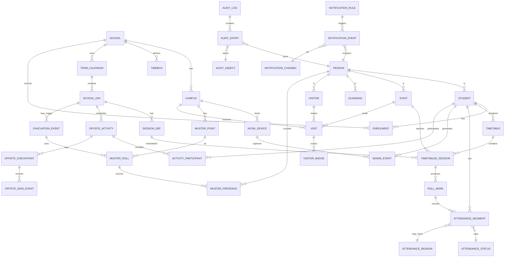
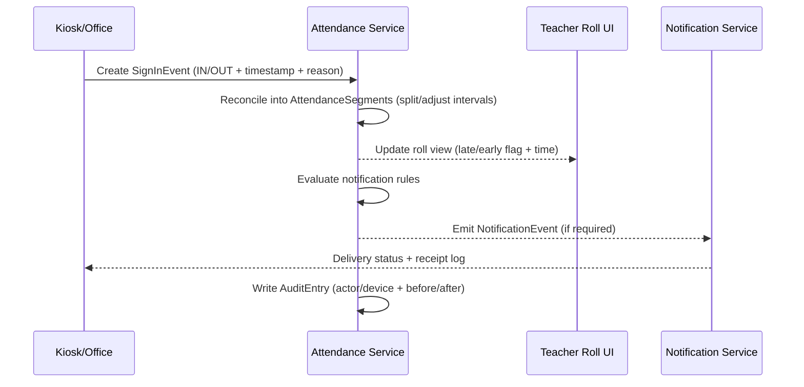
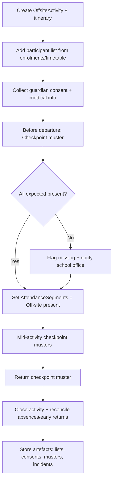
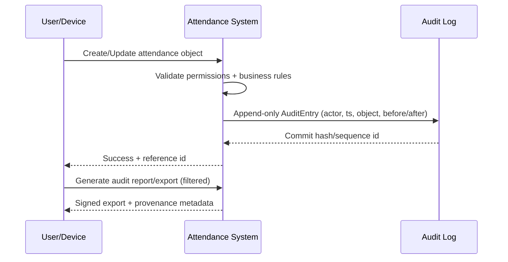

# Comprehensive School Attendance System for Australian Schools

## Executive summary

Australian schools record attendance to meet legal obligations and, critically, to determine the whereabouts of each student on each school day. citeturn11search9 A modern attendance system therefore needs to treat attendance as a safety-and-accountability capability first (real-time whereabouts, emergency rolls, auditable actions), and an administrative capability second (codes, reporting, parent notifications, retention/disposal). citeturn33search26turn31search29turn30search0

Across jurisdictions, operational expectations commonly include roll marking at the start of the day (and in many secondary settings, each period/lesson), plus precise recording of late arrivals and early departures. citeturn31search29 Attendance definitions also explicitly include participation in a school’s educational program when off-site (for example, excursions or alternative arrangements), so the system must support “present but off-site” attendance states rather than treating all off-site time as absence. citeturn19search12

Record retention and accountability requirements vary materially by jurisdiction and record class (for example, “daily class attendance” may be kept for years in one jurisdiction but decades in another), so a product intended for multi-jurisdiction use must implement configurable retention classes and “legal hold / disposal freeze” controls, not hard-coded purge rules. citeturn12view0turn15view0turn29view0turn27view0

Public audit bodies have repeatedly examined attendance administration and oversight, highlighting data quality, follow-up, and governance gaps as recurring themes. A defensible system design therefore needs end-to-end audit trails, exception reporting, and controls that make attendance data reliable enough for internal governance, departmental reporting, and potential external audit. citeturn30search0turn30search1turn30search2turn30search3

## Unified attendance domain model

### Modelling approach

A unified model that covers daily rolls, period rolls, part-day attendance, late/early events, excursions, kiosk sign-in/out, visitor management, and emergency rolls is easiest to maintain if it is built around:

- **A “person-on-schedule” core**: student enrolment, calendar, timetable, class/period sessions.
- **Event + interval attendance facts**: attendance is recorded as time-bounded segments (intervals) plus discrete events (late arrival, early leave, off-site departure/return).
- **Location/context**: on-site vs off-site, excursion/event identifier, supervision context.
- **Evidence and authority**: reason codes, parent-provided explanations, staff approvals.
- **Immutable audit trails** for every create/update/void action. citeturn31search29turn33search26turn11search9turn30search0

This aligns with jurisdictional practice: roll marking is required as a record of attendance (often day-start and, in high schools, period/lesson), and systems must capture precise arrival/departure times and reasons/codes. citeturn31search29

### Unified ER diagram (Mermaid)



### Data schema table (implementation-oriented)

The table below proposes a pragmatic relational schema (3NF-ish) that supports the full functional scope. Where jurisdictions require different retention periods, store **retention class** and compute disposal eligibility by policy, rather than deleting by hard-coded age. citeturn12view0turn15view0turn29view0turn27view0

| Entity | Primary key | Key fields (non-exhaustive) | Notes |
|---|---|---|---|
| School | school_id | name, sector_type, jurisdiction, registration_ids | Jurisdiction drives reporting + retention defaults. citeturn11search9 |
| Campus | campus_id | school_id, name, address, geo | Enables multi-campus emergency rolls and kiosk placement. |
| Person | person_id | legal_name, preferred_name, dob, contacts, identifiers | Common entity for students/staff/visitors/guardians. |
| Student | student_id | person_id, local_student_no, year_level | |
| Guardian | guardian_id | person_id | |
| Staff | staff_id | person_id, role, employment_status | Role affects permissions and audit. |
| Enrolment | enrolment_id | student_id, school_id, start_date, end_date, status | Attendance tied to active enrolments. |
| TermCalendar | calendar_id | school_id, year, term_boundaries | |
| SchoolDay | day_id | calendar_id, date, is_instruction_day | Needed for daily attendance rules. |
| SessionDef | session_def_id | school_id, name (e.g., AM/PM/Period), start_time, end_time | Supports half-days and period-by-period. |
| Timetable | timetable_id | student_id, effective_from, effective_to, timetable_version | Needed for period rolls. |
| TimetabledSession | session_id | timetable_id, day_id, session_def_id, class_id, staff_id, room | “The thing that gets a roll.” |
| RollMark | roll_id | session_id, taken_by_staff_id, taken_at, method (teacher device/web) | Roll marking is required as routine practice in some jurisdictions. citeturn31search29 |
| AttendanceSegment | segment_id | student_id, day_id, session_id (nullable), start_ts, end_ts, status_code, reason_code, recorded_by, evidence_ref | Use segments for partial attendance and off-site participation. citeturn19search12 |
| AttendanceStatus | status_code | category (present/absent/offsite), is_counted_present, is_authorised | Map to jurisdiction code sets for reporting. citeturn11search9 |
| AttendanceReason | reason_code | description, authority_required, evidence_required | Parent explanation vs medical certificate vs school decision. |
| SignInEvent | signin_id | student_id, campus_id, kiosk_id, ts, direction (IN/OUT), reason_code | Kiosk sign in/out for late/early/appointments. citeturn31search3turn31search13 |
| OffsiteActivity | activity_id | day_id, type (excursion/sport/work exp), start_ts, end_ts, location, organiser_staff_id | Off-site attendance needs explicit representation. citeturn19search12 |
| ActivityParticipant | participant_id | activity_id, student_id, role, consent_status | Supports “expected vs actual present” lists. |
| OffsiteCheckpoint | checkpoint_id | activity_id, name, ts_planned | E.g., depart/arrive/venue muster. |
| OffsiteSignEvent | offsite_sign_id | checkpoint_id, student_id, ts_actual, status | Captures excursion headcounts at checkpoints. |
| Visit | visit_id | visitor_person_id, campus_id, host_staff_id, purpose, sign_in_ts, sign_out_ts, identity_check, wwcc_sighted | Visitor registers are retained long-term in some jurisdictions. citeturn27view0turn15view0 |
| VisitorBadge | badge_id | visit_id, badge_no, issued_ts, returned_ts | Supports on-site identification. |
| EvacuationEvent | evac_id | campus_id, triggered_ts, type (drill/actual), initiated_by | |
| MusterPoint | muster_id | campus_id, name | |
| MusterRoll | muster_roll_id | evac_id, muster_id, taken_by, taken_at | “Emergency roll” snapshot. Vendor implementations exist. citeturn31search9 |
| MusterPresence | muster_presence_id | muster_roll_id, person_id, status (present/missing/injured) | Includes visitors + staff. citeturn27view0turn15view0 |
| NotificationRule | rule_id | trigger_type, audience, channel, throttle, template_id | Vendors commonly support absentee notifications. citeturn31search5turn31search2turn31search12 |
| NotificationEvent | notif_id | rule_id, person_id, ts, delivery_status, payload_ref | Record what was sent, when, to whom. |
| AuditEntry | audit_id | ts, actor_person_id, action, object_type, object_id, before_json, after_json, ip/device | Essential for audit defensibility. citeturn30search0turn14view0 |
| RecordRetentionClass | retention_id | record_type, jurisdiction, min_years, trigger_event, legal_hold_supported | Drives disposal eligibility per jurisdiction and schedule. citeturn12view0turn15view0turn29view0turn27view0 |

## Operational workflows

The diagrams below show “happy path” and key exception handling at the level typically needed to implement or evaluate Commercial Off-The-Shelf (COTS) products.

### Roll-taking workflow (day/class/period) and partial attendance

Roll marking commonly requires attendance recorded at the start of the school day, and (in high schools) each period/lesson; late arrivals and early departures require precise times with relevant codes. citeturn31search29

```mermaid
flowchart TD
    A[Session starts] --> B[Teacher opens Roll Mark]
    B --> C{Auto-populate from timetable?}
    C -->|Yes| D[Show expected students]
    C -->|No| D
    D --> E[Mark each student: Present / Absent / Off-site / Partial]
    E --> F{Late arrival occurred?}
    F -->|Yes| G[Record arrival time and reason code]
    F -->|No| H{Early departure planned/occurred?}
    H -->|Yes| I[Record departure time and authority]
    H -->|No| J[Submit roll]
    G --> J
    I --> J
    J --> K[Generate AttendanceSegments for session/day]
    K --> L[Trigger exception checks (unexplained absences, chronic patterns)]
    L --> M[Queue notifications per rules]
```

### Late arrival and early leave processing (office + kiosk + approvals)

Late/early processing must remain consistent with roll marking (teacher view) and student movement (office/kiosk view), with a single authoritative attendance fact set. NSW explicitly expects precise arrival/departure times and appropriate codes. citeturn31search29



### Excursion and off-site activity sign-in/out with checkpoint headcounts

Attendance definitions can include participation in the formal instructional program off-site; accordingly, excursions should produce “off-site present” attendance, not “absent”, and should support checkpoint musters (depart/arrive/venue). citeturn19search12turn11search9



### Evacuation and emergency roll procedures

Emergency roll capability should instantly answer: “Who is supposed to be on-site?” and “Who is confirmed at muster?” including visitors. Some vendor implementations explicitly support evacuation roll marking and summaries. citeturn31search9turn15view0turn27view0

```mermaid
flowchart TD
    A[Trigger EvacuationEvent] --> B[Freeze on-site expected list]
    B --> C[Expected list = Students scheduled + Staff roster + Signed-in visitors]
    C --> D[At MusterPoint: take MusterRoll (mobile/paper)]
    D --> E[Record each person: Present / Missing / Injured]
    E --> F[Compare expected vs present]
    F --> G[Generate Missing Persons list + last-known context]
    G --> H[Escalate per incident plan + log actions]
    H --> I[After all-clear: close event + retain evidence + audit]
```

### Visitor check-in/out workflow (identity, badge, child-safety gates)

Visitor registers commonly require names, purpose, date, and time in/out; some jurisdictions retain these for extended periods, and recordkeeping authorities treat such logs as formal records. citeturn27view0turn15view0

```mermaid
flowchart TD
    A[Visitor arrives] --> B[Capture identity + purpose + host staff]
    B --> C{Child-safety screening required?}
    C -->|Yes| D[Record WWCC/ID sighted outcome]
    C -->|No| E[Proceed]
    D --> E[Issue badge/pass]
    E --> F[Create Visit record (sign-in timestamp)]
    F --> G[Optional: emergency inclusion flag]
    G --> H[Visitor departs]
    H --> I[Sign out + return badge]
    I --> J[Close Visit + write AuditEntry]
```

### Automated parent/guardian notifications (absence, late, early, partial)

Automation is widely implemented in vendor products (SMS/email/push), and helps satisfy operational expectations around prompt follow-up of unexplained absences and safety confirmation. citeturn31search12turn31search5turn31search6turn33search26

```mermaid
flowchart TD
    A[AttendanceSegments updated] --> B{Rule match? (e.g., unexplained absence)}
    B -->|No| Z[Stop]
    B -->|Yes| C[Resolve recipients (primary/secondary guardians)]
    C --> D[Apply throttling + dedupe window]
    D --> E[Send via channel (SMS/email/push)]
    E --> F[Record NotificationEvent + delivery status]
    F --> G{Reply received?}
    G -->|Yes| H[Create evidence + update reason/authorisation]
    G -->|No| I[Escalate to attendance officer workflow]
    H --> J[Audit log all changes]
    I --> J
```

### Audit logging workflow (tamper-evident, reviewable, exportable)

Public audit reports routinely examine whether attendance processes and oversight are effective; defensibility depends on being able to show *who* changed attendance, *when*, *why*, and *what changed*. citeturn30search0turn30search1turn30search2



## Australian compliance requirements

### Cross-jurisdiction baseline

Nationally, attendance data is recorded and reported for legislative compliance and system monitoring, and is used for jurisdictional and national reporting. citeturn11search9 Operationally, jurisdictions emphasise that roll marking and attendance management are core to student safety (knowing where students are when instruction is provided). citeturn33search26turn19search12

A practical multi-jurisdiction compliance strategy is therefore:

- Implement **jurisdiction-aware code sets** (authorised/unauthorised, off-site categories, partial attendance).
- Support **minute-accurate timekeeping** for late/early and part-session attendance where required. citeturn31search29
- Provide **reporting exports** aligned to national/jurisdiction aggregates and auditing needs. citeturn11search9turn30search0
- Enforce **records retention by jurisdiction and record class**, including disposal holds and audit-ready destruction registers. citeturn14view0turn12view0turn29view0turn27view0

### Summary table by state/territory

Abbreviations below use the full jurisdiction name once, then abbreviate for repeat references.

| Jurisdiction | Statutory / authoritative basis (examples) | Attendance recording expectations (selected) | Retention examples for attendance-related records (government context) | Audit / enforcement examples |
|---|---|---|---|---|
| entity["state","New South Wales","australia"] (NSW) | entity["organization","NSW Department of Education","state education dept"] procedures under School attendance policy; citeturn31search29turn33search4 | Roll at day start; in high schools each lesson/period; record precise late/early times and codes. citeturn31search29 | Daily attendance registers/rolls (incl. excursion rolls etc): retain min 3 years after action completed. citeturn12view0 | Audit Office examined how attendance is managed in NSW government schools. citeturn30search0 |
| entity["state","Victoria","australia"] (VIC) | Education and Training Reform Act 2006 (Vic) (compulsory attendance framework); retention authority PROS 22/06. citeturn33search1turn14view0 | Attendance is treated as a formal school record class under PROS 22/06 (daily class records, exceptions such as early sign-out, and attendance case management). citeturn15view0 | “Daily class attendance records” class: destroy 7 years after action completed; summary attendance evidence / attendance case management: destroy 30 years after action completed. citeturn15view0 | Victorian Auditor-General reports examine attendance management practices. citeturn30search1 |
| entity["state","Queensland","australia"] (QLD) | Education (General Provisions) Act 2006 (Qld) (schooling framework); Education (General Provisions) Regulation 2006 (Qld) requires recording absences “in a way decided by the chief executive”; roll marking procedure sets operational expectations. citeturn33search2turn33search18turn33search26 | Roll marking procedure frames attendance recording as critical for student safety/protection. citeturn33search26 | Direct schedule access can be constrained online; Queensland State Archives-based school retention guidance exists (secondary synthesis). citeturn10search8turn9search1 | Queensland Audit Office performance audit on improving student attendance (2012). citeturn30search2turn30search22 |
| entity["state","Western Australia","australia"] (WA) | School Education Regulations 2000 prescribe retention of attendance particulars for 7 years from enrolment cessation (reg 21). Attendance policy defines attendance to include participation in formal instructional program off-site. citeturn20view0turn19search12 | Attendance includes on-site and off-site participation in the school program. citeturn19search12 | Attendance particulars retained 7 years from enrolment ceasing (reg 21); closure rules apply (reg 22). citeturn20view0 | WA Auditor General reports on managing student attendance in public schools (including follow-on). citeturn30search3turn30search11 |
| entity["state","South Australia","australia"] (SA) | Education and Children’s Services Act 2019 (SA) (attendance framework); State Records SA disposal schedules for school records (GDS 22). citeturn3search2turn16view0 | GDS 22 explicitly covers attendance records (roll books, notices of non-attendance) as a managed record category. citeturn17view0 | GDS 22 v4 includes attendance record classes; some items were time-bounded and flagged for review, and also include permanent retention classes in specific contexts. citeturn17view0turn16view0 | (Example audit context) Public recordkeeping and retention governance is managed through State Records SA disposal determinations. citeturn18search12 |
| entity["state","Tasmania","australia"] (TAS) | Education Act 2016 (Tas); Tasmanian Archive & Heritage Office disposal schedule DA2280 for government schools/colleges includes attendance record classes. citeturn23search17turn24view0 | DA2280 explicitly defines “Student Attendance” as managing attendance and absences. citeturn24view0 | Attendance registers (pre-central DB where only record): destroy 7 years after student leaves school or reaches 25, whichever is later; sign-out registers: destroy 2 years after action completed. citeturn24view0 | Tas Auditor-General commentary includes assessment of attendance systems/processes for national reporting compliance. citeturn23search27 |
| entity["state","Australian Capital Territory","australia"] (ACT) | Education Act 2004 (ACT) via Education Directorate policy; Territory Records disposal schedule covers student attendance records. citeturn33search24turn29view0 | Policy requires maintenance of enrolment/attendance registers in SAS; disposal schedule treats attendance as compliance records (incl. class roll). citeturn33search24turn29view0 | “Records relating to … student attendance (class roll)” retained 75 years from date of roll; aggregate reporting from attendance records: destroy 7 years after action completed. citeturn29view0 | Retention periods are formalised through Territory Records instruments; auditability supported by long retention of core attendance evidence. citeturn29view0 |
| entity["state","Northern Territory","australia"] (NT) | Education Act 2015 (NT) and Education Regulations 2015; Department procedures for enrolment/attendance enforcement; NT Archives disposal schedule for school management sets retention. citeturn33search23turn33search15turn33search11turn27view0 | Regulations prescribe information required in enrolment/attendance registers; procedures describe compulsory enrolment/attendance enforcement. citeturn33search15turn33search11 | Student daily attendance registers: destroy 45 years after student has left school; visitor registers (names/purpose/time in-out): destroy 45 years after last entry. citeturn27view0 | NT record disposal schedules explicitly tie disposal legality to statutory recordkeeping obligations (Information Act context in schedule preamble). citeturn26view1 |

### Practical “mandatory fields” baseline (fit-for-purpose across jurisdictions)

Because some jurisdictions specify register information in legislation/regulation (for example, prescribed register information in NT regulations; absences must be recorded as directed by the chief executive in QLD regulation), and others specify operational requirements in department procedures (for example, in NSW: roll marking timing and precise late/early timestamps), a conservative baseline set of mandatory attendance data fields is: citeturn33search15turn33search18turn31search29

- Student identifier (local + system), enrolment status, year level/home group.
- Instructional day/date and session identifier (day/AM-PM/period).
- Attendance status (present/absent/off-site/partial) with start/end timestamps for partials.
- Late arrival timestamp; early departure timestamp; and the authority/source for the change.
- Reason code + narrative (where required) and evidence pointer (note/SMS reply/medical).
- Recorder identity (staff/system), method (teacher roll/kiosk/admin import), and audit trail.

## Vendor feature comparison

The Australian school software market commonly offers attendance as part of a broader school management suite, with optional kiosks, parent portals, and messaging automation.

### Comparative feature table (illustrative, based on vendor documentation)

| Capability | entity["company","Compass Education","school management platform"] | entity["company","Sentral","school management system"] | entity["company","SEQTA","education platform"] | entity["company","Daymap","school management system"] | Specialist visitor systems (examples) |
|---|---|---|---|---|---|
| Parent-facing absence notes / attendance visibility | Parent guide indicates parents can monitor attendance and enter explanations for absence/lateness. citeturn31search0 | Attendance module integrates with messaging; admin/user guides describe absence types and recording. citeturn31search21turn31search13 | Engage/attendance admin includes parent-notified absences workflows (module-level capability). citeturn31search10 | Platform positions attendance management as core. citeturn31search3 | Usually visitor-focused rather than parent notes. |
| Automated absentee comms (SMS/email/push) | Vendor promotes automated updates via SMS/email/push and absence comms automation. citeturn31search4turn31search12 | Help docs describe automatic absence notifications (SMS/email rules). citeturn31search5 | Help docs cover absentee SMS templates and sending absentee SMSes. citeturn31search2turn31search6 | Feature set references reporting; comms often integrated but varies by deployment. citeturn31search3 | Visitor systems more commonly message hosts/emergency contacts than guardians. |
| Kiosk sign-in/out for students | Often implemented via portals/apps and/or front office processes; specific kiosk capability depends on deployment. citeturn31search12 | Admin guide notes kiosk support for roll marking/attendance tracking. citeturn31search13 | Typically supports attendance admin flows; kiosk varies by school. citeturn31search6 | Explicitly offers optional kiosk for students to sign in/out. citeturn31search3 | Designed primarily for visitor + contractor check-in/out. citeturn31search15turn31search19 |
| Evacuation / emergency roll support | Usually supported via roll access on devices; varies. | FAQ notes roll marking at evacuation point and evacuation summary comparison. citeturn31search9 | Not primarily marketed as evacuation-specific in cited docs. | Not specifically evidenced in cited feature page. | Visitor systems often support emergency lists/export (“who is on site”). citeturn31search15turn31search19 |
| Compliance reporting outputs | Depends on jurisdiction integration and report packs. | Attendance reporting is a key module function; guides describe roll configuration and export/reporting toolchain. citeturn31search13turn31search21 | Attendance admin module supports follow-up workflows (reporting varies). citeturn31search6 | Explicitly markets rich reporting including “government compliance reporting”. citeturn31search3 | Visitor systems provide audit and emergency exports rather than student attendance compliance. citeturn31search15 |

### Interpreting vendor claims in an Australian compliance context

Because public audits frequently examine attendance administration and oversight, vendor capability should be evaluated not only on feature checklists, but on evidence quality:

- Can you **reconstruct** who changed an attendance record, from what device, with what justification?
- Can you implement **jurisdictional retention** (including long retention periods for core attendance evidence in ACT/NT contexts) without manual effort?
- Can you produce **audit-ready exports** showing roll completion, late/early logs, and excursion participation evidence? citeturn30search0turn29view0turn27view0turn31search3

## Privacy and security considerations

### Regulatory landscape and applicability

Attendance systems process high-sensitivity personal information (identity, location/time patterns, health-related reasons for absences, and child-safety-related visitor screening artefacts). For private-sector and many non-government school operators, the Australian Privacy Principles (APPs) under the Privacy Act 1988 are the central baseline; the APPs govern collection, use/disclosure, security, access, and transparency obligations. citeturn32search0turn32search4

Public sector schools and education departments are typically governed by state/territory privacy frameworks; the OAIC provides a consolidated overview of state/territory privacy legislation and the general boundary between Commonwealth and state coverage. citeturn32search3 For example, NSW public sector privacy is governed by the Privacy and Personal Information Protection Act 1998. citeturn32search7

If the Privacy Act applies, the Notifiable Data Breaches (NDB) scheme requires notification to affected individuals and the OAIC where a breach is likely to result in serious harm. citeturn32search1turn32search5

### Security expectations that materially reduce attendance-system risk

A school attendance system is not just a database: it is an operational safety system. Minimum security controls should therefore align to recognised Australian Government cyber guidance, including the Essential Eight mitigation strategies as a baseline for reducing compromise likelihood. citeturn32search2turn32search14

Controls with direct relevance to attendance and visitor tooling include:

- **Strong identity and access management**: role-based access, least privilege, MFA for staff/admin, and strict separation between teacher, office, and system administrator capabilities. (Supports audit defensibility raised in attendance audits.) citeturn30search0turn30search1
- **Tamper-evident audit logs**: append-only logging of attendance edits and exports; searchable by student/day/class; export signing and provenance metadata. Public record authorities treat unlawful destruction of public records as a serious compliance issue, so auditability and disposal controls should be designed in. citeturn14view0turn29view0turn26view1
- **Data minimisation + purpose limitation**: avoid collecting health details in free-text where structured codes suffice; attach documents only where required; ensure notifications do not disclose sensitive reasons by default (channel-appropriate redaction).
- **Device security for kiosks**: kiosk lockdown mode, hardened OS, no local admin access, encrypted storage, remote wipe, and offline queue encryption (to prevent local tampering).
- **Retention and disposal governance**: retention classes per record type and jurisdiction; legal hold support; “register of destroyed records” or equivalent disposal audit trail where required by record authorities. citeturn29view0turn12view0turn26view1
- **Emergency-mode operation**: evacuation rolls and on-site person lists must still be available during network outages, with controlled offline exports and post-incident synchronisation. (This is operationally aligned with evacuation roll tooling patterns and visitor register inclusion.) citeturn31search9turn27view0

