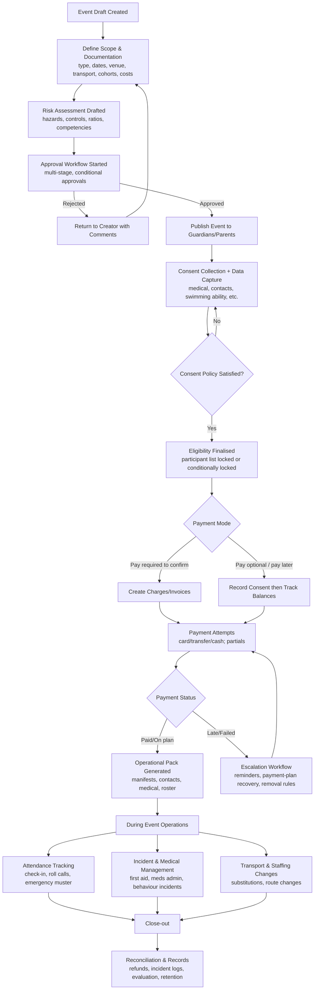
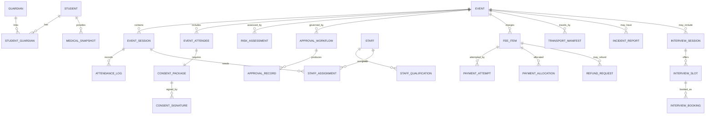

# Deep research on school event management systems for excursions, camps, sports, consent, payments, attendance, staffing, and parent–teacher interviews

## Scope and evidence base

This report covers end-to-end workflows and the underlying data model for school-managed events—especially excursions, camps, and sports events—plus parent–teacher interview booking, with an emphasis on consent collection, risk/approval workflows, payments/refunds, in-event attendance tracking, and staff allocation/rostering.

**Regulatory and policy constraints are treated as variables.** In practice, requirements vary by jurisdiction (for example: when written consent is legally required, what constitutes “parental responsibility”, what charging/remissions rules apply, and which child-safety checks are mandatory). The system design therefore needs a configurable policy layer rather than hard-coded assumptions. This is consistent with official guidance that distinguishes “everyday” vs “higher-risk” trips and expects proportionate arrangements, rather than one-size-fits-all paperwork. citeturn5view0turn14view0

**Primary sources prioritised (English):**

- Official guidance and regulators: entity["organization","Department for Education","uk government department"] (educational visits; parental responsibility; data protection in schools), entity["organization","Health and Safety Executive","uk safety regulator"] (proportionate risk management for school trips), entity["organization","NSW Department of Education","new south wales, australia"] (excursions and variations of routine; family law guidelines; translated excursion consent form), entity["organization","Victorian Government","victoria, australia"] (excursions/regular outings risk assessment and written authorisation elements), entity["organization","Office of the Australian Information Commissioner","australia privacy regulator"] (Australian Privacy Principles guidance), entity["organization","Information Commissioner's Office","uk data protection regulator"] (children and UK GDPR), entity["organization","U.S. Department of Education","federal government agency"] (FERPA overview; noncustodial access rights context via NCES), entity["organization","U.S. Department of Health & Human Services","federal government agency"] (FERPA vs HIPAA for school health records). citeturn5view0turn14view0turn16view0turn17view0turn38view0turn48view0turn41search1turn41search0turn41search6turn41search11  
- Major SIS / school-platform vendor documentation (public): entity["company","School Bytes","school management platform, australia"] (event approvals, online permission notes, audit logs, attendance module, parent portal payments/refunds/interviews, security posture claims), entity["company","Sentral","school management software, australia"] (activities risk assessment, approval workflow, activity logs, roll marking + attendance integration, finance refunds + approvals, overpayment/credit handling), entity["company","Compass Education","school management system vendor"] (billing instalments/payment plans and refunds; parent features incl. consent/payment and parent–teacher conference booking), entity["company","Arbor Education","school management system vendor"] (parent evening booking rules in practice), entity["company","Bromcom","school management system vendor"] (parent evening booking incl. auto/quick booking and online meeting integration). citeturn34view0turn35view0turn10view0turn19view0turn11view0turn21view0turn33view0turn33view1turn33view2turn31view0turn27view0turn27view1turn28view0turn29view0turn25view0turn49view0turn30search2  
- Security-control references supporting audit/logging and payment-data handling: entity["organization","PCI Security Standards Council","payment security standards body"] (no storage of sensitive authentication data post-authorisation), entity["organization","OWASP","web security foundation"] (logging design guidance), entity["organization","Australian Taxation Office","commonwealth tax authority"] (audit logging, MFA and retention expectations for software providers). citeturn40view0turn40view1turn40view2  
- Supporting infrastructure entities referenced by vendor docs: entity["company","Amazon Web Services","cloud provider"] (vendor-stated hosting region), entity["organization","Service NSW","nsw government service"] (vendor-stated payment platform), entity["organization","Office of the Children's Guardian","new south wales, australia"] (WWCC references in NSW excursion procedure). citeturn21view0turn42view0turn10view0  

## Executive summary

School event management systems that “work in the real world” converge on a **single lifecycle**: draft → risk/approvals → publish → consent + data collection → payments and reconciliation → operational execution (attendance, supervision, incidents) → close-out (refunds, records retention, evaluation). Official guidance explicitly expects **risk-proportionate planning**, headteacher/principal approval for higher-risk visits, and a documented emergency response approach. citeturn5view0turn14view0turn4view0

Across vendor documentation, the same lifecycle is implemented with different emphasis:
- Some systems foreground **multi-stage approvals and audit logs** (including per-event and even per-attendee audit trails), enabling traceable changes without re-papering everything. citeturn34view0turn33view1  
- Parent portals increasingly combine **consent collection and payments** and may enforce “pay-now to save consent”, while also supporting “consent now, pay later” variants—two materially different workflow modes that must be configurable. citeturn10view0turn29view0  
- Refunds are typically treated as **a workflow requiring approval** and status transitions rather than a simple reversal, particularly for controlled environments. citeturn19view0turn27view0  
- Parent–teacher interviews are implemented as a specialised “event family”: the unit of work is a **time-slot booking** with availability, rules, and cut-offs; some platforms support real-time slot locking and even auto-scheduling/quick-book. citeturn11view0turn49view0turn25view1  

The hardest problems are **edge cases**: split custody and multiple guardians, looked-after/out-of-home care consent authority, last-minute medical/behaviour changes, transport changes, school-cancelled events, partial/late payments, payment plan failures, and ensuring everyone is accounted for during an incident. Guidance on parental responsibility explicitly advises schools to avoid being drawn into parental disputes and sets expectations for when one vs both parents’ consent is sought—implying the system must represent “who can consent” as structured data and policy, not a free-text note. citeturn16view0turn7view0turn17view0

## Unified end-to-end workflows

The workflow below intentionally treats **excursions, camps, sports events, and interviews** as variations of a common “Event” model. This mirrors vendor practice where “events/incursions/excursions” share templates, approvals, and parent communications, while interviews share booking primitives (sessions/slots and capacity). citeturn34view0turn11view0turn49view0



**Event creation → approvals/risk assessment**  
Official guidance distinguishes routine/everyday-risk visits from those needing “risk assessment and extra planning” and notes that some trips require “detailed planning and the informed approval of the headteacher or governing board”, with competence expectations for the trip manager. citeturn5view0  
NSW’s excursion procedure similarly requires a risk assessment plan, consultation where needed, pre-excursion checks (including weather/safety warnings and student health support plans), and explicit processes for cancellation due to health/safety events or travel advisories; it also mandates record-keeping of the endorsed risk plan, approvals, consent forms, costs, and incident records. citeturn12view2turn13view3  
Vendor documentation shows the same pattern operationalised as configurable templates and multi-stage approvals with reminders and reject-with-comments loops. citeturn34view0  

**Consent collection (including split custody and multiple guardians)**  
Consent is not uniform across jurisdictions. In England, written consent is always required for nursery-age children, and typically for higher-risk/out-of-hours trips; schools may also collect enrolment-time “blanket consent” but still must inform parents and allow withdrawal. citeturn5view0turn7view1  

Split-custody handling must be policy-driven:
- Guidance on parental responsibility (England) states that when parental consent is needed for extra-curricular visits, the headteacher should usually seek consent from the resident parent, with exceptions; if the school is asked (or decides) to seek consent from both parents, it may assume consent is not given unless both agree, and it should avoid becoming involved in disputes. citeturn16view0turn7view0  
- NSW guidance emphasises dealing with court orders as sensitive records, assuming shared and equal parental responsibility unless notified otherwise, and applying careful information-sharing practices (including not disclosing addresses/contact details without consent). citeturn17view0  

A robust system therefore needs, at minimum:
- A **Guardian authority model** (per guardian: parental responsibility status, court-order constraints, “must-request-consent” flags, and “do-not-contact” safeties).
- A **Consent policy engine** (for a given event: require 1-of-N authorised guardians; require both guardians; require guardian + corporate parent; etc.).
- **Evidence and auditability**: OEAP guidance recommends electronic consent systems record when and by whom consent was given and support consent by all with parental responsibility where required. citeturn7view2turn34view0  

**Payments and refunds (late/partial/payment plans/failed payments)**  
Payments are not just “take money”: they define eligibility, cancellation terms, and how refunds/credits are processed.

Policy pressure points:
- England’s charging advice distinguishes chargeable “optional extras” (including board and lodging for residential visits) and requires charging/remissions policies; it also notes that schools cannot exclude children from national-curriculum activities purely because parents cannot or refuse to contribute, which can force budgeting or cancellation decisions. citeturn9view1turn9view2turn9view3  
- NSW procedure similarly indicates excursion costs are met by parents/carers, but also states students should not be disadvantaged by inability to pay (allowing principal discretion for subsidies). citeturn12view1turn12view2  

Observed vendor workflow variants:
- School Bytes supports events where the school can require **pay-at-the-same-time-as-consent**, and explicitly states payment may be required for the consent response to be saved; it also supports “pay or pay later” flows. citeturn10view0  
- School Bytes supports parent-initiated refund requests that are routed to the school for approval, with guidance that refunds should go back to the original card if available. citeturn19view0  
- Sentral models refunds as a workflow: refund requests move through pending approval → approve/reject → processing → completed, and the guide explicitly covers prerequisites like fees paid (full/partial) and cancellation creating credit. citeturn27view0turn27view1  
- Compass billing materials describe parents being able to pay “more than once” to chip away, include instalments/payment plans, and acknowledge failed payment plan troubleshooting and refunds in billing management. citeturn29view0  

**Attendance tracking during events (real-time check-in, roll calls, emergency musters)**  
A school event system must support two attendance planes:
1) **Official attendance** (the statutory/daily roll in many jurisdictions).  
2) **Operational attendance** for the event itself (who is physically present at each moment, especially during transitions like boarding buses or venue moves).

Vendor documentation exposes key primitives:
- School Bytes’ attendance module includes an “events view” used as an unofficial roll that can optionally be synchronised to the official daily roll. citeturn35view0  
- Sentral’s Activities module supports creating recurring or once-off rolls for an activity/excursion, marking rolls, and automatically creating/updating absences in the Attendance module when the activity roll is submitted (if configured). It also maintains a read-only activity log of actions and who performed them. citeturn33view1turn33view2turn31view0  

Official guidance reinforces “account for everyone” expectations indirectly through emergency planning and operational controls:
- England’s educational visits guidance expects an emergency response plan and communications plan for incidents away from school, plus evaluating visits and keeping incident/near-miss records. citeturn5view0  
- NSW requires reviewing weather and health warnings pre-excursion, carrying specific first aid and emergency medication items, and reporting incidents under incident notification procedures. citeturn13view3turn42view0  
- Victorian early childhood excursion guidance explicitly calls out strategies to account for children, especially during transition times, and to check presence against an accurate attendance record. (Even if your scope is K–12, this is a useful “mustering mindset” pattern.) citeturn48view0  

**Staff allocation and rostering (qualifications, ratios, substitutions)**  
Staffing rules vary. NSW explicitly states there are no set supervision ratio requirements for Kindergarten to Year 12 and principals determine staffing; it also notes that higher ratios are needed for water/outdoor activities and that activity guidelines may specify mandatory qualifications, prerequisites, and equipment. citeturn12view2turn13view3  
NSW also imposes strong constraints around supervision responsibility (cannot be delegated), volunteer participation conditions, and child protection screening (Working with Children Checks and checks in the department’s screening system) depending on role and context (day/overnight, transport, external providers). citeturn42view0turn12view2  

**Parent–teacher interview booking and integration with events**  
Public vendor docs converge on a shared pattern:
- Real-time slot booking with constraints (one slot per teacher/student, booking windows, and cut-off behaviour). citeturn11view0turn25view0turn25view1  
- Booking acceleration features like “Quick Book / auto-allocation” and explicit “Not available” handling when a slot is taken. citeturn49view0  
- Optional online meeting integration via Google or Office365 in some implementations. citeturn49view0  

From a unified system design perspective, interviews are best treated as an `Event` with:
- `InterviewSession` (e.g., “Year 9 Parents Evening, 17:00–20:00”)  
- `InterviewSlot` (teacher + time range + capacity)  
- `Booking` (guardian(s) + student + teacher + slot + attendance type like in-person/online). citeturn11view0turn25view1turn49view0  

### Workflow variants comparison table

| Workflow dimension | Variant A | Variant B | System implication |
|---|---|---|---|
| Consent scope | Blanket/enrolment-time consent with per-visit “inform + withdraw” step citeturn5view0turn7view1 | Visit-specific consent (often required where payment/cancellation terms apply) citeturn7view1turn7view2 | model both as `ConsentPolicy` + `ConsentEvidence` linked to `EventVersion` |
| Multi-guardian rules | 1 authorised guardian sufficient | require both guardians (or specific authority mix) citeturn16view0turn7view0 | per-event `required_signatures` rules; track who was asked and who responded |
| Consent/payment coupling | payment required to lodge/save consent citeturn10view0 | consent can be lodged, payment later / instalments citeturn10view0turn29view0 | two gating modes: `confirm_on_consent` vs `confirm_on_payment` |
| Payment structure | single full payment | partial payments, credits, instalments/payment plans citeturn20view0turn28view0turn29view0 | `PaymentPlan` + `PaymentAllocation`; idempotent payment attempts |
| Refund process | manual/offline | workflow: request → approve/reject → process → complete citeturn19view0turn27view0 | `RefundRequest` + `ApprovalRecord` + statuses; reversible accounting |
| Event attendance capture | unofficial “event roll” only citeturn35view0 | event roll synchronised to official attendance citeturn35view0turn31view0turn33view2 | dual-ledger attendance; mapping rules for absence codes |
| Interview booking | manual selection | auto/quick-book scheduling with rules citeturn49view0 | slot-locking + constraint solver; audit changes and cancellations |

## Edge cases and exception handling

Edge cases are not “rare”; they are the dominant source of operational risk. The matrix below maps the user-requested exceptions to detection, system behaviour, and the minimum data/audit artefacts required.

| Edge case | Detection / trigger | Required system behaviour | Data + audit artefacts |
|---|---|---|---|
| Split custody: one guardian consents, other objects | guardianship rules indicate dual consent required; or school asked to seek both citeturn16view0turn7view0 | set status `pending_dual_consent`; block participation; avoid “adjudicating” dispute; provide “seek legal advice/court order” guidance path for staff citeturn16view0 | `GuardianAuthority`, `ConsentSignature` per guardian, `ConsentDecision` status history, `NotificationLog` |
| Looked-after / out-of-home-care student | student flagged as care/out-of-home; consent authority is local authority/corporate parent; delays likely citeturn7view0turn16view0turn17view0 | allow confidential “reserved places”; longer deadlines; route consent request to designated authority; track delegation documents | `StudentLegalStatus`, `ConsentProxy`, `DocumentLink`, `AuditLog` |
| Late enrolment into event after approvals | participant added close to departure; staffing/ratios/costs impacted | configurable rule: allow add without re-approval vs require re-approval; vendors explicitly advertise “last-minute changes without a re-approval” as a capability, but this is a policy choice citeturn34view0 | `EventVersion`, `ApprovalPolicy`, `AttendeeChangeLog`, recalculated `StaffAssignment` |
| Cancellation by school (weather/emergency/travel advisory) | pre-excursion review flags weather/safety warnings; senior directive to cancel citeturn13view3turn5view0 | mass notify; freeze new payments; compute refund rules; preserve audit trail; generate incident/decision record | `EventCancellation`, `DecisionRecord`, `RefundBatch`, `CommsLog` |
| Cancellation by parent (withdrawal) | guardian withdraws consent or books out; payment policy varies citeturn7view1turn19view0 | update attendee status; enforce cancellation terms; allow refund request workflow | `ConsentWithdrawal`, `RefundRequest`, `FeeAdjustment`, audit entries |
| Medical changes after consent | guardian updates medical info; or emergency-contact changes; pre-excursion checks require review of health plans citeturn7view2turn13view3 | record new version; notify trip leader; regenerate medical summary; require acknowledgement by leader | `MedicalRecordVersion`, `Acknowledgement`, `NotificationLog` |
| Behaviour incident during event | incident reported; NSW requires incident reporting procedure alignment citeturn13view3 | create incident record; attach witnesses; link to attendance and supervision context; post-event follow-up workflow | `IncidentReport`, `EvidenceAttachment`, `AttendanceLog`, `StaffAssignment` |
| Transport change (bus swap, route change, seat re-allocation) | external provider update; risk assessment needs amendment | update transport manifest; notify guardians; ensure emergency contacts and muster points updated; if change introduces new risk, create `EventVersion` and trigger relevant approvals | `TransportManifestVersion`, `RiskAssessmentDelta`, `ApprovalRecord` |
| Payment fails (declined/insufficient funds) | gateway failure callback; instalment missed; billing system flags “failed plan” citeturn29view0turn40view0 | retry policy, reminders, alternate method path; optionally suspend participation if “pay required to confirm”; never store sensitive authentication data citeturn40view0turn10view0 | `PaymentAttempt` with reason, `DunningSchedule`, `EligibilityStatus` transitions |
| Partial payment, overpayment, credits | partial allocations; overpayment credit rules citeturn20view0turn28view0turn27view0 | allocate credits oldest→newest by default (if following Sentral’s model); allow manual reallocation; show balances per fee/item citeturn28view0 | `PaymentAllocation`, `CreditLedgerItem`, `ReallocationAudit` |
| Insurance claim (travel/medical/accident) | incident type indicates claim; travel insurance required for some events (example: air travel/travel insurance checkbox) citeturn38view0turn5view0turn13view3 | lock relevant records; export evidence pack; ensure data minimisation and retention rules | `InsurancePolicyRef`, `IncidentReport`, `ExportJob`, `RetentionHold` |

## Required data objects and schemas

Two official patterns strongly influence the data model:

- **Records must be reconstructible and auditable** (what happened, when, who approved/changed it). NSW requires maintaining excursion records including endorsed risk plans, parent info, approvals, consent forms, cost/supervision/travel details, and incident reports, and it explicitly calls out destruction of certain personal data (e.g., passport copies) after completion—implying lifecycle-aware retention policies. citeturn13view3  
- **Consent and participant information are distinct but linked**; OEAP guidance notes consent and participant data are often gathered together but need not be, and electronic consent should connect consent to visit information and capture who/when. citeturn7view0turn7view2  

### Data model table (core objects)

| Object | Purpose | Key fields (illustrative, not exhaustive) | Relationships |
|---|---|---|---|
| Student | participant identity | `student_id`, `legal_name`, `preferred_name`, `dob`, `year_level`, `flags` (medical/behaviour/legal), `school_id` | 1..* to `StudentGuardian`; 0..* to `EventAttendee` |
| Guardian | consent/payment actor | `guardian_id`, `name`, `email`, `phone`, `auth_methods`, `language_pref` | 1..* to `StudentGuardian`; 0..* to `ConsentSignature`, `PaymentAccount` |
| StudentGuardian | enrolment relationship | `relationship_type`, `lives_with`, `parental_responsibility` (jurisdictional), `court_order_refs`, `contact_restrictions` | joins Student↔Guardian; drives consent policy citeturn16view0turn17view0 |
| Event | excursion/camp/sport/interview umbrella | `event_id`, `type`, `status`, `title`, `description`, `start/end`, `venue`, `capacity`, `version` | 1..* to `EventSession`, `RiskAssessment`, `ApprovalWorkflow`, `EventAttendee` |
| EventSession | itinerary segment / interview session | `session_id`, `event_id`, `segment_type` (travel/activity/muster/interview), `start/end`, `location`, `capacity` | 0..* to `AttendanceLog`, `InterviewSlot` |
| RiskAssessment | hazards and controls | `risk_id`, `event_version`, `hazards[]`, `controls[]`, `residual_risk`, `last_reviewed_at` | linked to approvals; may require updates on change citeturn5view0turn13view3turn33view0 |
| ApprovalWorkflow | staged approvals | `workflow_id`, `event_version`, `steps[]` (role/conditions) | 1..* `ApprovalRecord`; matches “multi-stage approvals” pattern citeturn34view0turn33view0 |
| ApprovalRecord | evidence of approval decision | `step_id`, `approver_id`, `decision`, `comment`, `timestamp` | immutable log; supports reject-with-comments loops citeturn34view0 |
| ConsentPackage | the consent request | `consent_id`, `event_version`, `student_id`, `policy` (who must sign), `fields_schema`, `status` | 1..* to `ConsentSignature`; contains structured fields like medical/swimming needs citeturn34view0turn38view0 |
| ConsentSignature | each guardian’s action | `guardian_id`, `method` (portal/signature), `signed_at`, `ip/device`, `decision` | enables dual-consent and evidence; record “who/when” citeturn7view2turn34view0 |
| MedicalRecord (event-scoped snapshot) | safe participation snapshot | `medical_snapshot_id`, `student_id`, `event_version`, `conditions`, `medications`, `action_plans`, `emergency_contacts` | updated on change; referenced for first aid/meds admin citeturn13view3turn7view2 |
| Fee/InvoiceItem | chargeable units | `fee_id`, `event_id`, `amount`, `currency`, `due_dates`, `remission_rules`, `status` | 0..* to `PaymentAllocation`, 0..* to `RefundRequest` citeturn9view1turn12view2 |
| PaymentAttempt | gateway attempt | `attempt_id`, `fee_id`, `amount`, `status`, `provider_ref`, `failure_reason` | never store SAD; use provider tokens citeturn40view0turn10view0 |
| PaymentPlan | instalment schedule | `plan_id`, `debtor_id`, `instalments[]`, `autopay`, `status` | supports “chip away” payments and failed-plan recovery citeturn29view0 |
| RefundRequest | controlled refund workflow | `refund_id`, `fee_id`, `requested_by`, `reason`, `method`, `status` | approval workflow + processing stages citeturn19view0turn27view0 |
| AttendanceLog | event operational attendance | `attendance_id`, `event_session_id`, `student_id`, `state` (present/missing), `timestamp`, `marker_id` | real-time roll + muster; can sync to official roll citeturn33view2turn35view0 |
| Staff | supervising personnel | `staff_id`, `role`, `employment_status`, `screening_status`, `contact` | 0..* to `StaffQualification`, 0..* to `StaffAssignment` |
| StaffQualification | capabilities | `qualification_id`, `type` (first aid/CPR/anaphylaxis), `expiry`, `evidence_doc` | used for roster validation; NSW references training needs citeturn12view2turn13view3 |
| StaffAssignment | roster for event/session | `assignment_id`, `event_session_id`, `staff_id`, `responsibility`, `substitution_of` | substitution workflow; constraints from screening rules citeturn42view0turn12view2 |
| TransportManifest | travel accountability | `manifest_id`, `event_version`, `vehicle`, `seats`, `attendees`, `driver`, `route` | must be versioned; linked to musters and incidents citeturn13view3turn48view0 |
| EquipmentInventory | managed assets | `item_id`, `type`, `serial`, `assigned_to_session`, `checked_out/in` | supports audits and loss control (system-design requirement) |
| InterviewSlot | bookable unit | `slot_id`, `teacher_id`, `time_start/end`, `capacity`, `delivery_mode` | 0..* to `InterviewBooking`; supports “not available” locking citeturn49view0turn11view0 |
| InterviewBooking | guardian booking | `booking_id`, `slot_id`, `student_id`, `guardian_id(s)`, `status`, `comments` | enforce per-teacher/per-student rules; allow reschedule/cancel citeturn25view0turn25view1turn11view0 |
| AuditEvent | tamper-evident trace | `audit_id`, `actor`, `action`, `object_ref`, `before/after_hash`, `timestamp` | central requirement across approvals/attendance/finance citeturn34view0turn33view1turn40view2 |

### ER diagram (Mermaid)



## Sample API design

The goal is to provide API examples that support the lifecycle above while guaranteeing auditability, idempotency, and policy enforcement. The API below is illustrative; it assumes JWT/OAuth for user auth, and a separate payment service integration that avoids storing sensitive authentication data. citeturn40view0turn40view2  

### Create event

```http
POST /v1/events
Idempotency-Key: 0b8c6d3c-2a71-4f1f-a7d9-8c0e5b3ce2a1
Content-Type: application/json
Authorization: Bearer <token>
```

```json
{
  "type": "EXCURSION",
  "title": "Year 8 Geography Fieldwork",
  "description": "Coastal geomorphology data collection",
  "start_at": "2026-03-20T08:15:00+11:00",
  "end_at": "2026-03-20T16:30:00+11:00",
  "venue": { "name": "Coastal Reserve", "address": "…" },
  "cohorts": [{ "year_level": 8, "groups": ["8A", "8B"] }],
  "transport": { "mode": "BUS", "provider_name": "Vendor Co.", "legs": [] },
  "costing": {
    "currency": "AUD",
    "items": [{ "code": "BUS", "amount": 18.50 }, { "code": "ENTRY", "amount": 6.00 }],
    "payment_mode": "CONSENT_THEN_PAY_LATER"
  }
}
```

**Server-side behaviour:** create `Event` in `DRAFT`, generate `EventVersion=1`, and initialise an approval workflow template as configured (multi-stage or simple). This matches vendor patterns that allow saving drafts and later completing approvals. citeturn34view0  

### Submit / update risk assessment

```http
PUT /v1/events/{event_id}/versions/{version}/risk-assessment
Content-Type: application/json
Authorization: Bearer <token>
```

```json
{
  "hazards": [
    { "code": "WATER_HAZARD", "context": "Shoreline sampling", "likelihood": "POSSIBLE", "impact": "MAJOR" }
  ],
  "controls": [
    { "hazard_code": "WATER_HAZARD", "control": "Zone boundaries + dedicated water supervisor" }
  ],
  "staffing": {
    "ratio_basis": "RISK_BASED",
    "notes": "Higher supervision for shoreline",
    "required_qualifications": ["CPR", "ANAPHYLAXIS"]
  }
}
```

This aligns with guidance that higher-risk activities require additional staffing/specialist skills and that risk planning must be reviewed and adjusted when circumstances change (e.g., weather/safety warnings). citeturn5view0turn12view2turn13view3  

### Submit consent (supports split custody / multiple guardians)

```http
POST /v1/events/{event_id}/attendees/{student_id}/consents
Content-Type: application/json
Authorization: Bearer <guardian_token>
```

```json
{
  "guardian_id": "gdn_123",
  "decision": "CONSENT",
  "signature": { "type": "DRAWN", "blob_ref": "file_789" },
  "fields": {
    "emergency_contacts": [
      { "name": "A. Guardian", "phone": "+61..." },
      { "name": "B. Guardian", "phone": "+61..." }
    ],
    "medical_changes_ack": true,
    "swimming_ability": "NON_SWIMMER",
    "notes_for_staff": "Asthma plan updated Feb"
  }
}
```

**Policy enforcement:** the server evaluates whether this event’s consent policy requires one authorised guardian or multiple (e.g., both parents if required). Official and OEAP guidance both point to systems needing to support “all those with parental responsibility if required” and record who/when. citeturn7view2turn16view0turn34view0  

### Process payment (supports partial payment and payment plans)

```http
POST /v1/fees/{fee_id}/payment-intents
Idempotency-Key: 7a7d10c6-7ad3-4a96-b4ce-9a65c6e95e8a
Content-Type: application/json
Authorization: Bearer <guardian_token>
```

```json
{
  "payer_guardian_id": "gdn_123",
  "amount": 20.00,
  "currency": "AUD",
  "mode": "CARD",
  "allocations": [{ "fee_item_id": "fee_456", "amount": 20.00 }]
}
```

**Important security constraint:** do not store card verification data (or other sensitive authentication data) after authorisation—use gateway tokens and provider references. citeturn40view0turn21view0  

### Record attendance during event (check-in + muster semantics)

```http
POST /v1/events/{event_id}/sessions/{session_id}/attendance
Content-Type: application/json
Authorization: Bearer <staff_token>
```

```json
{
  "timestamp": "2026-03-20T09:02:11+11:00",
  "marker_staff_id": "stf_88",
  "mode": "QR_SCAN",
  "entries": [
    { "student_id": "stu_001", "state": "PRESENT" },
    { "student_id": "stu_002", "state": "PRESENT" }
  ],
  "muster_context": { "muster_id": "mst_01", "checkpoint": "ARRIVAL_AT_VENUE" }
}
```

This corresponds to vendor patterns of activity rolls and event rolls that can be synchronised to official attendance systems, while providing an operational view during excursions. citeturn33view1turn35view0turn31view0  

### Allocate staff (supports qualification/rule checks and substitutions)

```http
POST /v1/events/{event_id}/sessions/{session_id}/staff-assignments
Content-Type: application/json
Authorization: Bearer <admin_token>
```

```json
{
  "assignments": [
    { "staff_id": "stf_10", "role": "TRIP_LEADER" },
    { "staff_id": "stf_11", "role": "FIRST_AID_OFFICER", "requires": ["CPR", "ANAPHYLAXIS"] }
  ],
  "validation_mode": "STRICT"
}
```

**Validation expectation:** reject assignment if required clearances/qualifications are missing or expired, or if child-protection screening rules are not met for the role (jurisdiction-dependent). NSW explicitly defines differentiated screening requirements for staff, volunteers, transport helpers, and external providers. citeturn42view0turn12view2  

### Book parent–teacher interview slot (real-time locking)

```http
POST /v1/interviews/{interview_event_id}/bookings
Idempotency-Key: 2c3d1e1e-1aa2-4d63-9b55-0a4d6c45c2e2
Content-Type: application/json
Authorization: Bearer <guardian_token>
```

```json
{
  "student_id": "stu_001",
  "guardian_id": "gdn_123",
  "teacher_id": "tch_77",
  "slot_id": "slot_2026_03_26_1800",
  "attendance_type": "IN_PERSON",
  "comments": "Interpreter requested"
}
```

Vendor guidance highlights booking windows, rule constraints (e.g., one appointment per teacher per student), real-time securing of slots, and reschedule/cut-off behaviour. citeturn11view0turn25view0turn25view1turn49view0  

## Validation, audit trails, security, and implementation notes

### Recommended validation rules (configurable policy layer)

**Risk/approval gating**
- Block “Publish to families” until required risk assessment artefacts and approval steps are complete for the event’s risk class (routine vs higher-risk). citeturn5view0turn34view0turn33view0  
- If itinerary/transport/venue changes occur after approval, enforce either (a) re-approval, or (b) “minor change” rules with explicit audit trail. Vendors advertise the ability to insert approval stages into existing events and to log documentation/approval changes; treat that as the baseline expectation for traceability. citeturn34view0  

**Consent decisioning**
- Enforce that consent is **specific and evidenced** (who consented, when, method), and support multi-guardian consent where required by policy. citeturn7view1turn7view2turn16view0  
- Support attachments and conditional forms for water/swimming/medical needs, reflecting real-world paper consent structures (e.g., the NSW excursion consent form’s explicit flags and attached advice forms). citeturn38view0turn34view0  

**Payment eligibility**
- Provide explicit modes: `CONSENT_REQUIRES_PAYMENT` vs `CONSENT_INDEPENDENT_OF_PAYMENT`, because vendors and schools implement both. citeturn10view0turn29view0  
- For instalments/payment plans: require a policy definition of “eligible to attend while on plan”, escalation rules for failed instalments, and automatic removal rules (if allowed) tied to cut-off dates. citeturn29view0turn10view0  
- For credits/overpayments: maintain a credit ledger; default allocation may follow “oldest-to-newest” behaviour (as described in Sentral), but allow manual override with audit logs. citeturn28view0  

**Attendance/muster**
- Require an “operational roll” per travel leg and per venue, not only per day, to support emergency response and accountability through transition points (depart school, arrive venue, depart venue, arrive school). This is consistent with guidance emphasising accounting for children during transitions and having emergency response and communication plans. citeturn48view0turn5view0  
- Support optional synchronisation to official attendance, with mapping of activity absence reasons to attendance absence reasons where relevant. citeturn33view2turn31view0  

**Staffing**
- Validate screening/clearances (jurisdiction-specific) and role requirements (e.g., volunteers and external providers supervising children may require checks; NSW details role-based WWCC obligations). citeturn42view0  
- Validate qualifications for high-risk activity categories where mandated by local activity guidelines (the NSW procedure explicitly points to mandatory qualifications and prerequisite requirements in specific sport/activity guidelines). citeturn12view2turn13view3  

### Audit trails and logging

A production-grade system must treat audit trails as **first-class data**, not debug output:

- Vendor systems explicitly expose audit logs of event documentation changes, approval changes, and attendee permission/attendance status changes. citeturn34view0turn33view1  
- OWASP recommends designing logging for both operational monitoring and security/audit use cases, and explicitly references audit trails like data add/modify/delete and exports as core log events. citeturn40view1  
- Australian Taxation Office software-framework guidance (while not education-specific) is a strong “government-grade” reference for audit expectations: logs should uniquely identify users and sessions (no shared credentials), capture privilege/permission/authorisation changes, and be retained for at least 12 months. citeturn40view2  

**Audit event minimum schema (recommended):**  
`event_type`, `timestamp`, `actor_type` (staff/guardian/system), `actor_id`, `object_type`, `object_id`, `action`, `outcome` (success/failure), `source_ip/device`, `correlation_id`, plus before/after hashes for sensitive objects (risk assessment, consent, staff roster, transport manifest).

### Security considerations

**Identity and access**
- Role-based access control with separation between: event creators, approvers, finance officers, trip leaders, and general staff. Vendor docs show graded access levels and designated approvers; official policy requires specific roles to approve/verify screening in some contexts. citeturn35view0turn34view0turn42view0  
- MFA for staff/admin portals is strongly supported by cross-sector government frameworks; where adopting it, ensure privileged users are identifiable in logs. citeturn40view2  

**Data protection and privacy (variable by jurisdiction)**
- UK: children’s data requires careful protection and transparency; schools must comply with UK GDPR/DPA and should treat the best interests of children as central in online processing contexts. citeturn41search0turn41search8  
- Australia: APP guidelines define obligations around collection/use/disclosure and secure handling of personal information. citeturn41search1turn41search5  
- US: student health records maintained by schools are generally treated as FERPA education records, not HIPAA, and parents have FERPA rights over education records (with nuances such as “eligible student” transfer of rights at age 18). citeturn41search11turn41search6turn41search3  

**Payment security**
- Do not store sensitive authentication data post-authorisation; use payment provider tokens/references and restrict access to payment artefacts. citeturn40view0  
- Vendor claims (example): School Bytes describes HTTPS/TLS transport, encryption at rest, ISO 27001 certification, and PCI DSS level certification, and indicates payments are processed via a government payment platform. Treat such statements as vendor assurances that still require customer due diligence. citeturn21view0turn10view0  

### Implementation notes

**Unify “events” and “interviews” in the data model, but not in the UX.**  
Internally, reuse approvals/audit/notifications and treat interviews as a timed-capacity booking event. Externally, provide purpose-built UX for parents (slot picking, quick-book, reschedule rules), matching observed vendor patterns. citeturn11view0turn49view0  

**Version everything that can affect duty-of-care decisions.**  
Risk assessments, transport manifests, staff rosters, and consent forms should be versioned and linked to the exact event version in force at departure. NSW explicitly requires keeping the principal-endorsed risk plan and other artefacts, and vendors surface audit logs tracking documentation and approval changes. citeturn13view3turn34view0  

**Design for offline-first event operations.**  
Even when the platform is cloud-first, excursions/camps often have poor connectivity. Attendance check-in and emergency musters should support offline capture with later reconciliation, while preserving time ordering and auditability (append-only logs with conflict resolution).

**Treat “policy” as configuration, not code.**  
Examples: whether payment is required to confirm consent; whether adding attendees requires re-approval; dual-guardian consent rules; refund rules; staff ratio heuristics. This reflects the real variability documented across jurisdictions and vendors. citeturn5view0turn16view0turn34view0turn10view0turn29view0

