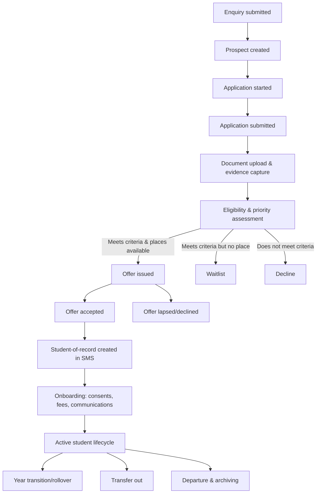
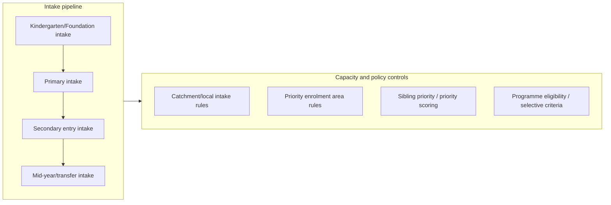

# Deep Research Report on Australian School Admissions and Enrolment Platforms and End-to-End Workflows

## Executive summary

Australian K–12 admissions/enrolment platforms typically implement a two-layer model: **an “admissions pipeline” layer** (enquiries → applications → assessment → offer/waitlist) and **a “student lifecycle” layer** (accepted/enrolled → active student → year transitions/rollover → departure/archival). The strongest market pattern is that **enquiry/application workflow tooling is increasingly modular and CRM-like**, while **final student-of-record creation and long-term records retention are anchored in student administration/records systems** (or department-managed student databases) governed by statutory retention and disposal authorities. citeturn40search19turn40search11turn40search10turn24view0

Across Australian jurisdictions, **government school records retention rules and disposal authorisations vary materially** (examples: NSW retains enrolment application records until the student is 25 or 7 years after last action; ACT retains student schooling history for 50 years after date of birth or 7 years after last action; WA’s Department system requires retention in SIS for 25 years after birthdate, and treats admission/enrolment records as State archives). These differences directly shape workflow-engine requirements for **auditability, evidence capture, defensible deletions, and retention-aware automation**. citeturn9view0turn35view1turn24view0

Consent and privacy handling is consistently treated as a **first-class workflow artefact** (not “just a checkbox”), particularly where sensitive information is collected (health, court orders) and where images/video are captured. Authoritative Australian privacy guidance emphasises (a) **capacity-based consent rather than age-based consent**, (b) **notice at or before collection**, and (c) **security plus active consideration of whether retention is permitted**, with destruction/de-identification when no longer needed unless an Australian law requires retention. citeturn39search0turn39search1turn39search2turn39search3

For an “OpenAusLMSK12” workflow engine intended to span admissions through enrolment and year transitions, the decisive requirements are: **retention-policy as code**, **event-driven orchestration**, **role-based approvals with evidentiary audit trails**, and **integration-first architecture** (SMS, CRM, email/SMS, payments, identity verification, e-signatures). The design should anticipate that some jurisdictions require **permanent admission registers / archival transfers**, and others require long-lived “student schooling history” files, making deletion and “right to be forgotten” workflows conditional and heavily logged. citeturn24view0turn35view1turn39search2turn9view0

## Reference end-to-end workflow for admissions and enrolment

This section provides a reference workflow model that reflects common Australian implementation patterns across government portals and major commercial platforms, with terminology aligned to the sources.

### Reference workflow stages and detailed steps

**Enquiries (lead capture → prospect record)**  
Most systems start with an enquiry/prospect stage capturing minimal identity and contact details to enable follow-up (e.g., prospectus distribution and interview scheduling). In Synergetic’s enrolment enquiries workflow, staff record basic enquirer details (at least name and address) so the school can send information and track the enquiry through subsequent statuses. citeturn40search16

**Online application submission (application case creation)**  
A common state-portal pattern is “create/save/submit directly to school” (NSW) and “online form + in-person follow-up for verification” (NT). NSW’s online enrolment system is positioned as a convenience channel allowing parents to create, save and send applications directly to a school, and NSW also uses the online enrolment system for Year 6→7 transition processes. citeturn41search1turn41search0  
Queensland’s statewide guidance emphasises school-specific processes: families are expected to check enrolment eligibility plans/catchments, complete the application form, and prepare documents for an enrolment interview. citeturn42search7turn42search11  
NT’s online form flow explicitly includes a “fill online → print pre-filled form to sign” option, reinforcing a hybrid digital–paper evidence pattern in some jurisdictions. citeturn42search1turn42search9

**Document collection and evidence capture (attachments + verification)**  
Government portals frequently require identity, residency and health-related documentation. In NSW, the enrolment process references required documents including identity documents, proof of address, and an immunisation statement, and indicates these can be submitted during the online enrolment application. citeturn41search2turn41search0  
Operationally, this stage must produce “verifiable evidence objects” (who provided what, when, how validated) and must handle replacement/correction cycles without losing auditability.

**Assessment of application (eligibility/priority rules + capacity constraints)**  
Australian public systems commonly apply a combination of:
- **Guaranteed local intake** rules (e.g., WA local-intake area; NSW designated enrolment areas / local enrolment area constraints for online applications). citeturn42search6turn41search0  
- **Priority enrolment area** concepts (NT) with explicit guidance to establish transparent criteria for out-of-area assessment, including sibling-based criteria. citeturn42search0turn42search8  
- **Completeness/validity rules**, including consequences of false or misleading information in the application. NSW warns that false or misleading application information may affect the result of the application. citeturn41search0

**Offer, waitlist, or decline (decision outcome)**  
The outcome stage produces one of:
- conditional offer
- unconditional offer
- waitlist
- decline / not admitted

Commercial platforms tend to model this as “status progression”. EnrolHQ describes an “enrolment journey stages” workflow where a profile progresses by switching status, and includes explicit waitlist management tooling. citeturn40search19turn40search3

**Acceptance and onboarding (conversion to enrolled / student-of-record creation)**  
Acceptance commonly includes fee payment (where relevant), consent acknowledgements, and creation of the student record in the system-of-record (SMS / departmental student database). EnrolHQ’s “reserved place workflow” explicitly supports taking a separate offer payment to reserve an interview and a place on the waitlist (or support international offers with different conditions). citeturn40search7  
Where the SMS is the system of record, admissions tooling must hand over clean, validated data. TASS’s Online Enrolments API is explicitly designed to let third-party applications be entered into TASS.web so they can be processed without manual data entry. citeturn40search13

**Year transitions and lifecycle events (rollover, transfers, departures)**  
Year transitions are frequently baked into departmental systems (e.g., NSW Year 6→7 transition support through the online enrolment system) and into SMS workflows (e.g., academic period “rollover” concerns in Sentral FAQ content). citeturn41search0turn40search14  
These workflows must preserve continuity of the student record while applying year-level changes, campus changes, and “former student” transitions.

### Mermaids for typical admission flows





## Approval gates, validation rules, and automation triggers

This section describes the “control points” that platforms implement and that OpenAusLMSK12 should support as first-class constructs.

### Approval gates commonly required in practice

**Gate: minimum application completeness and signature**  
Queensland’s state school procedure requires the enrolment form be signed by at least one parent/carer (or by the student if mature age/independent) and requires completion of all questions marked with an asterisk by applicants under 18. citeturn42search11turn42search3  
This implies: (a) field-level mandatory rules; (b) signature requirement; (c) applicant authority rules (parent/carer vs student).

**Gate: evidence sufficiency and verification**  
NSW requires that supporting documents can be submitted during enrolment (identity, address proof, immunisation statement, court orders, medical plans). citeturn41search2  
NSW records retention rules for identity verification documents provide a strong control pattern: originals used for verification should be returned once verification is complete, and copies (if made) should be destroyed once verification/validation completes. citeturn9view1turn9view0  
This is an explicit “gate” that should close only when verification is complete and the document handling rule is satisfied.

**Gate: eligibility for online channel**  
NSW’s online enrolment program includes eligibility constraints (residency, citizenship/permanent residency, and local enrolment area or out-of-area eligibility). citeturn41search0

**Gate: priority/catchment rules under capacity constraint**  
In NT, priority enrolment areas determine priority placement, and guidelines recommend transparent out-of-area criteria including sibling-of-current-student. citeturn42search8turn42search0  
In WA, local-intake area rules underpin guaranteed places for many public-school enrolments. citeturn42search6turn42search18

### Automation triggers and state transitions

Commercial platforms expose the core pattern: **status-driven workflow + notification triggers + integrations**. EnrolHQ’s workflow is explicitly status-based (“switching their status” to progress through enrolment journey stages). citeturn40search19  
Synergetic’s help content highlights notifications around case updates and status changes as a case transitions between statuses. citeturn40search0

Typical trigger catalogue for OpenAusLMSK12, grounded in these patterns and in government portal requirements:

- **On enquiry submit** → create prospect + assign owner + send acknowledgement
- **On application submit** → lock applicant edits (or version) + start SLA timers + request missing evidence
- **On evidence upload** → run file-type/virus scan + queue verification task + optionally request certification
- **On address verification pass/fail** → branch to local-intake vs out-of-area assessment path
- **On sibling match** → apply sibling-priority scoring/flag (EnrolHQ explicitly models sibling priority as scoring). citeturn40search15turn42search0
- **On offer issued** → start acceptance window + generate payment link (if applicable) + generate acceptance package
- **On payment success** → confirm acceptance + release onboarding tasks
- **On non-response** → auto-reminder cadence + auto-lapse to waitlist/declined (policy-driven)
- **On enrolment conversion** → create student record in SMS (e.g., TASS Online Enrolments API supports new student enrolments into staging). citeturn40search13turn40search1
- **On year transition (rollover)** → move cohort year levels + verify class allocations + notify families (Sentral explicitly surfaces rollover concerns in Enrolments FAQs). citeturn40search14

### Swimlane reference for approvals

```mermaid
flowchart LR
  subgraph ParentCarer["Parent/Carer"]
    A1[Submit enquiry] --> A2[Submit application + upload documents]
    A2 --> A3[Respond to requests for missing info]
    A4[Accept offer + pay (if required)]
  end

  subgraph Admissions["Admissions/Admin staff"]
    B1[Triage enquiry] --> B2[Initial completeness check]
    B2 --> B3[Request missing evidence]
    B2 --> B4[Verify identity/address docs]
    B4 --> B5[Assess eligibility & priority]
    B5 --> B6[Draft offer or waitlist decision]
  end

  subgraph PrincipalDelegate["Principal/Delegate"]
    C1[Approve offer/decline decision]
  end

  subgraph RecordsSystem["Records/SMS systems"]
    D1[Create student-of-record] --> D2[Archive evidence + audit log]
  end

  A1 --> B1
  A2 --> B2
  B3 --> A3 --> B2
  B6 --> C1 --> A4
  A4 --> D1 --> D2
```

## State, territory, and sector regulatory requirements for retention and consent

This section focuses on requirements that directly constrain workflow design: **what must be retained, for how long, what is archival/permanent, and what must happen at disposal time**. The table below is a jurisdictional comparison grounded in primary retention/disposal authorities and official guidance.

### Comparative table for retention of core enrolment records

| Jurisdiction | Public sector retention authority and core rule | Enrolment/admission records retention examples | Identity verification document handling | Notable operational implications |
|---|---|---|---|---|
| entity["state","New South Wales","australian state"] | NSW public schools use authorised retention/disposal authorities; FA387 is a functional retention & disposal authority. citeturn9view0turn7view0 | Admission registers (summary admission records) are required as State archives; enrolment forms and application assessment records retained until student reaches 25 **or** minimum 7 years after action completed (whichever longer); records of students not admitted / waiting lists retained minimum 1 year after action completed. citeturn9view0 | Originals used for identity verification must be returned once verification/validation completes; if copies are made, retain only until verification completes then destroy. citeturn9view1turn9view0 | Workflow must distinguish “admitted vs not admitted”, enforce long retention for enrolment files, and implement a verification-complete disposal/return event for ID docs. |
| entity["state","Victoria","australian state"] | PROS 22/06 VAR 3 governs Victorian government school records retention/disposal under the Public Records framework. citeturn11view0turn13view0 | “Facilitative records of Student Management” includes detailed student enrolment forms, transition records between department schools, and parent-provided consents/agreements; disposal action: destroy 7 years after action completed. citeturn13view0turn13view1 | Not singled out in the cited class; implement separately as high-risk evidence with minimisation rules consistent with privacy/security guidance. citeturn39search2 | Strong requirement to treat enrolment forms + consents as formal records with defined destruction timing; transition records are explicitly included in the retention class. citeturn13view1 |
| entity["state","Western Australia","australian state"] | WA Department student records stored in SIS are governed by approved disposal authority RD 2007005; State records/archives constraints are enforced under the State Records Act framework. citeturn24view0turn23view0 | Enrolment/admission records in SIS are listed as State archives; student records must be retained in SIS for 25 years after birthdate, or 7 years after mature age students leave school. citeturn24view0turn24view1 | Noted in retention context via “SIS” recordkeeping; implement verification and strongly controlled deletion/disposal. citeturn24view0turn39search2 | Disposal authorisation includes a two-step verification/sign-off process (business unit + corporate information services). citeturn24view0 This should be a workflow primitive for defensible disposal. |
| entity["state","South Australia","australian state"] | GDS 22 v4 is a disposal schedule for public primary and secondary schools (effective dates stated in the document). citeturn26view0turn30view0 | Student admission records (pre central database and central database admission records) are permanent; forms supporting student admission (including enrolment forms/returns, applications) and student transfer records are “temporary” with retention until 31 Dec 2023, subject to review (per GDS 22 v4). citeturn30view0turn30view1 | Not specified in the cited sections; treat under ID verification disposal rules where applicable. citeturn39search2 | Implement retention-policy versioning and “schedule expiry/review” capability because disposal instruments can be time-bounded and reviewed/updated. citeturn30view1 |
| entity["state","Australian Capital Territory","australian territory"] | Records Disposal Schedule – Student Management Records (NI2022-544) is the official disposal authority under Territory Records. citeturn32view0turn35view1 | Student schooling history files (including personal details, admin forms, attendance notes, incident reports, health records, transfer notes) are destroyed 50 years after date of birth **or** 7 years after last action, whichever is later. citeturn35view1 Some enrolment/exam result record classes are retained as Territory Archives. citeturn35view0 | Not isolated as a separate class here; embed as part of “student schooling history” file handling and minimise where possible. citeturn35view1turn39search2 | ACT implies longer lived “student file” artefacts than some other states; workflows must support very long retention and defensible archival selection. citeturn35view1turn35view0 |
| entity["state","Tasmania","australian state"] | Disposal Schedule for Functional Records of the Department of Education (DA 2281) under the Tasmanian archives framework. citeturn36view0turn38view1 | For international fee-paying student acceptance records (offer letter, enrolment advice, confirmation of enrolment, placement details), destroy 7 years after the student leaves school or when the student reaches 25 years of age, whichever is later. citeturn38view1 | Not singled out in the cited class; implement separate verification-handling controls. citeturn39search2 | Even when “temporary”, Tasmanian disposal actions frequently use “student leaves school or reaches 25, whichever later”, which must be representable in retention rules. citeturn38view1 |
| entity["state","Queensland","australian state"] | Queensland state school enrolment requires signed application forms and recordkeeping in authorised systems; public-record retention is governed via schedules referenced in department procedures (the schedule itself was not publicly retrievable in this research environment). citeturn42search11turn16search21turn19search2 | Procedure indicates schools retain completed enrolment forms (successful and unsuccessful) in accordance with the Education and Training Sector retention and disposal schedule. citeturn16search21 | Not specified in the accessible sources; implement separate ID verification handling consistent with minimisation/security rules. citeturn39search2 | Workflow must support “authorised recordkeeping system” constraints and track retention schedule references even when not embedded in the form itself. citeturn19search2turn16search21 |
| entity["state","Northern Territory","australian territory"] | NT operates priority enrolment and online enrolment service processes with published guidance; retention/disposal authorities were not identified in the retrieved sources. citeturn42search9turn42search0 | Priority enrolment area placement + out-of-area criteria including sibling-of-current-student. citeturn42search8turn42search0 | Consent for images/videos of children: principals must ensure parent consent is obtained before capture/use/storage; consent must be informed, voluntary, current, specific, and families must be told it can be withdrawn. citeturn42search13 | Workflow must model priority area rules and sibling priority, and treat consent as revocable with evidence of notice and withdrawal handling. citeturn42search0turn42search13 |

### Sector differences that shape platforms

**Government schools (state/territory public sector)**  
Government school workflows are directly constrained by state/territory recordkeeping instruments: admission registers may be archival/permanent (NSW, SA, WA, ACT), and student file retention often extends well beyond the student’s attendance. These constraints require retention-aware case management and defensible disposal approvals (explicitly documented in WA’s two-step disposal authorisation). citeturn9view0turn30view0turn24view0turn35view0

**Non-government schools (Catholic and independent)**  
Non-government schools typically operate as entities subject to the Australian Privacy Principles when covered by the Privacy Act framework, requiring compliant collection notices, consent practices for sensitive information, and security controls (APP 11). OAIC guidance emphasises that the Privacy Act protects personal information regardless of age and that valid consent depends on capacity; APP 5 requires notice at or before collection; APP 11 requires active measures for security and requires destruction/de-identification when no longer needed unless retention is required by Australian law. citeturn39search0turn39search1turn39search2turn39search3turn39search17  
In practical platform design, this means consents/permissions (photos, excursions, medical sharing) must be stored as versioned, auditable artefacts, and “withdraw consent” must be an operational workflow that propagates to downstream systems. citeturn39search3turn42search13

## Common data models and required data fields

Australian enrolment workflows converge on a predictable core data model driven by state enrolment forms and SMS enrolment modules.

### Core entities

- **Prospect/Enquiry** (contact-level, pre-application)
- **Application** (case file with versioning)
- **Applicant authority** (parent/carer vs student, signature)
- **Student** (person record; may be “future student” then “active student”)
- **Household / family relationships** (guardianship, role, contact order)
- **Address & residency evidence** (catchment/priority area evaluation)
- **Evidence documents** (identity, court orders, medical plans, academic reports)
- **Consents & agreements** (ICT use, media, collection/out-of-hours, etc.)
- **Decision artefacts** (assessment notes, offers, waitlist decisions)
- **Financial artefacts** (fees, deposits, reserved place payments)
- **Transitions** (school-to-school transfer, year transition, campus transfer, departure)

### Required field sets with primary-source grounding

The following table merges fields evidenced in Queensland’s state enrolment form, NSW’s enrolment requirements, and Sentral’s enrolment module guidance.

| Field group | Typical required fields | Evidence in sources |
|---|---|---|
| Student identity and history | legal name, date of birth, prior attendance at state school, year level sought, previous school(s), academic reports (where required), immunisation statement (jurisdiction-dependent) | Queensland enrolment form includes “Has the prospective student ever attended a Queensland state school?” and year level sought. citeturn42search3 NSW lists identity docs and immunisation statement as required documents. citeturn41search2 |
| Parent/carer authority | parent/carer identity, signature, relationship to student, custody orders where applicable | QLD procedure: form must be signed by at least one parent/carer (or student if mature age/independent). citeturn42search11 NSW enrolment docs include family law or other court orders. citeturn41search2 |
| Addresses and residency | residential address, proof-of-address documents, postal address, local intake/priority area mapping flags | NSW online enrolment references local enrolment areas and eligibility; NSW required documents include proof of address. citeturn41search0turn41search2 WA enrolment guidance references local-intake area guaranteed place patterns. citeturn42search6 |
| Contact and household structure | household members, emergency contacts, residential details, languages spoken at home, contact preferences/order | Sentral enrolments guide describes household information capturing contact details, emergency contacts, residential details, and languages spoken at home. citeturn40search10 |
| Health and risk info | medical conditions, emergency action plans, additional learning needs/disability supports (where disclosed), incident history (as relevant to transfer) | NSW enrolment docs mention medical/healthcare or emergency action plans. citeturn41search2 ACT “student schooling history” includes health records and incident reports as part of the student file. citeturn35view1 |
| Outcome tracking | application status, offer status, acceptance status, waitlist position/priority metadata, timestamps for SLA events | EnrolHQ uses status stages for enrolment journey. citeturn40search19 EnrolHQ also supports manual waitlist submission date to preserve priority queue ordering. citeturn40search11 |
| Priority and sibling handling | sibling-of-current-student indicator, priority scoring/banding, feeder-school indicators (where applicable) | NT guidelines include “student is the sibling of a current student” as a potential out-of-area assessment criterion. citeturn42search0 EnrolHQ models sibling as an explicit priority scoring factor. citeturn40search15 |

## Integration points, security, privacy, and consent best practices

### Integration points observed in Australian platform ecosystems

**SMS and student-of-record creation**  
A recurring architectural pattern is “admissions platform → SMS staging → staff processing → student-of-record”. TASS’s Online Enrolments API is designed for third-party applications to be entered into TASS.web without manual data entry and then processed in TASS.web’s enrolment application processing screens. citeturn40search13  
EnrolHQ’s integration documentation notes the TASS Online Enrolments API is designed to support new student enrolments only, with constraints around reprocessing/updating enrolments, implying that workflow engines must handle “idempotency + irreversible transitions” carefully. citeturn40search1  
Synergetic integration workflows include importing applications/enquiries into Synergetic via an import wizard process, evidencing a “file-based export/import” integration style still present in practice. citeturn40search8

**Email and notifications**  
Status-change notifications are a core workflow capability (Synergetic status transition notifications; Sentral portal configuration includes notification email behaviour for registration approval). citeturn40search0turn40search6

**Payments**  
Admissions platforms increasingly include payment events at the offer or reservation stage (e.g., EnrolHQ “reserved place workflow” supporting offer payments). citeturn40search7

### Security, privacy, and consent best practices aligned to Australian guidance

**Consent must be capacity-based and auditable**  
OAIC guidance states the Privacy Act does not specify an age after which an individual can make their own privacy decision and that valid consent requires capacity. citeturn39search0  
Queensland privacy guidance similarly notes the IP Act does not specify a consent age and agencies should assess capacity case-by-case. citeturn39search15  
Operationally, this implies that workflow engines must store:
- who consented (student vs parent/carer)
- what they were told (collection notice version)
- when and how consent was recorded
- consent scope, expiry, and withdrawal events citeturn39search3turn39search1

**Notice at or before collection (collection notices as workflow artefacts)**  
APP 5 requires reasonable steps to notify individuals (or ensure awareness) of specified matters at or before the time of collection, or as soon as practicable afterwards. citeturn39search1  
NSW’s collection notice for schools explicitly frames collection and handling of student/family personal and health information “before and during the course of a student’s enrolment” and exists to meet privacy-legislation notice requirements. citeturn42search17

**Security controls plus retention permission checks (APP 11 model)**  
OAIC’s APP 11 guidance requires active measures to secure personal information and explicitly requires entities to consider whether they are permitted to retain personal information; it further requires destruction/de-identification when information is no longer needed, except where retention is required by Australian law or the information is a Commonwealth record. citeturn39search2  
This aligns tightly with public-sector retention schedules that mandate long retention and archival selection (NSW, WA, ACT). citeturn9view0turn24view1turn35view0

**Data minimisation and “verify then dispose” for ID documentation**  
NSW retention rules explicitly require returning originals and destroying copies after verification. This is a strong best practice pattern to reduce long-lived exposure of high-value identity documents. citeturn9view1turn9view0

**Revocable consent in practice (example: images/videos)**  
NT’s procedure for images/videos mandates parent consent before capture/use/storage; consent must be informed, voluntary, current and specific, and withdrawal must be supported. citeturn42search13  
This implies workflows must treat withdrawal as a state transition that can trigger downstream actions (removal from galleries, revocation of publication permissions, content takedown tickets).

## Platform-specific implementations and official portal examples

This section names major platforms and official portals, and highlights how they implement key workflow capabilities.

### Comparative platform and portal table

| Platform / portal | Workflow scope covered | Waitlists and priority | Integrations and handoff | Notable implementation details |
|---|---|---|---|---|
| entity["organization","NSW Online Enrolment Application","nsw education portal"] | Online application creation, saving, and submission to school; supports Year 6→7 transition online. citeturn41search1turn41search0 | Local enrolment eligibility for the online channel is explicit (residency/citizenship/local area or out-of-area eligibility). citeturn41search0 | School receives application; supporting documents can be submitted during online application. citeturn41search2 | Strong emphasis on eligibility constraints and document upload within the application flow. citeturn41search0turn41search2 |
| entity["organization","EnrolHQ","australian school enrolment platform"] | Enquiry/application workflow with “enrolment journey stages” via statuses; extended admissions tooling (reserved place). citeturn40search19turn40search7 | Dedicated waitlist management; priority scoring supports sibling priority; manual waitlist submission date supports backdating queue priority. citeturn40search3turn40search15turn40search11 | Integrates with TASS and Synergetic via exports/imports and API-based sync patterns. citeturn40search1turn40search8 | “Reserved place workflow” can take a separate offer payment for early applicants / long waitlists. citeturn40search7 |
| entity["company","Sentral","australian school management software"] | Enrolments module captures student, household and contact structures; supports operational enrolment management and lifecycle questions (rollover, departures). citeturn40search2turn40search10turn40search14 | Not a dedicated waitlist platform in the cited materials; more student admin oriented. | Portal/admin configuration can require approval and send notification emails, evidencing configurable approvals and comms. citeturn40search6 | Enrolments guide explicitly captures household/emergency/language fields, reflecting the typical student admin data model. citeturn40search10 |
| entity["company","Synergetic","school administration system vendor"] | Enrolment enquiries capture and case/status transitions; notification support around case updates and status changes. citeturn40search16turn40search0 | Not specified in cited sources. | EnrolHQ export/import into Synergetic uses “Process Online Applications/Enquiries Import” style workflow. citeturn40search8 | Explicitly models that enquiry capture must record minimum details for downstream comms (prospectus). citeturn40search16 |
| entity["company","The Alpha School System","tass vendor"] | TASS Online Enrolments API supports ingestion of enrolment applications into TASS.web and processing via enrolment application screens. citeturn40search13turn40search1 | Not specified in cited sources. | API supports new student enrolments with constraints on updating/reprocessing once student exists, implying workflow must treat acceptance→enrolment as a boundary. citeturn40search1turn40search13 | Strong evidence for a staging-table/handoff model for admissions→SMS conversion. citeturn40search1turn40search13 |
| entity["organization","Northern Territory enrolment online service","nt government service portal"] | Online enrolment submission; service guidance indicates follow-up steps after submission and special handling if previously enrolled. citeturn42search9turn42search1 | Priority enrolment areas and out-of-area assessment criteria (including sibling). citeturn42search8turn42search0 | “Fill online + print and sign” option supports hybrid evidence capture. citeturn42search1turn42search9 | Explicit “priority is given to students living in the school’s priority enrolment area” phrasing drives workflow decision frameworks. citeturn42search9turn42search8 |
| entity["organization","Education Queensland enrolment guidance","queensland education portal"] | Parent guidance: check eligibility plan, contact school, complete application form, and prepare documents for enrolment interview. citeturn42search7 | Catchment/eligibility plan influences; no centralised prioritisation model described in the cited snippet. citeturn42search7 | Application form requires signature and mandatory fields; outcome is notified separately (submission ≠ enrolment). citeturn42search11turn42search19 | Explicit validation consequences: refusal/failure to complete required fields or provide docs may result in refusal to process. citeturn42search19 |
| entity["organization","WA public school enrolment guidance","wa education portal"] | Step-by-step enrolment guidance including guaranteed place patterns for local-intake enrolments. citeturn42search6turn42search18 | Local-intake area is a primary rule. citeturn42search6 | School-level processing; supports multiple entry points (kindergarten, pre-primary, Year 7, transfers). citeturn42search2turn42search6 | Clear trigger conditions for when an application is required (starting key years, changing schools, new to WA). citeturn42search2turn42search10 |

image_group{"layout":"carousel","aspect_ratio":"16:9","query":["NSW online enrolment application portal Australia","Northern Territory online enrolment form enrol.ntschools.net screenshot","Western Australia public school enrolment local intake area information","Queensland state school enrolment application form PDF screenshot"],"num_per_query":1}

## Recommended requirements for the OpenAusLMSK12 workflow engine

This section translates the observed Australian workflow and regulatory landscape into a concrete requirements set for a “no constraints on budget/stack” build.

### Functional requirements

OpenAusLMSK12 should implement admissions as a **policy-driven case workflow** with explicit artefacts for evidence, consent, decisions and retention.

**Case and workflow primitives**
- Configurable pipeline stages with status transitions (mirroring EnrolHQ’s status-driven journey and Synergetic’s status-change notifications). citeturn40search19turn40search0
- Branching logic for:
  - local intake / catchment eligibility (NSW, WA) citeturn41search0turn42search6
  - priority enrolment area & out-of-area assessment (NT) citeturn42search8turn42search0
  - special programmes and alternative pathways (international, selective/specialised, transfer)
- SLA timers and automated reminders for incomplete applications.

**Form and evidence subsystem**
- Dynamic forms with field-level constraints (mandatory, conditional mandatory, format validation).
- Digital signing support and authority rules (e.g., “must be signed by parent/carer” as a gate). citeturn42search11
- Evidence upload with:
  - virus scanning
  - file integrity hashing
  - document-type classification
  - verification tasking and “verification complete” events
- Verification-driven retention actions for identity docs (return originals; destroy copies post verification) as a configurable control. citeturn9view1turn9view0

**Waitlist, sibling priority, and intake**
- Waitlist objects with:
  - queue ordering rules (date, priority score, manual override with justification)
  - status and audit trails (EnrolHQ uses manual waitlist submission dates and priority scoring). citeturn40search11turn40search15
- Sibling-linking rules and priority scoring consistent with jurisdictional policy levers (NT explicitly lists sibling criterion). citeturn42search0
- Intake pipelines with cohort definitions (Kindergarten/Foundation, Year 7 entry, mid-year transfers) and timed release windows.

**Offer, acceptance, and onboarding**
- Offer generation with templating and conditional requirements (fees, interviews, deposit).
- Payment orchestration hooks (support reserved place/offer deposits). citeturn40search7
- Acceptance package that creates tasks: consent acknowledgements, medical plans, ICT agreements (Vic explicitly treats such consents/agreements as student management records). citeturn13view1
- Student-of-record creation and syncing to SMS with idempotent operations and “handoff boundary” semantics (TASS API constraints for new enrolments only). citeturn40search1turn40search13

**Year transitions**
- Explicit “transition workflow” types:
  - year-level rollover (internal)
  - primary-to-secondary transition (e.g., NSW Year 6→7 supported online) citeturn41search0
  - school-to-school transfers (and transfer record packages where required)
- Pre-rollover validation reports (e.g., ensure students move into correct year groups before rollover; a concern surfaced in Sentral Enrolments FAQs). citeturn40search14

### Non-functional requirements

**Auditability and evidentiary strength**
- Full event log for:
  - field edits (who/when/what changed)
  - document uploads and verification actions
  - consent capture and withdrawals
  - approvals and rejections
- Support “two-person” disposal approvals as a first-class workflow (WA explicitly documents two-step disposal authorisation). citeturn24view0

**Retention and disposal policy engine**
- A retention rules engine that can express:
  - “until student reaches X age OR Y years after last action, whichever longer” (NSW, ACT, Tas international student records) citeturn9view0turn35view1turn38view1
  - “destroy N years after action completed” (Victoria) citeturn13view0
  - “retain as State/Territory archives” (NSW admission register; ACT enrolment/exam results; WA enrolment/admission records) citeturn9view0turn35view0turn24view0
- Retention-policy versioning and re-sentencing support (SA schedule shows time-bounded instrument “retain until 31 Dec 2023, subject to review”). citeturn30view1

**Privacy and security baseline**
- Implement APP-aligned controls for covered entities:
  - collection notices (APP 5) and evidence of “notice presented” at time of collection citeturn39search1turn42search17
  - consent capture that is informed and withdrawable (OAIC consent guidance; NT consent procedure for images/videos) citeturn39search3turn42search13
  - APP 11 security controls, including “active consideration of whether retention is permitted” and secure destruction/de-identification routes when allowed. citeturn39search2
- Strong tenant isolation for multi-school use; encryption at rest and in transit; secret management; least-privilege RBAC; comprehensive intrusion and anomaly detection appropriate to “child data”.

**Scalability**
- Horizontal scaling for:
  - peak intake periods (Kindergarten/Foundation and Year 7)
  - large attachment uploads
  - high notification volume
- Asynchronous processing for document scanning, verification tasking and outbound comms.

### Suggested API shape and event triggers

Because “status transitions + integrations” is the dominant ecosystem pattern (EnrolHQ, Synergetic, TASS), OpenAusLMSK12 should expose:

- **REST + webhooks** as a minimum interoperability layer
- **Event bus** (e.g., CloudEvents envelope) for internal orchestration and downstream consumers

Core event types (examples):
- `admissions.enquiry.created`
- `admissions.application.submitted`
- `admissions.document.uploaded`
- `admissions.document.verified`
- `admissions.priority.updated` (sibling/catchment changes)
- `admissions.offer.issued`
- `admissions.offer.accepted`
- `student.record.created` (SMS write-through)
- `student.year_transition.completed`
- `records.retention.sentence_applied`
- `records.disposal.approval.requested`
- `records.disposal.approved`
- `consent.granted` / `consent.withdrawn`

### Prioritised feature list for OpenAusLMSK12

**P0 — Must have**
- Status-driven case workflow and configurable pipelines (status transition model). citeturn40search19turn40search0
- Field-level validation, signature gates, and evidence capture with verification tasks. citeturn42search11turn41search2
- Retention-policy engine supporting “age OR years-since-action” rules and archival/permanent flags. citeturn9view0turn35view1turn24view0turn38view1
- Immutable audit/event log for all workflow actions, including disposal approvals. citeturn24view0turn39search2
- Consent subsystem with notice-versioning and withdrawal workflows (including image/video-specific consent). citeturn39search1turn42search13turn39search3
- Integration adapters for at least: TASS API ingestion patterns and file-based export/import (Synergetic-style) to cover real-world heterogeneity. citeturn40search13turn40search8

**P1 — Should have**
- Waitlist queue management with scoring and sibling priority. citeturn40search3turn40search15turn42search0
- Offer/acceptance payment support (deposit/reserved place) with reconciliation hooks. citeturn40search7
- Year transition orchestration with pre-rollover validation and exception workflows. citeturn41search0turn40search14
- Multi-channel communications (email + SMS) with templating and audit trails (notification patterns). citeturn40search0turn40search6

**P2 — Could have**
- Automated catchment mapping integrations (where authoritative boundary datasets exist) and priority-area eligibility calculators. citeturn42search8turn41search0
- Privacy-preserving analytics on pipeline health (time-to-decision, conversion rates) with retention-safe aggregations.
- Self-service applicant portal with progressive disclosure and save/resume (mirroring NSW “create/save/send” usability expectations). citeturn41search1turn41search0

**P3 — Advanced**
- Policy-as-code simulators (test changes to sibling priority rules, intake caps, and retention schedules against historical cohorts).
- Automated “ID verify then purge” orchestration with proof-of-destruction receipts (patterned on NSW ID handling requirements). citeturn9view1turn9view0

