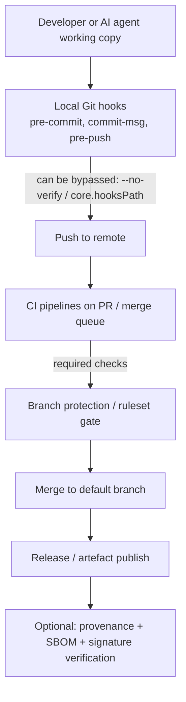

# Enforcing Commit and Push Hook Compliance and Preventing AI Agent Bypass in vibe-ts

## Executive summary

This research finds that **client-side Git hooks are essential for fast feedback but cannot be treated as an enforcement boundary**, because users (and AI agents acting with user credentials) can disable hooks via configuration (for example `core.hooksPath`) or bypass them per-command (for example `git commit --no-verify`). citeturn2search4turn1search2turn2search2 Robust compliance therefore requires **server-side gates** (protected branches / rulesets, mandatory PR review, required status checks, and optionally commit signing requirements) with CI as the ultimate arbiter. citeturn3search2turn3search0turn3search4turn3search6

Across modern AI coding CLIs, the most important takeaway is that **agent-side “approval systems”, “hooks”, and “rules” are helpful but optional controls**: they are either user-configurable (and can be disabled), or can be bypassed by running the same Git operations outside the agent. Claude Code has an explicit hooks mechanism (PreToolUse/PostToolUse) and a `disableAllHooks` switch. citeturn5search0turn5search1 Codex CLI supports a Starlark-based “rules” system and sandbox/approval configuration. citeturn10view0turn11view2 Gemini CLI supports settings layers, workspace trust, sandboxing, and allowlist-based shell-command restriction (with a documented warning that simple blocklists are bypassable). citeturn14view0turn15view1turn16view0 OpenCode supports repo/global instruction files and fine-grained permission policies (allow/ask/deny) for both file edits and shell commands. citeturn20view3turn21view0 Aider explicitly documents that it **skips pre-commit hooks by default** by using `--no-verify` (unless you opt-in). citeturn24search0turn1search2

For vibe-ts, the recommended end state is a **defence-in-depth enforcement stack**:

- **Local**: maintain pre-commit/pre-push/commit-msg hooks for fast developer feedback (lint-staged + typecheck/tests + commit message rules), but assume bypass is possible. citeturn2search2turn1search2  
- **Repository server-side**: require PRs, required reviews (including CODEOWNERS for “guardrail paths”), required status checks, and “do not allow bypass” settings (or equivalent) on the default branch. citeturn3search0turn3search5turn3search2  
- **CI**: make `npm run ci` (or equivalent) a required check. If workflows are skipped via commit-message instructions, required checks remain pending and should block merging. citeturn3search1turn3search6  
- **Supply-chain + detection**: dependency review, CodeQL/code scanning, Dependabot alerts, secret scanning + push protection, plus optional build provenance attestations/SLSA-aligned provenance for releases. citeturn27search4turn27search0turn32search0turn32search1turn28search4turn26search0  

## Current state in vibe-ts

### What exists today

Based on an authenticated inspection of the 45ck/vibe-ts repository via the GitHub connector (performed on 1 March 2026, Australia/Sydney time), vibe-ts currently includes:

- **Local hook plumbing** based on `core.hooksPath` (pointing to a repo directory) and hook scripts that run:
  - a staged-file gate (`lint-staged`) before commit;
  - a push gate that executes TypeScript typechecking and tests before push.
- A **Claude Code** project configuration under `.claude/` implementing a permissions allow/deny model and a **PreToolUse hook** intended to block obvious bypass attempts (for example commands that include `--no-verify`, or attempts to modify hook/CI configuration).

These are strong “developer guardrails” but (by design of Git and CLI tooling) they do not create a hard enforcement boundary without server-side verification.

### Key gaps relative to “cannot be bypassed”

- **Git client-side hooks are always bypassable by the actor who controls the environment** (human or AI agent), including by setting `core.hooksPath` to an inert location (for example `/dev/null`) or running commands with local config overrides. citeturn2search4turn2search2  
- Even when hooks exist and are executable, `--no-verify` bypasses the pre-commit and commit-msg hooks for `git commit` (and `--no-verify` exists for other operations too). citeturn1search2turn2search2  
- There is no reliable evidence of **server-side gating** (required checks, protected branch requirements, required reviews) being present in the repository itself; these are platform controls configured in GitHub/GitLab settings, not in the codebase. (This report provides the precise target configuration.)

## Threat model and bypass vectors

### Git hooks bypass and failure modes

Git’s hook model is intentionally local and configurable:

- Hooks run from `$GIT_DIR/hooks` **or** from a directory specified by `core.hooksPath`. citeturn2search2turn2search4  
- Hooks can be disabled entirely by setting `core.hooksPath` to `/dev/null`, and can also be changed per-command with `git -c core.hooksPath=…`. citeturn2search4  
- `git commit --no-verify` bypasses pre-commit and commit-msg hooks. citeturn1search2turn2search2  

So, any agent that can execute shell commands as the developer can:

- temporarily disable hooks (config override),
- bypass hooks per command (`--no-verify`),
- or commit/push via alternative flows (e.g., generating patches and applying them elsewhere).

### CI skipping and “check evasion”

For GitHub Actions, workflows triggered by `push` and `pull_request` can be skipped via commit message strings such as `[skip ci]`, and via a `skip-checks` trailer. citeturn3search1 However, **if you require the checks produced by those workflows**, GitHub documents that skipped workflows leave checks in a pending state and should block merging. citeturn3search1turn3search6

For GitLab, `[skip ci]` / `[ci skip]` can skip pipelines, and GitLab also supports a `ci.skip` git push option; GitLab notes that **pipeline execution policies can restrict or disable** the `[skip ci]` directive. citeturn4search8

### “Guardrail file” tampering

AI agents can be instructed (or drift into) modifying:

- hook scripts,
- CI workflow definitions,
- lint/test configuration,
- or the agent-policy files themselves,

to widen permissions or reduce checks. Because these modifications are “just code changes”, the only durable defence is **making those paths high-friction and high-visibility**:

- CODEOWNERS and mandatory reviews on sensitive paths, citeturn3search0turn4search0  
- branch rulesets that restrict file paths or require specific checks for those changes, citeturn3search2  
- and CI that fails if policy/hook changes are unauthorised.

### Credential misuse and “bot push” bypass

If an AI agent runs with credentials that can push to protected branches, it can bypass the “PR-only” workflow. Therefore, least privilege is not optional:

- tokens used by bots/agents must not have direct push permissions to protected branches,
- approvals must require a second actor (human) for merges into the default branch, citeturn3search0turn3search7  
- and auditability must be in place (audit logs and event review). citeturn33search0turn32search2  

## AI agent CLI landscape and controls

### Official capabilities relevant to enforcement

Claude Code: supports a first-class hooks system (PreToolUse/PostToolUse and decision control), configured in `.claude/settings.json`/user settings, explicitly allowing hooks to block tool calls. citeturn5search0 It also documents a `disableAllHooks` setting, reinforcing that these controls are not inherently immutable. citeturn5search1

Codex CLI: supports project/user configuration in TOML (`~/.codex/config.toml` and `.codex/config.toml`) and “rules files” (Starlark) that can allow/prompt/forbid command prefixes; it also explains its handling of compound shell commands (including splitting simple `bash -lc` chains for safer evaluation). citeturn11view2turn10view0turn10view4

Gemini CLI: offers layered JSON settings (`~/.gemini/settings.json`, `.gemini/settings.json`, and system-level overrides) and a “Trusted Folders” mechanism that controls whether project settings are loaded; untrusted folders run in restricted safe mode. citeturn14view0turn15view1 It also supports sandboxing (Seatbelt or containers) and an allowlist/denylist model for shell command execution that validates chained commands separately; it explicitly warns that simple string-based blocklists can be bypassed and recommends explicit allowlists. citeturn15view0turn16view0

OpenCode: supports project/global instruction files (`AGENTS.md`, with a fallback to `CLAUDE.md`) and a JSON/JSONC config with precedence (including remote “organisational defaults”), plus a permissions system (allow/ask/deny) that can match shell command patterns such as `git push *`. citeturn19view0turn20view3turn21view0

Aider: is tightly integrated with git and auto-commits by default; it documents that it **skips pre-commit hooks by default by using `--no-verify`**, unless `--git-commit-verify` is enabled. citeturn24search0turn1search2

GitHub Copilot CLI: supports an interactive agent, programmatic mode, and explicit “allow tool” options (e.g., allowing `shell(git)`), with a caution that auto-approving all tools gives the agent the same access as the user. citeturn23search8turn23search6

### Comparative table

The table below compares each AI CLI on (a) whether it has native policy or hook support, (b) likely bypass risk, and (c) the repo-side controls that matter most. The “repo controls” column is intentionally repetitive: **the repo must defend itself regardless of the agent**.

| AI agent CLI | Documented policy / hooks support | Primary bypass vectors affecting hook compliance | Mitigation inside the agent | Recommended repo-side controls |
|---|---|---|---|---|
| Claude Code | Hooks with PreToolUse/PostToolUse + decision control; settings are user/project managed citeturn5search0turn5search1 | Disable hooks; run git outside Claude Code; use alternate tooling | PreToolUse hook blocks unsafe commands; strong deny rules | Require PRs + required checks + CODEOWNERS on guardrail paths + no direct pushes to default branch |
| Codex CLI | Config layers + sandbox/approval; Starlark “rules” for command prefixes citeturn11view2turn10view0 | Use `git … --no-verify`; change `core.hooksPath`; push from outside Codex | Forbid/prompt rules for `git commit`, `git push`, config edits; sandbox limitations | Same as above; plus require signed commits if feasible |
| Gemini CLI | Settings layers + trusted folders + sandboxing; allowlist/denylist command restrictions with chaining split citeturn14view0turn15view1turn16view0 | Running commands outside Gemini CLI; weak blocklists; large pushes may evade push-protection scanning timeouts | Use explicit allowlists; enable trusted folders; run in sandbox | Same as above; plus secret scanning + push protection + dependency review |
| OpenCode | Repo/global rules files; permission policies allow/ask/deny for shell and edits citeturn19view0turn21view0 | Run git outside OpenCode; permissive defaults if not configured | Deny `git push *`, ask on `git commit *`; deny edits to guardrail files | Same as above; restrict who can push; protect guardrail paths |
| Aider | Git integration; auto-commits; defaults skip hook verification citeturn24search0 | Uses `--no-verify` by default; can commit rapidly without checks | Enable its verification options (`--git-commit-verify`) | Treat as high-risk: CI-required checks + strict branch protections; consider forbidding direct pushes from bot identities |
| GitHub Copilot CLI | Tool-allow flags and modes; warns about auto-approval risk citeturn23search8 | “Allow all tools” equivalent; run git normally | Keep approvals interactive; restrict allowed tool prefixes | Same as above; enforce all merging through PRs and required checks |

## Enforcement architecture options

### Layered enforcement flow

Client-side hooks are still worthwhile, but server-side controls must be the authority.



Git’s own documentation confirms that hooks may be located via `core.hooksPath` and that hooks can be disabled by configuration. citeturn2search2turn2search4 Therefore, “local hooks only” can never meet the requirement “agents cannot bypass”.

### GitHub enforcement primitives

For GitHub-hosted repositories where you cannot deploy custom server-side hooks, the enforcement stack is:

- **Branch protection / rulesets**:
  - require a PR before merge,
  - require status checks,
  - block force pushes,
  - optionally require linear history,
  - optionally require signed commits,
  - and avoid (or explicitly disable) bypass settings for admins where possible. citeturn3search2turn3search3turn3search5
- **Required status checks** should be tied to the expected “source app” if you want to reduce the chance of a compromised actor setting a fake “success” state. citeturn3search4
- **Merge queue compatibility**: required-check workflows should include `merge_group` triggers if the repository uses merge queues. citeturn3search6
- **Workflow skipping**: GitHub documents that `[skip ci]`/`skip-checks` can skip workflow runs, but also documents that if the repository requires those checks, skipped workflows leave checks pending and block merging. citeturn3search1turn3search6

### GitLab enforcement primitives

GitLab offers both project-level and (self-managed) server-side options:

- Protected branches + Code Owner approval requirements can deny direct pushes and enforce approval. citeturn4search0turn4search3
- “Pipelines must succeed” is a project merge check; GitLab documents the behaviour around skipped pipelines and the option that treats skipped pipelines as successful. citeturn4search2turn4search4
- GitLab allows skipping pipelines with `[skip ci]`/`[ci skip]`, but also notes that pipeline execution policies can restrict or disable this directive. citeturn4search8
- GitLab Self-Managed supports Git server hooks (pre-receive/update/post-receive) configured by administrators. citeturn4search5

## Detection, monitoring, and supply-chain assurance

### CI as security detection surface

A robust “quality control” posture is not just lint/tests:

- **Dependency review on PRs** can block introduction of vulnerable dependencies (and licence issues) as soon as `package-lock.json`/`pnpm-lock.yaml` changes land. citeturn27search4
- **Code scanning** with CodeQL can find vulnerabilities and coding errors and surfaces results as code scanning alerts. citeturn27search0
- **OpenSSF Scorecard** can be run as a GitHub Action to assess risky project practices and can surface build and maintenance risks. citeturn27search2turn27search3
- **Dependabot alerts** identify vulnerable dependencies based on the dependency graph and advisory ingestion. citeturn32search0
- **Secret scanning + push protection** can block pushes containing supported secrets (while still allowing controlled bypass with justification where enabled). citeturn32search1turn32search6

### Provenance and SBOMs

For high-assurance release artefacts, provenance and SBOMs strengthen incident response and reduce “silent tampering” risk:

- SLSA describes provenance as verifiable information about how an artefact was produced and provides a schema within the in-toto framework. citeturn26search0  
- GitHub “artifact attestations” provide cryptographically signed provenance claims about builds; GitHub documents that it uses Sigstore for attestations and that verification is required to realise security benefit. citeturn28search4turn28search0  
- Sigstore Cosign supports verification and keyless OIDC-based verification patterns. citeturn25search0  
- SBOM standards include SPDX (an ISO/IEC SBOM-related standard) and CycloneDX (ECMA-424). citeturn26search3turn25search1  

### Audit logs and anomaly detection

Audit logging is the canonical way to detect “who changed what” in munge-like governance failures:

- GitHub documents organisation audit logs (including actor, time, action, repository, and authentication context). citeturn33search0turn33search1  
- GitLab provides audit events for tracking actions (useful for compliance and incident response). citeturn32search2  

This should be paired with automated detection such as alerts on:
- branch protection / ruleset changes,
- CI workflow changes,
- secret scanning bypass requests,
- and anomalous token usage or machine-originated commits (e.g., “bot identity commits outside expected hours”).

## Recommended implementation plan for vibe-ts

This section provides concrete configurations. Items marked “GitHub option” and “GitLab option” are alternatives; you can implement both if you mirror repos.

### Default branch alignment and policy baseline

1) **Choose one default branch name** (`main` or `master`) and align scripts/docs accordingly. This reduces the chance of “policy-by-documentation” drifting from actual enforcement. (If you migrate to `main`, update any tooling that hardcodes the branch name.)

2) Establish a baseline rule: **no direct pushes to the default branch** (human or bot), except for break-glass identities that are separately logged and reviewed. This is implemented via branch protection / protected branch rules. citeturn3search0turn4search0

### Local hooks that match CI and catch obvious bypass

Because hooks are bypassable, the goal is UX and early feedback, not perfect security. citeturn1search2turn2search4

Add a `commit-msg` hook that enforces commit message format and forbids CI-skip directives (mirrors the platform skip features). GitHub’s skip strings and `skip-checks` trailer are documented. citeturn3search1

Create `.beads/hooks/commit-msg`:

```sh
#!/bin/sh
set -euo pipefail

MSG_FILE="$1"
MSG="$(cat "$MSG_FILE")"

# Block workflow-skipping directives used by GitHub Actions
echo "$MSG" | grep -Eiq '/[(skip ci|ci skip|no ci|skip actions|actions skip)/]' && {
  echo "ERROR: CI skip directives are not allowed in commit messages."
  exit 1
}

# Block the skip-checks trailer (GitHub Actions)
echo "$MSG" | grep -Eiq '(^|/n)skip-checks:/s*true(/s|$)' && {
  echo "ERROR: skip-checks trailer is not allowed in commit messages."
  exit 1
}

# Minimal Conventional Commits check on the subject line
SUBJECT_LINE="$(printf "%s" "$MSG" | head -n 1)"
echo "$SUBJECT_LINE" | grep -Eq '^(feat|fix|chore|docs|refactor|test|perf|build|ci|revert)(/([a-z0-9._-]+/))?: .{1,}$' || {
  echo "ERROR: Commit subject must follow Conventional Commits."
  echo "Example: feat(parser): handle Unicode whitespace"
  exit 1
}
```

Optional hardening for hooks:
- Add a CI step that verifies the hook files exist and have not been modified in unreviewed ways (see guardrail workflow below).
- Treat hook directories (`.beads/hooks/`, `.husky/`) as “protected paths” with CODEOWNERS.

### GitHub option: required CI workflows

Create `.github/workflows/ci.yml` and make it a required status check.

```yaml
name: ci

on:
  pull_request:
  merge_group:
  push:
    branches:
      - main
      - master

permissions:
  contents: read

jobs:
  quality:
    runs-on: ubuntu-latest
    timeout-minutes: 20
    steps:
      - uses: actions/checkout@v4
        with:
          fetch-depth: 0

      - uses: actions/setup-node@v4
        with:
          node-version: 20
          cache: npm

      - name: Install
        run: npm ci

      - name: Quality gate
        run: npm run ci
```

Rationale:
- `merge_group` is included to ensure merge-queue workflows report required checks when merge queues are used. citeturn3search6  
- If a workflow is skipped by commit message, required checks should remain pending and block merges. citeturn3search1turn3search6  

### GitHub option: guardrail workflow for sensitive paths

Add `.github/workflows/guardrails.yml` that fails PRs touching guardrails unless an explicit label is present **and** code owners approve (the label provides intent; code owner review provides authorisation).

```yaml
name: guardrails

on:
  pull_request:

permissions:
  contents: read
  pull-requests: read

jobs:
  protect-guardrails:
    runs-on: ubuntu-latest
    steps:
      - uses: actions/checkout@v4
        with:
          fetch-depth: 0

      - name: Fail if guardrails changed without override label
        env:
          BASE_SHA: ${{ github.event.pull_request.base.sha }}
          HEAD_SHA: ${{ github.event.pull_request.head.sha }}
          LABELS_JSON: ${{ toJson(github.event.pull_request.labels.*.name) }}
        run: |
          set -euo pipefail
          CHANGED="$(git diff --name-only "$BASE_SHA" "$HEAD_SHA")"
          echo "$CHANGED"

          if echo "$CHANGED" | grep -Eq '^(/.beads/hooks/|/.husky/|/.claude/|scripts/beads/|/.github/workflows/)'; then
            echo "Guardrail files changed."

            echo "$LABELS_JSON" | grep -q '"security-override"' || {
              echo "ERROR: guardrail edits require the security-override label."
              exit 1
            }
          fi
```

Pair this with CODEOWNERS so that `security-override` changes still require review, rather than becoming a “self-asserted bypass”.

### GitHub option: dependency review + code scanning + scorecard

Dependency review:

```yaml
name: dependency-review

on:
  pull_request:

permissions:
  contents: read

jobs:
  dependency-review:
    runs-on: ubuntu-latest
    steps:
      - uses: actions/checkout@v4
      - uses: actions/dependency-review-action@v4
```

The dependency review action is explicitly intended to fail PRs that introduce vulnerable dependencies (and invalid licences). citeturn27search4

Code scanning (TypeScript/JavaScript example using CodeQL as a starting point):

- Enable CodeQL setup so findings appear as code scanning alerts. citeturn27search0

OpenSSF Scorecard (periodic + on default branch):

- Use `ossf/scorecard-action` to measure security posture and catch drift in branch protections/CI practices. citeturn27search3turn27search2

### GitHub option: branch rulesets / branch protection targets

Configure a repository ruleset (preferred over classic branch protection where possible):

- Target: default branch (`main`/`master`)
- Rules:
  - require pull request before merging
  - require status checks (add `ci`, `dependency-review`, and any code scanning checks you enable)
  - block force pushes
  - require linear history (optional)
  - require signed commits (optional but recommended) citeturn3search2turn3search3turn3search10
  - restrict file paths: protect `.beads/hooks/**`, `.husky/**`, `.claude/**`, `.github/workflows/**`, and other policy/CI paths so only a security-maintainer team (or GitHub App) can modify them citeturn3search2
- Bypass: ideally **none**, or a minimal break-glass set with separate monitoring. GitHub documents bypass concepts for rulesets. citeturn3search2

Also enable “do not allow bypassing” for classic branch protection where applicable. citeturn3search5

### GitLab option: protected branches + merge checks + server hooks

In GitLab:

- Protect the default branch and require Code Owner approval where you protect sensitive paths. GitLab documents Code Owner approval on protected branches and the implications around who is allowed to push. citeturn4search0turn4search3
- Enable “Pipelines must succeed” merge checks, and ensure skipped pipelines block merges (avoid “skipped pipelines considered successful” unless you fully understand the bypass risk). citeturn4search2turn4search4
- Add a pipeline execution policy to restrict `[skip ci]` if your organisation uses that feature; GitLab notes policies can restrict or disable skip directives. citeturn4search8
- For GitLab Self-Managed: consider Git server hooks for hard server-side enforcement. GitLab documents Git server hooks using `pre-receive`, `update`, and `post-receive`. citeturn4search5

### Example server-side pre-receive hook for GitLab Self-Managed or self-hosted Git

This example focuses on things that are feasible server-side: **blocking CI skip directives** and **blocking edits to guardrail paths unless the committer is authorised**. (Do not run heavy tests in pre-receive.)

```sh
#!/bin/sh
set -euo pipefail

# Read lines: <oldrev> <newrev> <refname>
while read -r oldrev newrev refname; do
  # Only enforce on default branch updates
  case "$refname" in
    refs/heads/main|refs/heads/master) ;;
    *) continue ;;
  esac

  # Range may be "all zeros" on branch creation
  if [ "$oldrev" = "0000000000000000000000000000000000000000" ]; then
    range="$newrev"
  else
    range="$oldrev..$newrev"
  fi

  for commit in $(git rev-list "$range"); do
    msg="$(git log -1 --pretty=%B "$commit")"

    echo "$msg" | grep -Eiq '/[(skip ci|ci skip|no ci|skip actions|actions skip)/]' && {
      echo "ERROR: CI skip directives are forbidden (commit $commit)."
      exit 1
    }

    # Reject skip-checks trailer
    echo "$msg" | grep -Eiq '(^|/n)skip-checks:/s*true(/s|$)' && {
      echo "ERROR: skip-checks trailer is forbidden (commit $commit)."
      exit 1
    }

    changed="$(git diff-tree --no-commit-id --name-only -r "$commit")"
    echo "$changed" | grep -Eq '^(/.beads/hooks/|/.husky/|/.claude/|scripts/beads/|/.github/workflows/)' && {
      echo "ERROR: guardrail paths changed in commit $commit."
      echo "Make these changes via an approved security process."
      exit 1
    }
  done
done

exit 0
```

### Agent-side configuration recommendations for developer UX and safety

The following are *optional* developer controls; they reduce accidental bypass but cannot replace repo enforcement:

- **Codex CLI**: use `.codex/config.toml` to set stricter `approval_policy` and sandbox modes, and add rules files to prompt/forbid `git push` and dangerous `git commit` patterns. citeturn11view2turn10view2
- **Gemini CLI**: enable trusted folders so `.gemini/settings.json` is not loaded from untrusted repos; use explicit allowlists for shell command prefixes; enable sandboxing where practical. citeturn15view1turn16view0turn15view0
- **OpenCode**: set default permissions so `git push *` is denied and `git commit *` requires approval. citeturn21view0turn21view1
- **Aider**: require `--git-commit-verify` in team guidance (or wrapper scripts), because it otherwise uses `--no-verify`. citeturn24search0turn1search2

### Tests to validate enforcement

Create a “policy validation” script that runs in CI and proves that bypass routes are blocked at the merge gate:

1) **Required checks are required**: attempt a PR that changes code but deliberately fails `npm run ci`; confirm it cannot merge.

2) **Workflow-skip directives are ineffective**: create a PR whose HEAD commit contains `[skip ci]` and confirm required checks remain pending and block merge. GitHub documents that required checks should block in this case. citeturn3search1turn3search6

3) **Guardrail paths are protected**:
- attempt a PR editing `.github/workflows/ci.yml` or hook directories without the `security-override` label; guardrails workflow should fail.
- attempt the same change with the label but without CODEOWNER approval; branch rules should block merge. citeturn3search0turn3search2

4) **Secret protection works**: attempt to push a known “test secret” pattern and confirm push protection blocks it (where enabled). citeturn32search1turn32search6

5) **Dependency hygiene gates**: modify dependencies to a known vulnerable version and confirm dependency-review blocks. citeturn27search4

### Required apps/integrations and operational notes

- Enable GitHub-native features where available:
  - Dependabot alerts for vulnerability monitoring. citeturn32search0
  - Secret scanning + push protection if eligible for the repository tier. citeturn32search1
  - Code scanning with CodeQL if eligible. citeturn27search0
- If you adopt provenance for releases:
  - Use `actions/attest-build-provenance` for artefact provenance attestations; it uses short-lived Sigstore signing certificates and produces SLSA-aligned provenance predicates. citeturn28search0turn28search4turn26search0
- For policy-as-code validations in CI (especially for config drift):
  - Use OPA and/or Conftest to test structured configuration in CI pipelines, especially if you encode rulesets/branch policies via IaC. citeturn29search4turn29search0  
  - Gatekeeper becomes relevant if you enforce provenance/attestation policies in Kubernetes clusters (admission control), not directly for Git repo enforcement. citeturn30search0turn28search1

Finally, apply least-privilege token practices:
- Prefer short-lived OIDC-based auth in workflows where possible; GitHub documents the `id-token: write` requirement for requesting OIDC JWTs. citeturn33search2turn33search3
- Audit log review should be part of incident response and periodically reviewed, for both GitHub and GitLab. citeturn33search0turn32search2


