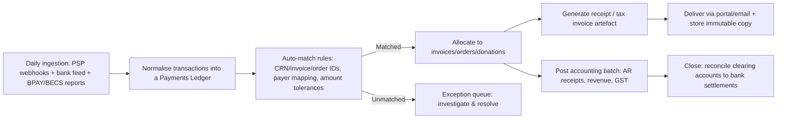

# Financial Modules for Australian School Finance Systems

## Executive summary

A modern school finance stack in entity["country","Australia","country"] typically needs nine tightly related modules: fee billing/invoicing, payment plans, debtor management, payment gateways, reconciliation, receipt generation, donations, event payments, and school services ordering (canteen/uniform). The critical design constraint is that these modules are not independent: payments and receipting must align to tax law (especially GST classification), accounting integration, and privacy/security obligations, with auditable end-to-end traceability from “charge raised” → “money received” → “allocation/reconciliation” → “receipt/tax invoice” → “general ledger posting” → “retention/disposal”. citeturn32view0turn36view2turn8view2turn8view3turn27view0

From a tax perspective, school tuition and closely related supplies are often GST-free where they fall within the GST law’s education provisions (for example, supplies of an education course and certain directly related items like course materials). However, the law also explicitly carves out many “education-adjacent” supplies that schools commonly charge for (for example, many goods sold to families), so a finance platform must support mixed tax treatments at line-item level, not merely at invoice level. citeturn32view1turn27view2turn27view3

From a security and payments perspective, the safest baseline is to keep cardholder data out of school systems by using a PCI DSS–compliant payment service provider with hosted payment pages/fields and tokenisation; schools then store only tokens and payment references while maintaining strong ecommerce controls, third‑party assurance, and clear service‑provider responsibility boundaries. citeturn2search13turn2search2turn2search5turn2search7turn2search15

From a privacy and governance perspective, systems must implement “reasonable steps” security controls for personal information and actively manage retention/disposal—destroying or de-identifying personal information when no longer needed, unless retention is required by law. They must also be prepared to assess and notify eligible data breaches under the Notifiable Data Breaches scheme when serious harm is likely. citeturn8view3turn36view0turn36view1

Record retention is a practical design driver. Government guidance indicates most business records must be kept for 5 years, while company records and some employment records typically must be kept for longer (commonly 7 years), and schools frequently need longer retention for student-related records under other regimes. A baseline architecture should therefore implement policy-driven retention with legal holds, immutable audit logs, and defensible deletion workflows. citeturn36view2turn8view2turn8view3

## Operating context for Australian schools

Australian schools commonly collect money across three broad “streams”: (1) education fees and levies billed per student/family account; (2) optional purchases (canteen, uniforms, excursions) that resemble retail/commerce; and (3) community fundraising (donations, raffles, events) where the tax and GST treatment depends on whether the payment is a genuine gift or consideration for a supply. citeturn32view0turn32view2turn27view0turn28view1

The dominant payment rails seen in school contexts are typically:
- Bill-style payments (often via entity["organization","BPAY","bill payment scheme, aus"]) using a biller code plus a customer reference number for allocation and reconciliation. citeturn34search0turn34search9  
- Direct debit (often via the Bulk Electronic Clearing System administered by entity["organization","AusPayNet","payments industry body, aus"]), requiring a direct debit request (DDR) / mandate process and careful handling of dishonours and cancellations. citeturn3search3turn3search7  
- Faster account-to-account payments via the New Payments Platform ecosystem, which uses ISO 20022 messaging to carry richer remittance data and can reduce reconciliation friction when references are well governed. citeturn34search2turn34search6turn34search14  
- Card payments (online and in-person), where the key architectural choice is how much card data touches school infrastructure and therefore how large the PCI DSS compliance scope becomes. citeturn2search13turn2search2turn2search15  

In governance terms, schools also operate under layered compliance drivers: GST law and invoicing rules, privacy law (including data breach notification), consumer protection expectations for debt collection, and corporate record‑keeping duties where the legal entity is a company. citeturn32view0turn36view3turn8view3turn36view0turn37search1turn8view2

## Module catalogue for a school finance platform

The catalogues below are written as implementation-ready requirements and controls. They are intentionally “vendor-neutral” and align to Australian regulatory constraints and payment-rail characteristics. citeturn32view0turn36view3turn2search13turn8view3turn37search1

### Fee billing and invoicing

| Aspect | Catalogue |
|---|---|
| Functional requirements | Maintain student/family accounts and invoice schedules; support line‑item tax classification (GST-free/taxable/out of scope) and mixed supplies; issue compliant tax invoices where required; support credits/adjustments and rebilling; support multiple delivery channels (portal, email, print); expose aged balances. citeturn36view3turn32view1turn27view0turn27view3 |
| Typical workflow | Student enrolment/fee rules → fee run generates draft invoices → review/approval → invoice issue (with BPAY/CRN and/or payment link) → payments arrive → allocation/reconciliation → statements and reminders. citeturn34search0turn36view3turn36view2 |
| Data elements | Student ID; family account; billing contacts; invoice number; line items (description, quantity, unit price); tax code and GST amount (if any); due dates; payment references; credit notes/adjustment notes where applicable. citeturn36view3turn36view2 |
| Security controls | Role-based access; segregation of duties (fee setup vs invoice approval); immutable audit trail for issued invoices; strong authentication for staff portals (prefer MFA); protect billing PII per APP 11. citeturn8view3turn35search6turn35search4 |
| User roles | Finance officer (AR), bursar/business manager, registrar/enrolments (read/trigger), class administrators (limited), parents/guardians (view/pay), auditor (read-only). |

### Payment plans

| Aspect | Catalogue |
|---|---|
| Functional requirements | Define instalment schedules; support direct debit mandates and/or tokenised recurring card payments; manage plan changes (pause, defer, catch‑up); compute and invoice plan fees/interest (if used); manage arrears and plan failures (dishonours, expired tokens). citeturn3search7turn2search5turn2search13 |
| Typical workflow | Plan request/eligibility → plan approval → mandate capture (DDR or card token) → scheduled collections → exception handling (dishonour/retry) → automated allocation to open invoices → statements. citeturn3search7turn3search3turn2search2 |
| Data elements | Plan ID; payer; mandate reference; schedule; instalment amounts; retry rules; failure reason codes; communications log; consent and authorisations. citeturn3search7turn8view3 |
| Security controls | PCI scope minimisation (tokenisation, no PAN storage); mandate/consent integrity; fraud/risk controls on plan edits; privileged access controls. citeturn2search5turn2search13turn35search7 |
| User roles | Finance (approve/manage), parents/guardians (request/maintain), collections staff (exceptions), IT/security (policy), auditors. |

### Debtor management

| Aspect | Catalogue |
|---|---|
| Functional requirements | Aged debtor reporting; configurable reminder sequences; payment promises; holds (e.g., excursions/uniform fulfilment gating); hardship workflows; dispute workflows; write‑off processing; external collections export when required. citeturn37search1turn37search3turn32view0 |
| Typical workflow | Payment overdue → reminders (with compliant contact cadence) → hardship/dispute handling → negotiated plan → escalation → write-off / external collections. citeturn37search2turn37search1 |
| Data elements | Aged buckets; contact history; consent/contact preferences; hardship indicators; notes; dispute status; write‑off approvals; third‑party agency handover pack (minimal necessary data). citeturn8view3turn37search0 |
| Security controls | Restrict access to sensitive notes; audit for changes to balances/status; minimise disclosures to third parties; privacy-by-design and breach-ready processes. citeturn8view3turn36view1turn37search0 |
| User roles | Collections officer, finance manager (approvals), wellbeing/student services (hardship liaison, limited access), school leadership (policy), external agency (if engaged; controlled data sharing). |

### Payment gateways

| Aspect | Catalogue |
|---|---|
| Functional requirements | Support online card payments, wallet options where available, and payment links; support tokenisation for recurring; support refunds and partial refunds; handle chargebacks/disputes; provide webhooks/events for payment lifecycle; expose settlement reports; support in‑person payments via PCI-validated point-to-point encryption (P2PE) where applicable. citeturn2search13turn2search5turn2search27turn2search7 |
| Typical workflow | Payment initiation from invoice/order → hosted payment page/fields → authorisation/capture → webhooks to finance system → settlement → reconciliation → receipt. citeturn2search2turn2search11turn36view2 |
| Data elements | Payment intent/transaction IDs; token references; payer identifiers; risk signals; 3DS outcomes if used; fee lines; settlement batch IDs. citeturn2search13turn2search5 |
| Security controls | Reduce PCI scope via SAQ A patterns when eligible; rigorous third‑party security assurance; monitor ecommerce integrity; keep cardholder data out of logs and systems; contractually define shared responsibilities. citeturn2search2turn2search13turn2search7turn2search15 |
| User roles | Parents/guardians (pay), finance (refunds/disputes), IT/security (vendor assurance/config), auditors. |

### Reconciliation

| Aspect | Catalogue |
|---|---|
| Functional requirements | Ingest payment rail reports (card settlement, BPAY reports, direct debit files, bank statements); match to invoices/orders/donations using reference governance (CRN, invoice number, payer mapping); manage exceptions (unknown payment, under/overpayment); produce reconciliation register and approval workflow; export journals to accounting. citeturn34search0turn3search3turn34search2turn32view0 |
| Typical workflow | Daily ingest → auto-match rules → exception queue → approval → post allocations → generate receipts where appropriate → push batch postings to accounting → retain artefacts. citeturn36view2turn8view2turn36view3 |
| Data elements | Bank transaction lines; settlement batch; reference fields; match confidence; allocation records; adjustment events. citeturn34search6turn34search9turn36view2 |
| Security controls | Dual control for posting; immutable reconciliation logs; restricted override permissions; centralised logging and protected audit trails. citeturn8view2turn35search11turn35search6 |
| User roles | Finance reconciler, finance manager (approval), accountant/bookkeeper (GL), auditors. |

### Receipts and tax invoice artefacts

| Aspect | Catalogue |
|---|---|
| Functional requirements | Generate receipts for payments received; generate tax invoices for taxable supplies when required; support combined documents (taxable + GST-free) with clear line treatment; support re-issue and corrections; store and retrieve artefacts by unique number; provide statement history for families. citeturn36view3turn36view2turn27view3 |
| Typical workflow | Payment allocated → receipt issued → delivery (email/portal) → retention clock starts → later adjustments produce credit notes/adjustment notes where applicable. citeturn36view3turn36view2 |
| Data elements | Receipt number; issue date; payer; payment method reference; invoice linkage; GST fields where applicable; delivery log. citeturn36view3turn36view2 |
| Security controls | Integrity of numbering; restricted re-issue; audit logging; secure storage; retention and disposal rules aligned to APP 11 and record-keeping obligations. citeturn8view3turn36view2turn8view2 |
| User roles | Finance (issue/reissue), parents/guardians (download), auditors (evidence). |

### Donations

| Aspect | Catalogue |
|---|---|
| Functional requirements | Distinguish gifts (donations) vs consideration (e.g., ticket purchase); support restricted funds and appeals; issue donation receipts where provided; capture donor intent/consent; handle refunds; integrate with DGR sub-entities (e.g., school building fund) where applicable. citeturn32view2turn32view1turn38search3turn38search2 |
| Typical workflow | Donor pledge/one‑off gift → payment → receipting → acknowledgement → reporting (appeal/fund) → accounting postings. citeturn32view2turn38search4 |
| Data elements | Donor identity/contact; amount; date; fund/appeal; “gift” attestation and benefit disclosure (if any); receipt metadata. citeturn38search4turn8view3 |
| Security controls | Minimise donor PII; consent management; protect donation databases; breach readiness under NDB; retention/disposal with legal holds for tax substantiation. citeturn36view0turn8view3turn36view2 |
| User roles | Development/fundraising staff, finance (reconciliation/receipt), donor (portal), auditors. |

### Event payments

| Aspect | Catalogue |
|---|---|
| Functional requirements | Event catalogue; ticketing and attendance; mixed treatment (donation component vs ticket price); refund/cancellation workflows; support raffle/bingo where lawful and where GST-free conditions apply for eligible entities; support sponsor invoicing. citeturn32view0turn28view1turn36view3 |
| Typical workflow | Event setup → ticket sales/registrations → payment collection → check-in/fulfilment → post-event reconciliation → receipts/tax invoices depending on supply type. citeturn36view3turn34search0 |
| Data elements | Event ID; ticket types; attendee details; tax codes; raffle ticket series; refund logs. citeturn28view1turn8view3 |
| Security controls | PCI scope control for ticket checkout; privacy controls for attendee lists; controls for raffle integrity and lawful conduct; audit logs. citeturn2search13turn8view3turn28view1 |
| User roles | Event coordinator, finance, volunteers (limited permissions), attendees/parents. |

### School services ordering (canteen/uniform)

| Aspect | Catalogue |
|---|---|
| Functional requirements | Product catalogue (sizes, variants), inventory where used, shopping carts, fulfilment/pickup queues, refunds/exchanges, POS integration, account charging options (prepaid balances vs per-order). Support correct GST treatment for supplies (not all supplies are GST-free). citeturn27view3turn36view2turn3search34 |
| Typical workflow | Catalogue setup → order placement → payment/charge → fulfilment → receipt/tax invoice (if taxable supply requiring) → reconciliation → inventory updates. citeturn36view3turn36view2 |
| Data elements | Product SKUs; pricing; tax codes; order ID; fulfilment status; returns/refunds. citeturn36view3turn36view2 |
| Security controls | Controls for staff fulfilment access; secure POS handling; prevent fraud/refund abuse; privacy for student accounts. citeturn8view3turn2search27 |
| User roles | Canteen/uniform staff, finance, parents/students (order), inventory manager. |

## Finance capability matrix and maturity comparison

The matrix below compares typical capability maturity for each module, from fragmented/manual through to integrated and automated. The maturity definitions are functional (not vendor-specific) and should be interpreted alongside security baselines (for example, MFA, backups, logging) as recommended by the entity["organization","Australian Cyber Security Centre","cyber agency, australia"] Essential Eight guidance. citeturn35search6turn35search3turn35search4

| Module | Foundational | Managed | Integrated | Optimised |
|---|---|---|---|---|
| Billing/invoicing | Spreadsheet fee runs; manual invoices | Central invoice register; line-item tax codes | Automated fee rules, portals, API sync to GL | Continuous billing, self-service adjustments, analytics-driven forecasting |
| Payment plans | Ad-hoc arrangements | Formal schedule + manual follow-up | DDR/tokenised recurring with exception workflows | Risk-based plan offers, automated retries/communications |
| Debtor management | Manual reminders | Aged debt, templates, escalation rules | Integrated comms + holds + hardship workflows | Predictive delinquency, tailored interventions within guidelines |
| Payment gateways | Bank transfer + manual | Payment links and limited reporting | Webhooks, tokenisation, refunds/disputes | Orchestrated multi-rail routing, fraud signals, automated fee accounting |
| Reconciliation | Manual bank statement ticking | Daily reconciliation register | Auto-match via references, exception queues | Near-real-time match, strong controls, low suspense balance |
| Receipts | Manual receipts | Automated receipts post-allocation | Unified artefact store and reissue controls | Immutable evidence trail, automated compliance reporting |
| Donations | Basic tracking | Donor register + acknowledgements | DGR-aware receipting + fund accounting | Campaign attribution, consent governance, donor analytics |
| Events | One-off EFT/card | Ticket lists + manual reconciliation | Ticketing + payments + GST segmentation | Hybrid donation/ticket modelling, integrated sponsor invoicing |
| Canteen/uniform | Cash/POS only | POS with basic reporting | Online ordering + inventory + tax codes | Integrated retail ops, demand forecasting, automated GL postings |

Key maturity accelerators in Australian schools are generally (a) reference governance for reconciliation (for example BPAY CRNs and consistent remittance fields) and (b) strict PCI scope minimisation via hosted payments and tokenisation. citeturn34search0turn2search2turn2search13turn2search5

## Accounting integration points, APIs, and GST-aware ledger mapping

### Recommended integration points with accounting systems

The integration objective is to preserve a clear subledger-to-general-ledger boundary: the school finance platform is usually the “student/parent subledger of record”, while the accounting system is the statutory ledger. Integration should therefore be event-driven (invoice issued, payment allocated, refund processed) with idempotent posting and full traceability back to source artefacts retained under record‑keeping obligations. citeturn8view2turn36view2turn36view3turn35search11

| Integration point | Direction | Typical mechanism | Accounting artefact | Notes |
|---|---|---|---|---|
| Invoice issued (fees, uniforms, events) | Finance → Accounting | API or batch file | AR invoice | Must carry tax codes and GST amount where applicable; tax invoice requirements apply for taxable supplies above thresholds. citeturn36view3turn27view3 |
| Payment allocated (all rails) | Finance → Accounting | API/batch | AR receipt + allocation | Allocation should reference settlement batch, payment rail ID, and payer; supports audit and bank rec. citeturn36view2turn34search0turn3search3 |
| Settlement fees (merchant service fees) | Finance → Accounting | API/batch | Expense line/journal | Requires mapping to expense accounts; tie to settlement report for evidence. citeturn2search7turn36view2 |
| Refunds | Finance → Accounting | API/batch | AR credit note / payment | Ensure adjustment events reflected correctly; preserve linkage to original transaction. citeturn32view0turn36view2 |
| Bad debt / write-off | Finance → Accounting | Journal | Bad debt expense + AR | Align to board/finance approvals; consider GST adjustment rules where applicable. citeturn37search0turn8view2 |
| Donations received | Finance → Accounting | Journal or receipt | Donation income (often no GST) | Treat as gift vs supply; receipting rules depend on DGR practice. citeturn32view2turn38search3turn38search4 |
| eInvoicing (where relevant) | Finance ↔ External | Peppol eInvoicing network | Structured invoice exchange | Australian government guidance notes secure eInvoicing via Peppol for supported accounting software. citeturn36view3 |

### Common standards and rails relevant to integration

- entity["organization","Australian Payments Plus","payments scheme operator, aus"] describes BPAY as using a biller code and customer reference number model, useful for reconciliation when references are governed. citeturn34search0turn34search9  
- Direct debit via BECS requires a DDR establishment process and operates as a batch clearing system, creating predictable exception handling needs (dishonours/returns). citeturn3search3turn3search7  
- The NPP ecosystem uses ISO 20022 messaging and supports richer remittance data, which can be leveraged for automated matching when reference policies are enforced. citeturn34search2turn34search6turn34search14  
- Card payments should be designed around PCI DSS scoping guidance and SAQ eligibility models, using tokenisation and hosted payment components to reduce exposure. citeturn2search13turn2search2turn2search5  

### GST-aware ledger entry mapping

The table below shows common school transactions and how they usually map into ledgers. Exact posting depends on entity type, GST registration status, chart of accounts, and “what exactly is being supplied”. The GST classifications below are grounded in the GST Act’s concepts of taxable supplies and consideration, and its education- and charity-related GST-free provisions. citeturn32view0turn32view1turn27view0turn27view3turn28view1

| Scenario | GST treatment basis | Example ledger posting (simplified) | Notes |
|---|---|---|---|
| Tuition fee invoice | Supply of an education course is GST‑free. citeturn27view0 | Dr Accounts Receivable<br>Cr Tuition Fee Revenue (GST‑free) | Still invoice/receipt operationally; GST amount should be $0 for those lines. citeturn36view3 |
| Curriculum-related excursion fee | Excursions can be GST‑free if directly related to curriculum and not predominantly recreational; food supplied as part of an excursion is not GST‑free under that section. citeturn27view0 | Dr Accounts Receivable<br>Cr Excursion Revenue (GST-free and/or taxable split)<br>Cr GST Payable (for taxable components) | Requires line-item splitting where parts are taxable (e.g., food). citeturn27view0turn36view3 |
| Uniform sale | Certain supplies related to education are explicitly not GST‑free (e.g., sale of goods other than course materials). citeturn27view2turn27view3 | Dr Cash/AR<br>Cr Retail Sales (taxable)<br>Cr GST Payable | If taxable supply > $82.50 and customer requests (or as required), issue tax invoice with required fields. citeturn36view3 |
| Canteen sale | GST on food depends on the “food” rules (GST-free vs not GST-free), often requiring product-level tax codes. citeturn3search34turn27view0 | Dr Cash/AR<br>Cr Canteen Sales (split GST-free/taxable)<br>Cr GST Payable (taxable items) | Maintain SKU-level tax code table; retain evidence. citeturn36view2 |
| Donation (genuine gift to non-profit body) | A gift to a non-profit body is not consideration; taxable supply requires consideration. citeturn32view0turn32view2 | Dr Cash<br>Cr Donation Income (no GST) | Must ensure no material benefit is provided; DGR receipts have required info if issued. citeturn38search4turn38search3 |
| Fundraising raffle/bingo ticket (eligible entity) | Raffles/bingo can be GST‑free if supplier is an endorsed charity, gift‑deductible entity, or government school and conditions are met. citeturn28view1 | Dr Cash<br>Cr Fundraising Income (GST-free) | Confirm legality under state/territory law as required by the provision. citeturn28view1 |
| Boarding accommodation | Student accommodation can be GST‑free in specified cases; food is explicitly excluded from GST‑free treatment in that section. citeturn27view2 | Dr AR<br>Cr Boarding Revenue (GST-free for accommodation line; taxable for food line)<br>Cr GST Payable (food line) | Needs itemisation between accommodation vs meals. citeturn27view2turn36view3 |
| Payment receipt and allocation | Operational and audit requirement; supports accounting integrity and traceability. citeturn36view2turn8view2 | Dr Bank/Clearing<br>Cr Accounts Receivable | Use clearing accounts per rail; then clear to bank on settlement confirmation. |

## Safe baseline design for school finance systems

This baseline design aims to (1) minimise PCI scope, (2) produce reconcilable, auditable accounting outcomes, and (3) support privacy and retention obligations. It assumes no vendor preference, but it does assume modern separation of duties and “shared responsibility” clarity with service providers. citeturn2search13turn2search7turn8view3turn8view2turn35search6

### Baseline architecture

```mermaid
flowchart TB
  subgraph Channels
    P[Parent/Guardian Portal]
    S[Staff Finance Console]
    D[Donor/Event Portal]
  end

  subgraph Identity
    IDP[Identity Provider / SSO]
  end

  subgraph SchoolFinance["School Finance Platform (in-scope systems)"]
    AR[Student/Family Subledger & Invoicing]
    ORD[Ordering: Canteen/Uniform]
    EVT[Events & Fundraising]
    RECPT[Receipt/Artefact Service]
    RECON[Reconciliation & Allocation Engine]
    AUD[Immutable Audit Log]
    DOC[Document Store (Invoices/Receipts)]
  end

  subgraph Payments["Payments (out-of-scope card data)"]
    PSP[Payment Service Provider / Gateway]
    TOK[Token Vault (PSP-managed)]
    BECS[Direct Debit Provider (BECS)]
    BPAYR[BPAY Reporting / Reference Files]
    BANK[School Bank Accounts]
  end

  subgraph Accounting
    GL[Accounting System (GL/AR)]
    FEED[Bank Feed / Statement Import]
  end

  P -->|SSO/MFA| IDP
  S -->|SSO/MFA| IDP
  D -->|SSO/MFA| IDP

  IDP --> AR
  IDP --> ORD
  IDP --> EVT

  AR -->|Payment link / hosted fields| PSP
  ORD -->|Checkout| PSP
  EVT -->|Donate / Ticket checkout| PSP

  PSP --> TOK
  PSP -->|Settlement payouts| BANK
  BECS -->|Direct debit collections| BANK
  BPAYR -->|Biller code + CRN matched payments| RECON
  FEED -->|Statements| RECON
  PSP -->|Webhooks: paid/refund/chargeback| RECON

  RECON -->|Allocations| AR
  RECON -->|Trigger receipts| RECPT
  RECPT --> DOC
  AR --> DOC
  AR --> AUD
  RECON --> AUD
  EVT --> AUD
  ORD --> AUD

  RECON -->|Journals/AR sync| GL
  GL -->|Period close outputs| S
```

Key security and compliance properties of this baseline:
- **Card data isolation**: the platform never stores or processes PANs; it uses hosted payment components and **tokenisation** so recurring payments and refunds can be initiated without bringing card data into school systems. citeturn2search2turn2search5turn2search13  
- **Rail-specific reconciliation**: BPAY’s biller code + CRN model and ISO 20022 rich references (where used) are treated as first-class matching keys. citeturn34search0turn34search2turn34search6  
- **Auditability**: immutable audit logs and retained artefacts support corporate record keeping expectations and enable defensible post-incident investigation. citeturn8view2turn35search11turn36view2  
- **Baseline cyber controls**: implement a risk-based control baseline consistent with Essential Eight guidance (MFA, patching, backups, logging). citeturn35search6turn35search4turn35search3turn35search11  

### Reconciliation and receipting process



This establishes “three-way reconciliation”: (1) subledger allocations, (2) settlement/bank reality, and (3) accounting postings—reducing disputes and supporting audit. citeturn36view2turn8view2turn2search7

### Record retention and defensible deletion baseline

A safe baseline requires:
- **Policy-driven retention**: retain finance artefacts and supporting records at least for the periods required (commonly 5 years for most records; longer for company records such as 7 years), and adopt longer regimes where applicable to student records and governance requirements. citeturn36view2turn8view2  
- **APP 11 disposal compliance**: actively destroy or de-identify personal information when no longer needed, unless retention is required by law or a court/tribunal order. citeturn8view3  
- **Legal holds**: prevent deletion when disputes, audits, or investigations are active (including chargebacks and fee disputes). citeturn2search7turn37search1  

### Payment gateway choices within a safe baseline

Without naming specific vendors, “gateway choice” criteria that directly impact safety and operational excellence include:
- Ability to implement a SAQ A style posture (hosted payments; merchant does not store/process/transmit cardholder data) where eligible. citeturn2search2turn2search13  
- Tokenisation support and clear token lifecycle controls (creation, rotation, deletion). citeturn2search5turn2search13  
- Robust settlement reporting for reconciliation, and defensible third‑party security assurance artefacts (attestations, responsibilities, incident notification terms). citeturn2search7turn2search15  
- Support for Australian rails indirectly (for example, enabling references that improve matching across BPAY/NPP workflows, even if the gateway is card-focused). citeturn34search0turn34search6  

## Australian compliance constraints and regulator guidance

### PCI DSS implications, card data scope, tokenisation, and PSP responsibilities

entity["organization","PCI Security Standards Council","payment card standard body"] publishes PCI DSS standards and supporting guidance, including scoping and self‑assessment questionnaires that are widely used to define merchant obligations when accepting card payments. citeturn2search15turn2search13turn2search11

Core implications for school finance design include:
- **Scope follows “store/process/transmit”**: systems that store, process, or transmit cardholder data (or can impact the security of those systems) expand PCI scope; hosted payment approaches are commonly used to reduce scope. citeturn2search13turn2search2  
- **SAQ A eligibility is conditional**: SAQ A is designed for merchants that outsource all cardholder data functions to validated third parties and do not store/process/transmit cardholder data on their systems; eligibility depends on meeting the SAQ criteria. citeturn2search2turn2search13  
- **Tokenisation reduces exposure but does not eliminate governance**: tokenisation guidance emphasises careful handling of tokens, system boundaries, and residual risks. citeturn2search5turn2search13  
- **Service providers do not remove accountability**: third‑party security assurance guidance highlights the need for due diligence, contractual clarity, and monitoring of providers that support in-scope services. citeturn2search7turn2search3  

### GST treatment for fees, donations, and events

GST treatment for school transactions hinges on whether there is a taxable supply (which generally requires consideration, enterprise, connection with Australia, and registration) and whether a supply is GST-free or input taxed. citeturn32view0turn32view1

Education-related GST-free treatment includes:
- **Education courses** and **administrative services directly related to supplying such a course** (subject to conditions). citeturn27view0  
- **Excursions/field trips** directly related to curriculum and not predominantly recreational, with explicit exclusions such as food supplied as part of an excursion. citeturn27view0  
- **Course materials** for subjects undertaken in an education course. citeturn27view0  
- Explicit clarifications that certain supplies related to an education course are not GST‑free (which is why product-level GST coding is necessary for uniforms and many retail-like items). citeturn27view3  

Donations and fundraising require careful classification:
- The GST law states that **making a gift to a non‑profit body is not the provision of consideration**, while consideration is broadly defined (including voluntary payments connected with a supply). This is why systems must separate genuine gifts from payments that buy something (tickets, goods, sponsorship benefits). citeturn32view1turn32view2  
- Certain fundraising gambling supplies (raffles and bingo) can be GST‑free for endorsed charities, gift‑deductible entities, or government schools, subject to conditions including compliance with state/territory law. citeturn28view1  

For canteen and food-related supplies, GST outcomes depend on the GST food rules and classifications; finance systems therefore require SKU-level tax coding and evidence retention for tax positions. citeturn3search34turn36view2

### Privacy, security, and breach notification

entity["organization","Office of the Australian Information Commissioner","privacy regulator, australia"] guidance on APP 11 states entities must take reasonable steps to protect personal information and must destroy or de-identify it when no longer needed (unless retention is required by law or court/tribunal order). This has direct architectural implications for finance platforms handling parent/student identity, payment history, hardship notes, and donor databases. citeturn8view3turn36view2

The OAIC also confirms that under the Notifiable Data Breaches scheme, organisations covered by the Privacy Act must notify affected individuals and the OAIC when an eligible data breach is likely to result in serious harm, and provides response planning guidance. citeturn36view0turn36view1

In scope determination, OAIC guidance indicates the small business exemption does not apply to some categories such as health service providers, and private schools are referenced within that context—so schools should not assume they are out of scope purely because of turnover or size. citeturn1search5

### Record retention and corporate record-keeping

entity["organization","business.gov.au","australian govt business site"] advises that most business records must be kept for 5 years, and that some records must be kept longer (giving company records as an example of 7 years). This maps directly to requirements for retention scheduling and audit evidence retention in the finance platform. citeturn36view2

entity["organization","Australian Securities and Investments Commission","corporate regulator, australia"] guidance for company record‑keeping states companies must keep financial records (including invoices, receipts, and ledgers) for at least 7 years, and that records can be electronic provided hard copies can be produced within a reasonable timeframe. citeturn8view2

### Debtor management and consumer protection expectations

Debtor management in schools should be designed to align with the jointly produced ACCC/ASIC debt collection guidance (Regulatory Guide 96), which is intended to ensure collection activity is consistent with Commonwealth consumer protection laws and applies to creditors as well as collectors. This is particularly relevant where schools use agents or external collection services, since creditor liability can attach to agent conduct. citeturn37search1turn37search0turn37search3

Accordingly, debtor modules should include: controlled contact cadence, special handling for vulnerable families and hardship pathways, clear dispute mechanisms, and compliant escalation—implemented as workflow controls rather than “staff training only”. citeturn37search2turn37search0

### Security baseline expectations

While schools have diverse threat profiles, the Essential Eight maturity model from the entity["organization","Australian Signals Directorate","signals intelligence, australia"] / ACSC recommends a risk-based approach to implementing baseline mitigations, including MFA (preferably phishing-resistant options), patching, and backups. These controls are directly applicable to finance systems that process sensitive customer data and to privileged accounts used for refunds, write-offs, and configuration. citeturn35search6turn35search3turn35search4turn35search13

