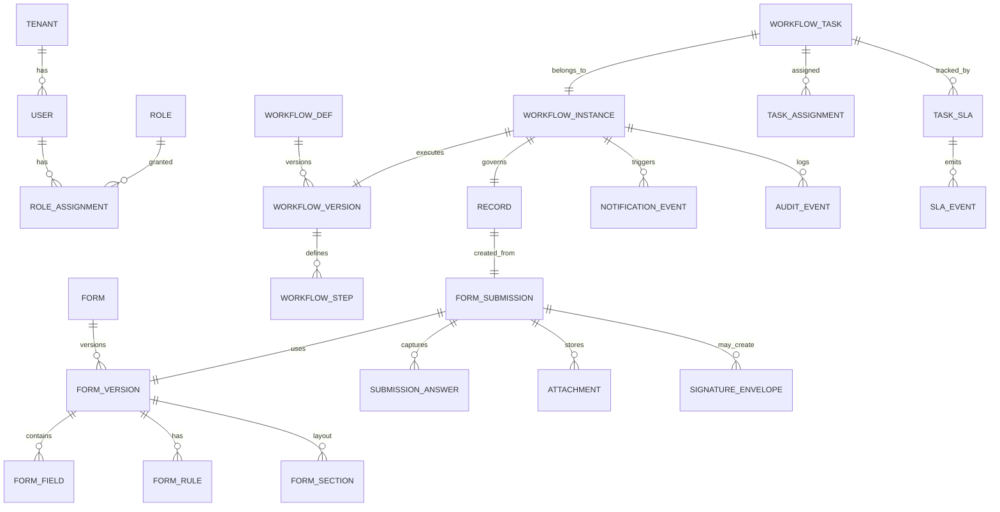
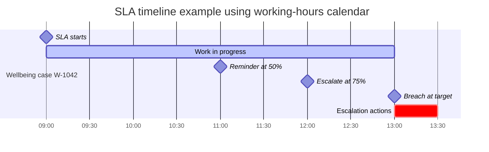
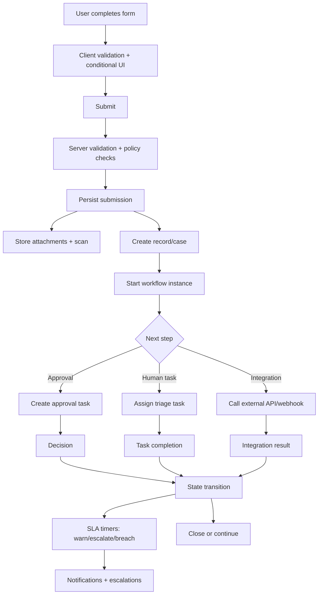

# Implementing Forms and Workflows in Modern Systems

## Executive summary

Modern “forms + workflows” platforms converge on a consistent pattern: a form submission is not just a payload but the creation (or mutation) of a durable **record/case** that then progresses through an orchestrated **workflow** with human steps (approvals, reviews), automation steps (integrations, updates), and time-based governance (reminders, escalations, SLA tracking). This “submission creates record” pattern is explicit in systems like Google Forms linking responses into a spreadsheet destination, citeturn2search3 Jira Service Management linking form fields to Jira fields on work items, citeturn1search19 and ServiceNow record producers creating task-based records (for example incidents) from a guided service-catalog form. citeturn6search4turn6search5

Across form builders, **conditional logic** typically comes in two flavours: (a) *section/page branching* (Google Forms “go to section based on answer”), citeturn4search3turn12view0 and (b) *show/hide fields or skip steps* (Jotform show/hide fields; Typeform “Logic Jumps” triggered by answers or hidden fields). citeturn4search13turn1search0 Attachments are widely supported but with materially different constraints (for example Typeform’s File Upload question supports all file types but enforces a 10MB maximum). citeturn1search1

For workflow governance, two product families are particularly instructive:

- **ITSM / case systems**: Jira Service Management provides SLA constructs (goals, calendars, conditions to start/pause/stop). citeturn9view0 ServiceNow can trigger flows from SLA task conditions and provides approval actions with due-date-driven default outcomes if approvers do not respond. citeturn2search2turn2search6  
- **Workflow engines / automation**: BPMN standardises process notation intended to be both broadly understandable and precise enough for translation into executable components; BPMN includes timer and escalation semantics that map cleanly onto reminders/escalations and exception routing. citeturn3search2turn3search5turn2search4 Camunda documents interrupting vs non-interrupting timer boundary events as canonical models for timeouts vs reminders. citeturn2search0 n8n illustrates the “webhook in, workflow runs, response out” integration pattern and highlights operational concerns such as encrypted credential storage, RBAC, and execution log pruning/retention. citeturn2search1turn7search0turn7search5turn7search2

**Assumptions (explicitly noted where relevant):** modern web stack; OAuth2/OIDC SSO; multi-school tenancy; up to ~50k staff users and ~2–5M submissions/year; attachments up to hundreds of MB; and availability targets typical of school operational platforms (≥99.9%). These are design assumptions, not requirements, and should be adjusted to your context.

## Evidence base and observed product patterns

This section summarises *what leading systems actually do* (from official docs and primary standards), then extracts architectural patterns.

### Form builders

**Google Forms** (from entity["company","Google","tech company"]) supports both (1) conditional *section branching* (“go to section based on answer”) and (2) attachments to questions via a File upload question type, copying uploaded files into the form owner’s Google Drive and organising them into a Drive folder per form, with subfolders per question. citeturn4search3turn12view0 Google Forms can also link responses to a Google Sheets spreadsheet as the selected destination. citeturn2search3

The Google Forms API exposes file-upload question metadata (folder ID, accepted file types, max files, max file size) but notes that the API does **not** support creating file upload questions. citeturn0search13 This is a useful reminder that “form definition APIs” may deliberately exclude sensitive capabilities (like file uploads) even when UIs support them.

**Microsoft Forms** (from entity["company","Microsoft","tech company"]) supports a dedicated “Upload file” question, but official guidance emphasises that file upload is only available when responses are restricted to people in your organisation (or specific people in your organisation). citeturn0search2 For downstream “record” handling, Forms provides export to Excel (“Open in Excel”). citeturn8search3 Microsoft also describes an “automated workflow between Microsoft Forms and Excel through Power Automate”, reinforcing the form→workflow coupling approach. citeturn8search16

**Typeform** (from entity["company","Typeform","form builder company"]) documents “Logic Jumps” that route the respondent to different fields based on an answer or a hidden field value. citeturn1search0 It also documents outbound webhooks triggered upon full form submissions or partial responses, typically delivered within seconds. citeturn1search20 Its File Upload question supports all file types but enforces a maximum 10MB file size. citeturn1search1

**Jotform** (from entity["company","Jotform","form builder company"]) provides both page routing (skip/hide pages) and field-level show/hide conditional logic. citeturn4search0turn4search13turn4search4 Jotform’s file upload element supports configuration of allowed formats and size limits and documents a maximum individual file size of 1GB (and recommends limiting to ~25 uploads per entry). citeturn4search14turn4search5 For signatures, Jotform supports an in-form signature field (“Signature” element) citeturn0search28 and also provides Jotform Sign for multi-signer document workflows (including signing order). citeturn0search16turn0search4

**Formstack** (from entity["company","Formstack","form automation company"]) provides eSignature capabilities through Formstack Sign and integrates document generation with signing (including explicit eSignature tag support and multi-signer tagging conventions). citeturn1search2turn1search10 It also documents integrations with third-party eSignature tools such as DocuSign and Adobe Sign for document workflows. citeturn1search6

image_group{"layout":"carousel","aspect_ratio":"16:9","query":["Google Forms file upload question interface screenshot","Microsoft Power Automate approval flow designer screenshot","Jira Service Management forms conditional logic screenshot","ServiceNow Flow Designer ask for approval action screenshot"],"num_per_query":1}

### Workflow orchestration, approvals, escalations, and SLAs

**Workflow patterns (academic baseline).** The Workflow Patterns Initiative and classic workflow research (e.g., van der Aalst et al.) frame workflow engines in terms of recurring control-flow, data, and resource patterns that appear across products and implementations. citeturn3search4turn3search1 This matters because “school workflows” are not just linear approvals; they often include parallel actions, exceptions, cancellations, and rework loops.

**BPMN as a common modelling substrate.** BPMN is defined by the entity["organization","Object Management Group","standards body"] and aims to be understandable to business users while being precise enough to map to executable process components. citeturn3search2turn3search5 BPMN timer events and escalation semantics directly correspond to SLA timers and escalation routing. citeturn2search4

**Camunda** (from entity["company","Camunda","process automation company"]) documents timer boundary events: interrupting timers terminate the current activity (common for timeouts), while non-interrupting timers are often used for notifications (reminders/escalations) without cancelling the underlying task. citeturn2search0 Camunda also discusses process “history” as audit logs of process execution traces in migration guidance. citeturn6search18

**n8n** (from entity["company","n8n","workflow automation company"]) documents the webhook trigger pattern (run a workflow based on inbound HTTP data, optionally returning an HTTP response), citeturn2search1 credential encryption (n8n encrypts credentials before saving to DB; the encryption key is generated on first launch and can be set via environment variable; queue mode requires the key across workers), citeturn7search0turn7search4 RBAC for access to workflows/credentials by project roles, citeturn7search5 and execution-data pruning that deletes old execution and binary data on a schedule (enabled by default). citeturn7search2 These features map closely to non-functional requirements for any workflow platform used in regulated school environments (auditability, least privilege, retention).

**Power Automate** approvals. Microsoft describes building approvals by adding “Start and wait for an approval” actions and managing approvals across services like SharePoint and others. citeturn0search7 It also documents the operational constraint that cloud flows have a maximum run duration of 30 days (pending steps time out after 30 days) and run retention in storage of 30 days. citeturn4search2 This is a concrete example of why long-running, human-centric approvals must be modelled as durable state machines, not “single long-running job executions”.

**Jira Service Management** (by entity["company","Atlassian","software company"]) provides:
- Forms that can use conditional logic and field validation; form-only fields can exist without creating new Jira custom fields, and can be linked to Jira fields when needed. citeturn1search19  
- Fine-grained access control to restrict who can view submitted forms on work items. citeturn6search2  
- Form settings that include locking edits and saving a PDF snapshot each time a form is resubmitted. citeturn6search28  
- Workflow approval steps; documentation notes approvers can approve/decline and that approvers receive notifications, with approval interactions supported via email and also via Slack or Microsoft Teams. citeturn8search0turn8search17  
- SLAs as explicit constructs with goals, calendars, and start/pause/stop conditions. citeturn9view0

**ServiceNow** (from entity["company","ServiceNow","itsm company"]) provides:
- SLA-driven triggers: “SLA Task trigger only runs when a task record matches the conditions of an SLA definition.” citeturn2search2  
- Approval actions: “Ask for Approval” supports rule sets and notes that if a due date is added, the approval can be auto-approved/rejected/cancelled if approvers do not respond by the designated time. citeturn2search6turn2search10  
- “Record Producer” as a service-catalog mechanism that lets end users create task-based records (like incidents) from a guided form. citeturn6search4turn6search5  
- Notification-channel configuration (for example, email channels are automatically created for users once a notification is sent). citeturn8search31

### Extracted architecture patterns

1. **Form definition and workflow definition are versioned artefacts.** Jira’s “save PDF each time resubmitted” is a practical expression of “snapshot state for audit”. citeturn6search28  
2. **Conditional logic belongs in a rules layer, not hard-coded UI.** This is consistently present: Google section branching citeturn4search3, Typeform logic jumps citeturn1search0, Jotform show/hide fields citeturn4search13, Jira forms conditional logic. citeturn1search19  
3. **Attachments and signatures are “binary artefacts” that require separate storage lifecycles.** Some systems document explicit constraints and configuration for uploads (Typeform 10MB; Jotform up to 1GB), citeturn1search1turn4search5 and others place uploads into a separate storage system (Google Drive folders). citeturn12view0  
4. **Approvals and SLAs must be first-class, durable workflow concepts.** ServiceNow approval due-date rules and SLA triggers citeturn2search6turn2search2, Jira workflow approval steps and SLAs with calendars/conditions citeturn8search0turn9view0, and BPMN timers citeturn2search0turn3search2 all converge on the need for timers, due dates, escalation routing, and audit trails.  
5. **Operational limits and retention policies shape architecture.** Power Automate’s 30-day run-duration timeout demonstrates why you should not depend on single-process executions for long-running work. citeturn4search2 n8n’s execution pruning illustrates the other side: indiscriminate retention can be expensive, so pruning is often default-on. citeturn7search2

## Workflow engine requirements

This section defines a rigorous, implementable requirements set for a workflow engine that sits behind form-driven processes in schools.

### Functional requirements

**Process definition and execution**
- The system must support a declarative workflow definition model expressible as a directed graph with explicit states and transitions (BPMN-inspired is acceptable), because formal control-flow patterns recur across workflow products and are used to evaluate engine expressiveness. citeturn3search4turn3search2  
- Core control-flow constructs must include: linear sequence, conditional branching, parallel split/join, loops/rework, cancellation, and exception routing, aligned with workflow patterns research. citeturn3search4turn3search1  
- The engine must support **timer semantics** at both workflow-instance and task scope (timeout vs reminder) consistent with BPMN timer boundary concepts (interrupting vs non-interrupting). citeturn2search0turn3search2  
- The engine must support **escalation routing** as a first-class concept (escalation differs from error: it routes attention without necessarily failing the workflow), consistent with BPMN escalation events. citeturn2search4turn3search2

**Form-driven initiation and record lifecycle**
- Workflows must be startable by: form submission created; record state transitions; inbound message/webhook; scheduled trigger; or SLA-events (for example “SLA task trigger runs when a task matches SLA definition”). citeturn2search2turn2search1  
- A “submission creates record” mechanism must exist: on submission, create a domain record (case/work item) and attach structured form payload and binaries, mirroring ServiceNow record producers and Jira form-to-field linking patterns. citeturn6search4turn1search19turn2search3  
- Records must have lifecycle states independent of workflow engine runtime (for example: Open → Triage → Awaiting Approval → In Progress → Resolved → Closed), enabling continuity even if workflows are migrated or paused.

**Tasks, approvals, and assignments**
- The engine must support task types:
  - Human task (work item assigned to a role/user).
  - Approval task (one-or-many approvers; optional unanimity; staged approvals).
  - System task (internal computation).
  - Integration task (HTTP/API call; message publish; webhook).
- Approval tasks must support due dates and an explicit **non-response outcome policy** (auto-approve/auto-reject/auto-cancel), reflecting ServiceNow approval behaviour when due dates are configured. citeturn2search6turn2search10  
- Tasks must support assignment strategies aligned to resource patterns (direct user, group role, rule-based routing, round-robin, load-based), consistent with workflow pattern perspectives. citeturn3search25turn3search4  
- Approvers and assignees must be notified via configured channels; approver actions should be possible from multiple surfaces (web portal, email, chat integrations), as seen in Jira approvals (email, Slack, Microsoft Teams). citeturn8search17

**Notifications**
- Notifications must support: in-app, email, SMS, push, Teams/Slack, and outbound webhooks. This is justified by (a) products exposing webhooks for submission events (Typeform), citeturn1search20 (b) workflow systems exposing webhook triggers (n8n), citeturn2search1 and (c) ITSM approvals being actioned in email/chat (Jira). citeturn8search17  
- Notification templates must support localisation (en-GB at minimum), parameter substitution, and policy-based redaction for sensitive fields.

**SLA-like tracking**
- SLA tracking must be first-class and must support:
  - Goal definitions (for example time-to-first-response, time-to-triage, time-to-resolution).
  - Calendars/working hours.
  - Start/pause/stop conditions bound to record fields and workflow states.  
  This matches Jira Service Management’s SLA model (goals, calendars, conditions). citeturn9view0
- Timers must be computable against calendars (business hours vs absolute time), and must emit events at thresholds (for example 50% reminder; 75% escalation; breach).

**Attachments and e-signatures**
- Attachments must be usable both as primary form fields (file upload) and as workflow artefacts (supporting documents generated later), reflecting Google Drive-per-form storage patterns and mainstream form builders’ file-upload configurations. citeturn12view0turn4search14  
- The platform must support two signature modes:
  - **In-form signature capture** (drawn signature field) as a field type, as supported by Jotform. citeturn0search28  
  - **Document signing workflow** (envelope model: roles, signing order, PDFs), as supported by Jotform Sign and Formstack Sign/document integrations. citeturn0search16turn1search10  
- Signature capture must preserve an audit trail sufficient for evidentiary purposes; in the EU context, electronic signatures must not be denied legal effect solely for being electronic (eIDAS). citeturn5search6 (This is a legal design motivation, not legal advice.)

### Non-functional requirements

**Reliability and consistency**
- Workflow execution must be durable: every state transition persisted transactionally, with idempotent reprocessing. The design should treat human steps as “wait states” (consistent with workflow-engine semantics of waiting for events/timers). citeturn2search0turn3search2  
- Long-running workflow instances must survive deployments, restarts, and migrations, avoiding single-run timeouts as seen in Power Automate (30-day run duration). citeturn4search2  
- Concurrency control must prevent double-approvals/double-execution (optimistic locking on tasks; idempotency keys on external calls).

**Scalability**
- Support multi-tenant isolation (per school/organisation).  
- Scale dimensions include:
  - Write-heavy bursts (for example incident reporting during an excursion).
  - High binary throughput (photos/videos).
  - High notification fan-out (whole-staff alerts).
- Architecture should separate hot paths (submission capture) from slow paths (virus scanning, PDF generation, third-party webhooks) using queues.

**Security and privacy**
- **Authentication (assumption):** OAuth2/OIDC with SSO to a school IdP.  
- **Authorisation:** RBAC plus record-level access control (student wellbeing records restricted to authorised staff). Jira’s ability to restrict who can see submitted forms illustrates the necessity of field/form-level security. citeturn6search2  
- **Credential security (for integrations):** credentials must be encrypted at rest; n8n’s use of an encryption key to encrypt credentials before storing them is a concrete precedent. citeturn7search0turn7search4  
- **Data minimisation:** only collect/store what is necessary for the stated purpose (UK GDPR principle). citeturn5search0turn5search4  
- **Retention and disposal:** implement retention schedules and destruction/de-identification once no longer needed; this is explicitly emphasised by Australian Privacy Principle 11 guidance (security plus active consideration of whether retention is permitted, and destruction/de-identification when no longer needed). citeturn5search3  
- **Auditability:** maintain immutable audit logs of who did what and when (submission edits, approvals, workflow transitions). Camunda describes process history/audit traces as part of “history” concepts. citeturn6search18turn8search14

**Observability and operations**
- Provide structured logs, metrics, and traces for workflow execution and SLA timers.
- Provide administrative tools for: re-driving failed steps; retrying integration tasks; manually overriding workflow state with audited justification; and exporting audit reports.

### Data model requirements

Below is a conceptual ER model capturing minimal entities needed for form definition, submission-as-record, workflow execution, SLAs, notifications, and audit.



Key modelling rules (normative):
- A **FormVersion** is immutable once published; changes create a new version (Jira’s “save PDF on resubmission” is an example of preserving historical state snapshots for audit). citeturn6search28  
- A **Submission** binds to a specific FormVersion to preserve interpretability of answers over time.  
- A **Record** is the canonical “case” object; workflows refer to the record, not directly to the submission.  
- A **TaskSLA** is attached to a specific task or record state; SLA events generate notifications and escalations.

### API requirements

A workable API surface (REST + events) should include:

- **Forms API**
  - Create draft form; publish form version; list versions.
  - Retrieve rendered schema (for web/app clients).
  - Validate submission payload against a specific form version (server-side).
- **Submissions API**
  - Create submission; upload attachment pre-signed URL; finalise submission.
  - Retrieve submission with redaction based on permissions.
  - Create submission revision (append-only model) for “edit response” use cases.
- **Records API**
  - Create/update record; query by status/student/date; manage access control lists.
- **Workflows API**
  - Deploy workflow definition/version; start instance for record; query instance state.
  - Query tasks; claim/reassign; complete tasks; record approval decisions.
- **SLA API**
  - Define SLA policies; compute due times; query breached/at-risk items.
- **Notifications API**
  - Configure notification routing rules; preview templates; send test notifications.
- **Audit API**
  - Query audit events by record/workflow/user/time; export signed audit reports.

Additionally, emit events for integration (pub/sub):
- `submission.created`, `record.created`, `workflow.task.created`, `workflow.task.completed`, `sla.warning`, `sla.breached`, `notification.sent`.

These align with webhook-first integration patterns documented by Typeform (submission webhooks) and n8n (webhook trigger). citeturn1search20turn2search1

### SLA, reminder, and escalation semantics

A reference SLA algorithm should support:
- Calendar-aware “working time” accumulation (mirrors Jira SLA calendars). citeturn9view0  
- Task-level timers (interrupting timeout vs non-interrupting reminder), reflecting Camunda timer semantics. citeturn2search0  
- Escalation ladder:
  - Warn task assignee.
  - Escalate to line manager / year coordinator.
  - Escalate to duty executive.
  - Trigger incident/severity upgrade (optional for wellbeing-critical events).

Example SLA timeline diagram:



## Flexible form schema design

This section proposes a form schema that is flexible enough for school workflows while remaining implementable, versionable, and enforceable.

### Form schema goals and principles

- **Versionability:** schema definitions are immutable once published; edits create a new version; submissions always reference the version used at the time. (This is necessary to preserve audit meaning over time, similar in spirit to Jira’s “save PDF each time it’s resubmitted” capability.) citeturn6search28  
- **Separation of concerns:** layout (sections/pages), data fields, validations, and logic rules are separate.  
- **Execution parity:** the same validation/logic must run (a) client-side for UX and (b) server-side for integrity.  
- **Security metadata is first-class:** classification, consent, and retention are not afterthoughts; they travel with the schema and answer payload, motivated by UK GDPR principles like data minimisation and storage limitation. citeturn5search0turn5search8  
- **Binary artefacts are references:** attachments and signatures are stored as objects with metadata and integrity hashes, not embedded in submissions.

### Field types

A practical field type set (minimum viable but extensible):
- **Text:** short, long, rich text (with sanitisation).
- **Numbers:** integer/decimal with bounds.
- **Date/time:** date, datetime, time, duration.
- **Choice:** single-select, multi-select, dropdown, radio, checkbox list.
- **Contact:** name, email, phone (normalised formats).
- **Entity references:** student, staff, class, location (lookup fields).
- **Boolean:** yes/no with conditional follow-ups.
- **Repeater/group:** repeatable sections for multi-item capture (multiple students involved, multiple expenses, multiple attachments).
- **Table/matrix:** grid-style responses (use sparingly).
- **File upload:** attachments with constraints (count, MIME types, per-file and total size), reflecting how mainstream form tools expose both size and type controls. citeturn12view0turn4search14turn1search1  
- **Signature (in-form):** drawn signature capture, as supported in Jotform’s form elements. citeturn0search28  
- **Signature request (document envelope):** not a “field”, but a workflow hook that generates a document and routes signers, aligned with Formstack Sign tagging and Jotform Sign multi-signer workflows. citeturn1search10turn0search16  

### Validation model

Validation should be composable:
- Required rules (static or conditional).
- String length; numeric bounds; regex; enumerations.
- Cross-field validations (e.g., “if injury = yes then attach incident photo or provide explanation”).
- External validations (e.g., student ID exists; staff role permitted).

### Conditional logic model

Support both:
- **Navigation logic** (skip pages/sections), like Google Forms section branching and Jotform skip/hide page logic. citeturn4search3turn4search0turn4search4  
- **Visibility and requirement logic** (show/hide fields; set required), like Jotform show/hide fields and Jira forms conditional logic. citeturn4search13turn1search19  
- **Jump logic based on hidden context** (e.g., prefilled risk level), consistent with Typeform logic jumps triggered by hidden fields. citeturn1search0  

Recommendation: represent conditions as an expression AST (not arbitrary code) to enable safe evaluation, auditability, and static analysis (e.g., “which fields depend on which answers”).

### Attachments and signatures: storage, retention, and integrity

- Use object storage for binaries; store metadata rows with:
  - object key, byte size, MIME type, uploader, scan status, SHA-256 hash, created time.
- Enforce server-side policy constraints from schema (max size/type/count), mirroring how leading tools explicitly define such constraints. citeturn12view0turn4search14turn1search1  
- Allow “open attached files” and “view folder” patterns similar to Google Forms Drive folder organisation, but implemented in your storage system. citeturn12view0  
- Retention: some content must be retained (safeguarding records) while other content should be deleted when no longer needed; implement retention schedules and deletion/de-identification workflows. citeturn5search8turn5search3  

### Privacy and consent metadata

At schema level:
- **Purpose** and **data categories** (e.g., wellbeing/health, behavioural incidents).  
- **Classification** (e.g., Public/Internal/Confidential/Highly Sensitive).  
- **Lawful basis / consent capture requirements** (jurisdiction-dependent).  
- **Retention policy** (duration; disposal method; legal hold overrides).  

Motivation:
- UK GDPR principles require data minimisation and security/integrity controls; citeturn5search0turn5search12  
- In Australia, APP 11 guidance explicitly ties security with actively considering whether retention is permitted and destroying/de-identifying when no longer needed. citeturn5search3  
- Documentation obligations (records of processing activities) are formalised in GDPR Article 30, which informs why systems benefit from embedding “purpose/retention/security measures” metadata alongside form definitions. citeturn5search5  

### Example JSON form schema

Below is a *platform schema* example (not JSON Schema) illustrating field definitions, conditional logic, attachments, and privacy metadata.

```json
{
  "formId": "wellbeing_entry",
  "version": 3,
  "status": "published",
  "title": "Student wellbeing entry",
  "locale": "en-GB",
  "recordType": "wellbeing_case",
  "privacy": {
    "purpose": "Safeguarding and wellbeing triage",
    "classification": "highly_sensitive",
    "dataCategories": ["student_health", "student_behaviour", "staff_observation"],
    "consent": {
      "required": false,
      "noticeText": "This information will be used for safeguarding and wellbeing support."
    },
    "retention": {
      "policyId": "school_safeguarding_7y",
      "minRetentionDays": 2555,
      "legalHoldCapable": true
    }
  },
  "sections": [
    { "id": "s1", "title": "Reporter details" },
    { "id": "s2", "title": "Student and concern" },
    { "id": "s3", "title": "Attachments and follow-up" }
  ],
  "fields": [
    {
      "id": "reporterStaffId",
      "sectionId": "s1",
      "type": "staff_ref",
      "label": "Reporting staff member",
      "required": true
    },
    {
      "id": "studentId",
      "sectionId": "s2",
      "type": "student_ref",
      "label": "Student",
      "required": true
    },
    {
      "id": "concernType",
      "sectionId": "s2",
      "type": "single_select",
      "label": "Concern type",
      "required": true,
      "options": [
        { "value": "mental_health", "label": "Mental health" },
        { "value": "bullying", "label": "Bullying" },
        { "value": "self_harm_risk", "label": "Self-harm risk" },
        { "value": "family", "label": "Family/home" },
        { "value": "other", "label": "Other" }
      ]
    },
    {
      "id": "riskLevel",
      "sectionId": "s2",
      "type": "single_select",
      "label": "Immediate risk level",
      "required": true,
      "options": [
        { "value": "low", "label": "Low" },
        { "value": "medium", "label": "Medium" },
        { "value": "high", "label": "High" },
        { "value": "critical", "label": "Critical" }
      ]
    },
    {
      "id": "narrative",
      "sectionId": "s2",
      "type": "long_text",
      "label": "What happened / what did you observe?",
      "required": true,
      "validation": [
        { "type": "min_length", "value": 30, "message": "Please provide at least 30 characters." }
      ]
    },
    {
      "id": "evidenceFiles",
      "sectionId": "s3",
      "type": "file",
      "label": "Attach files (optional)",
      "required": false,
      "filePolicy": {
        "maxFiles": 5,
        "maxBytesPerFile": 52428800,
        "allowedMimeTypes": ["image/*", "application/pdf"],
        "scanRequired": true
      }
    },
    {
      "id": "parentContacted",
      "sectionId": "s3",
      "type": "boolean",
      "label": "Has a parent/carer been contacted?",
      "required": true
    },
    {
      "id": "parentContactDetails",
      "sectionId": "s3",
      "type": "long_text",
      "label": "If yes, provide details",
      "required": false
    }
  ],
  "rules": [
    {
      "id": "r1",
      "when": {
        "op": "equals",
        "left": { "field": "parentContacted" },
        "right": true
      },
      "then": [
        { "action": "set_required", "field": "parentContactDetails", "value": true },
        { "action": "show_field", "field": "parentContactDetails" }
      ]
    },
    {
      "id": "r2",
      "when": {
        "op": "in",
        "left": { "field": "riskLevel" },
        "right": ["high", "critical"]
      },
      "then": [
        { "action": "set_ui_hint", "field": "evidenceFiles", "hint": "Consider attaching supporting evidence if available." }
      ]
    }
  ]
}
```

## Reusable workflow templates for schools

The table below provides reusable workflow templates designed around common school operations. Each template assumes the “submission creates record” pattern and includes baseline SLAs/escalations and notifications.

> Conventions: “Actors/Roles” are abstract roles; map them to your directory groups (e.g., Year Coordinator, Principal’s Delegate). SLA times are examples and must be adapted to your policies and duty-of-care obligations.

| Template name | Purpose | Actors/roles | Form schema summary | Approval steps | SLA and escalation rules | Notifications | Sample data |
|---|---|---|---|---|---|---|---|
| Student wellbeing entry | Capture a safeguarding/wellbeing concern and drive triage | Reporter (staff), Wellbeing team, Year coordinator, Duty executive | Student ref; concern type; risk; narrative; attachments | None by default; optional “close approval” by wellbeing lead | Triage SLA: 2h business time (warn 50%, escalate 75%, breach → duty executive) | Immediate alert for high/critical risk; daily digest for low/medium | `{ "studentId":"S-10492", "risk":"high", "concernType":"bullying" }` |
| Behaviour incident report | Record behaviour incidents and route follow-up actions | Staff reporter, Year coordinator, Head of school | Student(s) ref; location; incident type; witnesses; actions taken; files | If suspension recommended → approvals: Head of school → Principal delegate | Response SLA: 1 day; if “violence” → 2h; breach escalates to Head of school | Email + in-app; optional SMS for urgent | `{ "incidentType":"physical", "location":"Oval", "students":["S-22","S-41"] }` |
| Bullying report anonymous | Anonymous reporting channel with controlled visibility | Anonymous reporter, Wellbeing triage, Safeguarding lead | Narrative; optional student refs; optional attachments; consent notice | None; triage only | Triage SLA: 4h; urgency auto-derivation from keywords/risk fields | Only safeguarding group notified; strict record ACL | `{ "narrative":"Repeated harassment on bus route 12..." }` |
| Excursion permission and medical | Collect permissions and medical info, generate permission pack | Parent/carer, Teacher-in-charge, Admin officer | Student; excursion; medical fields; consent; signature | Teacher-in-charge review → Admin final check | Due date: excursion cutoff; reminders at T-7d and T-2d | Parent email reminders; staff dashboard list | `{ "studentId":"S-551", "excursion":"Zoo", "medical":"asthma" }` |
| Medication administration request | Authorise medication with medical evidence | Parent/carer, School nurse, Admin | Medication details; dosage; schedule; evidence file; parent signature | Nurse approval → Admin approval | SLA: 2 business days; if “anaphylaxis” → 2h | Email + in-app; urgent push for critical | `{ "med":"EpiPen", "frequency":"as needed", "risk":"critical" }` |
| Staff absence and relief cover | Capture unplanned/planned absence; allocate relief | Staff member, HR/admin, Timetabler | Absence type; dates; class impacts; attachments (medical cert) | If >N days → HR approval; otherwise auto-route | SLA: 1h for same-day absence; escalation to timetabler lead | Email + Teams/Slack (optional) | `{ "staffId":"T-882", "type":"sick", "start":"2026-03-01" }` |
| IT help request | Service desk intake with prioritisation and SLA | Staff/student, IT service desk | Category; device; impact; attachments | For purchases → budget holder approval | SLA tiers: P1 1h response; P2 4h; P3 1d | Confirmation + status updates; breach alerts | `{ "category":"wifi", "impact":"classroom down", "priority":"P1" }` |
| Facilities maintenance request | Intake maintenance jobs and track completion | Staff requester, Facilities team, Business manager | Location; issue type; photos; access constraints | If cost estimate > threshold → business manager approval | SLA: safety hazards 2h; routine 5d; escalation ladder | Email + in-app; daily worklist | `{ "location":"Block B", "issue":"broken glass", "hazard":true }` |
| Enrolment enquiry and follow-up | Capture prospective student enquiries and assignments | Parent, Enrolment officer, Principal delegate | Contact info; student year; notes; attachments | None; optional offer approval later | SLA: first response 2 business days; escalate after 3 | Email confirmation; internal follow-up reminders | `{ "guardianEmail":"x@example.com", "year":"Year 7" }` |
| Risk assessment and approval | Formal risk assessment for events/activities | Organiser, H&S officer, Principal delegate | Activity; hazards; mitigations; attachments; sign-off | H&S approval → Principal delegate approval | SLA: due before event; reminders at T-14d/T-7d; breach blocks event status | Email + dashboard; “blocker” flag on record | `{ "activity":"Camp", "hazards":["water","bushfire"], "date":"2026-05-10" }` |
| Procurement request | Controlled purchase intake with budget and approvals | Requester, Budget holder, Finance | Item; cost; justification; vendor; attachments | Budget holder → Finance → Principal delegate (threshold-based) | SLA: 5 business days; escalation at 7 | Email + in-app; approval from email supported | `{ "item":"Laptops", "cost":12000, "vendor":"..." }` |
| Child protection mandatory report pack | Controlled evidence capture and escalation | Reporter, Safeguarding lead, Duty executive | Structured checklist; narrative; attachments; classification | Safeguarding lead acknowledgement; executive visibility | SLA: immediate notify; acknowledgement within 30m; breach escalates | High-priority channels; restricted access; audit export | `{ "studentId":"S-77", "category":"neglect", "risk":"critical" }` |

### Example workflow template definition format

A template representation in JSON (suitable for a template library and deployable to your engine):

```json
{
  "templateId": "school_wellbeing_triage_v1",
  "name": "Student wellbeing triage",
  "recordType": "wellbeing_case",
  "startsOn": { "event": "submission.created", "formId": "wellbeing_entry" },
  "routing": {
    "visibility": { "aclPolicy": "safeguarding_minimum_access" }
  },
  "slaPolicies": [
    {
      "name": "triage_time_to_first_action",
      "startsWhen": { "recordStatus": "open" },
      "stopsWhen": { "recordStatus": ["triaged", "closed"] },
      "calendar": "school_business_hours",
      "targetMinutes": 120,
      "notifyAtPercent": [50, 75, 100],
      "escalations": [
        { "atPercent": 75, "toRole": "year_coordinator" },
        { "atPercent": 100, "toRole": "duty_executive" }
      ]
    }
  ],
  "steps": [
    {
      "id": "set_priority",
      "type": "system_task",
      "action": "derive_priority",
      "inputs": { "fromField": "riskLevel" }
    },
    {
      "id": "notify_on_high_risk",
      "type": "notification",
      "when": { "field": "riskLevel", "in": ["high", "critical"] },
      "channels": ["in_app", "email"],
      "toRoles": ["wellbeing_team", "duty_executive"],
      "template": "wellbeing_high_risk_alert"
    },
    {
      "id": "triage_task",
      "type": "human_task",
      "name": "Triage and decide next actions",
      "assignToRole": "wellbeing_team",
      "due": { "minutes": 120, "calendar": "school_business_hours" }
    },
    {
      "id": "close_case",
      "type": "system_task",
      "action": "transition_record",
      "inputs": { "toStatus": "triaged" }
    }
  ]
}
```

### Reference control-flow for “submission creates record” workflows



## Selected references

Primary standards and research:
- BPMN 2.0 specification by OMG. citeturn3search2turn3search5  
- Workflow patterns literature (van der Aalst et al.) and Workflow Patterns Initiative. citeturn3search4turn3search1  
- Business process management survey (van der Aalst). citeturn3search32  

Official product documentation used as evidence:
- Google Forms: attachments go to Drive and conditional section branching. citeturn12view0turn4search3  
- Google Forms: choose response destination in Sheets. citeturn2search3  
- Google Forms API: file upload question metadata; API cannot create file upload questions. citeturn0search13  
- Microsoft Forms: file upload restrictions; export to Excel. citeturn0search2turn8search3  
- Power Automate approvals and limits (30-day run duration; pending steps time out). citeturn0search7turn4search2  
- Typeform: logic jumps; webhooks; file upload limit. citeturn1search0turn1search20turn1search1  
- Jotform: conditional logic and file upload configuration; signature element and signing workflows. citeturn4search13turn4search14turn4search5turn0search28turn0search16  
- Formstack: eSignature/document signing integration. citeturn1search10turn1search6  
- Jira Service Management: forms, restricted visibility, approval steps, SLAs (calendars/conditions). citeturn1search19turn6search2turn8search0turn9view0  
- ServiceNow: SLA task trigger, approvals with due-date rules, record producers, notification channels. citeturn2search2turn2search6turn6search4turn8search31  
- Camunda: timer boundary events for timeouts and notifications; history/audit concept in migration guidance. citeturn2search0turn6search18turn8search14  
- n8n: webhook trigger, credential encryption key, RBAC, execution pruning. citeturn2search1turn7search0turn7search5turn7search2  

Privacy and retention principles motivating schema metadata:
- ICO guidance on data minimisation, storage limitation, and security principle under UK GDPR. citeturn5search0turn5search8turn5search12  
- OAIC APP 11 guidance on security and destruction/de-identification when no longer needed. citeturn5search3  
- GDPR Article 30 on records of processing activities (for governance motivations). citeturn5search5

