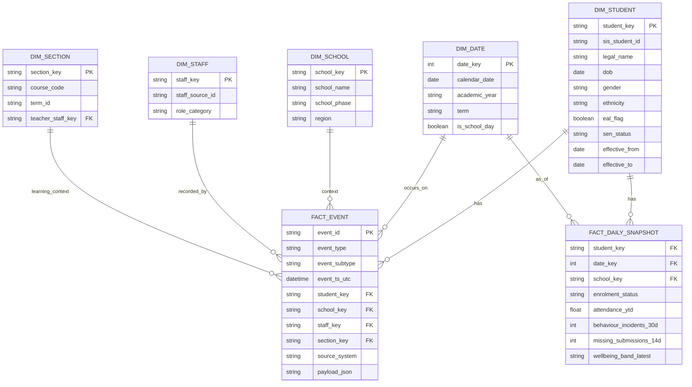

# K–12 School Analytics for Dashboards, Longitudinal Views, and Governance

## Executive summary

K–12 analytics platforms typically sit on top of Student Information Systems (SIS) and Learning Management Systems (LMS), and differ most in *how they expose data* (APIs vs exports vs vendor-hosted warehouses) rather than in the surface-level dashboards themselves. LMS vendors widely provide REST APIs and structured exports (for example, Canvas provides a REST API and bulk data access via Canvas Data 2, which is intended to power customer data warehouses rather than to be an end-user reporting tool). citeturn0search1turn0search20turn0search16

A practical “best default” for longitudinal student analytics is: an event/snapshot warehouse pattern (event facts + daily/termly snapshots), a star-schema semantic layer for BI consumption, and strong governance primitives (role-based access, masking, audit logging, and tightly controlled scheduled distribution and export). Star-schema approaches are explicitly recommended for BI semantic models, with fact tables storing observations/events linked to dimension tables, and SCD Type 2 techniques are commonly used when dimension attributes must retain history (for example: year group, provision status, EAL/SEN categories). citeturn21search0turn21search2turn21search3

Attendance and wellbeing analytics need both (a) jurisdiction-specific definitions (e.g., persistent absence in England is defined as missing 10%+ of possible sessions; severe absence as missing 50%+), and (b) evidence-based correlation framing (wellbeing and mental health are associated with attendance problems, but dashboards should avoid implying unproven causality without context). citeturn3search0turn32search2turn5search0turn5search1

In practice, schools that successfully operationalise dashboards do three things consistently: (1) standardise identifiers and calendars via rostering standards such as OneRoster (CSV and REST patterns), (2) automate ingestion with incremental loads (API throttling/quotas require backoff and batching), and (3) turn dashboards into workflows via scheduled reports/subscriptions and export controls that match governance roles. citeturn2search0turn16search0turn16search2turn14search0

## Vendor landscape and capability inventory

### Key integration standards schools encounter

**OneRoster** is widely used to exchange rostering data between SIS and downstream tools, supporting both spreadsheet-style CSV exchange and REST API exchange. citeturn2search0turn2search4  
For learning activity and engagement telemetry, **1EdTech Caliper** defines a structured vocabulary for learning activity/usage event data that can drive consistent engagement metrics across tools. citeturn2search6turn2search10  
For US-centric data ecosystems, **Ed-Fi** explicitly covers core K–12 entities and commonly analysed domains including attendance and discipline, alongside demographics and assessment-related information. citeturn2search9turn2search5

### Comparative vendor capability table

Interpretation notes used in the table:
- **BI connector** = a “direct query” style connection (e.g., OData feed, vendor-hosted warehouse accessible to BI tools, or live-feed link intended for tools like Excel/Power BI).
- **Data warehousing** = vendor-provided warehouse option (not merely “exports you can load yourself”).
- **Third‑party ETL typical** = schools commonly need separate ingestion/ELT tooling to centralise data across SIS/LMS/wellbeing/behaviour apps.

| Vendor (product family) | Category | API availability | BI connector | Vendor-provided data warehousing | Third‑party ETL typical for cross-system analytics | Evidence from primary/official docs |
|---|---:|---:|---:|---:|---:|---|
| entity["company","PowerSchool","k-12 sis and edtech vendor"] (PowerSchool SIS / data solutions) | SIS + analytics | Yes (e.g., Data Event API services) | Sometimes (depends on product; often export/API driven) | Yes (data/analytics solutions marketed as end-to-end) | Yes | PowerSchool SIS admin docs describe enabling Data Event API services for third-party notifications. citeturn18search2 PowerSchool positions data/analytics solutions for end-to-end analytics. citeturn6search0 |
| entity["company","Infinite Campus","k-12 student information system vendor"] | SIS | Yes (API setup and integrations; OneRoster commonly used) | Primarily exports (ad hoc reporting + extract utilities) | Not typically a standalone “warehouse” for BI | Yes | Infinite Campus documents “API setup”, ad hoc reporting, and a Data Extract Utility for automated flat-file transfer. citeturn17search7turn17search3 |
| entity["company","Skyward","k-12 sis vendor"] (Skyward SMS 2.0) | SIS | Yes (REST API; OneRoster endpoints) | Usually export/API driven | Not usually | Yes | Skyward provides a REST API for SMS 2.0 and OneRoster access via its API portal. citeturn6search5turn1search18 |
| entity["company","Aeries Software","k-12 sis vendor"] | SIS | Yes (REST API) | Typically export/API driven | Not usually | Yes | Aeries provides a web-based REST API and documents endpoints and request construction. citeturn1search3 |
| entity["company","Edupoint Educational Systems","synergy sis vendor"] (Synergy SIS) | SIS | Often via OneRoster / partner tooling | Typically export/API driven | Not usually | Yes | OneRoster-based third-party setup guidance describes exposing Synergy rostering endpoints via OneRoster 1.1. citeturn10search5 |
| entity["company","FACTS Management","facts school management vendor"] (FACTS SIS) | SIS | Yes (OneRoster API; API library portal) | Typically API/export driven | Not usually | Yes | FACTS SIS provides OneRoster API endpoints for rostering objects and an API library portal for endpoint testing. citeturn10search6turn10search3 |
| entity["company","Arbor Education","uk mis vendor"] | SIS/MIS + analytics | Yes (partner integrations; developer portal) | Yes (live feed exports; optional warehouse) | Yes (custom Snowflake warehouse offering) | Often yes (unless the vendor warehouse is adopted as the hub) | Arbor documents third-party API integrations and granular app access control. citeturn7search2 Arbor provides “Live Feeds” to export auto-refreshing reports. citeturn7search10 Arbor also offers a bespoke Snowflake “Custom Data Warehouse” for multi-source reporting. citeturn24search9 |
| entity["company","Bromcom","uk school management system vendor"] | SIS/MIS | Yes (REST APIs via partner portal) | Yes (live data feed + scheduled reporting features) | Not usually | Often yes | Bromcom provides REST APIs via its partner portal and supports admin-controlled app scopes. citeturn7search7 Bromcom documents scheduled report emailing features. citeturn8search14 |
| entity["company","iSAMS","independent school mis vendor"] | SIS/MIS | Yes (REST API + Batch API) | Typically API/export driven | Not usually | Yes | iSAMS explicitly offers a REST API and a Batch API for real-time reads/writes and batch workflows. citeturn8search0 |
| entity["company","Compass Education","school management system vendor"] | SIS/MIS | Yes (public REST API) | Typically API/export driven | Not usually | Often yes | Compass states it offers a robust, public RESTful API for schools. citeturn8search11 |
| entity["company","TASS Web Systems","school management system vendor"] | SIS/MIS | Yes (API integration program) | Typically API/export driven | Not usually | Often yes | TASS describes using APIs to securely connect school systems for data sync and automation. citeturn11search7 |
| entity["company","Instructure","canvas lms vendor"] (Canvas LMS / Canvas Data 2) | LMS | Yes (Canvas REST API; bulk via Canvas Data 2) | Indirect (requires ingestion into warehouse) | Canvas Data 2 is for bulk warehouse access, not an end-user BI tool | Yes | Canvas API docs describe a REST API for external access. citeturn0search1 Canvas Data 2 provides bulk, low-latency access to power data warehouses and custom reporting initiatives. citeturn0search20turn0search16 |
| entity["company","D2L","brightspace lms vendor"] (Brightspace) | LMS | Yes (Brightspace API; Data Hub APIs) | Mostly exports (CSV datasets; some differential extracts) | Not usually (Data Hub is export framework, not a warehouse) | Yes | Brightspace Data Hub exports datasets to CSV for analysis in third-party tools and supports differential datasets where available. citeturn0search14turn0search2 Data Hub can be accessed via API, including Advanced Data Sets workflows. citeturn0search6 |
| entity["company","Google","google workspace for education vendor"] (Google Classroom) | LMS (lightweight) | Yes (Classroom API) | No native warehouse/BI connector | No | Yes | Google documents the Classroom REST API for programmatic management of Classroom resources. citeturn12search4turn12search0 |
| entity["company","Microsoft","microsoft 365 education vendor"] (Teams / Graph Education APIs) | Collaboration/LMS-adjacent | Yes (Microsoft Graph education APIs) | No native warehouse | No | Yes | Microsoft documents education resources and assignment APIs via Microsoft Graph, which underpin Teams education experiences. citeturn12search1turn12search9 |
| entity["company","Moodle Pty Ltd","moodle lms vendor"] (Moodle) | LMS | Yes (web services API) | No native warehouse | No | Yes | Moodle documents configuring web services where users access services using tokens/keys. citeturn12search10turn12search14 |
| entity["company","Anthology","blackboard vendor"] (Blackboard Learn / Learn REST APIs) | LMS | Yes (REST API framework + developer portal) | No native warehouse (API driven) | No | Yes | Anthology documents its REST API framework for Learn and publishes endpoint requirements via its developer portal. citeturn19search0turn19search1 |
| entity["company","itslearning","lms vendor"] | LMS | Yes (Data Warehouse API + OData) | Yes (OData-accessible “Data Warehouse”) | Yes (data warehouse as an optional suite) | Often yes (to combine with SIS/wellbeing/behaviour) | itslearning describes a data warehouse designed to be accessed by organisations’ analytical systems via the OData standard. citeturn19search3turn19search2 |
| entity["company","Renaissance Learning","k-12 assessment and analytics vendor"] (Schoolzilla) | Analytics | Via connectors/APIs depending on source systems | Yes (vendor-hosted warehouse for dashboards; integrations vary) | Yes (Schoolzilla “Data Warehouse” referenced in support docs) | Sometimes (if Schoolzilla is used as the hub) | Renaissance support content discusses Schoolzilla dashboards and the underlying data warehouse configuration for metrics/enrolment rules. citeturn24search2 |
| entity["company","Panorama Education","student success and wellbeing vendor"] | Analytics / wellbeing | Often (direct access via APIs/automated exports) | Primarily platform UI; exports for BI | No (typically not a general-purpose warehouse) | Often yes | Panorama documents integration methods including “direct access” (nightly automated exports using read-only access) and SFTP-based exports. citeturn11search1turn11search4 |
| entity["company","Wonde","school data integration platform vendor"] | Integration / ETL | Yes (API platform for synced school data) | API-first (used by third parties) | No | N/A (it *is* the integration layer) | Wonde publishes API documentation for synchronised school objects and notes MIS-specific support differences. citeturn7search16turn7search0 |
| entity["company","Groupcall","education data integration vendor"] (Xporter) | Integration / ETL | Tooling-driven (extraction/write-back) | Files/feeds to authorised consumers | No | N/A (it *is* the integration layer) | Groupcall describes MIS integration as automated extraction/write-back, and Arbor documents using Groupcall Xporter on Demand for SIMS-linked migration workflows via SIMS APIs. citeturn7search13turn7search9 |
| entity["company","Fivetran","data integration vendor"] | ETL/ELT | Connector-driven | Loads to your chosen warehouse | No | N/A (it *is* the ingestion layer) | Fivetran documents managed connectors for education sources (e.g., PowerSchool; Canvas Data 2) to replicate into a destination warehouse. citeturn6search16turn0search8 |

## Common KPIs schools track with definitions, formulas, windows, and operational thresholds

### KPI principles for comparability

Attendance, behaviour, attainment, and wellbeing KPIs are only comparable when three things are stabilised: the calendar unit (days vs sessions), membership/enrolment rules, and subgroup definitions (e.g., what counts as EAL/SEN). The DfE’s published methodology defines persistent absence as 10%+ of sessions missed and severe absence as 50%+ of sessions missed; US practice commonly defines chronic absenteeism as missing 10%+ of school days. citeturn3search0turn32search2turn3search2

Where available, anchor your thresholds to statutory/authority definitions first (e.g., persistent/severe absence), then use national or system benchmarks, and only then apply school targets. In New South Wales, the Audit Office records that the department expects students to attend at least 95% of the time and highlights that attending less than 90% puts educational outcomes at risk. citeturn32search0

### KPI catalogue table

Notation used:
- `Possible` = possible sessions (or days) while enrolled, excluding non-attendance periods per local rules.
- `Present` = attended sessions (or days).
- `N_students` = number of enrolled pupils in the denominator cohort for the window.
- Windows listed are common operational windows; align to term/semester/year reporting cycles and to intervention cadence.

| Domain | KPI | Definition | Calculation (typical) | Typical aggregation windows | Suggested thresholds / benchmarks |
|---|---|---|---|---|---|
| Attendance | Attendance rate | Proportion of sessions/days attended while enrolled. | `AttendanceRate = Present / Possible` | Daily; weekly; rolling 28d; half-term/term; year-to-date | Operational “green” often ≥95% where expected by system; “risk” commonly <90% (aligns with 10% absence concept). citeturn32search0turn3search0turn3search2 |
| Attendance | Persistent absence | In England, classification where overall absence is ≥10% of possible sessions. | `Absent / Possible ≥ 0.10` (sessions-based) | Term; year-to-date; trailing 90d | Statutory/statistical definition: ≥10% sessions missed. citeturn3search0turn32search2 |
| Attendance | Severe absence | In England, classification where absence is ≥50% of possible sessions. | `Absent / Possible ≥ 0.50` | Term; year-to-date | Severe absence definition: ≥50% sessions missed; attendance guidance references “severe (below 50% attendance)” as a threshold for intensifying safeguarding-related support. citeturn32search2turn29view0 |
| Attendance | Chronic absenteeism (US) | Common US definition: missing ≥10% of school days for any reason. | `DaysAbsent / DaysEnrolled ≥ 0.10` | School year; semester; rolling 90d | US Dept of Education: typically ≥10% days (≈18 days/year). citeturn3search2turn3search10 |
| Attendance | Average Daily Attendance (ADA) | Average attendance used operationally and (in some US states) for funding. | `ADA = TotalDaysAttended / TotalDaysInstruction` (definition varies) | Monthly; term; annual | Example statutory definition (California): days attended ÷ days of instruction. Treat as jurisdiction-specific. citeturn31search5 |
| Attendance | Unauthorised absence rate | Proportion of possible sessions marked as unauthorised (jurisdiction-specific codes). | `UnauthAbs / Possible` | Weekly; term; year | Use local attendance codes; compare to prior-year same period; flag sudden increases. (Definitions vary by jurisdiction.) citeturn25view1 |
| Attendance | Punctuality rate | Proportion of sessions where pupil arrives on time. | `OnTimeSessions / PossibleSessions` | Daily; weekly; rolling 10 school days | Escalate where repeated lateness clusters or correlates with absence; thresholds should be school-policy aligned. citeturn25view1 |
| Attainment | Proficiency / expected standard rate | Share of pupils meeting a defined standard (test/assessment framework specific). | `N_meeting_standard / N_assessed` | By assessment cycle; term; annual | Benchmark using system/national distributions for the same assessment; avoid cross-test comparisons without equating. citeturn32search4turn32search12 |
| Attainment | Grade distribution | Distribution of grades or attainment bands for a cohort/subject. | `CountByGrade` and `%ByGrade` | Term; annual; exam series | Compare to prior cohort or prior year group baseline; use confidence intervals for small cohorts. citeturn21search0 |
| Progress | Progress vs baseline (value-added style) | Change from baseline to current attainment using a consistent scale. | `Progress = CurrentScore - BaselineScore` | Termly; assessment window | Use subject-specific expected progress trajectories; track by prior attainment and subgroup. citeturn31search7turn21search0 |
| Progress | Student Growth Percentile (SGP) | Relative growth ranking vs peers with similar prior attainment. | Conceptually: `SGP = percentile_rank( CurrentScore | PriorScoreHistory )` | Annual (typical); between standardised tests | RAND describes SGPs as comparing improvement to similar students to make comparisons fair. Implementations vary; treat as assessment-program specific. citeturn31search7 |
| Engagement | LMS active days | Days with any meaningful activity in LMS (login, content view, submission). | `DistinctActiveDays(student, window)` | Weekly; rolling 14d/28d | Use decreasing trend alerts rather than a single threshold; standardise “meaningful activity” using event definitions (e.g., Caliper). citeturn2search6turn2search10 |
| Engagement | Assignment on-time submission rate | Rate of assignments submitted by due date. | `OnTimeSubmissions / DueSubmissions` | Weekly; unit; term | Teacher workflow thresholding is context dependent; often track “missing ≥2 in last 14 days” as a risk rule (set locally). citeturn12search1turn12search4 |
| Engagement | Course participation intensity | Composite of page views, time-in-course proxies, submissions, forum activity. | Weighted index over standard event counts | Weekly; term | Avoid overfitting (time-on-task is a proxy); validate against teacher judgement; Caliper shows how consistent event vocabularies support usage analytics. citeturn2search6turn2search10 |
| Behaviour | Behaviour incident rate | Incidents per pupil (or per 100 pupils) in a window. | `Incidents / N_students` (or `*100`) | Weekly; term; rolling 30d | Track spikes by location/time/staff; thresholds best based on prior-year baseline + tolerances. citeturn21search0 |
| Behaviour | Suspension rate (UK terminology) | Suspensions as a rate of enrolled pupils, per term/year. | `N_suspended / N_students` (or days lost) | Term; annual | England: guidance uses “suspension” to refer to a fixed-period exclusion in legislation. citeturn27view1 |
| Behaviour | Permanent exclusion rate (UK) | Permanent exclusions as a rate of enrolled pupils, per year. | `N_permanent_exclusions / N_students` | Annual | Track with safeguarding and equalities lenses; definitions/collection vary by system. citeturn27view1 |
| Inclusion | SEN/SEND identification rate | Share of pupils with identified SEN/SEND status. | `N_SEN / N_students` | Term; annual | Use jurisdictional definitions; in England, EHC plans are for pupils needing more support than available through SEN support. citeturn20search0 |
| Inclusion | EHC plan rate (England) | Share of pupils with an Education, Health and Care plan. | `N_EHC / N_students` | Term; annual | Treated as a high-need subgroup with governance controls; definitions are jurisdiction-specific. citeturn20search0turn20search5 |
| Inclusion | EAL rate | Share of pupils recorded as English as an Additional Language. | `N_EAL / N_students` | Term; annual | England definition commonly recorded via school census evidence; underlying definition varies internationally. citeturn20search10turn20search8 |
| Equity | Attainment gap (subgroup) | Difference in attainment between subgroup and comparator. | `Gap = MeanScore_group - MeanScore_reference` (or difference in proficiency %) | Term; annual | Monitor confidence intervals; small cohorts require caution. citeturn21search0 |
| Retention | Adjusted Cohort Graduation Rate (ACGR, US) | % of a 9th-grade cohort graduating within 4 years, adjusted for transfers in/out. | `Graduates / AdjustedCohort` | Annual | NCES defines ACGR and describes cohort adjustment (adds transfers in; subtracts transfers out/emigration/death). citeturn31search3turn31search17 |
| Wellbeing | SDQ total difficulties band | Behavioural/emotional screening total (2–17yrs) commonly grouped into bands. | SDQ scoring → banding; thresholds depend on version/norms | Survey cycle (e.g., termly/biannual) | SDQ guidance describes scoring and standard cut-points/banding approaches; UK norms historically target an 80–10–10 distribution across normal/borderline/abnormal. citeturn23search13turn23search7 |
| Wellbeing | WEMWBS score | Mental wellbeing scale score (14–70) for groups; can be used for cut-points in analysis contexts. | `Sum(item_scores)` | Survey cycle | Warwick guidance provides indicative cut points for possible/mild vs probable depression; interpretation depends on context. citeturn22search2turn22search13 |
| Wellbeing ↔ attendance correlation | Attendance vs wellbeing association | Quantifies association between wellbeing measures and absence/attendance. | Examples: correlation; stratified odds ratios; regression controlling for covariates | Term; annual | Evidence supports associations between anxiety/depression and poor attendance; interpret as association, not proof of causality. citeturn5search0turn5search1 |

### Evidence base for wellbeing correlations and how to present them safely

Systematic reviews and meta-analyses provide consistent evidence that **anxiety** and **depression** are associated with poor school attendance outcomes (including absenteeism and school refusal patterns), though directionality can be complex and may be bidirectional. citeturn5search0turn5search1turn5search13

School-based **social and emotional learning (SEL)** programmes show positive effects on academic outcomes and behaviour at scale (e.g., Durlak et al. meta-analysis reporting improved academic performance and behavioural outcomes compared to controls), supporting the “whole-child” framing many dashboard suites aim to operationalise. citeturn4search1turn4search9

To avoid “correlation implies causation” errors in dashboards, present wellbeing-related analytics as:
- **Co-occurrence** (e.g., high-absence pupils also show higher wellbeing risk bands) and  
- **Trend/trajectory** (e.g., wellbeing decline precedes attendance drop in a subset),  
with notes on confounders and data completeness, and with drilldowns restricted to authorised pastoral roles. This aligns with the broader human-centred guidance emerging in K–12 learning analytics dashboard design research (which emphasises teacher needs, interpretability, and context). citeturn30search22turn30search5

## Reference analytics architecture for student-level longitudinal views

### Event model: what to capture, and why

A durable K–12 analytics model should represent **what happened** (events) and **what is true at a point in time** (snapshots).

**Events** (append-only, immutable where possible) drive auditability and longitudinal analysis:
- Attendance marking events (present/absent/late; session/day; reason code; entered_by; source system).
- Enrolment change events (entry/exit; roll changes; class/house changes).
- Assessment result events (assessment_id, measure, scale, raw/standardised score, grade, date).
- LMS activity events (login, content view, submission, grade posted, message); ideally standardised to a vocabulary such as Caliper’s actor/action/object framing. citeturn2search10turn2search6
- Behaviour incident events (type, severity, location, consequence; staff involved).
- Wellbeing survey response events (instrument, domain scores, risk band, consent flags).

**Snapshots** (periodic materialisations) make dashboards fast and simplify “as-of” questions:
- Student daily snapshot: roll status, school, year group, tutor group, SEN/EAL flags, attendance-to-date, active interventions count.
- Termly attainment snapshot: latest grades, predicted grades, target vs achieved.
- Weekly engagement snapshot: LMS active days, missing submissions count.

### Identifiers and canonical keys

Use a canonical internal `student_key` *separate from* source-system IDs to prevent downstream breakage when schools migrate systems. Rostering standards like OneRoster are often used to exchange and stabilise key entities (orgs, schools, users, classes, enrolments) across SIS and learning tools. citeturn2search0turn2search4

Recommended identifier set:
- `student_key` (warehouse surrogate key)
- `student_source_id` per system (`sis_student_id`, `lms_user_id`, etc.)
- `person_key` for staff (teacher/pastoral/leadership)
- `org_key` / `school_key`
- `course_key` / `section_key`
- `date_key` / `time_key` with timezone-normalised timestamps

### Suggested warehouse schema patterns

**Staging → conformed → semantic** layering (a medallion-like pattern) reduces breakage and supports data quality controls. Databricks’ “medallion architecture” describes bronze/silver/gold layers for progressively refined data products. citeturn21search1turn21search7

- **Bronze (raw)**: landed API payloads / CSV extracts + metadata (source, extract time, hash).
- **Silver (conformed)**: cleaned, deduped, identity-resolved event tables + conformed dimensions.
- **Gold (semantic)**: star-schema facts and dimensions optimised for BI.

For semantic models, a star schema is explicitly recommended in BI guidance: a fact table stores observations/events and links to dimension tables via keys, enabling flexible slicing/filtering. citeturn21search0turn21search2  
When student attributes change over time (e.g., enrolment status, subgroup flags), Type 2 slowly changing dimensions preserve history by inserting a new versioned row with effective dates. citeturn21search3

### Mermaid ER diagram: event-centric model with longitudinal support



### Data pipeline flowchart: sources → warehouse → dashboards

```mermaid
flowchart LR
  SIS[SIS / MIS/n(enrolment, attendance, behaviour, timetable)] --> ING[Ingestion/n(API, OneRoster, SFTP exports)]
  LMS[LMS/n(activities, submissions, grades)] --> ING
  WB[Wellbeing / pastoral tools/n(surveys, interventions)] --> ING
  ASSESS[Assessment tools/n(standardised tests, rubrics)] --> ING

  ING --> RAW[Bronze / Raw landing/nimmutable extracts + metadata]
  RAW --> CONF[Silver / Conformed layer/nidentity resolution + standardised events]
  CONF --> DW[Warehouse / Lakehouse/nfacts + dims + snapshots]
  DW --> SEM[Semantic layer/nstar schema + metrics]
  SEM --> BI[Dashboards/n(leadership, teachers, pastoral)]
  BI --> DIST[Scheduled reports + exports/nemail/PDF/CSV + governed sharing]
```

## Default dashboards for leadership and teachers

### Design goals grounded in learning analytics dashboard research

K–12 dashboard research emphasises interpretability, teacher workflow alignment, and avoiding “data overload”, with human-centred design approaches proposed for K–12 classroom dashboards. citeturn30search5turn30search22  
In operational terms: dashboards should prioritise “next best action” lists, cohort context, and drilldowns that match the user’s authority and safeguarding role.

### Leadership dashboards: recommended set

**Attendance and inclusion overview (Exec)**  
Purpose: system-level early warning, resourcing, and statutory reporting readiness.  
Key widgets: attendance rate trend; persistent/severe/chronic absence counts; unauthorised absence; absence bandings; subgroup breakdowns (year group, SEN/EAL, disadvantage where applicable). Persistent/severe definitions in England are explicitly defined by DfE statistics outputs. citeturn32search2turn3search0  
Filters: school, year group, cohort (entry-year), vulnerable groups, date range.  
Drilldowns: cohort → tutor group → pupil list; pupil → timeline view.  
Scheduled reports: weekly attendance banding pack; “severe absence” watchlist for safeguarding escalation (governed). Attendance guidance highlights intensifying support where absence becomes severe. citeturn29view0  
Exports: PDF snapshot for meetings; governed CSV extracts for analysts only.

**Attainment and progress (Standards)**  
Purpose: standards monitoring, gap analysis, intervention evaluation.  
Key widgets: proficiency/expected standard rates; progress vs baseline; growth distributions; subgroup gaps; subject heatmaps.  
Filters: assessment window, subject, year group, teacher, subgroup.  
Drilldowns: subject → class → pupil, with pupil-level longitudinal chart.

**Behaviour and safety (Culture)**  
Purpose: behavioural climate monitoring and safeguarding oversight.  
Key widgets: incident rate per 100 pupils; incidents by type/location/time; suspension/permanent exclusion counts and days lost. DfE guidance clarifies “suspension” corresponds to fixed-period exclusion. citeturn27view1  
Filters: school, year group, incident category, time window.  
Drilldowns: hotspot → incident list → pupil timeline, subject to role permissions.

**Wellbeing and pastoral risk (Whole child)**  
Purpose: identify risk clusters; evaluate pastoral programmes; track co-occurrence with attendance/behaviour.  
Key widgets: wellbeing survey participation rate; SDQ band distribution (if used); WEMWBS mean/segments (if used); correlation tiles (attendance band × wellbeing band). SDQ scoring and banding guidance is provided by SDQinfo; WEMWBS scoring/cut points are documented by Warwick resources and the original validation paper. citeturn23search13turn22search2turn22search13  
Filters: cohort, year group, pastoral team, survey wave, consent scope.  
Drilldowns: subgroup → anonymised distribution; authorised pastoral users → identified list.

### Teacher dashboards: recommended set

**Class pulse (Today / This week)**  
Purpose: immediate teaching actions.  
Widgets: markbook summary; missing submissions; attendance/punctuality for this week; behaviour notes; engagement signals (active days, last activity).  
Filters: class/section, week, subgroup flags.  
Drilldowns: pupil → “last 20 events” timeline; “missing work” detail.

**At‑risk pupil queue (Action list)**  
Purpose: prioritised interventions.  
Widgets: pupils flagged by rule engine (e.g., attendance drop, multiple missing submissions, behaviour spike).  
Rule engine should respect platform/API constraints and use stable event definitions (Caliper-style) where possible. citeturn2search10turn2search6

**Communication and follow-up (Workflow)**  
Purpose: document teacher actions and support continuity.  
Widgets: contact log, next follow-up date, intervention notes, referrals.  
Exports: governed “parent meeting” pack (PDF), not raw data dumps.

### Scheduled reports and exports: what “good defaults” look like

Because dashboards are not always opened, scheduled delivery is essential. Major BI tools support subscription-style scheduled email delivery of report snapshots (Power BI subscriptions send scheduled email snapshots/attachments; Tableau subscriptions email images/PDF snapshots; Looker supports scheduled dashboard deliveries). citeturn14search0turn14search1turn14search5  
Exports should be tiered: teachers get PDF-class packs; leaders get aggregated CSV only where policy permits; analysts get warehouse access or governed extracts.

## Governance, privacy, and compliance controls

### Jurisdiction-dependent compliance framing

Because jurisdiction is unspecified, governance should be implemented as a control framework that can be *mapped* to local law. At minimum:
- For the **UK/England**, schools operate under the **UK GDPR** and the Data Protection Act 2018; the government provides specific guidance for schools on data processing and sharing personal data. citeturn13search1turn13search16turn13search2  
- For the **US**, **FERPA** governs disclosure of personally identifiable information from education records, including conditions where prior consent is not required. citeturn13search3  
- For **Australia**, the OAIC provides guidance that privacy protections apply regardless of a child’s age and focus on capacity to consent. citeturn13search15

Additionally, where online services are likely accessed by children, the UK **Children’s code** sets standards for age-appropriate design. citeturn13search0

### Role-based access model for analytics

A defensible model uses “purpose-based roles”:

- **Teacher (class-level)**: sees own classes; can drill down to individual pupils in those classes; cannot access whole-school sensitive wellbeing/incident details without safeguarding role.
- **Middle leader / head of year**: sees year group/cohort; drilldown to named pupils; can view attendance/behaviour and limited wellbeing indicators where authorised.
- **Safeguarding / wellbeing team**: access to identified wellbeing data, intervention plans, and sensitive notes; strict audit logging; limited export rights.
- **Senior leadership**: aggregated views across school; identified view for pupils flagged as high risk; exports restricted and logged.
- **Data/IT analyst**: warehouse access; no operational need to view free-text pastoral notes; focus on de-identified/structured fields.

### Masking, anonymisation, and minimisation

Implement three layers:
1. **Minimisation by design**: ingest only what is needed for agreed KPIs and workflows; avoid raw message content where not needed.
2. **Pseudonymisation for analytics**: use `student_key` and keep re-identification tables in a restricted enclave.
3. **Dynamic masking** in BI semantic layer: hide names/DOB and show cohort aggregates unless the role requires identification.

### Retention and audit logging

Retention should be data-type dependent:
- Attendance/attainment records may be subject to statutory retention policies (jurisdiction-specific).
- Wellbeing survey raw responses and free-text notes warrant shorter retention and stricter access.
- Audit logs should be retained long enough to support incident investigations and compliance proof.

For scheduled report controls, treat “who receives what” as an access policy extension: Power BI explicitly supports managing subscriptions (including workspace administrators taking over subscription ownership), which can be mapped to governance roles and leaver processes. citeturn14search0turn14search10

## Implementation notes: BI tooling, ETL patterns, scaling, and API best practices

### BI tool choices and when they fit

A common pattern is:
- **Power BI** for broad deployment in Microsoft-centric school systems; supports scheduled subscriptions and incremental refresh partition management for large fact tables. citeturn14search0turn15search0turn15search1  
- **Tableau** for exploratory analytics and strong visual interactivity; supports subscriptions and multiple export formats. citeturn14search1turn14search3  
- **Looker / Looker Studio** where a central semantic layer and scheduled deliveries are priorities; supports scheduled dashboard delivery features. citeturn14search5turn14search12

### ETL/ELT patterns and connector examples

**Ingestion patterns typically seen in K–12:**
- **REST APIs**: Canvas, Schoology, Brightspace, Classroom, Graph education APIs. citeturn0search1turn0search3turn12search3turn12search4turn12search1
- **Bulk extracts / dataset exports**: Brightspace Data Hub exports CSV datasets (including differential extracts where available). citeturn0search2turn0search14
- **OneRoster** for rostering sync between systems (CSV/REST). citeturn2search0turn6search11
- **MIS aggregators**: Wonde and Groupcall Xporter frequently act as integration layers for MIS-to-app syncing and extraction/write-back patterns. citeturn7search16turn7search13
- **Managed ELT connectors**: tools like Fivetran provide managed replication connectors into warehouses for sources such as PowerSchool and Canvas Data 2. citeturn6search16turn0search8

**Transformation patterns:**
- Use incremental transformations for event and attendance fact tables (dbt incremental models are explicitly designed to transform/load only new or changed rows on subsequent runs). citeturn15search4turn15search8
- Materialise “gold” snapshot tables for teacher dashboards (daily/weekly snapshots), and keep raw event grain available for drilldown.

### Performance and scaling considerations

**Warehouse optimisation**  
Partition and cluster large event tables by date and high-selectivity fields. BigQuery documents clustering for partitioned tables and automatic reclustering; Snowflake documents micro-partitions and clustering keys for pruning. citeturn15search3turn15search2turn15search6

**Semantic model optimisation**  
For Power BI scale-out, incremental refresh is designed to manage partitions for frequently changing fact tables, reducing refresh cost and improving performance. citeturn15search0turn15search1  
Maintain star schema relationships for BI flexibility (Microsoft guidance explicitly recommends star schema design rather than relating fact tables directly). citeturn21search12turn21search0

### API best practices for K–12 data ingestion

K–12 APIs frequently enforce throttling/quotas; ingestion must be built with retries, backoff, pagination, and idempotency.

- Canvas documents dynamic throttling with request “costs” and quota replenishment, returning rate-limit errors when exceeded. citeturn16search0turn16search4  
- Microsoft Graph documents throttling and the use of the `Retry-After` header on 429 responses. citeturn16search1turn16search5  
- Google Classroom documents explicit per-minute and per-day usage limits. citeturn16search2  
- Brightspace describes token-bucket style rate limiting and publishes rate limit headers/credit schemes. citeturn16search3turn16search19

Recommended ingestion controls:
- **Checkpointing + incremental windows** (e.g., “since last_successful_ts”) for event feeds.
- **Idempotent upserts** using stable event IDs or source hashes (to avoid duplicates under retry).
- **Backoff strategies** keyed to vendor guidance (`Retry-After` where provided).
- **Schema drift handling** in bronze → silver transformations, not in BI.

### Sample event-to-metric mapping table

This is a template mapping you can adapt; it assumes the event model in the architecture section and demonstrates how to derive KPIs from event facts and snapshots.

| Source event type | Example event subtype | Required attributes | Derived metric | Aggregation | Notes |
|---|---|---|---|---|---|
| `attendance_marked` | `present / absent / late` | student_key, date_key, session_id, mark_code, minutes_late | Attendance rate; punctuality rate; persistent absence | Daily → term/year | Persistent/severe absence thresholds are jurisdiction-defined (e.g., 10%+ and 50%+ sessions missed in England). citeturn32search2turn3search0 |
| `enrolment_changed` | `entered / exited / transferred` | student_key, school_key, effective_from/to, reason_code | Denominator membership for rates; retention/graduation cohorts | Term/year | Cohort adjustment logic mirrors ACGR-style cohort adjustment in US contexts. citeturn31search3turn31search17 |
| `assessment_scored` | `standardised_test` | assessment_id, scale, score, date, subject | Proficiency rate; growth vs baseline; SGP-like measures | Assessment window | SGP concept compares growth to similar students; implementation depends on assessment programme. citeturn31search7 |
| `lms_activity` | `login / content_view / submission` | actor, object, action, event_ts | Active days; missing submissions; engagement index | Weekly/rolling 14–28d | Caliper provides a consistent vocabulary pattern for learning activity/usage events to support comparable analytics. citeturn2search6turn2search10 |
| `behaviour_incident` | `minor / major` | incident_type, severity, location, staff_key | Incident rate; exclusion/suspension indicators | Rolling 30d/term | UK terminology: “suspension” corresponds to a fixed-period exclusion in legislation. citeturn27view1 |
| `wellbeing_response_recorded` | `sdq_completed` | instrument_version, domain_scores, band, consent_scope | Wellbeing band distribution; risk watchlists | Survey cycle | SDQ scoring and banding guidance is published with UK normative references. citeturn23search13turn23search7 |


