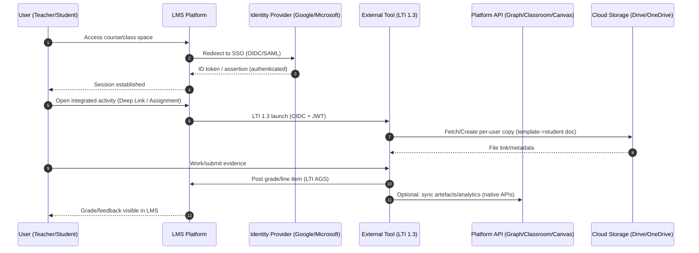
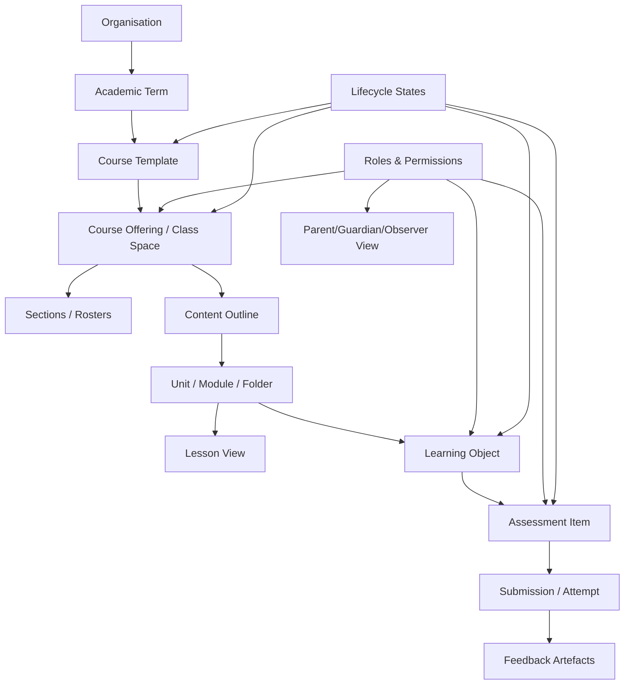

# Learning and Teaching Layers in Major LMS Platforms

## Executive summary

Across Canvas, Moodle, Google Classroom, Microsoft Teams for Education (with School Data Sync), Brightspace, and Schoology, the “learning/teaching layer” consistently converges on a small set of primitives: a **class space** (course/team/class), a **content outline** (modules/topics/folders), **work** (assignments/quizzes/questions), **evidence** (submissions/attempts), **feedback** (rubrics, annotations, comments), and **visibility/roles** (especially parent/guardian/observer). The biggest architectural differences are (a) whether the platform has a strong *pedagogical sequencing model* (e.g., modules with requirements and unlock rules) versus a simpler *posting model* (topics + stream), and (b) whether reuse is dominated by *course copy/templates* or by *centrally managed libraries with controlled roll-out* (Blueprint/template sync, repositories, enterprise resource libraries). citeturn12search0turn16search3turn17search0turn7search1turn6search0

From an implementation perspective, modern interoperability is increasingly shaped by **LTI 1.3 / LTI Advantage** (OIDC + JWT security; Deep Linking; Names & Roles; Assignment & Grade Services), while legacy packaged e-learning still appears as **SCORM** packages and increasingly as **xAPI** (and xAPI’s IEEE standardisation). citeturn8search0turn8search4turn8search9turn10search3

For Google Workspace and Microsoft 365, three integration patterns dominate: **SSO** (SAML/OIDC to LMS), **cloud-file workflows** (Drive/OneDrive attachments, copies per student, collaboration), and **assignment/grade synchronisation** (native APIs or LTI AGS-style grade passback). The most common operational pitfalls are identity mismatches (email/UPN), file permission edge-cases (link vs copy), calendar feed latency, and token/scope misconfiguration (including short-lived access tokens and admin-consent requirements). citeturn11search9turn21search3turn21search8turn20search4

## Content structures and lifecycle management

A useful way to compare platforms is to separate **structural hierarchy** (how content is organised) from **workflow state** (draft/publish/archive/conclude) and from **reuse channels** (copy/template/library).

### Comparative view of core learning objects and lifecycle

| Platform | Primary “class space” | Typical content outline pattern | Draft/publish/conclude/archival mechanics | Built-in “discussion/journal” affordances | Parent/guardian visibility baseline |
|---|---|---|---|---|---|
| Canvas | Course | **Modules** (module items can be pages, assignments, quizzes, discussions, external URLs/tools) | Course must be **published** for students to access; items have publish state; courses can be **concluded** to read-only (often end-of-term) | Discussions; pages can act as collaborative wiki content | Observer role with pairing codes; observers can view grades/comments but cannot participate |
| Moodle | Course | Course **sections** (e.g., topics/weeks) containing **activities/resources** | Course visibility is controlled (hide/show); archiving commonly via **backup/restore**; granular visibility by activities | Forum activity; blogs are supported (user blogs + course-associated entries) | “Parent”/mentor-style access model via roles/capabilities and relationships |
| Google Classroom | Class | Classwork organised by **Topics**; work items are CourseWork types | Assignments can be **draft**, **scheduled**, posted; classes can be **archived** (and later deleted after archive) | Stream posts/comments + question posts (lighter-weight than forums) | Guardian email summaries model (not a full in-app parent role) |
| Microsoft Teams (Education) | Class Team | Channels + Files; “Assignments” is the core work surface | Teams can be **archived** to make content read-only; assignments can be saved as draft; reuse from archived teams | Channel conversations; OneNote Class Notebook often used for journalling-like workflows | No dedicated universal “parent role” primitive; access is fundamentally membership-based (inferred from submissions visibility rules) |
| Brightspace (D2L) | Course | **Content** with modules/topics; “Lessons”/content experience layers | Copy/import/export components; repository publishing; role-based access incl. Parent/Guardian tool | Discussions tool | Parent & Guardian product with explicit permission matrix and SIS-linked relationships |
| Schoology | Course + Section | Course materials organised in **folders**; materials include assignments, discussions, assessments, pages, etc. | Availability dates and per-item controls; systematic reuse via course templates and resources libraries | Discussions and course activity streams | Parent accounts with configurable permissions (view grades/submissions/mastery, etc.) |

Canvas Modules explicitly support structured sequencing and unlock criteria (“requirements” and “prerequisites”), which is a materially different design assumption from Classroom’s post-centric Classwork model. citeturn12search0turn16search3  
Canvas publishing is a first-class workflow gate: courses and many content items must be published for learners to access them, and courses can be concluded into read-only states. citeturn18search1turn18search0  
Moodle’s content organisation is strongly “course sections + activities/resources”, where the course format (topics/weeks/etc.) defines the visible skeleton; visibility is often handled by hiding the course or activities, and end-of-term lifecycle is typically handled operationally via backups/restores rather than a single canonical “conclude” toggle. citeturn1search1turn2search3turn1search5  
Google Classroom explicitly supports draft/scheduled/posted states for assignments and an archive/delete lifecycle for the class container. citeturn16search0turn16search1  
Microsoft Teams supports both “reuse assignment” (including from archived classes) and “archive team” (making artefacts read-only), aligning its lifecycle with Microsoft 365 group/team governance patterns. citeturn17search0turn17search1  
Brightspace models content as modules/topics in its APIs and provides a formal Learning Object Repository (LOR) for storing and sharing learning objects beyond a single course offering. citeturn6search27turn6search0  
Schoology’s design centres on folders/materials and separately distinguishes “Courses” (parent objects) from “Sections” where teachers/students are enrolled and where materials/assignments live, which has implications for roster sync and API modelling. citeturn7search0turn7search19turn7search31

### Content versioning and “lesson planning” reality

Only some platforms implement explicit version history on learning objects inside the LMS. Canvas Pages, for example, keep page revision history and allow rollback to prior versions, which is a concrete “content versioning” primitive that can be leveraged for lesson iteration. citeturn14search0

In many “classstream-first” environments (notably Classroom, and often Teams), “lesson planning” is frequently externalised into documents/spreadsheets/notebooks, with the LMS acting as the distribution and workflow surface. This shows up in official docs as tight attachment and collaboration features rather than deep native lesson-plan entities (e.g. building an assignment around Drive/Office files, reusing posts, reusing assignments). citeturn16search6turn17search2turn17search0turn20search5turn20search6

## Reuse and interoperability standards

### Reuse mechanisms: copy, template sync, and libraries

A pragmatic taxonomy of reuse across the platforms:

**Course-copy cloning (instance-to-instance replication).**  
Canvas’s Course Import Tool copies course artefacts (assignments/modules/pages/discussions, etc.) into another course; it explicitly warns about unintended consequences if you re-import and override edited artefacts. citeturn12search1turn12search5  
Moodle operationally relies on backup/restore for moving courses and content between contexts, including restoring into existing courses. citeturn1search5turn1search13  
Brightspace provides “Import/Export/Copy Components” to move content and create standards-compliant export packages. citeturn6search4  
Teams supports “reuse an assignment” across classes, including from archived classes. citeturn17search0  
Schoology supports course templates (including automated distribution) and a resources library concept (“My Resources”) for longer-lived reuse. citeturn7search1turn7search9  
Google Classroom supports “Reuse post”, including optional creation of new copies of attachments to avoid cross-class coupling. citeturn16search6

**Template sync / centrally managed roll-out (one-to-many propagation).**  
Canvas Blueprint Courses provide a formally synchronised template → associated course model. Notably, Blueprint sync includes the *published/unpublished state* of objects, and there are documented exception behaviours for modules (ordering and duplication edge-cases). citeturn11search10  
This model more closely resembles enterprise content governance (where a coordinating team controls core artefacts, while local instructors adjust dates or unlocked properties).

**Shared libraries / repositories (objects live outside any one course).**  
Canvas Commons is a learning object repository and preserves published/unpublished status of items at share/import time; Canvas Commons also exposes a REST API. citeturn12search2turn12search19turn11search3  
Moodle’s Content bank is a reusable content repository concept (commonly used for H5P and other reusable items). citeturn2search0  
Brightspace’s LOR is explicitly positioned as an online library for storing, managing, and sharing learning objects; objects can be published to the repository from course tools like Content. citeturn6search0turn6search24  
Schoology’s “My Resources” is a personal library permitting long-term access and reuse across courses. citeturn7search9

### Standards: LTI, SCORM, xAPI

**LTI 1.3 / LTI Advantage (preferred modern tool integration).**  
LTI 1.3 uses OpenID Connect and JWT-secured message flows (platform launches as OpenID tokens; tool messages as JWTs), and LTI Advantage standardises three key service families: Names & Roles (NRPS), Deep Linking, and Assignment & Grade Services (AGS). citeturn8search0turn8search4turn8search1  
These services directly map to practical LMS requirements: roster-like context exchange (NRPS), secure content embedding/selection flows (Deep Linking), and grade passback (AGS). citeturn8search1turn8search4  
The standards are stewarded by entity["organization","1EdTech Consortium","edtech standards org"]. citeturn8search1turn8search16

**SCORM (packaged content and LMS runtime API).**  
SCORM 2004 (4th Edition) remains an authoritative baseline for packaged e-learning and is documented by the entity["organization","Advanced Distributed Learning Initiative","us govt learning standards"]. citeturn8search9  
In practice, SCORM support in modern LMS ecosystems is often “bounded”: it is excellent for browser-based, self-contained packages with standard completion/score tracking but less aligned to collaborative/assessment workflows that span multiple tools.

**xAPI (experience tracking to an LRS) and IEEE standardisation.**  
The xAPI specification is maintained openly (notably the canonical 1.0.3 specification set), and it has evolved into an entity["organization","IEEE","standards body"] standard (IEEE 9274.1.1-2023) describing a JSON data model and RESTful API for communicating learner experience data to/from a Learning Record Store (LRS). citeturn9search0turn9search1turn10search3turn10search23

### Platform extensibility surfaces: what this means operationally

From an LMS product-design perspective, these standards imply three “extensibility layers” you should model explicitly:

1) **Launch/context exchange** (LTI 1.3 launches; OIDC/JWT security). citeturn8search0  
2) **Assessment interoperability** (grades, outcomes, attempts; often LTI AGS-style or native APIs). citeturn8search1turn17search6  
3) **Analytics/event streams** (SCORM runtime data, xAPI statements, and increasingly tool telemetry into an LRS). citeturn8search9turn10search3

## Assessment workflows and parent visibility

### Assignments, submissions, grading, rubrics, feedback

Across platforms, the “assignment” object typically binds: instructions + due window + submission modality + grading schema + feedback artefacts.

**Canvas.**  
Canvas supports online submissions (files, URLs, text entry, media) and also supports “cloud assignments” that embed Google Drive or Microsoft Office 365 files and create a per-student copy when opened; grading is typically mediated through SpeedGrader and rubrics. citeturn20search5turn20search6turn20search1turn20search2turn14search1  
Canvas course objects, modules, and submissions are exposed via a REST API (e.g., Modules API; Submissions API), which matters if you aim to build workflow automations or extract assessment evidence. citeturn12search0turn11search0

**Moodle.**  
Moodle’s Assignment activity supports structured submission and grading workflows; advanced grading includes Rubrics and Marking Guides, and these can be reused and shared as grading form definitions (which is an underappreciated reuse surface for assessment consistency). citeturn1search7turn15search21turn15search1turn15search5

**Google Classroom.**  
Classroom CourseWork supports work items such as assignments and question types; assignment management explicitly includes draft/scheduled/posted states. Rubrics can be created, reused, graded with, and exported, and Google has also exposed rubric capabilities via developer APIs to enable at-scale management and retrieval of rubric-related grades. citeturn16search3turn16search0turn16search2turn16search15turn16search19

**Microsoft Teams for Education.**  
Teams Assignments supports attaching resources (including OneDrive files, links, or a Class Notebook page), rubric authoring and reuse, and workflow transitions like “turn in / turn in again / turn in late.” The Microsoft Graph education endpoints expose assignment resources and submissions, and Graph explicitly distinguishes operations that must be performed via a “publish action” rather than PATCH-ing status. citeturn17search2turn17search5turn17search13turn17search7turn17search8turn17search16turn17search20

**Brightspace.**  
Brightspace Assignments supports multiple submission types (documented as four types), can associate assignments to rubrics and competencies, and can integrate plagiarism checking (e.g., Turnitin integration). citeturn6search1turn6search25turn6search13

**Schoology.**  
Schoology’s developers’ model treats assignments as containers tied to the gradebook; submission identity is defined by section + grade item + user + revision. This is a meaningful design choice: it simplifies “latest submission” retrieval but requires careful modelling of multiple attempts/versions. citeturn7search3turn7search15

### Plagiarism/originality checking and feedback integration

Plagiarism/originality tends to appear in one of three ways:

1) **Native feature** (e.g., Classroom “Originality reports”). citeturn3search23  
2) **Framework/API hooks** inside the LMS. Moodle, for example, has a Plagiarism API designed so modules can emit events that plagiarism plugins handle; Moodle does not ship with a built-in plagiarism tool, so this is plugin-based. citeturn22search2turn22search8  
3) **External tool integration** (commonly via LTI). Canvas’s ecosystem has supported plagiarism integrations through multiple mechanisms; notably, vendor documentation indicates the “Canvas Plagiarism Framework” has been marked as being retired/not recommended for new integrations in favour of a newer “Document Processor” approach. citeturn14search3turn14search14turn12search17

A recurring lesson for LMS architecture: plagiarism/originality tooling is most robust when it is modelled as **a first-class attachment/analysis artifact on a submission attempt**, with explicit control over what is visible to the student, teacher, and (where relevant) observers/parents. Moodle’s “managing plagiarism prevention” framing explicitly emphasises plugin support across multiple activity types (assignment, workshop, forum, quiz essays), reinforcing the need to treat “submission-like things” uniformly. citeturn22search7

### Parent/guardian visibility controls

Parent visibility is not a single feature; it is a combination of **identity linkage**, **permission boundaries**, and **content/grade visibility policy**.

**Canvas: observers + pairing codes.**  
Canvas supports an Observer role often used for parents/guardians; students can generate pairing codes that link an observer to their account. Observer visibility is formally constrained (e.g., observers can view grades and assignment comments but cannot participate in discussions). citeturn19search1turn19search0turn19search4turn19search5

**Schoology: parent accounts with granular admin settings.**  
Schoology provides explicit system-level toggles for what parents can see (including child submissions, grades, attendance, and mastery grades), plus privacy override options (such as hiding other students’ comments/posts). citeturn13search0turn13search7  
The “Parent Access Code” model also supports decentralised onboarding when a district does not centrally provision parent identities, which is operationally important in K–12. citeturn13search1

**Brightspace: Parent & Guardian roles/permissions + SIS relationships.**  
Brightspace provides a dedicated Parent & Guardian model with a specific permission matrix and an implementation checklist that includes creating parent/guardian-child relationships through SIS integrations (including OneRoster and CSV-based approaches). citeturn6search2turn6search10

**Google Classroom: guardian summaries.**  
Classroom’s guardian model is principally email-based (guardian summaries) rather than a full in-product role that navigates the class space like a student. This results in a fundamentally different permission surface: you design “what guardians are told” rather than “what guardians can do.” citeturn3search3

**Moodle: roles/capabilities + parent role pattern.**  
Moodle documents a “Parent role” pattern at the role/capabilities level, reflecting Moodle’s generalised RBAC approach rather than a dedicated productised parent app surface. citeturn1search9turn1search10

**Teams for Education: membership-bound access.**  
Teams’ education submission model makes it explicit that only the assigned student can see/modify their submission (while teachers and appropriately permissioned applications can access submissions). This is not framed as a “parent feature,” but it implies that parental access would require deliberate account membership, proxy patterns, or external reporting systems rather than a built-in parent role primitive. citeturn17search20turn17search32

## Google Workspace and Microsoft 365 integrations

This section treats integrations in five layers: SSO, cloud-file workflows, calendars, LMS-to-LMS interoperability (Classroom/Teams), and API/scopes/pitfalls.

### SSO patterns and identity alignment

Most LMS deployments treat identity as “external IdP → LMS user + roles + rosters”. Key design constraints:

- **Token lifetimes and refresh:** Canvas notes that (for developer keys issued after a certain period) access tokens are short-lived (1 hour) and apps must use refresh tokens to obtain new access tokens. This strongly affects background jobs and long-running integrations. citeturn11search9turn11search1  
- **Azure tenant registration for Microsoft 365 integrations:** Brightspace’s Microsoft 365 widget setup requires registering Brightspace in Azure (client/application ID + key) and explicitly recommends single-tenant instances. citeturn21search8

A realistic integration architecture should assume **multiple identifiers** (email, SIS ID, LMS user ID, Microsoft 365 user ID, Google user ID) and should persist an “identity mapping” table rather than relying on email matching at runtime.

### Drive/OneDrive file linking and “copy per student”

The dominant cloud-file workflow is: teacher selects a template document, the system creates a per-student copy (or controlled link), students work, teacher grades.

**Canvas cloud assignments (Drive and Office 365).**  
Canvas cloud assignments explicitly create a copy of the teacher-provided Drive/Office file as the student’s submission when the student opens the assignment, and the copy is also added to the student’s Drive/OneDrive folder for the course; changes after submission typically require resubmission to be visible for grading. citeturn20search1turn20search2turn20search5turn20search6

**Moodle repositories (Google Drive).**  
Moodle’s Google Drive repository allows “pulling” files from Drive via the file picker; Moodle also surfaces a subtle but important OAuth scope constraint: when using `auth/drive.file`, users may only see files uploaded via Moodle rather than their full Drive. That design choice directly impacts UX expectations (“Why can’t I see all my files?”). citeturn20search4turn20search11

**Brightspace Google Drive and OneDrive.**  
Brightspace supports syncing a Google account to access Drive/Docs in course workflows and also supports linking a OneDrive account to import content from OneDrive into a course. citeturn20search3turn21search0

**Schoology integrations (Google + Microsoft).**  
Schoology offers Microsoft integrations (including organisation-wide enablement and authentication via O365) and has explicit OneDrive Assignments app guidance describing template assignment distribution, per-student copies, and in-platform grading/feedback. citeturn21search25turn21search15  
Schoology also offers Google assignment integrations that include originality checking and rubric handling within the app integration flow. citeturn7search22

**Microsoft’s consolidating LTI strategy.**  
Microsoft’s documentation indicates the “classic” OneDrive/OneNote/Teams Assignments/Reflect LTI apps are being replaced by a consolidated Microsoft 365 LTI, with a stated sunset date for classic apps (September 17, 2026). This has direct implications for lifecycle planning: deployments should design for migration and avoid hard-coding assumptions about “which LTI app” is canonical. citeturn21search11turn21search32

### Calendar synchronisation: feeds and latency

Google Classroom commonly places due dates into the broader Google ecosystem via its built-in workflows, but the most explicitly standardised cross-system pattern in major LMSs is still **iCalendar feeds**.

Canvas documents calendar iCal feeds and provides explicit user guidance for subscribing via Google Calendar or Outlook.com, including constraints such as finite item limits and the reality that external calendars may take up to 24 hours to reflect updates. citeturn21search3turn21search6turn21search34

### Classroom and Teams interoperability

Direct Classroom ↔ LMS interoperability is typically not “LMS-to-LMS” but rather *API-to-API* or *LTI tool-to-LMS*:

- Classroom exposes a developer API with explicit resources such as `CourseWork` and `studentSubmissions`, plus user-facing and admin patterns for guardians. citeturn16search3turn3search4turn3search3  
- Teams interoperability with external LMSs is increasingly structured as LTI 1.3 Advantage integrations (e.g., “Teams Assignments LTI”), which presumes the external LMS is LTI 1.3 Advantage conformant. citeturn5search35turn21search1

### OAuth scopes, API patterns, and common pitfalls

#### API patterns you should expect to implement

- **Canvas:** OAuth2 + scoped developer keys; REST resources for modules, pages, assignments, submissions, external tools, etc. citeturn11search1turn11search9turn12search0turn11search0turn12search17  
- **Google Classroom:** OAuth scopes are explicit and granular (e.g., guardians and profile scopes in the user profiles API), and CourseWork modelling distinguishes supported work types at the API layer. citeturn3search4turn16search3  
- **Microsoft Graph (education):** access tokens + permissions; assignment and submission resources are available under education endpoints; some state transitions are modelled as explicit actions (publish) rather than field updates. citeturn17search3turn17search8turn17search16turn17search20  
- **Brightspace:** a versioned API surface (Valence) with a formal reference and scopes tables; content objects are typed as modules/topics with API-managed structures. citeturn6search3turn6search27  
- **Schoology:** OAuth-authenticated REST API with course/section objects and assignment/submission resources. citeturn7search7turn7search19turn7search3turn7search15

#### Common pitfalls (and how to design around them)

1) **Identity mismatches across ecosystems:** email aliasing, UPN differences, and SIS IDs often break “just match by email” assumptions. Designs should treat identity mapping as a first-class integration concern rather than a convenience layer. (The operational emphasis on proper provisioning is visible in SDS and in Brightspace’s Azure registration guidance.) citeturn5search5turn21search8  
2) **Token expiry and refresh mechanics:** Canvas highlights one-hour token expiration and the need for refresh tokens; long-running jobs must be refresh-safe and idempotent. citeturn11search9turn11search1  
3) **Admin consent and tenant constraints:** Microsoft 365 integrations (LTI apps, Brightspace widgets) frequently require tenant-level admin consent; failures may produce delays or retry windows during which configuration cannot be repeated cleanly. citeturn21search5turn21search8  
4) **File permissions and scope limitations:** Moodle’s Google Drive `auth/drive.file` behaviour is a canonical example—scopes can intentionally limit visibility and surprise users. citeturn20search4  
5) **Calendar feed latency:** Canvas documents that Google Calendar/Outlook.com may take up to 24 hours to sync, so “real-time” expectations should be avoided for calendar mirroring. citeturn21search3turn21search6  
6) **State transitions that are not pure CRUD:** Microsoft Graph explicitly advises using publish actions rather than PATCH for assignment status changes; ignoring this produces brittle integrations. citeturn17search16  
7) **Deprecation/migration risk:** Microsoft’s stated sunset for classic LTI apps implies that “integration design” must include lifecycle governance, not just initial configuration. citeturn21search11  
8) **Plagiarism/originality integration churn:** vendor guidance indicating retirement of Canvas Plagiarism Framework for new integrations is a real-world example—treat plagiarism integrations as replaceable adapters in your architecture. citeturn14search3turn22search2

### Integration pattern diagram: SSO + LTI tool + grade passback

This diagram reflects the standards-level division of responsibility where LTI handles secure launch + grade passback, while native APIs handle optional deep synchronisation and reporting. citeturn8search0turn8search1turn17search16turn17search6

## Recommended information architecture and MVP module set

The goal here is a vendor-neutral IA that can accommodate “Canvas-like sequencing”, “Moodle-like activity composition”, and “Classroom/Teams-like file-centric workflows” without forcing pedagogical lock-in.

### Recommended canonical content model and lifecycle

Key modelling recommendation: treat most learning content as **Learning Objects** arranged into outlines, where “lesson” is a *view* (a curated sequence) rather than always a unique entity type. This accommodates systems that have explicit lessons and those that don’t.

A practical lifecycle state machine that maps cleanly to observed platform behaviour:

- **Draft**: visible to authors; not generally visible to learners/observers. (Matches Classroom “Save draft” and common LMS authoring patterns.) citeturn16search0turn18search1  
- **Published**: visible to learners (subject to dates/prerequisites). (Matches Canvas publish requirements and Brightspace content availability norms.) citeturn18search1turn6search36  
- **Concluded/Archived**: read-only access for reference/audit; may remain searchable. (Matches Canvas concluding and Teams archiving semantics.) citeturn18search0turn17search1  
- **Deleted** (soft or hard, policy-driven): in practice often controlled by admin policy and retention. (Classroom’s “delete after archive” model shows the explicitness of this state.) citeturn16search1

### Minimum viable LMS module set

The table below is intentionally “MVP but extensible”: it targets the learning/teaching layer, assumes integrations will exist, and explicitly reserves space for parent visibility as a first-class policy problem.

| Module | Core features | Priority |
|---|---|---|
| Identity, roles, and tenant policy | Users; roles (teacher/student/TA/admin/observer); feature flags; consent & audit logs | P0 |
| Class spaces and rosters | Course/class/team container; sections; enrolments; term mapping; archive/conclude | P0 |
| Content outline and delivery | Modules/topics/folders; item ordering; prerequisites/requirements (optional); visibility controls | P0 |
| Content authoring | Rich content editor; file/link embedding; version history for key artefacts (at least pages/lesson notes) | P0 |
| Assignments and submissions | Assignment types; due windows; submission modalities; attempt tracking; resubmission rules | P0 |
| Grading and feedback | Gradebook; rubric engine; inline annotation/comments; release policy (e.g., hide totals/quantitative views) | P0 |
| Communication and collaboration | Announcements; discussions; messaging; journalling pattern (private reflection posts or notebook integration) | P1 |
| Shared content library | Org/shared libraries; tagging/metadata; import into courses; governance | P1 |
| Templates and controlled roll-out | Course templates; sync-to-offerings model (Blueprint-like); exception handling | P1 |
| Parent/guardian visibility | Relationship model (parent↔student); permission matrix; privacy overrides; digest/email summaries option | P1 |
| Integration hub | LTI 1.3 + Advantage; SCORM ingestion (if needed); xAPI/LRS export; API keys & webhooks | P1 |
| Analytics and evidence | Activity logs; submission/grade exports; outcomes/competency reporting | P2 |

The “P1 Integration hub” should explicitly treat LTI as the default modern pathway (especially for tool/grade workflows), alongside optional legacy package support where required. citeturn8search4turn8search9turn10search3turn12search17

### Concrete integration examples with API endpoints

The endpoints below are representative “anchor points” for common integrations (roster pull, content outline sync, assignment/submission sync, grade write-back). Exact deployment URLs and versions differ, but these illustrate the patterns the official docs expect.

| Platform | Typical tasks | Example endpoints / resources (representative) | Notes |
|---|---|---|---|
| Canvas | List courses; manage modules; manage submissions | `GET /api/v1/courses` ; Modules API; Submissions API | OAuth2 with scoped developer keys; short-lived tokens and refresh flow are explicitly documented |
| Google Classroom | Manage coursework; manage submissions; guardians/profile surfaces | `courses.courseWork` resources; `studentSubmissions`; userProfiles/guardians | OAuth scopes are granular and must be planned up-front |
| Microsoft Graph | Classes; assignments; submissions; resources | `/education/classes/{id}/assignments` ; create assignment resources; get submissions | Some state transitions should be done via publish action rather than PATCHing status |
| Schoology | Courses/sections; assignments; submissions | REST resources for assignment and submissions | OAuth-authenticated REST model; course vs section separation matters |
| Brightspace | Content modules/topics; copy/import; repository | Valence API resource model; Content object typing | Often integrated via documented admin setup flows and platform developer portal conventions |
| Moodle | Courses; activities; plagiarism hooks; content bank/repositories | Web service functions + plugin APIs | Plagiarism integration is via event-driven Plagiarism API; repositories use file picker and OAuth constraints |

Canvas’s OAuth2 overview and setup, including token expiry and developer key scope restrictions, is explicitly documented and should be treated as a baseline for “production-grade integrations”. citeturn11search1turn11search9turn11search22  
Google Classroom’s developer docs make work-type modelling and scope requirements explicit (e.g., CourseWork subtypes and user profile/guardian scope patterns). citeturn16search3turn3search4  
Microsoft Graph’s education resources explicitly surface the need for correct permissions and the publish action pattern, which should be reflected in your integration service design. citeturn17search3turn17search16turn17search8  
Schoology’s API documentation (assignments/submissions) demonstrates the “gradebook-tied assignment container” model and a revision-aware submissions model. citeturn7search3turn7search15  
Moodle’s Plagiarism API documentation shows the event-driven plugin approach, and Moodle’s repository documentation underscores that repository UX is deeply shaped by OAuth scope configuration. citeturn22search2turn20search4turn20search9

### Strategic design guidance

If you’re designing an LMS learning/teaching layer from scratch (or rationalising one), the safest architecture is to:

- Make the **course outline** and **work/submission workflow** canonical, and treat “lesson planning” as a compositional view over those primitives (because some platforms are lesson-centric while others are not). citeturn12search0turn7search0turn16search3  
- Treat **reuse as a governed pipeline**: (a) author in template/library, (b) publish into offerings, (c) allow controlled local overrides, (d) archive offerings predictably. Blueprint sync semantics and repository publishing patterns are strong evidence for this being operationally necessary at scale. citeturn11search10turn6search24  
- Put **parent visibility** behind an explicit “relationship + policy” layer, because each ecosystem expresses it differently (observer role, parent portal, guardian summaries, or not at all). citeturn19search4turn13search0turn6search2turn3search3  
- Make the integration surface **standards-first** (LTI 1.3 Advantage), but plan for **API-first** when you need deep automation (assignments/submissions at scale, analytics, reporting). citeturn8search4turn17search6turn11search0turn16search3

(Where relevant to vendor ecosystems: Canvas is produced by entity["company","Instructure","edtech company"], Brightspace by entity["company","D2L","desire2learn company"], Schoology by entity["company","PowerSchool","k-12 education software"], and the dominant cloud ecosystems are operated by entity["company","Google","technology company"] and entity["company","Microsoft","technology company"]. Plagiarism integration is commonly anchored around providers such as entity["company","Turnitin","plagiarism detection company"].) citeturn6search0turn7search8turn19search1turn21search32turn22search5turn14search3

