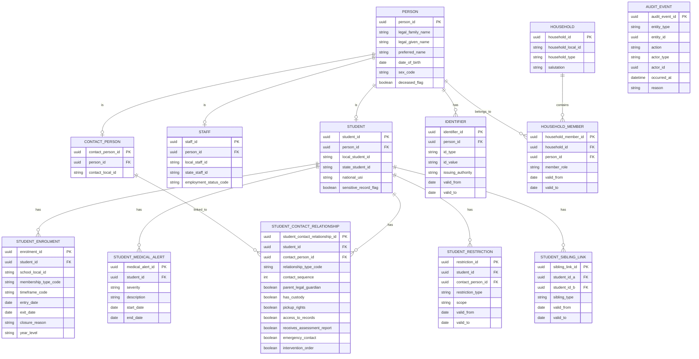

# Reverse-engineering the Core SIS/MIS Data Model in Australian K–12 Schools

## Executive summary

Australian K–12 school information systems (SIS/MIS) converge on a *person-and-relationship* data model: (a) canonical **Person** records (student, staff, parent/carer/other contact), (b) time-bounded **Enrolment** records, and (c) **relationship “join” entities** that carry rights/flags (custody, portal access, “lives with”, emergency contact order, etc.). The closest thing to a nationally-consistent *reference schema* in practice is the Australia profile of the entity["organization","Schools Interoperability Framework","education data interoperability standard"] (SIF AU) Implementation Specification, which defines baseline objects for students, staff, contacts and enrolments and explicitly models contact-to-student relationships with household IDs and role flags. citeturn7view0turn12view1turn15view0turn17view0

Complex family structures are handled by **multiple household memberships** and **multiple contacts per student**, with rights expressed at the *relationship* level (e.g., legal guardian/has custody/pick-up rights/access-to-records). SIF AU formalises those rights as relationship flags (e.g., `ParentLegalGuardian`, `HasCustody`, `PickupRights`, `AccessToRecords`, `EmergencyContact`) and allows a contact to be associated to multiple household IDs. citeturn15view1turn23view0turn25view2

State/territory government ecosystems show strong alignment to these same concepts but with jurisdictional terminology and workflow constraints. Examples: in entity["state","New South Wales","australia state"], the entity["organization","Enrolment Registration Number System","nsw student enrolment database"] (ERN) supports a “family tree” concept and uses an “online access” control designed to immediately prevent parent access in urgent circumstances (including impending court orders), and it gates which parents/carers can see pre-filled enrolment data based on being an “enrolment owner” and having no active court orders. citeturn43view0turn42view2turn42view3 In entity["state","Victoria","australia state"], entity["organization","CASES21","vic govt school admin system"] strongly encodes a “primary family” with “Adult A/B” records that must be complete to satisfy census validation and reporting requirements. citeturn39view0turn38view0 In entity["state","Queensland","australia state"], entity["organization","OneSchool","qld state schools admin system"] is described as having controlled access with authentication and 2FA, and Queensland’s Student Transfer Note explicitly captures custody/guardianship orders and medical action plans as part of safe transfer between schools. citeturn45view2turn46view0

For privacy/security, SIS data contains both **personal information** and often **highly sensitive information** (health, disability adjustments, family violence/court orders, care status). Australian-wide obligations are anchored in the Privacy Act 1988 and the Australian Privacy Principles, as summarised by the entity["organization","Office of the Australian Information Commissioner","australian privacy regulator"]. citeturn50search0turn50search8turn50search4 At the model level, SIF AU’s field-by-field **privacy ratings** (e.g., “Extreme” for medical alerts) are a useful operational proxy for data classification and access control design. citeturn12view1turn23view4

## Research basis and canonical modelling approach

This report “reverse engineers” a canonical SIS/MIS core model by triangulating:

The SIF AU Implementation Specification 3.6.4 (published via entity["organization","Access4Learning","education interoperability org"]), including its baseline objects for StudentPersonal, StudentSchoolEnrollment, StaffPersonal, StudentContactPersonal and StudentContactRelationship, plus its Common Types (PersonInfoType, ContactFlagsType, Household list/contact info types). citeturn6view0turn21view0turn16view5turn15view0turn23view2turn24view0

Jurisdictional government documentation that indirectly exposes the operational model (e.g., NSW enrolment hub controls around court orders and “online access”, Victorian “primary family” validation, Queensland transfer-note fields for custody/medical). citeturn43view0turn39view0turn46view0

Publicly available vendor guidance demonstrating real implementations of split-household support, portal-access scoping, and “multiple families / >2 contacts” semantics. citeturn27view0turn28view3turn27view1

Because many vendor physical database schemas are private, any vendor-specific “table names/columns” below are treated as *inferences from published workflows* rather than confirmed internal DB design; the canonical model is therefore presented as a **normalised, migration-friendly reference** that maps cleanly to SIF AU objects and to common Australian government workflows. citeturn15view0turn17view4turn25view2

## Canonical entity specifications

The entity definitions below are intended to be implementable as relational tables *or* as document/event models provided the cardinalities and constraints are preserved. Field constraints are described as “typical” because implementations vary, but they are grounded in observed constraints from SIF AU and state validation artefacts. citeturn12view1turn15view0turn39view0turn46view0

### Student

**Conceptual scope**  
A student is a person with a locally assigned student identifier and potentially state and national identifiers, plus demographic attributes and flags/alerts (including medical and legal sensitivity markers). SIF AU’s StudentPersonal captures these core concepts (and treats certain alert/medical elements as extremely sensitive). citeturn12view1turn12view6

**Primary identifiers**  
Primary key: `student_id` (UUID).  
Operational identifiers (unique within scope):
- `local_student_id` (required): “locally-assigned identifier” for the student. citeturn12view1  
- `state_student_id` (optional): “state-assigned identifier” (varies by jurisdiction). citeturn12view1turn29search0turn29search3turn29search15  
- `national_unique_student_identifier` (optional): in SIF AU, Commonwealth-assigned USI is modelled as `NationalUniqueStudentIdentifier`. citeturn12view1turn29search6turn29search7  

**Core fields and constraints**

| Field | Type | Req? | Cardinality | Typical constraints/notes |
|---|---:|:---:|:---:|---|
| student_id | UUID | R | 1 | Immutable surrogate key (recommended for migration and audit). |
| local_student_id | string | R | 1 | Required local ID. citeturn12view1 |
| state_student_id | string | O | 0..1 | Jurisdiction-specific; e.g., Victoria’s VSN is a 9-digit unique identifier. citeturn12view1turn29search0 |
| national_unique_student_identifier | string | O | 0..1 | SIF AU models Commonwealth USI; format/coverage evolving in schools USI context. citeturn12view1turn29search6turn29search7 |
| person_name_legal | string components | R | 1 | SIF PersonInfo requires `Name` (type LGL). citeturn23view2 |
| preferred_name | string | O | 0..1 | Often stored as alias/other name; SIF supports `OtherNames`. citeturn23view2 |
| date_of_birth | date | R (practically) | 1 | Typically required for enrolment records and dedupe; Victoria enrolment records require DOB. citeturn29search8 |
| sex/gender_code | enum/string | O | 0..1 | Frequently constrained to a code set; implementations vary. citeturn23view2 |
| addresses | structured | O | 0..n | SIF PersonInfo supports AddressList. citeturn23view2 |
| phones/emails | structured | O | 0..n | SIF PersonInfo supports PhoneNumberList and EmailList. citeturn23view2 |
| alert_messages | list(text, type) | O | 0..n | SIF supports AlertMessages for student, including legal alerts. citeturn12view1turn23view3 |
| medical_alert_messages | list(text, severity) | O | 0..n | SIF supports MedicalAlertMessages with severity levels. citeturn12view1turn23view4 |
| sensitive_record_flag | boolean | O | 0..1 | SIF’s `Sensitive` flag exists for court/custody/restriction scenarios. citeturn12view6 |

**Privacy/security considerations**  
Student data combines routine personal information with high-sensitivity categories (health, disability adjustments, legal risk markers). SIF explicitly rates student medical alerts as “Extreme” sensitivity and includes a student-level “Sensitive” indicator for court/custody/risk restrictions. citeturn12view1turn12view6turn23view4 Model-level controls should support field-level segregation (e.g., medical/legal) and strict access logging consistent with APP principles. citeturn50search0turn50search4

### Staff

**Conceptual scope**  
Staff are persons with employment status and school assignment context. SIF AU’s StaffPersonal defines a staff person with local/state IDs and PersonInfo, plus an employment status field. citeturn21view0

**Primary identifiers**  
Primary key: `staff_id` (UUID).  
Operational identifiers:
- `local_staff_id` (required): locally-assigned staff identifier. citeturn21view0  
- `state_staff_id` (optional): state-assigned identifier. citeturn21view0  

**Core fields and constraints**

| Field | Type | Req? | Cardinality | Typical constraints/notes |
|---|---:|:---:|:---:|---|
| staff_id | UUID | R | 1 | Immutable surrogate key. |
| local_staff_id | string | R | 1 | SIF StaffPersonal LocalId is mandatory. citeturn21view0 |
| state_staff_id | string | O | 0..1 | Jurisdiction-specific. citeturn21view0 |
| person_info | structured | R | 1 | SIF PersonInfo is mandatory. citeturn21view0turn23view2 |
| employment_status | enum | O | 0..1 | SIF `EmploymentStatus` exists. citeturn21view0 |
| school_assignment_context | structured | O | 0..1 | SIF “MostRecent” assignment container exists. citeturn13view3 |

**Privacy/security considerations**  
Staff records mix personal information with HR-like attributes. Apply role-based access and least privilege, and avoid exposing staff private contact details to broader audiences unless explicitly required. The APPs require “open and transparent management” and appropriate security; staff data should be covered by consistent policy and audit. citeturn50search0turn50search4

### Parent/carer and other contacts

**Conceptual scope**  
Australian SIS commonly treat “parent/guardian/carer/emergency contact” as a **Contact Person** associated to a student via a **relationship record**. SIF AU formalises this via StudentContactPersonal (the contact person) and StudentContactRelationship (the association). citeturn16view5turn15view0

**Primary identifiers**  
Primary key: `contact_person_id` (UUID).  
Operational IDs:
- `contact_ref_id` (UUID/GUID in SIF) as an interchange key. citeturn16view3  
- `contact_local_id` (optional and may not be unique): SIF notes LocalId may be used as a person ID and can appear in multiple StudentContactPersonal instances. citeturn16view5  

**Core contact fields and constraints**

| Field | Type | Req? | Cardinality | Typical constraints/notes |
|---|---:|:---:|:---:|---|
| contact_person_id | UUID | R | 1 | Immutable surrogate key. |
| contact_local_id | string | O | 0..1 | Not guaranteed unique across contacts. citeturn16view5 |
| person_info | structured | R | 1 | SIF PersonInfo mandatory. citeturn16view5turn23view2 |
| other_ids | list | O | 0..n | SIF `OtherIdList` supports alternate IDs. citeturn16view5 |
| employment_type / education | codes | O | 0..1 | SIF includes EmploymentType and education-related fields. citeturn16view10 |
| WWCC eligibility (contextual) | structured | O | 0..1 | SIF has WorkingWithChildrenCheck type for some contacts. citeturn13view7 |

**Relationship entity (contact ↔ student)**  
The join entity is where *custody, access rights, emergency order* and *household linkage* live.

| Field | Type | Req? | Cardinality | Typical constraints/notes |
|---|---:|:---:|:---:|---|
| student_contact_relationship_id | UUID | R | 1 | SIF uses a GUID for the relationship itself. citeturn15view0 |
| student_id | UUID | R | 1 | Relationship references the student. citeturn15view0 |
| contact_person_id | UUID | R | 1 | Relationship references the contact person. citeturn15view0 |
| relationship_type | code | R | 1 | Relationship category (e.g., mother/father/guardian/carer). citeturn15view0 |
| household_ids | list(string) | O | 0..n | SIF allows list of household IDs on the relationship. citeturn15view1turn23view0 |
| contact_flags | booleans | C | 0..1 | Flags define role rights (guardian/custody/pickup/access/etc). At least one must be “Yes”. citeturn15view4turn25view1 |
| emergency_contact_sequence | integer | O | 0..1 | “Order in which person should be contacted.” citeturn14view5 |
| preferred_contact_method | code | O | 0..1 | SIF includes ContactMethod. citeturn14view5 |
| fee_percentage | decimal | O | 0..1 | SIF supports FeePercentage for fee responsibility. citeturn14view5 |

**Key “rights” flags (custody/access/emergency)**  
SIF AU’s ContactFlagsType includes: `ParentLegalGuardian`, `PickupRights`, `LivesWith`, `AccessToRecords`, `ReceivesAssessmentReport`, `EmergencyContact`, `HasCustody`, plus others including `InterventionOrder`. citeturn25view2turn25view3turn25view5

**Privacy/security considerations**  
Contact data is personal information, but relationship-level flags can be *exceptionally sensitive* (e.g., intervention orders, “no access to records”, court-order constraints). SIF explicitly carries an `InterventionOrder` flag and a student-level “Sensitive” marker. citeturn25view5turn12view6 Access control therefore must be enforced on the join entity, not just the person record.

### Household

**Conceptual scope**  
A household is a unit of residence/mailing/billing context used to model split families and multi-residence students. SIF AU models “household” primarily as IDs associated to relationships and as per-person household contact info lists (address/phones/emails per household). citeturn23view0turn24view0turn23view2

**Primary identifiers**  
Primary key: `household_id` (UUID).  
Operational IDs: `household_local_id` (string) for imports, matching SIF LocalIdType usage. citeturn23view0

**Core fields and constraints**

| Field | Type | Req? | Cardinality | Typical constraints/notes |
|---|---:|:---:|:---:|---|
| household_id | UUID | R | 1 | Immutable surrogate key. |
| household_local_id | string | R (recommended) | 1 | Stable external ID for migration & linkage. |
| household_type | enum | O | 0..1 | e.g., residential, mailing, billing, “care placement”. |
| address_list | structured | O | 0..n | Household addresses (normalised vs embedded). |
| household_salutation | string | O | 0..1 | SIF HouseholdContactInfoType supports household salutation usage. citeturn24view0 |
| is_primary_for_student | boolean | O | 0..1 | Keep at student-household level if multiple households exist. |

**Household membership (recommended)**  
Use a join table `household_member` (household ↔ person) with effective dates; this is the cleanest way to represent “split households” and to support moving students between residences without losing history.

| Field | Type | Req? | Cardinality | Typical constraints/notes |
|---|---:|:---:|:---:|---|
| household_member_id | UUID | R | 1 | |
| household_id | UUID | R | 1 | |
| person_id | UUID | R | 1 | student or contact person |
| member_role | enum | R | 1 | e.g., student_resident, parent_resident, billing_contact |
| valid_from / valid_to | date | R/O | 1 | effective dating for splits/moves |

**Privacy/security considerations**  
Addresses are highly sensitive for protected persons. NSW specifically provides an “online access flag” to prevent parent access to information in urgent circumstances and irrespective of court-order status, which implies household/address visibility must be dynamically restricted. citeturn43view0turn42view2

### Enrolment record

**Conceptual scope**  
Enrolment is a time-bounded association of a student to a school (and often campus/year-level/homegroup) with entry/exit semantics. SIF AU models this as StudentSchoolEnrollment, referencing student and school IDs, membership type, timeframe, entry/exit dates, and closure reasons. citeturn17view4turn18view5turn19view3

**Primary identifiers**  
Primary key: `enrolment_id` (UUID).  
Alternate identifier: `enrolment_local_id` (optional local enrolment identifier). citeturn17view4turn17view8

**Core enrolment fields and constraints**

| Field | Type | Req? | Cardinality | Typical constraints/notes |
|---|---:|:---:|:---:|---|
| enrolment_id | UUID | R | 1 | SIF uses RefId for enrolment. citeturn17view4 |
| student_id | UUID | R | 1 | references student. citeturn17view4 |
| school_id | UUID/string | R | 1 | SIF uses SchoolInfoRefId. citeturn17view4 |
| membership_type | code | R | 1 | enrolment type. citeturn17view4 |
| timeframe | code | R | 1 | used to identify “current” status. citeturn17view8 |
| entry_date | date | R | 1 | start of enrolment validity. citeturn17view9 |
| exit_date | date | C | 0..1 | required if exited or closure reason exists. citeturn18view5turn19view3 |
| record_closure_reason | enum | O | 0..1 | includes EndOfYear, SchoolExit, etc. citeturn19view3 |
| year_level | code/string | O | 0..1 | year/academic level. citeturn17view11 |
| class_code/test_level | string/code | O | 0..1 | SIF includes NAPLAN registration fields (ClassCode, TestLevel). citeturn18view0 |

**Privacy/security considerations**  
Enrolment history can reveal location and movement. When paired with custody restrictions, “destination school” details are also sensitive; SIF includes transfer destination fields and exit semantics. citeturn19view5turn19view3

### Identifiers (cross-cutting)

**Conceptual scope**  
Australian SIS must carry multiple identifiers for the same entity: local IDs, state-level IDs, national identifiers, sector/diocese IDs, platform IDs (assessment, portal), and sometimes identity assertions for SSO.

SIF AU formalises this through LocalId, StateProvinceId, NationalUniqueStudentIdentifier, ElectronicIdList, OtherIdList across student/staff, and OtherIdList for contacts. citeturn12view1turn21view0turn16view5

**Jurisdictional examples (student IDs)**
- Victoria: VSN is a nine-digit unique identifier. citeturn29search0  
- Western Australia: WASN is required for SCSA student portal access and is administered by SCSA. citeturn29search3turn29search7  
- Queensland: LUI is used (at least for senior secondary contexts) and appears on Queensland’s transfer note as a student number. citeturn29search15turn46view0  

**Privacy/security considerations**  
Identifiers increase re-identification risk and linkability. Treat state/national identifiers as high sensitivity, enforce uniqueness constraints carefully, and avoid displaying them broadly in portals unless required.

### Emergency contacts, medical flags, custody/restrictions, guardianship, siblings, and historical records

These concepts are best modelled as *normalised, effective-dated subdomains* attached to the student and/or student-contact relationship:

Emergency contacts are relationship-driven: SIF includes `EmergencyContact` in ContactFlags and provides a `ContactSequence` to order contact. citeturn25view3turn14view5

Medical flags can be in two layers: (1) short “medical alerts” with severity (SIF MedicalAlertMessages), and (2) longer-form “plans/documents” that often cannot be transferred without contextual revision (Queensland notes that individual/emergency health plans cannot be implemented in a new setting without revision). citeturn23view4turn46view0

Custody/restrictions appear both as relationship rights (HasCustody/AccessToRecords/PickupRights/InterventionOrder) and as student-level sensitivity flags; Queensland explicitly treats family court orders and out-of-home care as transfer-critical custody/guardianship matters. citeturn25view2turn25view5turn46view0turn12view6

Sibling links are frequently derived from shared households or shared guardians; some systems expose sibling details in UI (e.g., Sentral’s profiles roadmap includes sibling details and multi-family support), but explicit sibling-link tables are still recommended for correctness in blended families. citeturn27view0

Historical records involve both **business history** (enrolments, household memberships, relationship changes) and **audit history** (who changed what and when). NSW policy explicitly requires a permanent register of admission maintained on ERN and sets additional retention periods for attendance-related records, which is a strong driver for keeping long-lived historical enrolment and attendance metadata. citeturn41view1

## Modelling split households, restricted access, multiple guardians, sibling linking, and history

### Split households

**Canonical pattern**  
Model split households using:
1) `household` (a stable group),  
2) `household_member` (effective-dated membership), and  
3) `student_contact_relationship.household_ids` (for compatibility with SIF-style relationship tagging). citeturn23view0turn24view0turn15view1

**Why this pattern fits Australian practice**  
SIF AU explicitly allows multiple household IDs on a student-contact relationship and allows persons to carry multiple household contact info blocks, implying that “household” is not a single address but a *set of contextual contact channels* per household. citeturn15view1turn24view0turn23view2

**Business rules and edge cases**
Shared care alternating weeks: represent two active student household memberships with schedules as an optional extension (do not overload “primary address” to express a timetable).  
Student living independently: treat as a household where the student is the sole resident and define contact relationships separately (SIF student model includes an “IndependentStudent” concept; many SIS mirror this). citeturn12view6  
Care placement: model as a special household type with restricted visibility and tightly scoped access.

### Restricted access and safety controls

**Student-level locks**  
NSW’s enrolment hub material describes an “online access flag” designed to immediately prevent parent access to information, explicitly including circumstances where a potential court order is being pursued, and states the flag is a “super flag” regardless of active court order status. citeturn43view0 This is best represented as:
- `student.restricted_visibility = true`
- `student.restriction_reason_code` (e.g., “pending court order”, “family violence risk”)  
- `student.restriction_scope` (portal only vs whole-system)

**Relationship-level rights**  
SIF AU’s contact flags explicitly require modelling “AccessToRecords”, “PickupRights”, “HasCustody”, “ParentLegalGuardian”, and “InterventionOrder” per student-contact relationship. citeturn25view2turn25view5 This supports scenarios where:
- a parent is a legal guardian but does not have pickup rights, or
- a contact is an emergency contact but must not access academic reports.

**Portal scoping example (vendor)**  
Sentral’s portal guidance distinguishes “family access keys” vs “student access keys” and states student keys are used for split families/custody issues, and that holders of student keys “will not be able to see details of the residential guardian.” citeturn28view1turn28view3 This implies the underlying model must (a) distinguish residential vs non-residential guardians and (b) support view-filtering by relationship role.

### Multiple guardians and complex family graphs

SIF AU allows more than two contacts per “family context” and makes guardianship a flag rather than a hard-coded “Parent1/Parent2 only” assumption. citeturn25view2turn15view1 Sentral explicitly notes support for multiple families and more than two contacts per family in its profile view. citeturn27view0

**Canonical rule**  
Do not encode “mother/father” as fixed columns. Instead:
- `student_contact_relationship.relationship_type` (enum)
- `student_contact_relationship.contact_flags.parent_legal_guardian` (boolean)
- `student_contact_relationship.contact_flags.has_custody` (boolean)
- rights matrix (portal, records, pickup, reports)

### Sibling linking

**Two-tier approach**
1) **Derived siblings** (default)  
Derive sibling suggestions from shared guardians or shared household membership (same household_local_id). This mirrors common operational expectations in “family tree” interfaces. citeturn27view1turn42view3  
2) **Explicit sibling links** (authoritative override)  
Persist `student_sibling_link` rows for step/half/foster siblings where derivation may be ambiguous or politically sensitive.

**Edge cases**  
Deceased parent: keep the person record but set relationship end date and a “deceased” marker; ensure the contact is excluded from emergency sequences and portals.  
Anonymous emergency contact: allow “organisation contacts” (hospital, case worker) with minimal fields and no portal identity.

### Historical records and audit/versioning

**Business-history tables (minimum)**
- enrolment history (entry/exit dates, closure reason) aligns with SIF enrolment semantics including record closure reason and conditional exit date. citeturn19view3turn18view5  
- household membership history (valid_from/valid_to)
- student-contact relationship history (rights flags and relationship changes over time)

**Audit history drivers**
- NSW requires permanent admission register maintenance in ERN and specifies retention rules for attendance-related records, driving long-lived immutable event logging. citeturn41view1  
- SIF AU states “SIF_Events are reported” for student/staff/contact/enrolment objects—an interoperability signal that change events are a first-class concept even if the internal DB is not event-sourced. citeturn21view0turn16view0turn15view0turn17view2  
- Sentral exposes “past school years” and past roll groups in a student history UI, reinforcing that history is operationally used, not just archived. citeturn27view0  

### Mermaid ER diagram



## Comparative landscape across jurisdictions and major systems

The table below compares how major Australian jurisdictions and widely used platforms represent the requested concepts, based on publicly available documentation. Where a cell states “not publicly specified”, that reflects lack of authoritative public schema disclosure rather than absence of the capability.

| Segment | System / authority | Split households | Restricted access & custody | Multiple guardians | Sibling linking | Historical records |
|---|---|---|---|---|---|---|
| Jurisdiction | entity["organization","NSW Department of Education","state education dept, nsw"] (ERN ecosystem) | ERN has an explicit “family tree” concept and enrolment-owner semantics (implies a family graph rather than single household). citeturn42view3 | “Online access flag” to prevent parent access urgently; court orders affect visibility; access to pre-fill requires being an enrolment owner and no active court orders. citeturn43view0turn42view2turn43view2 | Implied by “family tree” and enrolment-owner role; not limited to two contacts in the NSW material. citeturn42view3 | Not explicitly specified in NSW enrolment hub material. | Admission register retained permanently on ERN; additional retention rules for attendance records. citeturn41view1 |
| Jurisdiction | entity["organization","Department of Education (Victoria)","state education dept, vic"] (CASES21) | Encodes a “primary family” with Adult A/B; “primary family daisy chain” implies a structured family unit. citeturn39view0turn38view0 | Validation and reporting depend on completeness of primary family adults; broader custody-order handling referenced in Victorian enrolment guidance (policy level). citeturn39view0turn34search4 | Primary family supports at least Adult A/B; complex scenarios beyond that depend on local practice and system extensions. citeturn39view0 | Not explicitly specified in cited CASES21 artefacts. | Enrolment records include enrolment dates and leaving date; student transfers between government schools require transfer through CASES21. citeturn29search8turn34search2 |
| Jurisdiction | entity["organization","Queensland Department of Education","state education dept, qld"] (OneSchool) | Not publicly specified at schema level; transfer artefacts imply separated-parent handling via custody/guardianship section. citeturn46view0 | OneSchool described with controlled access (authorised staff, authentication, 2FA); transfer note captures “formal legal arrangements… Family Court Orders” and OOHC. citeturn45view2turn46view0 | Not publicly specified at schema level; custody/guardianship matters are explicitly collected. citeturn46view0 | Not specified. | Transfer records formalised by Student Transfer Note; OneSchool access procedure requires monitoring and reporting of misuse. citeturn46view0turn45view1 |
| Jurisdiction | entity["organization","Department of Education Western Australia","state education dept, wa"] (SIS + SCSA identifiers) | WA SIS described as used by most government schools to store/maintain records for enrolments, absences, transfers, behaviour. citeturn48search5 | Attendance procedures reference SIS codes (staff-only details); WA student number (WASN) is required for student portal access; “Schools USI” initiative referenced. citeturn48search9turn29search3turn29search7 | Not specified publicly. | Not specified. | SIS central to enrolment/absence/transfer recordkeeping per WA records commission note. citeturn48search5 |
| Jurisdiction | entity["organization","Department for Education (South Australia)","state education dept, sa"] (EDSAS / EMS transition) | EDSAS Student Module includes Family Information and Relations tasks, implying explicit family graph modelling. citeturn48search2turn47search16 | EDSAS includes Custody Details, Emergency Contacts, Medical Conditions, Permission Details as explicit tasks; enrolment form states collection for emergency contact and health requirements (and references privacy principles). citeturn47search16turn48search10 | Relations + custody tasks imply multi-guardian support; exact cardinality not published. citeturn47search16 | Relations task explicitly exists. citeturn47search16 | Not specified publicly. |
| Jurisdiction | entity["organization","Department for Education, Children and Young People","state education dept, tas"] (plus senior secondary scope) | Not publicly specified for departmental SIS; senior secondary certification uses TASC TRACS. citeturn48search4 | Not publicly specified at SIS-schema level in cited sources. | Not specified. | Not specified. | TRACS manages student administration/examination/certification data (senior secondary scope). citeturn48search4 |
| Jurisdiction | entity["organization","ACT Education Directorate","state education dept, act"] | Student Movement Register supports uploading enrol/leave movements and looking up enrolling student ID numbers. citeturn47search18 | Not publicly specified at schema level; MAZE is referenced as an administration system in ACT contexts. citeturn47search6turn47search14 | Not specified. | Not specified. | Student Movement Register implies movement history tracking across schools. citeturn47search18 |
| Jurisdiction | entity["organization","Northern Territory Department of Education","state education dept, nt"] (SAMS) | Not specified. | SAMS described as standard student administration system used in all NT government schools to manage enrolment, attendance and behaviour. citeturn47search7 | Not specified. | Not specified. | SAMS scope includes enrolment/attendance/behaviour; NT attendance procedures reference mandated student administration system. citeturn47search7turn47search19 |
| Vendor | entity["company","Sentral Education","australian sis vendor"] | Explicit support for “multiple families” and “more than 2 contacts per family” in contact display; split-household behaviour noted (family phone field copied on split). citeturn27view0turn27view1 | Portal keying distinguishes custody-issue cases; student keys used for split/custody scenarios and hide residential guardian details. citeturn28view1turn28view3 | Explicitly more than two contacts and multiple families. citeturn27view0 | Sibling details are an explicit feature area in profile roadmap. citeturn27view0 | Student profile includes past school years/roll groups in “Student History”. citeturn27view0 |
| Vendor | entity["company","Compass Education","school management software company"] | Not publicly specified at schema level in cited sources. | Parent-facing materials indicate families can update emergency contact and family details (implies a maintained contact/relationship model). citeturn26search8 | Not specified. | Not specified. | Not specified. |
| Vendor | entity["company","Simon Schools","k-12 admin platform vendor"] | Not publicly specified at schema level in cited sources. | Parent access provisioning is described as derived from student parent/guardian contacts and can be modified by school (implies explicit guardian relationship and access flags). citeturn26search10turn26search22 | Implied by “parent/guardians” model. citeturn26search10 | Not specified. | Not specified. |
| Vendor | entity["company","PowerSchool","student information system vendor"] (eSchoolPlus) | Not publicly specified in Australian-government context; product positioned as SIS. citeturn49search12 | Not specified. | Not specified. | Not specified. | Not specified. |

## Migration, integration, validation and import strategy

### Recommended import order

The safest order is to load “identity and structure” first, then people, then relationships, then high-sensitivity overlays:

```mermaid
flowchart TD
  A[Reference data: schools, campuses, year levels, code sets] --> B[Persons: students, staff, contacts]
  B --> C[Identifiers: state/national/local/portal IDs]
  B --> D[Households]
  D --> E[Household memberships (effective-dated)]
  B --> F[Student-contact relationships + rights flags]
  B --> G[Enrolments (entry/exit history)]
  F --> H[Emergency contact ordering]
  B --> I[Medical alerts + plans metadata]
  F --> J[Custody/restrictions + access controls]
  B --> K[Sibling links (explicit overrides)]
  B --> L[Audit history backfill (optional)]
```

This ordering matches SIF AU’s dependency graph: StudentContactRelationship references both StudentPersonal and StudentContactPersonal; StudentSchoolEnrollment references StudentPersonal and SchoolInfo. citeturn15view0turn17view4

### Mapping templates and transformation rules

A pragmatic migration uses “source→canonical” mapping templates per entity type. Below is a compact example template format (extend as needed):

| Canonical field | Source field(s) | Transform | Validation | Conflict handling |
|---|---|---|---|---|
| student.local_student_id | StudentID / LocalId | trim, preserve leading zeros | non-empty | if duplicate: treat as same student only if DOB+name match, else quarantine |
| student.state_student_id | VSN / WASN / state ID | strip spaces | format per state | prefer state ID over local when merging |
| student.national_usi | USI | uppercase | pattern & checksum if available | never overwrite non-null with null |
| contact.relationship.has_custody | custody flag | map Y/N/Yes/No | boolean only | if conflicting sources: choose most recent & require manual review |
| contact.relationship.access_to_records | “portal access”/records access | map to boolean | boolean only | if “restricted” anywhere, restrict until resolved |

Where state artefacts define validation expectations, treat those as “golden” constraints for that domain. For example, Victorian census validation requires immunisation status to be recorded and adult A/B primary-family details to be complete when present; these patterns should be captured as validation rules in migration pipelines. citeturn38view0turn39view0

### Conflict resolution rules

Use a deterministic precedence ladder for matching and merging:

1) National identifiers (when available and authoritative)  
SIF models a `NationalUniqueStudentIdentifier` for students; treat it as globally unique if used. citeturn12view1  
2) State-issued IDs (where statewide uniqueness is defined)  
Example: Victoria’s VSN is a unique identifier. citeturn29search0  
3) Jurisdictional programme IDs (e.g., QLD LUI, AIMS ID)  
Queensland’s transfer note captures both LUI and AIMS ID as identifiers; treat these as strong alternate keys within Queensland processes. citeturn46view0  
4) Local student ID + DOB + legal name (fallback)

For contacts (parents/carers), use:
- stable external contact ID if present, else
- email + name + phone (soft match), else
- name + DOB (if captured) + address (soft match)

If any record is under a “sensitive”/restricted marker, default to *least disclosure* until manual adjudication. SIF provides a student-level “Sensitive” flag and relationship-level access controls; NSW provides a portal-level “online access” override flag. citeturn12view6turn25view2turn43view0

### Data validation rules

A robust Australian K–12 validation set typically includes:

Student core identity  
DOB present and not in the future; legal name present. Victorian enrolment records require at least name and DOB and include address and parent/carer contact details at time of enrolment. citeturn29search8  

Enrolment date integrity  
Enrolment entry_date ≤ exit_date; exit_date required when enrolment is closed (SIF: exit date required when exited or has closure reason). citeturn18view5turn19view3  

Emergency contacts  
At least one emergency contact relationship flagged and an integer contact order if multiple exist; SIF supports both `EmergencyContact` flag and `ContactSequence`. citeturn25view3turn14view5  

Medical alerts  
If critical medical condition exists, ensure an alert exists with severity and a linked plan reference; SIF’s medical alert type requires severity and supports an “Unknown” severity to avoid false precision. citeturn23view4turn12view1 Queensland transfer artefacts require action-plan presence to be captured and attached when applicable. citeturn46view0  

Custody/guardianship orders  
If “court order/intervention order/out-of-home care” exists, ensure:  
- student.sensitive_record_flag = true  
- at least one restricted relationship flag is set (e.g., `AccessToRecords=false`),  
- portal visibility is constrained (e.g., NSW “online access flag” where relevant). citeturn46view0turn25view2turn43view0  

### Recommended test cases

The following test cases are designed to validate both relational integrity and real-world policy constraints:

A student with two concurrent households (week-on/week-off) where each parent is a legal guardian, but only one has pickup rights. Validate that pickup restrictions do not suppress academic report access unless explicitly set. citeturn25view2turn25view3  

A student with a court order and NSW-style “online access flag” enabled: confirm that portal identity provisioning is blocked even if the parent is otherwise linked, and that restrictions supersede normal enrolment-owner display. citeturn43view0turn42view2  

A Queensland transfer where custody orders exist and medical action plan is “Yes”: ensure plan metadata attaches and that receiving-school visibility is restricted to authorised staff only. citeturn46view0turn45view2  

Victorian “primary family” Adult B partially populated: verify migration either completes required fields or removes the adult record (mirroring CASES21 validation hints). citeturn39view0  

Sentral-like multi-family: student has two family groups and three contacts in one family; verify relationship cardinality and that more than two contacts do not break downstream exports. citeturn27view0  

Emergency contact is an organisation (“local hospital”) with no DOB and minimal fields: ensure it can be stored as a contact person and linked with emergency flag and contact order, but cannot receive portal identity. citeturn25view3turn14view5  

Deceased parent: keep contact record, set deceased flag, ensure the person is excluded from contact ordering and portal keys, and ensure historical links remain queryable.  

### Sample CSV and JSON import schemas

The schemas below are canonical and migration-oriented (they are not vendor-specific exports).

#### Student CSV

```csv
student_id,local_student_id,state_student_id,national_usi,legal_family_name,legal_given_name,preferred_name,date_of_birth,sex_code,sensitive_record_flag
```

#### Student JSON (example shape)

```json
{
  "student_id": "uuid",
  "local_student_id": "string",
  "state_student_id": "string|null",
  "national_usi": "string|null",
  "name": { "family": "string", "given": "string", "preferred": "string|null" },
  "date_of_birth": "YYYY-MM-DD",
  "sex_code": "string|null",
  "sensitive_record_flag": true
}
```

#### Contact person CSV

```csv
contact_person_id,contact_local_id,legal_family_name,legal_given_name,email,mobile_phone,date_of_birth,deceased_flag
```

#### Student–contact relationship CSV

```csv
student_contact_relationship_id,student_id,contact_person_id,relationship_type_code,contact_sequence,parent_legal_guardian,has_custody,pickup_rights,access_to_records,receives_assessment_report,emergency_contact,intervention_order,household_local_ids
```

#### Household CSV

```csv
household_id,household_local_id,household_type,salutation
```

#### Household membership CSV

```csv
household_member_id,household_id,person_id,member_role,valid_from,valid_to
```

#### Enrolment CSV

```csv
enrolment_id,student_id,school_local_id,membership_type_code,timeframe_code,entry_date,exit_date,closure_reason,year_level,class_code,test_level
```

#### Medical alert CSV

```csv
medical_alert_id,student_id,severity,description,start_date,end_date
```

#### Restriction CSV

```csv
restriction_id,student_id,contact_person_id,restriction_type,scope,valid_from,valid_to,notes
```

#### Sibling link CSV

```csv
sibling_link_id,student_id_a,student_id_b,sibling_type,valid_from,valid_to
```

## Interoperability standards and priority sources

### Standards commonly encountered in Australian school integrations

SIF AU (SIF Australia profile)  
SIF AU provides a detailed object model for student, staff, contact, and enrolment interchange, including relationship flags for custody/access and privacy-rated fields, and is therefore the most practical baseline when “reverse engineering” a cross-vendor SIS model. citeturn15view0turn12view1turn25view2turn23view2

OneRoster  
The entity["organization","1EdTech Consortium","education interoperability standards"] OneRoster specification is designed to securely share class rosters and related data between a SIS and other systems (often an LMS) and supports CSV exports and REST-based exchanges. citeturn50search1turn50search9

Ed-Fi  
The entity["organization","Ed-Fi Alliance","k-12 data standard org"] data standards focus on K–12 information related to students and academic performance and are widely used internationally as an interoperability model; in Australia they are more commonly referenced in analytics/data-warehouse contexts than as an “out-of-the-box” school SIS standard, but they remain a relevant reference model. citeturn50search2turn50search10

National reporting and collections (My School / student background / NAPLAN)  
My School reporting is managed by ACARA and publishes available data on registered schools; ACARA operates formal data access and reporting programmes, including student background data collections used to compute SEA and language-background measures. citeturn50search15turn50search3turn50search11  
NAPLAN-related SIS integration commonly manifests as enrolment/enrolment-context fields used for registration (e.g., class code and test level values 3/5/7/9 in SIF AU enrolment). citeturn18view0turn46view1

### Privacy/security guidance sources to prioritise

Australian Privacy Principles and Privacy Act guidance  
The OAIC describes the Australian Privacy Principles as the cornerstone of privacy protection under the Privacy Act 1988 and publishes interpretative guidelines. citeturn50search0turn50search4turn50search8

State/sector privacy and system access policies  
Queensland’s OneSchool public description ties information handling to the Information Privacy Act 2009 (Qld) and describes strong access controls (authorised staff only, authentication and 2FA). citeturn45view2turn29search2  
Queensland also publishes an explicit OneSchool access management procedure outlining monitoring and breach handling expectations. citeturn45view1  
South Australian enrolment documentation indicates explicit collection purposes including emergency contact and health requirements, and references privacy principles and contractor confidentiality/disposal obligations. citeturn48search10  
NSW documentation shows explicit mechanisms to prevent parent access where safety/legal risks exist (online access flag; court-order visibility effects), which should be treated as “high priority” requirements during migration into any SIS. citeturn43view0turn42view3

### Priority sources to consult for a real implementation

For a production-grade reverse engineering effort, the highest-yield primary sources in English are:

SIF AU implementation specification and code sets for object-by-object field semantics, particularly StudentPersonal, StudentContactRelationship (ContactFlags), and StudentSchoolEnrollment. citeturn12view1turn15view0turn17view4turn25view2

State government “system-of-record” artefacts that reveal hard constraints (e.g., NSW ERN online access and admission register retention; Victorian primary family validation; Queensland transfer note custody/medical fields). citeturn41view1turn39view0turn46view0turn43view0

Vendor portal/access documentation for practical access scoping under split households and custody restrictions (e.g., Sentral’s differentiation between “family keys” and “student keys”). citeturn28view1turn28view3

ACARA reporting and student background data standards where interoperating with national reporting pipelines is in scope. citeturn50search3turn50search11

