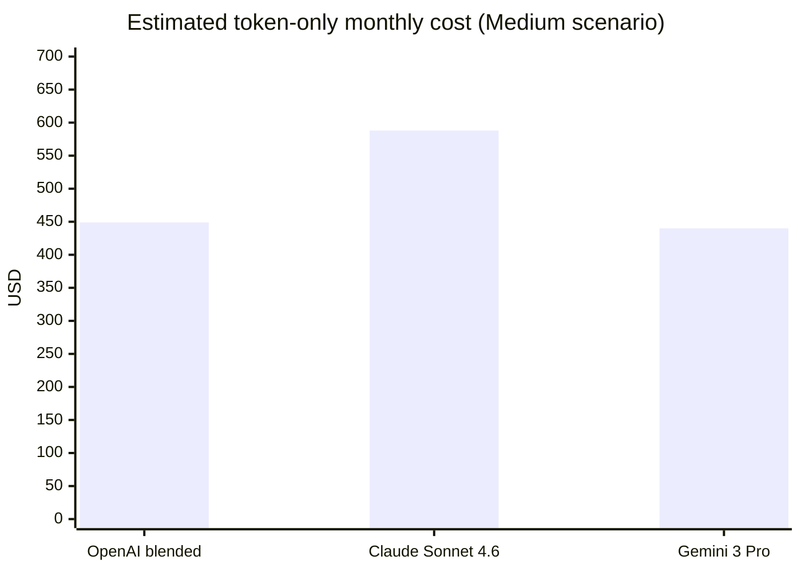
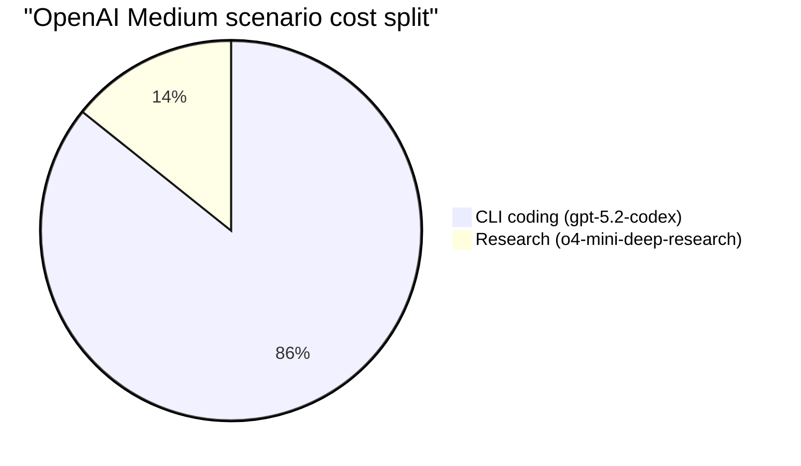
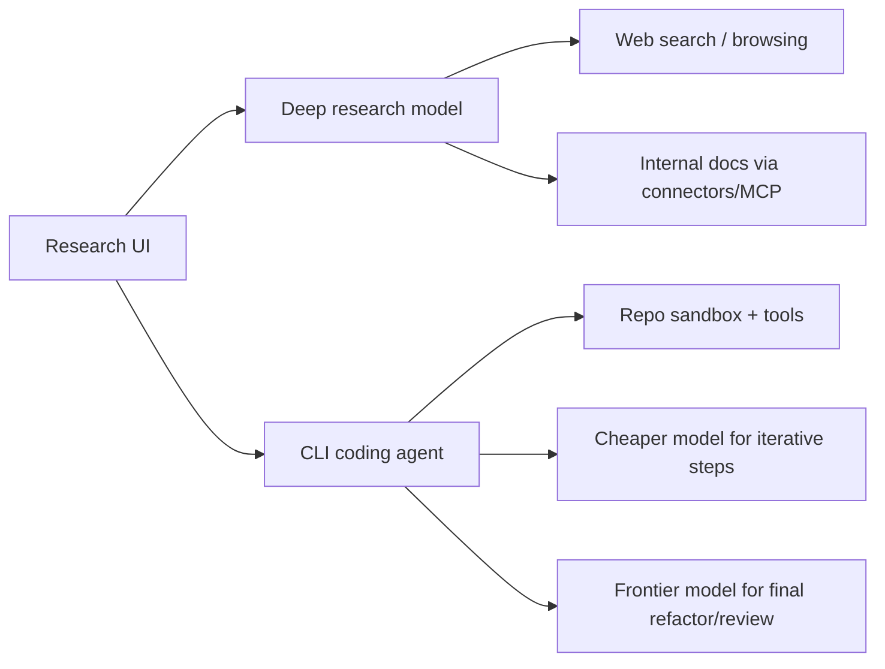

# Single-User AI Setups for Macquarie ICT: Research and CLI Coding Vendor Comparison

## Executive summary

This report evaluates single-user (one-person account) AI setups suitable for use inside entity["organization","Macquarie University","sydney, nsw, au"] ICT workflows, centered on two workloads: (a) research (longform synthesis with citations, browsing, and document ingestion) and (b) CLI coding agents (repo refactors, test generation, code review, and multi-step automation). Findings reflect vendor documentation available as of **February 24, 2026 (Australia/Sydney)**.

The most important constraint you raised—**whether inference can be guaranteed to run on Australian soil**—splits the landscape:

- **OpenAI**: Australia **data-at-rest** residency is available for ChatGPT Enterprise/Edu, but **inference residency is currently only available in the US and Europe** (not Australia).citeturn7view0 For the OpenAI API, Australia supports **regional storage but not regional processing** (i.e., inference is not guaranteed in Australia).citeturn9view0  
- **Anthropic**: Claude API “inference geo” controls offer **US-only** or **global** routing; **Australia is not available** as an inference geo, and “workspace geo” (data-at-rest/processing for certain endpoints) is **US-only**.citeturn13view0  
- **Google**: The **Gemini Developer API is global** (requests handled in a global pool).citeturn16view3 For **Vertex AI**, Google provides explicit guarantees: **ML processing occurs within the region (or multi-region) where the request is made**, and data stored at rest stays in the chosen location. This includes **Australia (australia-southeast1)** for many Gemini models.citeturn17view0turn16view0  
- **Azure (Microsoft Foundry / Azure OpenAI)**: Standard deployments process prompts/responses **within the customer-specified geography** (and may move between regions *within* that geography for operational reasons); global and data-zone deployments relax this.citeturn20view0 Azure has Australia regions (e.g., Australia East and Australia Southeast).citeturn19view2  
- **AWS Bedrock**: Amazon Bedrock states it **doesn’t store/log prompts and completions and doesn’t use them to train AWS models**, and model providers don’t access customer prompts/completions.citeturn14view1 AWS also introduced **Australia geo cross-region inference** profiles for select Claude models where routing stays **within Australia** (between Sydney and Melbourne).citeturn14view0

On capability and workflow fit:

- For **research-first** work that matches “ChatGPT Deep Research”-style output, OpenAI’s deep research models are purpose-built for browsing + synthesis and explicitly support web search, remote MCP servers, and file search over internal vector stores.citeturn26search7turn26search0  
- For **CLI coding-first** workflows, the most mature “agentic repo” experiences are: Claude Code (token-aware, multi-step repo edits; strong cost controls)citeturn22view0, OpenAI Codex CLI (open source; integrates with Codex models and can run tasks from the terminal)citeturn0search1turn26search4, and Gemini CLI (open source; ReAct loop; integrates with MCP servers; supports using a Gemini API key/pay-as-you-go).citeturn5view3  
- **Consumer subscriptions** (ChatGPT Plus/Business; Claude Pro/Max; Gemini for individuals) can be convenient for a single person, but **data-sovereignty guarantees typically require cloud regional endpoints (Vertex/Azure/AWS)** and/or enterprise-grade contracts, not consumer tiers.citeturn7view0turn13view0turn17view0

Cost modeling (token-only) shows that at high usage, vendor choice matters less than **model tiering and routing** (using smaller models for everyday tasks, escalating to frontier models only when needed). Using official token prices, a “Medium” mixed workload estimate yields roughly **$440–$588/month** across Gemini 3 Pro vs Claude Sonnet 4.6 vs OpenAI (Codex + deep research), under defined assumptions.citeturn32search3turn11view1turn29view3turn26search3

## Evaluation framework and assumptions

This comparison uses a consistent vocabulary for “data residency”:

- **Inference location**: where **model compute (ML processing / GPU execution)** occurs. This is the key for “inference on Australian soil.” OpenAI distinguishes “inference residency” (GPU execution in-region) from data residency (storage at rest).citeturn7view0  
- **Data-at-rest residency**: where stored artifacts (chat history, files, embeddings, stored conversation state, etc.) are kept.citeturn7view0turn17view0  
- **Routing / global endpoints**: some vendors offer “global” routing for availability; this generally **breaks strict single-country inference requirements**. For example, Anthropic’s “global” inference_geo can run anywhere.citeturn13view0

Assumptions (explicit, because exact usage varies by user and repo):

- Token-cost scenarios are **token-only** (input/output), excluding: enterprise seat fees, cloud networking, storage, logging, incidentals, and any vendor-specific tool-call charges (e.g., web search fees).  
- Costs use official list prices (USD) for representative models:
  - OpenAI CLI coding: **gpt-5.2-codex** (400k context).citeturn25search1turn32search3  
  - OpenAI research: **o4-mini-deep-research** (200k context).citeturn26search1turn26search3  
  - Anthropic: **Claude Sonnet 4.6** pricing (and note that “regional endpoints” on some third-party platforms add a 10% premium for Claude 4.5+ models).citeturn11view1  
  - Google: **Gemini 3 Pro Preview** pricing.citeturn29view3  
- If “Australian soil inference” is mandated, the practical implementations considered are **Vertex AI regional endpoints in Australia**, **Azure geography-bound processing in Australia**, or **AWS Bedrock Australia geo cross-region inference / in-region endpoints**, depending on model availability.citeturn17view0turn20view0turn14view0

## Comparison matrix

| Ecosystem | Research strength (browsing + citations + ingestion) | CLI coding agent maturity | Guaranteed Australian inference? | Australian data-at-rest options | Practical path if “AU inference required” | Notes on training/data use (default posture) |
|---|---|---|---|---|---|---|
| **entity["company","OpenAI","ai company"]** (ChatGPT + Codex + API) | “Deep research” models designed for multi-step research with web search + MCP + file search.citeturn26search7turn26search0 | Codex CLI (open source) + Codex models + “cloud coding agent” positioning in ChatGPT Business.citeturn0search1turn7view2turn25search1 | **No (today)** for Australia. ChatGPT inference residency is **US/EU only**; API “Australia” supports storage but **not regional processing**.citeturn7view0turn9view0 | ChatGPT Enterprise/Edu: Australia at-rest supported.citeturn7view0 | If strict AU inference: **not currently achievable** with OpenAI API/ChatGPT alone (as documented). Potential alternative: run open models locally/other clouds.citeturn9view0 | OpenAI API: data is not used to train by default; 30-day abuse monitoring retention by default; ZDR requires approval.citeturn18search13turn5view4 |
| **entity["company","Anthropic","ai company"]** (Claude + Claude Code + API) | Strong long-context + MCP + web search tool (API) with explicit per-search fees.citeturn25search9turn27search1turn27search0 | Claude Code has detailed cost controls and token visibility (/cost) for API usage; subscription usage is included until limits, then pay-as-you-go (“extra usage”).citeturn22view0turn22view1 | **No** on Claude API: inference_geo is **global or US only**; workspace geo **US only**.citeturn13view0 | Consumer and commercial plans differ; commercial/API retention defaults described separately.citeturn11view2turn13view1 | Use **AWS Bedrock** / **Vertex AI** regional endpoints (where available) for region-bound processing; note 10% premium for regional endpoints for Claude 4.5+.citeturn11view1turn16view2turn14view0 | Consumer Claude can be opted into training with longer retention; commercial/API are excluded from that consumer opt-in scheme.citeturn11view2turn13view1 |
| **entity["company","Google","technology company"]** (Gemini + Vertex AI + Gemini CLI) | Gemini Deep Research Agent exists (priced at Gemini 3 Pro rates, including intermediate tokens); paid vs unpaid tiers differ significantly.citeturn29view3turn6view0 | Gemini CLI is open source, ReAct-based, MCP-capable; can run with Code Assist quotas or Gemini API key.citeturn5view3 | **Yes, if using Vertex AI regional endpoint**: ML processing occurs in the region where request is made (incl. australia-southeast1 for many models). Developer API itself is global pool.citeturn17view0turn16view3 | Vertex AI supports data residency; at-rest stays in chosen location.citeturn17view0 | Use **Vertex AI australia-southeast1** for Gemini workloads that need AU-bound processing; avoid “global” endpoints if strict locality is required.citeturn17view0turn16view1 | Gemini API terms: paid services don’t use prompts/responses to improve products; but logs may be stored transiently/cached in any country.citeturn6view0 |
| **entity["company","Microsoft","technology company"]** (Azure AI Foundry / Azure OpenAI + Copilot) | Strong enterprise grounding patterns (“on your data”), plus broad ecosystem integration; research-style browsing depends on product/feature set. Azure doc focuses on data processing boundaries.citeturn20view0 | GitHub Copilot CLI is available across Copilot plans (policy-controlled if org-managed).citeturn19view3 | **Yes (at geography level)** for standard deployments: processed within customer-specified geography (can move between regions within geography).citeturn20view0 | Azure supports Australia regions.citeturn19view2 | Deploy Azure AI Foundry/Azure OpenAI resources in Australian geography; avoid “Global” deployment types for strict locality.citeturn20view0 | Prompts/completions are not stored in the model and aren’t used to train base models; abuse monitoring/logging has separate controls.citeturn20view0 |
| **entity["company","Amazon Web Services","cloud computing"]** (AWS Bedrock) | Enables RAG/agents and model choice; “research experience” is build-your-own (not a single Deep Research UI). Data protection posture is explicit.citeturn14view1 | CLI experience depends on tooling you run (Claude Code, Gemini CLI, Codex CLI, or custom). Bedrock is a hosting layer.citeturn22view0turn5view3turn0search1 | **Yes, depending on configuration**: in-region endpoints in ap-southeast-2; and “Australia geo” cross-region inference profiles that stay within Australia for select Claude models.citeturn14view2turn14view0 | Region-scoped by design; logs/monitoring are AWS-account scoped.citeturn14view2turn14view3 | Use ap-southeast-2 and region/geo-specific inference profiles; avoid global cross-region inference profiles if locality is required.citeturn14view3turn14view0 | Bedrock states it doesn’t store/log prompts/completions and doesn’t use them to train; model providers don’t access your prompts/completions.citeturn14view1 |

## Vendor deep dive for research and CLI workflows

This section focuses on “what you can do as a single user,” while flagging which controls usually require enterprise procurement or cloud setup.

### OpenAI (ChatGPT + Codex + API)

**Research (browsing, citations, ingestion).** The OpenAI API’s deep research models (**o3-deep-research** and **o4-mini-deep-research**) are explicitly designed to “find, analyze, and synthesize” many sources with web search plus MCP and file-search over vector stores.citeturn26search7turn26search0turn26search1 This aligns closely with your “ChatGPT deep research” target workload. The model spec for o4-mini-deep-research lists a 200k context window and high max output, supporting longform deliverables.citeturn26search1

**CLI coding.** Codex CLI is available as an open-source CLI agent.citeturn0search1 Codex model documentation also describes selecting models in Codex CLI using flags and per-thread selection.citeturn26search4 For high-end repo work, **gpt-5.2-codex** is described as an agentic-coding optimized variant with a 400k context window.citeturn25search1turn32search3

**Data locality reality check (Australia).** OpenAI’s ChatGPT data residency includes **Australia for storage at rest**, but inference residency is currently only **Europe and the United States**.citeturn7view0 On the OpenAI API, the data residency table shows **Australia: regional storage ✅, regional processing ❌**—so you cannot document a guarantee that inference executes on Australian infrastructure via OpenAI’s own regional processing controls.citeturn9view0

**Security and retention (API default).** OpenAI states that API data is not used to train models by default.citeturn18search13 It also documents abuse-monitoring log retention up to 30 days by default, with Zero Data Retention available only for eligible/approved customers under additional requirements.citeturn5view4

### Anthropic (Claude + Claude Code + API)

**Research.** Claude supports MCP connectors (remote MCP servers directly from the Messages API).citeturn27search1 Anthropic also prices a web search tool for the API at **$10 per 1,000 searches**, plus token costs for search content.citeturn27search0 For long-context research and ingestion, Claude’s “1M token context window” is documented as available (beta) for certain org usage tiers, and the context-window docs describe the capability for Opus 4.6 and Sonnet 4.6 (and some earlier).citeturn25search9turn11view1

**CLI coding.** Claude Code provides explicit cost management guidance: it consumes tokens; average daily costs and common monthly ranges are documented; subscriptions include usage, while teams charge by API token consumption.citeturn22view0 Claude’s paid consumer plans can add “extra usage” (pay-as-you-go at standard API rates after included limits).citeturn22view1 This is important for one-person “power user” setups: you can start with a predictable subscription, then allow bounded pay-as-you-go bursts.

**Data locality reality check (Australia).** Anthropic’s “data residency” controls for its **first-party Claude API** currently expose only `inference_geo: "global"` or `"us"`, and “workspace geo” is **US-only**.citeturn13view0 So you cannot guarantee Australian inference using Anthropic’s own API controls. In practice, Australian inference requirements push you to Claude via **AWS Bedrock** or **Vertex AI** regional endpoints. Anthropic’s pricing documentation explicitly notes that AWS Bedrock and Google Vertex AI offer “global endpoints” vs “regional endpoints,” where regional endpoints guarantee routing within specific geographic regions (with a 10% premium for regional endpoints for Claude 4.5+).citeturn11view1

**Security and retention differences (consumer vs commercial).** Anthropic’s consumer Claude plans introduced a choice around training use and longer retention when opted in, with consumer chats/coding sessions potentially retained longer when model-improvement sharing is enabled; the blog notes commercial/API products are excluded from these consumer policy changes.citeturn11view2 For commercial/API users, Anthropic documents standard retention where API inputs/outputs are automatically deleted within 30 days (subject to exceptions like policy violations or negotiated terms).citeturn13view1

### Google (Gemini + Vertex AI + Gemini CLI)

**Research.** Google’s Gemini ecosystem has a “Deep Research Agent” priced at Gemini 3 Pro list rates (including intermediate tokens generated in agentic loops), per the official pricing page.citeturn29view3 For a single user, you can do “research-first” either by calling Gemini models via API/Vertex or by using tools like Gemini CLI, depending on governance needs.

**CLI coding.** Gemini CLI is documented as an open-source AI agent with a ReAct loop, using built-in tools and MCP servers to complete tasks like fixing bugs, creating features, and improving test coverage.citeturn5view3 It can use predefined quotas (through Gemini Code Assist editions) or a Gemini API key for pay-as-you-go.citeturn5view3

**Data locality: the key split (Developer API vs Vertex AI).** The Gemini Developer API is explicitly described as **global access**—requests handled “anywhere in the global pool.”citeturn16view3 In contrast, Vertex AI generative AI data residency documentation states: ML processing occurs **within the region (or multi-region) where the request is made**, and data stored at rest stays in the selected location.citeturn17view0 This includes an Australia region (**australia-southeast1**) for a large set of Gemini models.citeturn17view0turn16view0

**Paid vs unpaid terms matter for privacy.** Gemini API terms state:
- For **paid services**, Google doesn’t use prompts/responses to improve products; processing follows Google’s data processing addendum—but logs are kept for limited time for prohibited use detection and may be stored transiently/cached in any country.citeturn6view0  
- For **unpaid services** (e.g., free AI Studio / unpaid API quota), Google uses submitted content and responses to improve and develop products and ML technologies, and notes human review may occur (with warnings not to submit sensitive info).citeturn6view1  

For a Macquarie ICT “work data” posture, this pushes a single user toward **paid services and/or Vertex AI** rather than unpaid tiers, unless content is strictly non-sensitive.

### Azure + GitHub Copilot (Microsoft Foundry / Azure OpenAI + Copilot CLI)

**CLI coding.** GitHub Copilot CLI is documented as available with all Copilot plans (subject to organization policy settings if managed).citeturn19view3 For a single-user setup, Copilot CLI can be a practical terminal copilot, but it is best evaluated as a **coding accelerator** rather than a deep research engine.

**Data locality controls.** Microsoft’s data privacy documentation for Azure Direct Models states “prompts and responses are processed within the customer-specified geography” (unless using Global or DataZone deployment types), and may move between regions within the geography for operational purposes.citeturn20view0 This is a stronger “Australia boundary” guarantee than what you can currently document from OpenAI’s own API controls for Australia.

**Australian cloud footprint.** Azure’s official region list includes **Australia East** and **Australia Southeast**.citeturn19view2

### AWS Bedrock (as the sovereignty “control plane”)

If the primary goal is “CLI + research” while guaranteeing Australian processing, AWS Bedrock can serve as the **deployment substrate**: keep workloads in-region and run whichever agents/tools you prefer on top.

- **Data protection posture**: Bedrock states it doesn’t store/log prompts and completions and doesn’t use them to train AWS models; model providers do not access Bedrock logs or customer prompts/completions.citeturn14view1  
- **Australian inference profiles**: AWS documents Australia geo cross-region inference profiles that route within Australia (Sydney ↔ Melbourne) for select Claude models, explicitly framed as helping customers process data locally.citeturn14view0  
- **Region endpoints**: AWS lists Bedrock agent endpoints including Asia Pacific (Sydney) (ap-southeast-2).citeturn14view2  
- **Alternative “lower cost” model options in Sydney**: The Bedrock pricing page shows multiple open/partner models priced for Asia Pacific (Sydney), including coder-oriented families such as Qwen3 Coder.citeturn31view3  

## CLI tooling and integration snapshots

image_group{"layout":"carousel","aspect_ratio":"16:9","query":["Claude Code terminal screenshot","OpenAI Codex CLI screenshot","Google Gemini CLI terminal screenshot","GitHub Copilot CLI terminal screenshot"],"num_per_query":1}

A practical single-user setup often uses **two planes**:

- A **research plane** (interactive UI, longform synthesis, citations, doc ingestion, browsing).  
- A **coding plane** (CLI agent that edits repos, runs tests, writes diffs, and can be constrained by sandbox rules).

Key tooling notes from official docs:

- **Codex CLI**: open-source CLI agent; supports choosing models for CLI threads with flags and has an ecosystem of Codex models optimized for agentic coding.citeturn0search1turn26search4turn25search1  
- **Claude Code**: exposes cost visibility and spend controls; `/cost` is meaningful for API usage, while subscriber usage is included in subscription limits; active “agent teams” multiply token usage because each agent instance has its own context.citeturn22view0  
- **Gemini CLI**: open source; ReAct loop; uses local tools and MCP servers; can run under Code Assist quotas or with a Gemini API key.citeturn5view3  
- **MCP integration**:
  - OpenAI deep research models support remote MCP servers and file search over vector stores for grounding.citeturn26search7turn26search0  
  - Anthropic has an MCP connector feature in the Messages API.citeturn27search1  
  - Gemini CLI supports local or remote MCP servers.citeturn5view3  

## Token economics and cost scenarios

### Assumed monthly usage scenarios

These are deliberately simple, but they map well to real “agentic” behavior where input tokens dominate (repo context, diffs, test output, documents, and repeated planning):

- **Low**: 19M input tokens, 6M output tokens  
- **Medium**: 76M input tokens, 24M output tokens  
- **High**: 250M input tokens, 85M output tokens  

Split between “CLI coding” and “Research” (assumption used for the OpenAI blended option):

- Low: CLI 15M in / 5M out; Research 4M in / 1M out  
- Medium: CLI 60M in / 20M out; Research 16M in / 4M out  
- High: CLI 200M in / 70M out; Research 50M in / 15M out  

### Official token prices used

- OpenAI: **gpt-5.2-codex** and **o4-mini-deep-research**.citeturn32search3turn26search3  
- Anthropic: **Claude Sonnet 4.6**.citeturn11view1  
- Google: **Gemini 3 Pro Preview**.citeturn29view3  

### Monthly cost estimates (token-only; USD)

**Low scenario**

| Option | Est. monthly cost | What it represents |
|---|---:|---|
| OpenAI (gpt-5.2-codex for CLI + o4-mini-deep-research for research) | **$112** | Codex-heavy CLI plus separate deep research model calls.citeturn32search3turn26search3 |
| Claude Sonnet 4.6 (single model for both) | **$147** | Single-model approach; excludes web-search fees and any extra usage mechanics.citeturn11view1turn27search0 |
| Gemini 3 Pro (single model for both) | **$110** | Single-model approach at Gemini 3 Pro rates (≤200k prompt tier assumed).citeturn29view3 |

**Medium scenario**

| Option | Est. monthly cost | What it represents |
|---|---:|---|
| OpenAI (gpt-5.2-codex + o4-mini-deep-research) | **$449** | High CLI usage (code context + outputs) plus research usage.citeturn32search3turn26search3 |
| Claude Sonnet 4.6 | **$588** | Single-model approach; note Claude Code may make many tool steps and repeated context.citeturn22view0turn11view1 |
| Gemini 3 Pro | **$440** | Comparable capability tier; excludes any “grounding” tool fees.citeturn29view3 |

**High scenario**

| Option | Est. monthly cost | What it represents |
|---|---:|---|
| OpenAI (gpt-5.2-codex + o4-mini-deep-research) | **$1,550** | Heavy daily agentic coding plus frequent research runs.citeturn32search3turn26search3 |
| Claude Sonnet 4.6 | **$2,025** | Single-model; high output cost dominates.citeturn11view1 |
| Gemini 3 Pro | **$1,520** | Single-model; output price lower than Claude Sonnet 4.6 at list rates.citeturn29view3 |

### Visual summary charts





### Cost levers that matter more than vendor

Across all vendors, the documentation and pricing structures strongly imply that the biggest “bill shock” drivers are **(a) repeated large-context reads**, **(b) verbose outputs**, and **(c) multi-agent parallelism** (multiple simultaneous agent contexts). Claude Code explicitly calls out “agent teams” multiplying context windows and thus token usage.citeturn22view0

A pragmatic single-user strategy is:

- Default to a **mid-tier** model for routine tasks, escalate to frontier only for “hard” work.  
- Use **context caching** (where supported) to reduce repeated prompt costs (not modeled above).citeturn11view1turn28view0turn32search3  
- Keep “research browsing” in a dedicated tool/model rather than running browsing loops inside the coding agent when possible (OpenAI explicitly offers deep research models for that separation).citeturn26search7  

## Architecture options and recommended picks

### Architecture options

```mermaid
flowchart LR
  A[Developer laptop in Australia] --> B[Local LLM runtime]
  B --> C[Codebase + docs on disk]
  B --> D[Local embeddings + RAG index]
  A --> E[Optional: secure proxy / DLP gate]
  E --> F[Cloud LLM endpoint (regional)]
  E --> G[Cloud LLM endpoint (global)]
```

```mermaid
flowchart LR
  A[CLI agent on laptop] --> B[Repo sandbox]
  B --> C[Test runner / linters]
  A --> D[Regional cloud inference in AU]
  D --> E[LLM responses]
  A --> F[Document store (AU region)]
  F --> D
```



### Recommended picks by goal

**Research-first (best “deep research” experience)**  
- **Primary**: OpenAI deep research models (o3-deep-research / o4-mini-deep-research) for browsing + synthesis with MCP/file search support.citeturn26search7turn26search0  
- **If strict AU inference is required**: Google Vertex AI in **australia-southeast1**, using Gemini models with ML-processing-in-region guarantees, combined with your own citation/browsing layer as needed.citeturn17view0turn16view0  

**CLI-coding-first (repo agent productivity)**  
- **Primary**: Claude Code for interactive repo work with strong cost tooling and documented operational guidance.citeturn22view0  
- **Runner-up**: Codex CLI + gpt-5.2-codex for long-horizon refactors and “agentic coding” with large context.citeturn0search1turn25search1  
- **Also credible**: Gemini CLI if you want an open-source ReAct agent with MCP support and flexible auth (quota or API key).citeturn5view3  

**Lowest-risk data sovereignty (strongest “Australia boundary” story)**  
- **Best-documented single-country inference (today): Vertex AI in Australia** where ML processing occurs in the selected region and data stays in the selected location.citeturn17view0  
- **Also strong**: Azure AI Foundry/Azure OpenAI standard deployments scoped to “Australia” geography, noting processing may move between Australian regions for capacity/performance.citeturn20view0turn19view2  
- **For Claude specifically**: AWS Bedrock Australia geo cross-region inference profiles for supported Claude models, designed to keep inference within Australia (Sydney/Melbourne).citeturn14view0  

**Lowest cost at high usage**  
- Don’t pick a single vendor; pick a **tiered routing strategy**:
  - Use mid/cheap models for “iteration loops,” escalate for “final merge-quality” steps.  
  - Consider cloud-hosted lower-cost models in Sydney regions (e.g., Bedrock-hosted coder models priced in Asia Pacific (Sydney)) for high-volume tasks where frontier quality is not required.citeturn31view3  
  - Keep deep research runs bounded (because research models can be both token- and tool-call-heavy).citeturn26search7turn22view1  

## Procurement and test plan for a one-person Macquarie ICT setup

A single-user procurement plan should explicitly separate “trialing capability” from “authorizing data exposure.”

1. **Decide your data classification boundary for AI** (e.g., public/open-source only vs internal-but-non-sensitive vs sensitive/student/staff data). This step is driven by Australian privacy and NSW public-sector privacy obligations (see next section).citeturn24search0turn24search14  
2. **Run a two-lane pilot (2 weeks total, realistic):**
   - Lane A (Research): evaluate at least one deep research workflow (longform report with citations) using your chosen research stack. OpenAI’s deep research models provide a direct benchmark target for “research analyst”-style output.citeturn26search7turn26news39  
   - Lane B (CLI coding): run the same repo task set (refactor, test-gen, code review, bugfix) through Claude Code, Codex CLI, and Gemini CLI; measure diffs quality, test pass rate, and how often the agent needs human steering.citeturn22view0turn0search1turn5view3  
3. **If “AU inference required,” choose your enforcement mechanism**:
   - Vertex AI australia-southeast1 (regional ML processing guarantee).citeturn17view0  
   - Azure “Australia” geography standard deployment types (avoid global deployment types).citeturn20view0turn19view2  
   - AWS Bedrock in-region + Australia geo inference profiles where supported.citeturn14view0turn14view2  
4. **Lock down tool connectivity** (MCP/connectors) with least privilege:
   - Prefer read-only connectors for research indexing; restrict write-capable tools to the repo sandbox; treat browsing as an “external integration” that can fall outside residency boundaries even when data is region-pinned (OpenAI explicitly notes external integrations like web search/MCP can store/process data outside the region).citeturn7view0turn26search7  
5. **Set spend controls and escalation rules**:
   - For Claude Code, start with documented cost tracking and cap spend; be explicit about agent-team concurrency (it multiplies token burn).citeturn22view0turn22view1  
   - For OpenAI API, understand default 30-day abuse monitoring logs and what ZDR approval entails.citeturn5view4turn9view0  
6. **Document an operational policy** (one pager) for Macquarie ICT auditability: “what data allowed,” “where inference runs,” “how logs are handled,” and “how to report an incident.”

## Legal and compliance notes for Macquarie ICT in NSW

You requested “any legal/compliance notes relevant to Macquarie ICT.” This section is not legal advice; it summarizes the highest-impact issues that repeatedly surface in Australian university ICT contexts.

**Australian Privacy Act and APPs.** The Australian Privacy Principles are the core privacy framework under the Privacy Act 1988 for covered entities.citeturn24search0turn24search8 Even if a specific unit’s exact coverage depends on structure, **the APPs are the standard benchmark** for handling personal information in Australian institutional environments.

**Cross-border disclosure risk (APP 8).** If personal information is disclosed to an overseas recipient (including via cloud processing outside Australia), APP 8 can make the Australian entity accountable in certain circumstances for downstream handling by the overseas recipient.citeturn24search1turn24search13 Practically, this means that “inference not on Australian soil” is not just a technical preference; it can become a governance and contractual question.

**NSW privacy law expectations.** The entity["organization","Information and Privacy Commission NSW","nsw privacy regulator"] describes the PPIP Act as outlining how NSW public sector agencies manage personal information.citeturn24search14turn24search2 For a NSW public university setting, Macquarie ICT typically behaves as if it must meet NSW privacy expectations for personal information handling.

**Notifiable Data Breaches (NDB) scheme.** The entity["organization","Office of the Australian Information Commissioner","australian privacy regulator"] explains that entities covered by the Privacy Act must notify affected individuals and OAIC when an eligible data breach is likely to result in serious harm.citeturn24search3 Operationally, any AI vendor/tool that increases the probability of uncontrolled disclosure (e.g., sending sensitive code or student/staff data off-shore without guardrails) increases breach exposure.

**Vendor terms can override your assumptions.** Two examples from vendor primary sources illustrate why procurement must read terms carefully:
- OpenAI: even where ChatGPT data residency is enabled, certain data categories may still be stored/processed outside region (e.g., external integrations like web search and MCP).citeturn7view0  
- Google: for Gemini paid services, prompts/responses aren’t used to improve products—but logs may be stored transiently/cached in any country, which may undermine “Australia-only” intent unless you use Vertex AI with regional ML processing guarantees.citeturn6view0turn17view0  

**Practical compliance takeaway.** If Macquarie ICT needs a defensible position for work data, the most supportable stance is to treat “consumer chat products” as **non-compliant for sensitive data by default**, and use **regional cloud endpoints (Vertex/Azure/AWS)** or **local inference** for anything above “public/open-source” classification, because those are the only paths with explicit location guarantees in vendor documentation today.citeturn17view0turn20view0turn14view0turn9view0

