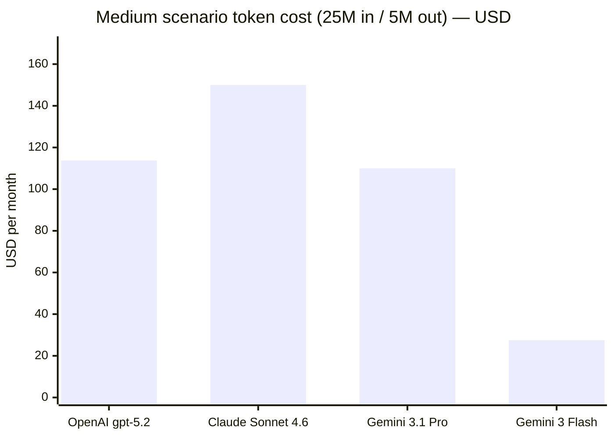
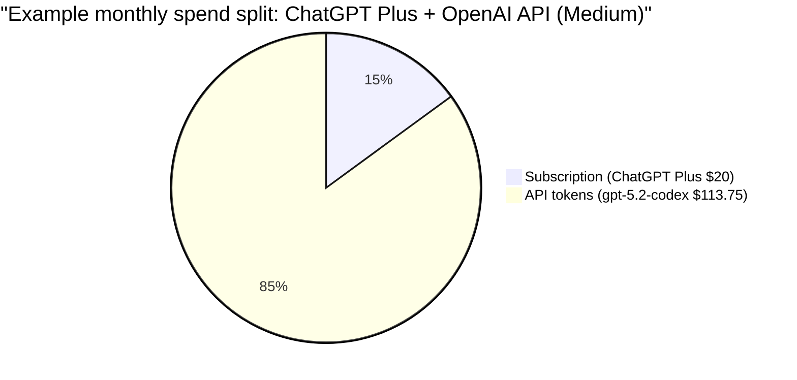

# Single-user AI setups for research and CLI coding in Macquarie University ICT

## Executive summary

**Date:** Feb 24, 2026 (Australia/Sydney)

For a one-person setup inside Macquarie University ICT, you are balancing two competing realities: (1) the best “all-in-one” research experiences tend to live in consumer/pro SaaS plans (ChatGPT / Claude / Gemini), and (2) **strong “Australian-soil inference” guarantees most reliably come from running in an Australian cloud region (Azure / AWS / Google Cloud Vertex) or running locally**—not from consumer SaaS plans. OpenAI explicitly distinguishes “data residency” (storage-at-rest) from “inference residency” (where processing occurs), and **inference residency is not offered for Australia** at the time of writing. citeturn27search3turn32view2

If your **top priority is research quality and longform synthesis with citations + browsing**, OpenAI’s deep research stack (and ChatGPT’s Deep Research product surface) remains the most directly documented as “research analyst–level” browsing + synthesis, including use of web search and MCP connectors and file search over internal vector stores. citeturn27search4turn27search1turn27search6 Google’s Gemini subscriptions in Australia explicitly market Deep Research that can analyze “hundreds of sources,” and they include strong document ingestion limits (e.g., up to 1,500 pages of uploads). citeturn17view0

If your **top priority is CLI coding workflows** (repo tasks, refactors, test generation, code review), the most plan-friendly “single-seat” options are:
- **Claude Pro/Max** (subscription) plus **Claude Code** and optional pay-as-you-go “extra usage” after you hit usage limits, billed at standard API rates. citeturn41view2turn29view0  
- **ChatGPT Plus/Pro** plus **Codex CLI**, which can authenticate with a ChatGPT account or an API key, and is included in several paid ChatGPT plans. citeturn35view2turn9view0turn8view3  
- **Google AI Pro/Ultra** (Australia pricing) which explicitly includes higher daily request limits in **Gemini CLI** and “Gemini Code Assist.” citeturn17view0turn37search2  
- **GitHub Copilot Pro/Pro+** with clear “premium request” quotas and an explicit $0.04/request overage model; Business/Enterprise tiers exist but are less “one-person” unless your org already uses GitHub Enterprise Cloud. citeturn18view3turn20view2  

For **lowest-risk data sovereignty**, the cleanest approach is **hybrid**: keep sensitive code/docs **local (Ollama)** and use **Australian-region inference** in **Azure**, **AWS (Sydney Bedrock)**, or **Vertex AI (Sydney/Melbourne)** for the tasks that need frontier models. Ollama’s FAQ states local runs don’t send prompts/data to the vendor. citeturn24search6 Vertex AI’s data residency doc explicitly says ML processing occurs in the region where the request is made, and data stored at rest remains in the customer-selected location. citeturn45view0

## Plan-first comparison matrix

| Vendor | Best-fit single-user plan(s) to start | Research (browsing, citations, doc ingestion) | CLI/agent workflow (terminal + repo tasks) | AU inference guaranteed “on soil”? | Plan vs API training/retention posture (high-level) | Overage/billing model clarity |
|---|---|---|---|---|---|---|
| **entity["company","OpenAI","ai company"]** | ChatGPT Plus ($20/mo), Pro ($200/mo); Business Free (AU-only) for work account separation citeturn8view2turn9view0turn11view0turn11view2 | Deep Research models explicitly documented for “hundreds of sources,” web search + MCP + file search; strong longform synthesis citeturn27search4turn27search1 | Codex CLI is open source; runs locally; auth via ChatGPT account or API key; included with multiple ChatGPT paid plans citeturn35view2turn27search0 | **No** AU inference residency for ChatGPT; API “regional processing” for AU is explicitly **not** supported (storage-only) citeturn27search3turn32view2 | ChatGPT Pro notes conversations may be used to improve models (opt-out exists); Business Free states no training by default on workspace data citeturn9view0turn11view2 | Consumer plans: “usage limits” but not token-metered; API is pay-as-you-go per token with published rates citeturn8view2turn21search4 |
| **entity["company","Anthropic","ai company"]** | Claude Pro ($20/mo or $17/mo annual), Max (from $100/mo) citeturn41view2 | Research feature in Pro; web search tool also priced for API; strong long-context patterns via Projects/RAG citeturn41view2turn29view1 | Claude Code included in Pro; “extra usage” after plan limit billed at standard API rates; combined across chat + terminal citeturn41view2turn29view0turn29view1 | **No** (direct). Data residency regions are “US” or “global” for Anthropic workspace models citeturn1search1 | Consumer choice can affect retention (longer if you opt in), but default retention remains 30 days; API deletes within 30 days (exceptions) citeturn28search7turn28search1 | Strong: Can buy “extra usage” with caps; overage at standard API per-token pricing citeturn29view0turn41view2 |
| **entity["company","Google","tech company"]** | Australia subscriptions: Google AI Plus ($12.49 AUD/mo), Pro ($32.99 AUD/mo), Ultra ($409.99 AUD/mo) citeturn17view0 | Gemini includes Deep Research; large doc uploads (marketing claims include hundreds of sources and up to 1,500 pages uploads) citeturn17view0 | Gemini CLI is open source; install via npm/brew; can use API key pay-as-you-go; Pro/Ultra include higher daily request limits citeturn37search9turn37search2turn17view0 | **Conditional**: Consumer Gemini app—no explicit AU inference guarantee. **Yes via Vertex AI**: ML processing occurs in-region where request is made; AU regions exist citeturn45view0turn38search0turn38search1 | Gemini Developer API page: Free tier content used to improve products; paid tier content not used citeturn42view0 | Gemini API pay-as-you-go per token with published pricing; subscriptions are quota/feature-tiered, not token-metered citeturn42view0turn17view0 |
| **entity["company","Microsoft","tech company"]** (Azure AI Foundry / Azure OpenAI) | Azure is pay-as-you-go (no “single-seat” plan); pair with GitHub Copilot for seat-based developer UX citeturn26search2turn20view2 | Research features depend on what you build; Azure Direct Models store/process data to provide the service and monitor for abuse citeturn26search2 | Strong for enterprise-grade deployment; for daily CLI coding, most users pair Azure with Copilot/agents rather than raw CLI citeturn20view2 | **Yes (Geo-level)**: Microsoft states it will not store or process customer data outside customer-specified Geo without authorization; AU regions exist citeturn26search1turn26search0 | Azure Direct Models store/process for service + policy monitoring citeturn26search2 | Token pricing exists but is best handled via Azure’s calculator/portal (tables are model/region-specific) citeturn26search7 |
| **entity["company","GitHub","software platform"]** (Copilot plans) | Individual: Pro ($10/mo), Pro+ ($39/mo); Business ($19/user/mo), Enterprise ($39/user/mo) citeturn18view3turn20view2 | Not a primary research product; better for code-adjacent Q&A and PR review than citation-heavy research | Copilot CLI/agent mode/code review consume “premium requests”; clear monthly quota + $0.04/request overage citeturn18view3turn20view2 | Not a residency/sovereignty product by itself; depends on underlying model hosting | Copilot Business/Enterprise data not used to train GitHub’s models citeturn18view0 | Very clear: premium requests/month, and paid overage pricing citeturn18view3turn20view2 |
| **entity["company","Amazon Web Services","cloud computing"]** (Bedrock + Claude) | AWS account pay-as-you-go; model and tier dependent citeturn22view1 | Knowledge bases, RAG patterns; research UX is “what you build” rather than a consumer research surface | Strong for production-grade agent stacks; less “single-seat UX,” but can be used personally if you have AWS billing | **Yes (Australia)**: Bedrock is available in Sydney; CRIS for Claude can process data in-country geography for AU use cases citeturn25search14turn22view0 | Bedrock states it doesn’t store/log prompts/completions and doesn’t use them to train AWS models citeturn25search0turn25search15 | Pricing depends on provider/model/tier; published but interactive citeturn22view1 |
| **entity["company","Mistral AI","ai company"]** | Le Chat Pro ($14.99/mo), Team ($24.99/mo), Enterprise custom citeturn23view3 | Pro describes “web searches” + “deep research reports” (preview) citeturn23view0 | Mistral’s pricing page references “Mistral Vibe CLI” (plan-featured) citeturn23view0 | Not an AU-soil guarantee by default; enterprise/self-host paths exist | Plan/privacy specifics depend on product + contract | Plan pricing clear; API pricing exists but is separate and not fully captured in this report’s sources citeturn23view3 |
| **entity["organization","Ollama","local llm platform"]** | Free (local runtime); hardware cost is yours citeturn24search6 | No native “web citations” unless you build tooling around it | Excellent for local CLI + RAG patterns if you integrate; model quality depends on local model and GPU/CPU | **Yes** (your machine) citeturn24search6 | FAQ states local runs don’t send prompts/data to vendor citeturn24search6 | Costs are compute/power/hardware, not tokens |

## Vendor notes with plan vs API distinctions

### OpenAI (ChatGPT plans + Codex/Codex CLI)

**Plans (single user).** ChatGPT Plus is documented as **$20/month**, and it explicitly notes that API usage is billed separately from ChatGPT subscriptions. citeturn8view2 ChatGPT Pro is **$200/month**. citeturn9view0 For a work-identity split inside Macquarie ICT, ChatGPT Business Free is **early access available only in Australia and Japan** and is positioned as a “business-ready” space; it states that by default OpenAI **will not train on your data** in that workspace. citeturn11view0turn11view2 (Business Free is primarily a governance/workspace boundary; usage limits are still “personal Free–like.” citeturn11view2)

**Research workflow.** On the API side, OpenAI’s deep research guide describes **o3-deep-research** and **o4-mini-deep-research** as models that can “find, analyze, and synthesize hundreds of sources,” optimized for browsing and analysis, and able to use web search, remote MCP servers, and file search. citeturn27search4turn27search1turn27search6 This maps well to your “longform synthesis with citations + browsing + doc ingestion” requirement.

**CLI workflow.** Codex CLI is an official “coding agent you can run locally from your terminal,” open source, that can read/change/run code in a directory. It prompts you to sign in and can authenticate via a **ChatGPT account or an API key**; and it states Codex is included with ChatGPT Plus/Pro/Business/Edu/Enterprise. citeturn35view2turn27search0

**Australia inference / data residency.** OpenAI’s ChatGPT “data residency” feature supports **Australia for data-at-rest** but ChatGPT “inference residency” (where model processing happens) is stated as available only in the **US and EU**. citeturn27search3turn27search8 On the API platform, OpenAI’s own data controls table shows **Australia supports regional storage but not regional processing**, meaning you should not treat it as an AU-soil inference guarantee. citeturn32view2turn32view1 If AU-soil inference is a hard preference, deploy OpenAI-class models through an Australian cloud region (Azure) or use a different vendor/stack that guarantees in-region processing.

**Privacy/security.** OpenAI’s API data controls document states that (by default) abuse monitoring logs are retained up to 30 days, and it enumerates “Zero Data Retention” behavior and eligibility by endpoint. citeturn32view0turn32view3 It also warns that **MCP servers are third-party services** and data sent to them is subject to their own retention policies—important if you’re ingesting internal docs or repos through connectors. citeturn32view3

### Anthropic (Claude plans + Claude Code)

**Plans (single user).** Anthropic’s published plan pricing lists:
- **Claude Pro**: $17/month with annual discount or $20 billed monthly; includes “Claude Code and Cowork” and “Research.” citeturn41view2  
- **Claude Max**: “From $100 per person billed monthly” (5x or 20x usage vs Pro). citeturn41view2  

**CLI workflow + overage.** Anthropic has unusually clear subscription overage mechanics: “Extra usage” lets Pro/Max users continue after hitting plan usage limits, switching to **pay-as-you-go at standard API rates**; it also states that usage limits reset every five hours, and that extra usage applies to **both Claude conversations and Claude Code terminal usage** (combined budget). citeturn29view0turn29view1

**Token economics (API/overage).** The Claude pricing page includes per-million-token rates. For example, **Sonnet 4.6** is shown as **$3/MTok input and $15/MTok output** for prompts ≤200K tokens (higher for >200K), and **Haiku 4.5** as **$1/MTok input + $5/MTok output**. citeturn41view2 That same page also notes “US-only inference” is available at **1.1x pricing** for workloads needing US-only processing. citeturn41view2

**Context window.** Anthropic’s usage/limits documentation states the context window is **200K tokens across all models and paid plans**, except **Claude Sonnet 4.5 has a 500K context window for Enterprise plans**. citeturn29view1

**Data residency / retention.** Anthropic’s published residency options (for “Workspaces”) are **US** or **global**—not Australia—so consumer Pro/Max is not an AU-soil inference path. citeturn1search1 For retention, Anthropic’s privacy center states API inputs/outputs are deleted within **30 days** (with exceptions such as Files API, ZDR agreements, policy enforcement, or legal requirements). citeturn28search1

### Google (Gemini subscriptions + Gemini CLI + Gemini API / Vertex AI)

**Plans in Australia.** The Australia subscriptions page lists multiple tiers (AUD):
- Free ($0 AUD/month)  
- Google AI Plus ($12.49 AUD/month)  
- Google AI Pro ($32.99 AUD/month, with a trial offer)  
- Google AI Ultra ($409.99 AUD/month, with an intro discount) citeturn17view0  
The Pro/Ultra tiers explicitly include **higher daily request limits in Gemini CLI and Gemini Code Assist**, which directly matches your “mostly CLI tools” requirement. citeturn17view0

**Gemini CLI (open source + pay-as-you-go).** Google’s official developer documentation states Gemini CLI quotas depend on your Gemini Code Assist edition and are shared between Gemini CLI and agent mode, and **Gemini CLI supports using a Gemini API key to pay as you go**. citeturn37search2 The official GitHub repo shows common installs (npx, npm, Homebrew). citeturn37search9

```bash
# Install Gemini CLI (examples)
npm install -g @google/gemini-cli
gemini

# Pay-as-you-go via Gemini API key
export GEMINI_API_KEY="YOUR_KEY"
```

**Token economics (Gemini Developer API).** Google publishes token pricing for paid API use. For example, for **Gemini 3.1 Pro Preview (Standard)** the page lists **$2.00/MTok input** (≤200K) and **$12.00/MTok output** (≤200K), with higher rates for prompts >200K; and for **Gemini 3 Flash Preview** it lists **$0.50/MTok input** and **$3.00/MTok output** (standard). citeturn42view0 The same page also makes a plan-like distinction: **Free tier content is “used to improve our products,”** while **Paid tier content is “not used to improve our products.”** citeturn42view0

**Australia inference guarantee via Vertex AI.** Google Cloud documents state that (a) “data stored at rest in the customer selected location remains at rest in that location,” and (b) “ML processing … occurs within the specific region or multi-region where the request is made.” citeturn45view0 This is one of the clearest “in-region inference” statements available for Australian sovereignty use—**if you invoke the models through Vertex AI regional endpoints in Sydney or Melbourne**. Google Cloud’s locations list includes Sydney (australia-southeast1) and Melbourne (australia-southeast2). citeturn38search0turn38search1

### Microsoft (Azure AI Foundry / Azure OpenAI) + GitHub Copilot plans

**Azure residency posture (AU).** Azure’s data residency statement says Microsoft **will not store or process customer data outside the customer-specified Geo** without authorization, while still allowing replication within a Geo for redundancy. citeturn26search1 Azure’s official region list includes **Australia East** (New South Wales) and **Australia Southeast** (Victoria). citeturn26search0

For Azure OpenAI specifically, a Microsoft response states that endpoints are regional and data is stored in the same region as the endpoint. citeturn39view3 For Azure Direct Models in Foundry, Microsoft’s data-privacy doc states these models “store and process data to provide the service and to monitor for uses that violate the applicable product terms.” citeturn26search2

**GitHub Copilot plan economics (very relevant for CLI).** Copilot’s plan page documents:
- Pro $10/mo with **300 premium requests/month**,  
- Pro+ $39/mo with **1,500 premium requests/month**,  
- Paid overage at **$0.04 per premium request**. citeturn18view3  
For enterprises, GitHub docs state Copilot Business is **$19/user/month** and Copilot Enterprise **$39/user/month**. citeturn20view2 GitHub also states it does **not** use Copilot Business/Enterprise data to train its models. citeturn18view0

### AWS Bedrock (Claude via AWS) for Australian-soil inference

**Australia availability + sovereignty control.** AWS announced Bedrock availability in the Asia Pacific (Sydney) region. citeturn25search14 More importantly for sovereignty, AWS published that customers in **Australia can access Claude Sonnet 4.5 and Haiku 4.5 while processing data in their specific geography using Cross-Region inference (CRIS)**—explicitly positioned for “requirements to process data locally.” citeturn22view0

**Data handling.** AWS documentation states Bedrock **doesn’t store or log prompts and completions** and **doesn’t use them to train AWS models** or distribute them to third parties. citeturn25search0turn25search15

### Mistral and Ollama as credible alternatives

**Mistral plans.** Mistral’s pricing page shows Le Chat Pro **$14.99/mo** and Team **$24.99/mo**, and describes Pro as including “more extended thinking and deep research reports” plus web searches. citeturn23view0turn23view3 This is credible for experimentation, but AU inference guarantees depend on where the service processes requests (and what you contract for).

**Ollama for local-only inference.** Ollama’s FAQ states it runs locally and the vendor doesn’t see prompts or data when you run locally (separate statements exist for cloud-hosted models). citeturn24search6 This is the cleanest “Australian soil” story because the soil is literally your device or on-prem host.

image_group{"layout":"carousel","aspect_ratio":"16:9","query":["Codex CLI terminal screenshot","Claude Code terminal screenshot","Gemini CLI terminal screenshot","GitHub Copilot CLI screenshot"],"num_per_query":1}

## Token economics and practical monthly cost scenarios

### Assumptions used in this section

These are explicit assumptions to make “plan + CLI” costs comparable across vendors. Where a subscription plan does not publish included token budgets, I treat the subscription as a **fixed fee** and model “CLI at scale” via the vendor’s **pay-as-you-go** rates (API or plan overage), which is where heavy CLI usage typically lands.

**Token volume scenarios (monthly):**
- **Low:** 5M input tokens + 1M output tokens  
- **Medium:** 25M input + 5M output  
- **High:** 100M input + 20M output  

**Model price points used (official published rates):**
- OpenAI API: **gpt-5.2 / gpt-5.2-codex** input **$1.75/MTok**, output **$14.00/MTok** citeturn21search4  
- Anthropic API (and Claude “extra usage”): **Sonnet 4.6** input **$3/MTok**, output **$15/MTok** for prompts ≤200K citeturn41view2  
- Google Gemini API: **Gemini 3.1 Pro Preview** input **$2/MTok**, output **$12/MTok** for prompts ≤200K citeturn42view0  
- Google Gemini API: **Gemini 3 Flash Preview** input **$0.50/MTok**, output **$3/MTok** citeturn42view0  

### Scenario cost table (API/overage layer only, USD)

| Scenario | OpenAI gpt-5.2 (USD) | Claude Sonnet 4.6 (USD) | Gemini 3.1 Pro Preview (USD) | Gemini 3 Flash Preview (USD) |
|---|---:|---:|---:|---:|
| Low | $22.75 | $30.00 | $22.00 | $5.50 |
| Medium | $113.75 | $150.00 | $110.00 | $27.50 |
| High | $455.00 | $600.00 | $440.00 | $110.00 |

These numbers illustrate a pattern you’ll feel in CLI agent workflows: **output tokens dominate cost** on most frontier models (OpenAI and Anthropic in particular), so any tool or discipline that reduces “agent chatter” and repeated diff rewrites matters materially.

### Plan fees that typically sit on top (selected reference points)

- ChatGPT Plus: $20/month citeturn8view2  
- ChatGPT Pro: $200/month citeturn9view0  
- Claude Pro: $20/month (or $17/month annualized) citeturn41view2  
- Google AI Pro (Australia): $32.99 AUD/month citeturn17view0  
- GitHub Copilot Pro: $10/month; Pro+: $39/month; premium request overage $0.04/request citeturn18view3  

### Mermaid chart: medium-scenario token cost comparison



### Mermaid pie: cost split example (ChatGPT Plus + OpenAI API, medium scenario)



### What this implies for “mostly CLI tools”

- If you do heavy, daily CLI agent work, **your subscription fee is likely a minority of spend** unless you remain inside plan quotas and avoid pay-as-you-go. This is particularly true for tools that can run long horizons and generate lots of output (tests, refactors, CI fix loops). citeturn28search2turn35view0  
- Claude is unusually explicit that once you hit plan limits you can continue via a token-metered overage path (“extra usage”), which makes budgeting more controllable than “hard stop” quotas. citeturn29view0  
- For lowest-cost high-usage where frontier quality is not always required, **Gemini Flash-class pricing can be dramatically cheaper** than large reasoning models, making it suitable for high-volume mechanical tasks (lint fixes, straightforward test scaffolding, formatting, docstring churn) in an agent pipeline. citeturn42view0  

## Architecture options for AU sovereignty and hybrid workflows

### Local-only (max sovereignty, lower ceiling)

```mermaid
flowchart LR
  Dev[Developer laptop/workstation] --> Ollama[Local LLM runtime]
  Dev --> Repo[Local git repo]
  Ollama --> RAG[Local RAG index (embeddings + docs)]
  RAG --> Ollama
  Ollama --> Dev
```

This is the cleanest “Australian soil” inference story if you avoid cloud calls. Ollama explicitly says local runs don’t send prompts/data to the vendor. citeturn24search6

### Cloud regional (AU inference via region selection)

```mermaid
flowchart LR
  Dev[Developer laptop] --> AUCloud[AU Region Endpoint]
  AUCloud -->|Inference in AU region| Model[Hosted frontier model]
  Dev --> VPC[University network controls/n(VPN, firewall, egress rules)]
  VPC --> AUCloud
```

Concrete examples with explicit regional processing statements:
- Vertex AI: ML processing occurs in the region where the request is made; data stored at rest remains in the selected location. citeturn45view0  
- Azure: Microsoft states it will not store or process customer data outside the chosen Geo; Australia regions exist. citeturn26search1turn26search0  
- AWS Bedrock: Bedrock is in Sydney; AWS states prompts/completions aren’t stored/logged; CRIS can process within Australia geography for supported Claude models. citeturn25search14turn25search0turn22view0  

### Hybrid (recommended for Macquarie ICT single-user: “best tools, controlled risk”)

```mermaid
flowchart TB
  Dev[Developer laptop] --> Local[Local LLM + local embeddings/n(sensitive repos/docs)]
  Dev --> ChatSaaS[Chat-based SaaS research/n(non-sensitive)]
  Dev --> AUCloud[AU Region inference/n(sensitive/high-stakes tasks)]
  Local --> Repo[Local git repo]
  AUCloud --> SecureStore[AU-region storage/n(if needed)]
  ChatSaaS --> Web[Public web sources]
```

Key caution: connector-based ingestion (MCP servers, third-party tools) can create **new cross-border or third-party disclosures**. OpenAI explicitly notes MCP servers are third-party services and data sent to them is subject to their retention policies. citeturn32view3

## Procurement and test timeline for a one-person deployment

This is a pragmatic “minimum bureaucracy” path that still respects the governance realities of a university ICT environment.

**Phase definition**
- **Classify data** you will allow into each tier: public, internal-but-low-risk, and sensitive (student/staff personal info, security configs, credentials, etc.). (This aligns with how cross-border obligations and breach response duties typically attach to personal information and security incidents.) citeturn30search0turn30search2turn30search7  

**Pilot sequence (suggested order)**
1. **Week 1: Establish work/personal separation**
   - Create a work-boundary workspace where available (e.g., ChatGPT Business Free is AU-only and “no training by default” on workspace data). citeturn11view0turn11view2  
   - Decide whether personal Pro tooling will be used only for public/non-sensitive research.

2. **Week 1–2: CLI evaluation bake-off on one representative repo**
   - Run the same tasks with: Claude Code (Pro), Codex CLI (ChatGPT Plus/Pro), Gemini CLI (Google AI Pro), and Copilot (Pro/Pro+). Use the same rubric: patch quality, test quality, rate of regressions, time-to-merge, and “agent babysitting” overhead. citeturn29view0turn35view2turn37search2turn18view3  

3. **Week 2: Data sovereignty “AU inference” proof**
   - If AU inference becomes a hard requirement for certain tasks, stand up one AU-region endpoint path:
     - Vertex AI in australia-southeast1/2 with its explicit in-region ML processing statement, or citeturn45view0turn38search0  
     - Azure in Australia Geo, or citeturn26search1turn26search0  
     - AWS Bedrock Sydney + CRIS geography profile for Claude where applicable. citeturn22view0turn25search14  

4. **Week 3: Lock “default stack” and add guardrails**
   - Add approval modes for file edits/command execution (use the agent’s native controls where available).
   - Add redaction rules: never paste secrets; never ingest full identity datasets; prefer synthetic fixtures.

## Compliance considerations for Macquarie ICT

Macquarie University states it is subject to the **Privacy and Personal Information Protection Act 1998 (NSW)** (and HRIP for health information) and aligns practices with the relevant principles. citeturn30search7turn30search11 For any workflow that touches personal information, you should treat AI vendors and connector services as potential recipients and evaluate whether you are creating a “disclosure” and whether cross-border transfer requirements apply.

**Cross-border controls (APP-style reasoning).** OAIC guidance on APP 8 emphasizes taking steps to ensure overseas recipients handle personal information appropriately, and it highlights accountability when cross-border disclosures occur. citeturn30search0turn30search8 Even when NSW PPIP is the primary frame for the university, APP-style cross-border discipline is a useful risk lens for vendor SaaS that may process outside Australia.

**Notifiable Data Breaches (NDB) discipline.** OAIC describes the NDB scheme as requiring notification to affected individuals and the OAIC when an eligible breach is likely to result in serious harm, with emphasis on containment and remediation first. citeturn30search2turn30search6 AI tooling decisions affect your breach surface area (logs, prompts, retained files, connector tokens).

**Practical controls that map to the vendor landscape above**
- Prefer **AU-region inference** (Vertex AI / Azure / AWS Bedrock Sydney) for anything containing personal info, security configurations, credentials, or internal network details. citeturn45view0turn26search1turn22view0  
- Where you must use SaaS plans, use business/workspace boundaries where available and confirm “no training by default” statements (e.g., ChatGPT Business Free; note: this does not create AU inference residency). citeturn11view2turn27search3  
- Treat MCP/connector ingestion as a **separate third-party disclosure vector**; OpenAI explicitly flags that MCP servers are third-party with their own retention policies. citeturn32view3  
- For CLI agents that can run commands or apply diffs, enforce approval gates and run in constrained directories/containers; prefer “read-only review” modes until you trust the tool. (Codex CLI explicitly supports code review flows; Copilot and Gemini both have agentic modes that consume quota and can change code.) citeturn35view0turn18view3turn37search2  

### Recommended picks (based on your four decision lenses)

**Research-first (longform, citations, browsing):**  
ChatGPT (Plus/Pro or Business where appropriate) because OpenAI documents deep research as a browsing + synthesis system using web search + MCP + file search, which matches your research workflow requirements. citeturn27search4turn8view2

**CLI-coding-first (repo tasks, refactor, tests, review):**  
Claude Pro/Max + Claude Code, because it’s explicitly bundled with the subscription and has a defined pay-as-you-go overage model (“extra usage”) at standard API rates when you hit limits—this is unusually budgetable for a single user. citeturn41view2turn29view0

**Lowest-risk data sovereignty (closest to guaranteed AU-soil inference):**  
Hybrid: Ollama for local-sensitive work + Vertex AI / Azure / AWS Bedrock Sydney for frontier tasks that must remain in Australia. Vertex AI’s residency statement is the clearest “in-region ML processing” text in this set. citeturn24search6turn45view0turn22view0turn26search1

**Lowest-cost high-usage (when you can trade down model class):**  
Gemini 3 Flash Preview token pricing is substantially lower than large reasoning/coding models and can be used as the “high-volume worker” in an agent pipeline, with a “frontier escalator” model reserved for complex reasoning steps. citeturn42view0


