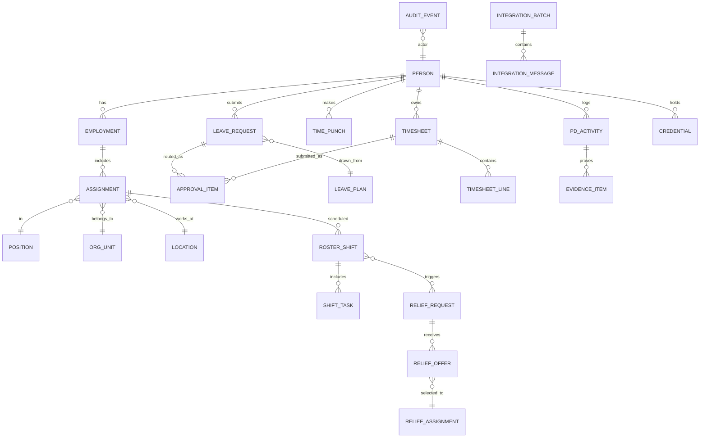
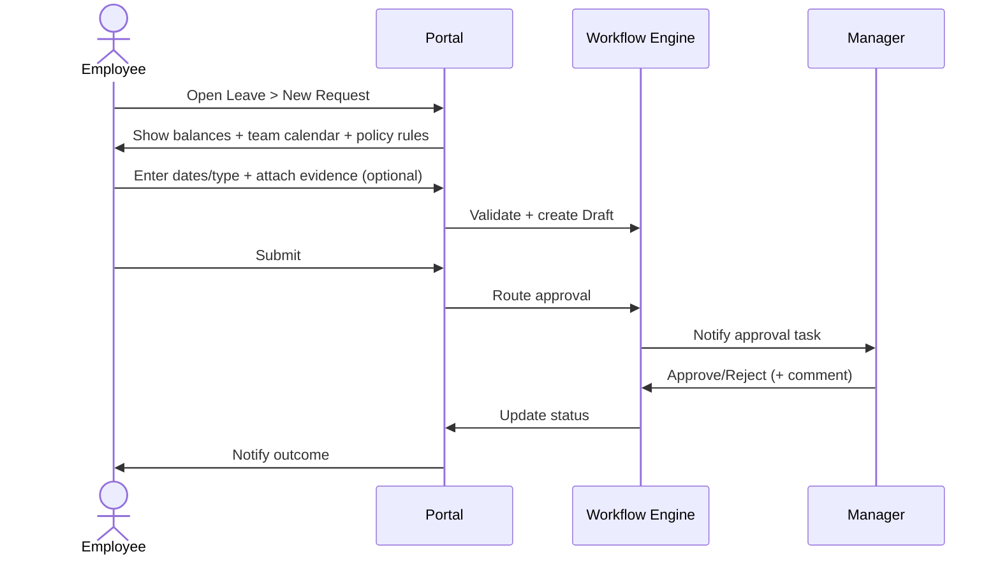
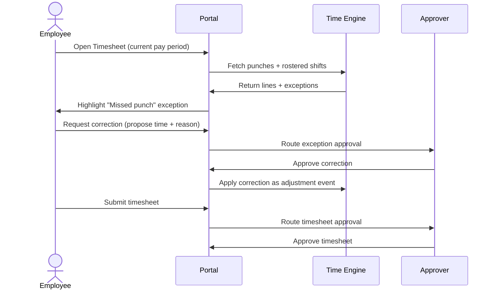
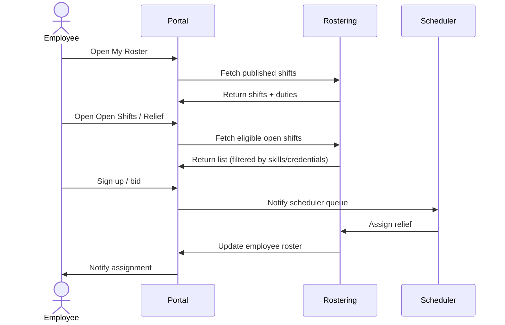
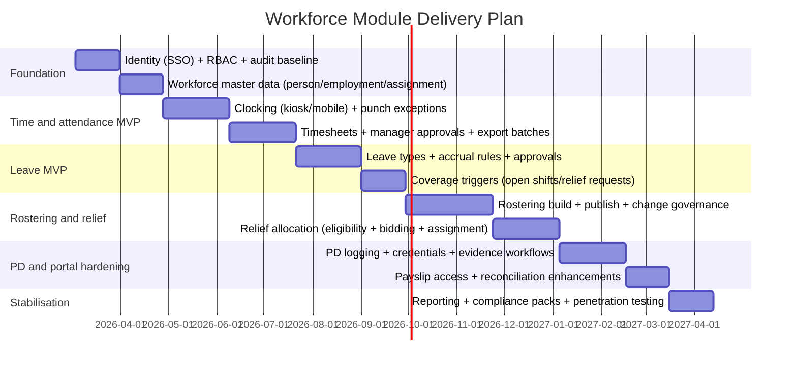

# Staff-Facing HR and Workforce Management Capabilities

## Executive summary

This report specifies a staff-facing HR/workforce module spanning leave/absences, time capture (including kiosks), timesheets, rostering/duties, relief allocation, payroll integration, professional development (PD) tracking, and a staff self-service portal. It also recommends an integration strategy and phased implementation plan, designed to minimise payroll risk, strengthen auditability, and support policy-driven compliance across jurisdictions.

Key conclusions:

- A “single workforce record” (person → employment/assignment → position/location/cost centre) is the backbone for every downstream workflow (leave, rostering, time capture, PD, payroll export). Record-keeping and traceability must be built-in, not bolted on, particularly where jurisdictions require long retention and prohibit misleading records. citeturn29view0  
- Design approvals as a generic, configurable workflow engine (policy-driven routing, delegations, SLAs, reminders, multi-step approvals), then apply it consistently to leave, timesheet exceptions, roster publishes/changes, relief allocations, and PD evidence verification.  
- For payroll interfaces, treat payroll as the “system of record” for pay calculation and statutory reporting where appropriate, while the workforce module is the system of record for time/attendance inputs and scheduling intent. Australia’s STP reporting occurs “each time you pay employees” via STP-enabled payroll software, so workforce exports must produce clean, reconciled pay inputs on payroll cut-off. citeturn28view0turn28view1  
- An MVP staff portal should cover: leave requests, timesheet submission/exceptions, roster viewing, relief/open-shift sign-up, PD logging (including evidence uploads), and payslip access—while enforcing privacy constraints (e.g., payslip presentation rules). citeturn29view1turn24view3  
- Implement in phases: identity/roles + core master data first; then time capture and approvals; then leave; then rostering & relief; then PD and refined payroll reconciliations—because time/leave errors compound quickly into pay and compliance risk.

Assumptions explicitly applied:

- No specific payroll vendor is assumed; patterns are vendor-agnostic and support both SME payroll products and enterprise payroll suites.
- The compliance discussion uses examples from Australia and the UK because the user context is Australia/Sydney and the requested language is en-GB; the design supports jurisdiction-specific policy configuration.

## Reference architecture and design assumptions

A robust workforce module is best viewed as a policy engine + immutable event history around a workforce master data model. The architecture separates:

- **Authoritative master data**: person, employment, assignment, position, org unit, location, cost centre.
- **Work intent**: rosters/duties, relief demand, open shifts, planned leave.
- **Work performed**: time punches, timesheet lines, exceptions, attestations.
- **Evidence & development**: PD activities, credentials, licences, certificates, approvals.
- **Compliance artefacts**: audit trail, retention rules, access logging, record correction history.

A key design constraint is that record-keeping obligations can require long retention and prohibit misleading or improperly altered records. For example, time and wages records may need to be kept for **7 years** in Australia, must be accessible/legible/in English, and cannot be changed except to correct an error (and cannot be false or misleading). citeturn29view0turn0search15

### Conceptual integration view

```mermaid
flowchart LR
  subgraph Identity
    IdP[Identity Provider/nSSO + MFA]
    Dir[Directory / HR Identity/nSCIM provisioning]
  end

  subgraph Workforce["Workforce Module (this spec)"]
    WFM[Workforce Core/nAbsence + Time + Rosters + Relief + PD]
    Audit[Audit Log + Evidence Store]
    Notif[Notifications/nEmail/SMS/Push/In-app]
  end

  subgraph Payroll
    PR[Payroll System/nPay runs + statutory reporting]
    Payslips[Payslip store / portal]
  end

  subgraph External
    Fin[Finance/GL]
    LMS[Learning platform]
    BI[Data warehouse / BI]
  end

  IdP -->|OIDC/SAML| WFM
  Dir -->|SCIM| WFM

  WFM -->|Pay inputs/n(earnings, leave, allowances)| PR
  PR -->|Payslips + pay results| Payslips
  PR -->|Journals| Fin

  WFM -->|Exports/Events| BI
  LMS <--> |Course completions/nPD evidence| WFM

  WFM --> Audit
  WFM --> Notif
```

The design is compatible with:

- **API-first** (REST/JSON over HTTPS) where payroll supports it (real-time or near-real-time).
- **Batch-first** (SFTP + CSV/XML) where payroll is file-driven, with reconciliation and exception handling.

## HR and workforce module specification

### Core data model and entity catalogue

The following entity set is sufficient to model the requested capabilities without overfitting to a specific industry. (Where “relief allocation” is domain-specific—e.g., substitute staffing—this model maps it to open shifts + eligibility + assignment.)

#### Entity relationships overview



#### Entity specification table

| Domain | Entity | Purpose | Key attributes (minimum) |
|---|---|---|---|
| Identity | Person | Human identity | person_id (UUID), legal name, preferred name, DoB (optional), contact methods, emergency contacts, identity links (directory_id), privacy flags |
| Employment | Employment | Contractual relationship | employment_id, employer entity, start/end dates, employment type (FT/PT/casual/contractor), status |
| Employment | Assignment | Where/what they do now | assignment_id, person_id, position_id, org_unit_id, location_id, manager_assignment_id, FTE, work pattern, effective dates |
| Structure | Org unit / Location / Cost centre | Allocation & reporting | ids, hierarchy paths, payroll costing codes |
| Leave | Leave plan | Accrual & entitlement rules | plan_id, unit (hours/days), accrual method, carryover, caps, eligibility, negative balance rules, approval policy |
| Leave | Leave request | Staff absence request | request_id, person_id, leave_type, start/end, part-day segments, reason, attachments, status, submitted_at, backdated flag |
| Time | Time punch | Clock event record | punch_id, person_id, device_id, timestamp (RFC3339), type (in/out/break), geo (optional), confidence, source |
| Time | Timesheet | Pay-period work record | timesheet_id, person_id, pay_period_id, status, submitted_at, approved_at |
| Time | Timesheet line | Worked time allocation | line_id, day/date, start/end/duration, earning_code, project/cost centre, roster_shift_id link, notes, exception flags |
| Rostering | Roster shift | Scheduled duty | shift_id, assignment_id, start/end, role/skill requirements, location, break rules, published status, change log |
| Rostering | Shift task | Duty components | task_id, shift_id, duty type, time window, notes |
| Relief | Relief request | Coverage demand | relief_request_id, originating_shift_id, reason (leave, unfilled, training), required skills, urgency, approval policy |
| Relief | Relief offer | Staff response | offer_id, relief_request_id, person_id, availability confirmation, conflicts, status |
| Relief | Relief assignment | Final allocation | assignment_id, relief_request_id, person_id, approved_by, notification timestamps |
| PD | PD activity | PD tracking & compliance | pd_id, person_id, category (internal/external), hours/credits, date range, evidence required, approval status |
| PD | Credential | Licences/certifications | credential_id, person_id, type, issuing body, issue/expiry dates, renewal rules, constraints (shift eligibility) |
| Governance | Approval item | Workflow step record | approval_id, object_type/id, step order, approver role/user, decision, decision_at, delegation used, SLA breach flag |
| Governance | Audit event | Tamper-evident history | audit_id, actor, action, object, before/after hashes, timestamp, reason code, source channel |
| Integration | Integration batch/message | Export/import trace | batch_id, interface_name, run window, counts, success/fail, payload checksums, error categories |

### Workflows and approvals by capability

Workflows should be *policy-driven* (configured by jurisdiction, workforce group, or award/contract rules), but implemented as the same primitives:

- **State machine** per object type (draft → submitted → approved/rejected → posted/locked → exported → reconciled).
- **Approval policy** (who approves, when escalation occurs, what evidence is required, what is auto-approved).
- **SLA policy** (target durations by object type and urgency).
- **Delegation policy** (acting manager, temporary delegation, automatic fallback).

#### Cross-capability approval summary

| Capability | Typical initiator | Typical approver chain | Lock points | SLA examples (configurable) | Edge cases requiring special handling |
|---|---|---|---|---|---|
| Leave/absence | Employee | Line manager → (optional) HR | Payroll cut-off; pay run lock | Manager decision within 2 working days; HR within 3 working days | Backdated leave; leave in advance agreements; overlaps with roster; medical certificate; partial day |
| Timesheets/timecards | Employee / kiosk device | Employee attestation → manager/timekeeper → payroll | Pay period close; export lock | Exceptions reviewed within 1 working day; regular timesheets within 2 working days | Missed punches; duplicate punches; device offline; manual edits; roster mismatch |
| Rostering/duties | Scheduler/manager | (Optional) manager → workforce admin | Publish lock; change lock window | Rosters published N days prior; changes require consultation window | Overlapping rosters; fatigue/rest breaches; last-minute changes; skills/licence constraints |
| Relief allocation | Scheduler/manager | Approver depends on urgency (manager) | Assignment lock once accepted | Urgent coverage within 2 hours; normal within 1 day | Multiple eligible staff; conflicts; cancellation; double-booking across locations |
| PD tracking | Employee / manager | Manager or compliance officer | Evidence lock (immutable) | Evidence review within 5 working days | Expired credentials blocking shifts; external courses; retroactive PD logging |
| Payslip access | Payroll system | n/a (informational delivery) | Payroll-issued | Payslips available within statutory timeframe where applicable | Masking sensitive leave categories; access privacy; revoked access post-termination |

### Detailed workflow diagrams

#### Leave request and approval workflow

This workflow must detect overlaps with published rosters and enforce policy-based constraints before approval.

```mermaid
flowchart TD
  A[Employee creates leave request/n(date range, type, attachments)] --> B{Validate policy}
  B -->|checks: balance, eligibility,/nblackout dates, notice period| C{Roster overlap?}
  C -->|Yes| D[Flag impact/nshow affected shifts/duties]
  C -->|No| E[Submit request]

  D --> E
  E --> F[Route approval/n(manager or delegate)]
  F --> G{Backdated or evidence-required?}
  G -->|Yes| H[Require evidence upload/n(e.g., certificate)/n+ optional HR review]
  G -->|No| I[Manager decision]

  H --> I
  I -->|Approve| J[Update leave ledger/nrecalculate balances]
  I -->|Reject| K[Notify employee/nwith reason]
  J --> L[Notify employee + scheduler/nrecompute coverage needs]
  L --> M{Coverage required?}
  M -->|Yes| N[Create relief request / open shift]
  M -->|No| O[Complete]
```

Record-keeping requirements and payroll accuracy drive design choices: leave taken and leave balances must be retained as part of time and wage records and support employee access requests. citeturn29view0turn29view1

#### Time punch to timesheet workflow

This workflow supports kiosks/mobile/web clocking, exceptions, and manager approvals.

```mermaid
flowchart TD
  A[Clock event/n(kiosk/mobile/web)] --> B[Create TimePunch]
  B --> C{Pairable?/n(in/out/break)}
  C -->|No| D[Exception: missed/invalid punch]
  C -->|Yes| E[Build time segments/n+ apply rounding rules]

  D --> F[Notify employee/n+ manager/timekeeper queue]
  E --> G[Populate TimesheetLine(s)/n(costing + earning codes)]
  G --> H[Employee review + attestation]
  H --> I[Manager approve]
  I --> J[Lock pay period data/n(export-ready)]
  J --> K[Export to payroll interface/n(batch/API)]
  K --> L[Reconciliation/n(import pay result summary)]
```

Systems should treat altered time and wage records as controlled corrections rather than silent edits, consistent with jurisdictions that restrict record changes to error correction and prohibit misleading records. citeturn29view0turn0search15

#### Rostering and relief allocation workflow

This workflow incorporates roster publishing, change governance, and relief fill.

```mermaid
flowchart LR
  A[Planner creates roster/n(demand, skills, rules)] --> B[Validate rules/n(rest breaks, max hours,/ncredential eligibility)]
  B --> C[Publish roster]
  C --> D{Change needed?}
  D -->|No| E[Employees view roster/n+ acknowledge]
  D -->|Yes| F[Create change proposal/n(reason, impact)]
  F --> G[Consult affected staff/n+ capture responses]
  G --> H[Approve change/n(manager policy)]
  H --> I[Republish / notify]

  C --> J{Unfilled shift/nor approved leave?}
  J -->|Yes| K[Relief request / open shift]
  K --> L[Notify eligible pool]
  L --> M[Staff opt-in / bid]
  M --> N[Select candidate/n+ approval if required]
  N --> O[Assign relief/nupdate roster]
  O --> P[Lock assignment/n+ feed to time capture]
```

If operating under Australian rules, roster changes may require discussion/consultation with employees, and awards/agreements can add extra constraints—so the product must store evidence of consultation and decision history. citeturn16view0turn29view0

### Role-based access control and segregation of duties

RBAC must prevent self-approval, restrict pay-sensitive operations, and provide privacy boundaries. The following roles are a practical baseline:

- **Employee** (self-service)
- **Relief pool member** (can opt into open shifts within eligibility)
- **Line manager** (approves leave/timesheets for direct reports; views team data)
- **Scheduler/roster officer** (creates rosters, manages open shifts; cannot change pay rules)
- **HR administrator** (manages leave plans, employment data; cannot finalise payroll)
- **Timekeeper** (resolves time exceptions; cannot change pay rates)
- **Payroll officer** (runs payroll; consumes approved time/leave inputs; restricted HR edits)
- **Compliance officer** (PD/credential verification; audit reporting)
- **System administrator** (technical config; no routine access to payroll totals unless explicitly granted)

#### Segregation-of-duties rules (minimum)

1. No user can approve their own leave, timesheet, roster exception, relief allocation, or PD evidence.  
2. Payroll officers cannot modify the underlying time punches or roster history being used as pay inputs after payroll cut-off; they can only request corrections through controlled workflows.  
3. Schedulers cannot modify pay rules or earning code mappings; they can only schedule work and request exceptions.  
4. HR can adjust leave plans/balances only with dual-control (second approver) when changes are material (e.g., balance grants, retroactive accrual changes).  
5. System administrators cannot access payslips or sensitive HR documents by default; emergency access must be break-glass with full audit, timeboxed.

### Audit trails, notifications, and SLAs

#### Audit trail requirements

Audit logging is not limited to “who clicked approve.” It must support:

- **Object lifecycle events**: create/submit/approve/reject/withdraw/cancel/export/reconcile.
- **Before/after snapshots** (or hashed deltas) for key records: leave dates/units, timesheet lines, roster shifts, credential status.
- **Reason codes** for adjustments: “missed punch correction,” “manager-authorised overtime,” “backdated sick leave with evidence,” etc.
- **Evidence chain**: file hashes, uploader, timestamp, and verification outcome.

This aligns with record-keeping regimes requiring that records not be false or misleading and only be changed to correct error, with long retention. citeturn29view0turn0search15

#### Notifications

Minimum channels:

- In-app (task queue + timeline)
- Email (formal record of request/decision)
- Push (mobile, where used)
- Optional: calendar integration for approved leave and roster changes

Notification triggers:

- Leave submitted/approved/rejected; evidence requested; SLA breach reminders.
- Missed punch detected; timesheet submitted; exceptions assigned; approvals overdue.
- Roster published; roster changed; open shift posted; relief assignment confirmed/cancelled.
- PD credential expiry approaching; credential blocks shift assignment.
- Payroll export success/failure; reconciliation mismatch detected.

#### SLAs and operational cut-offs

Support policy configuration for:

- **Approval SLAs** by object and urgency class.
- **Payroll cut-off**: freeze window for timesheet edits; escalation for missing approvals.
- **Roster publish lead time**: a target date/time for roster availability, plus governed changes after publish.

## Payroll integration strategy

### Integration patterns and when to use them

#### Batch (file-based) integration

Best when:

- Payroll only supports imports via file drop (common in legacy or outsourced payroll).
- You need deterministic “pay period snapshots” and auditable export batches.

Typical approach:

- Generate export batches per pay period and payroll group.
- Deliver via SFTP (over SSH) and optionally PGP-encrypt payloads. SSH provides encrypted transport and server authentication. citeturn4search1turn4search2  
- Use CSV where the payroll importer is strict; CSV format has an established definition and MIME type (“text/csv”). citeturn20search0

#### Real-time (API-based) integration

Best when:

- Payroll supports APIs for time/leave inputs, employee changes, and retrieval of pay results.
- You need fast feedback loops (e.g., immediate validation of earning code mapping).

Typical approach:

- Use HTTPS with TLS 1.3 for transport security. citeturn4search0  
- Use OAuth 2.0 for delegated authorisation. citeturn0search2  
- Use OpenID Connect for authentication/SSO patterns on top of OAuth 2.0. citeturn3search0

#### Hybrid

Most organisations end up hybrid:

- APIs for master data sync and status checks.
- Batch exports for pay-period time/leave inputs because payroll processing is inherently periodic and locked.

### Data domains, ownership, and mapping strategy

A practical ownership model:

- Workforce module owns: rosters, time punches, timesheets, leave requests, PD/credentials, approval history.
- Payroll owns: pay runs, statutory reporting outputs, payslips, final gross/net calculations.
- Shared master data requires one “golden source” per attribute set:
  - Person identity: HR/workforce (or HRIS)
  - Pay rates and tax settings: payroll
  - Cost centres/gl accounts: finance/ERP
  - Credentials: workforce/learning/compliance (depending on tooling), but enforced in rostering

#### Core mapping tables (must be explicitly managed)

1. **Earning code mapping**: timesheet line type → payroll earning code (ordinary, overtime, shift diff, allowance).  
2. **Leave code mapping**: leave type → payroll absence category / earning substitution rule.  
3. **Costing mapping**: location/org unit/project → payroll costing segment(s).  
4. **Employee identifier mapping**: workforce person_id/assignment_id ↔ payroll employee_id/payroll_id.

Australian STP rules and downstream consumers can be sensitive to payee identity: ATO STP guidance indicates an STP report can include only one record per payee identity (based on payroll ID and identifying details). This elevates the importance of stable identifier strategy and rigorous merge rules. citeturn18search1  
Similarly, Services Australia describes STP data as year-to-date figures per pay period, broken down into components—so corrections and reconciliation must account for YTD deltas, not just period totals. citeturn28view3

### Reconciliation and controls

A high-reliability payroll interface includes three reconciliation loops:

1. **Pre-export validation** (before sending to payroll)
   - Missing approvals
   - Unresolved exceptions
   - Missing earning/leave mapping
   - Overlaps (two shifts, duplicate time segments)
2. **Post-import validation** (payroll accepted inputs)
   - Compare record counts and totals by employee and earning code
   - Confirm “import batch id” and per-record statuses
3. **Post-payrun reconciliation**
   - Pull pay result summaries (gross hours, leave hours, key allowances) and compare to exported values
   - Flag variances for investigation rather than silently “accept payroll as truth”

Where UK payroll reporting uses RTI, the employer typically submits a Full Payment Submission (FPS) each time they pay employees. citeturn16view2 The system should therefore support stringent pay-period locking and provide an immutable export batch record for audit.

### Error handling and resilience

Minimum requirements:

- **Idempotency**: for API writes, support idempotency keys to safely retry POST/PATCH without duplicating side effects (documented and increasingly standardised). citeturn20search3turn20search7  
- **Retry policy**: exponential backoff; circuit breakers for vendor outages.
- **Dead-letter queues**: quarantine failed messages for manual correction.
- **Error taxonomy**: auth errors, schema validation errors, business rule errors (invalid earning code), and referential errors (unknown employee id).
- **Graceful degradation**: if real-time validation is down, queue transactions and fall back to batch export.

### Security controls for payroll integrations

- Transport security: TLS 1.3. citeturn4search0  
- Authorisation: OAuth 2.0; authentication: OpenID Connect. citeturn0search2turn3search0  
- Provisioning to workforce portal: SCIM (HTTP-based) standardises identity provisioning patterns. citeturn14view3  
- Data minimisation: only export pay inputs needed for payroll calculation; avoid exporting sensitive attachments unless required.
- Privileged operations: separate integration credentials per environment; rotate secrets; least privilege scopes.
- Full traceability: store export payload checksums and mapping versions used.

## Minimum viable staff portal feature set and UX flows

This portal is “staff-facing,” but must also serve managers (approvals) and schedulers (coverage) without leaking payroll-sensitive data.

### MVP feature set

The MVP should ship these modules with coherent navigation and a single “My Work” home:

- **Leave**
  - View balances (where permitted), team calendar (if authorised), request leave, attach evidence, withdraw/correct.
  - Policy feedback (notice periods, blackout days, balance warnings).
- **Time & timesheets**
  - Clock in/out (where applicable), view time punches, correct missed punches (request-based), submit timesheet, track approval status.
- **Roster**
  - View published rosters, shift details (location, duty, breaks), roster change notifications, acknowledge.
- **Relief / open shifts**
  - Browse eligible shifts, sign up/bid, see selection outcomes, cancel within allowed windows.
- **PD**
  - Log PD hours/credits, upload evidence, track credential expiry, request manager verification.
- **Payslips**
  - Access payslips securely and privately; download/print.
  - Must support jurisdictions where payslips can be electronic and must be issued within specific timeframes. citeturn29view1

Where operating under Australian rules, payslips must be provided within **1 working day of pay day** and can be electronic, but privacy constraints exist (e.g., paid family and domestic violence leave must not be mentioned on payslips, including leave taken and balances). citeturn29view1turn5search5

### UX flow diagrams

#### Leave request self-service



#### Timesheet submission with missed punch correction



#### Roster viewing and relief sign-up



### Access constraints in the portal

- Employees can see their own:
  - leave balances (subject to policy) and leave history
  - punches/time entries and approvals
  - roster shifts
  - PD logs and credential status
  - payslips (from payroll system)
- Employees cannot see:
  - pay rates, other employees’ pay data, payroll export files
  - other employees’ leave reasons or medical evidence
- Managers can see:
  - team leave calendar and approval queues
  - team timesheet status and exceptions
  - team PD compliance dashboards (completion/expiry), but not necessarily sensitive attachment content unless required

### Edge case handling checklist

- **Backdated leave**: require reason + evidence + HR review depending on policy; must not break payroll lock—route to “retro adjustment” process.
- **Leave in advance**: store explicit agreement where required; enforce maximum negative balance; record agreement artefact. citeturn29view0  
- **Missed punches**: represent as exception events; correction approval creates an adjustment record, not a silent overwrite.
- **Overlapping rosters**: detect at creation and change time; allow override only with dual approval and audit comment.
- **Rest breaches/fatigue**: rules engine should block or warn when schedules violate rest requirements (UK daily rest and weekly rest examples exist in official guidance). citeturn30view0turn30view2  
- **Privacy-sensitive leave types**: ensure payslip and portal presentation rules mask sensitive categories where required. citeturn29view1  

## Vendor capabilities and common standards

This section provides: (a) a vendor capability comparison table, and (b) a standards/protocols table covering APIs, file transfers, security, and payroll reporting formats. Vendor examples are illustrative; selection should follow a formal procurement and fit-gap assessment.

### Vendor capability comparison

| Vendor | Leave / absence | Time capture (kiosk/mobile) | Timesheets & exceptions | Rostering / scheduling | Relief / open shifts | PD / learning tracking | Payroll integration surfaces |
|---|---|---|---|---|---|---|---|
| entity["company","Workday","hcm software vendor"] | Yes (absence requests, balances, approvals) citeturn26view0turn26view2 | Supports mobile check-in/out with geofencing; kiosk options mentioned citeturn22view2 | Real-time validations; configurable auditing citeturn22view2 | Positioning includes scheduling unified with time/absence/payroll citeturn22view2turn26view2 | Indirect (via scheduling/open shifts patterns; depends on configuration) citeturn22view2 | Learning product supports enterprise learning and compliance tracking citeturn26view1turn26view3 | Vendor-specific APIs/connectors (not assessed here); commonly API + batch in market |
| entity["company","UKG","workforce management vendor"] | Absence management positioning; automates time off requests and leave rules citeturn22view1turn22view0 | Clock-in supports timeclocks/mobile/desktop/telephony; even touch-free facial recognition is referenced citeturn22view0 | Missing punch alerts; continuous timesheet readiness described citeturn22view1turn22view0 | Scheduling included; best-fit schedules based on demand/skills/compliance; employees can select open shifts citeturn22view1 | Open shift selection supported citeturn22view1 | Talent management includes learning academies positioning citeturn9search2 | Marketplace/integrations positioning; payroll usage depends on product mix citeturn22view1 |
| entity["company","Oracle","enterprise software vendor"] | Absence management integrates with time and payroll; diverse absence plans citeturn25view1turn25view3 | Time collection device configurations referenced in implementation guidance citeturn25view3 | Time & labour + absence integration patterns documented citeturn25view3 | Workforce management explicitly links time/labour/scheduling/leave with payroll and finance citeturn25view0 | Self-scheduling / swaps and “no shift uncovered” positioning citeturn25view0 | Learning product supports creating/assigning/tracking training, certification management citeturn25view2 | REST APIs exist for HR domains (e.g., absences endpoints) citeturn10view3turn8search4 |
| entity["company","SAP","enterprise software vendor"] | Time Off supports employee requests and manager approvals via mobile/web; team absence calendar referenced citeturn23view3 | Clock-in/out feature supports integration with terminals/external services (per help guidance snippet) citeturn21search17turn21search25 | Time management capabilities include recording absences and attendances (per help guidance snippet) citeturn21search5turn8search15 | Workforce Scheduling product announcement: integrates with time tracking and payroll; GA “second half of 2026” citeturn23view1 | Product positioning includes notifications and real-time disruption response citeturn23view1 | Depends on SAP learning stack; not assessed here | Payroll integration referenced via Employee Central Payroll integration (product page) citeturn23view1turn7search1 |
| entity["company","ADP","payroll and hcm vendor"] | Leave approval workflows and time-off balances referenced citeturn15view1 | Time & attendance includes shift scheduling, employee self-service, geo targeting citeturn15view1 | Variance (roster vs timesheet comparisons) and real-time dashboards referenced citeturn15view1 | Shift scheduling and roster publishing referenced citeturn15view1 | Coverage often via scheduling + integrations ecosystem | Depends on product mix; not assessed here | API Central describes developer access to secure APIs and explicitly references OpenID Connect and OAuth 2.0 citeturn15view0 |
| entity["company","Dayforce","hcm and payroll vendor"] | Absence/leave is part of workforce management positioning (alerts for absenteeism) citeturn24view1 | Geofencing and biometric timestamping referenced citeturn24view1 | Time collection in real time and pay policy adherence positioning citeturn24view1 | Scheduling/rostering product: auto-generate rosters; shift trade mentioned; scheduled shift concepts documented citeturn24view0turn24view2 | Shift trades supported (as described) citeturn24view0 | Learning guide includes CPD tracking and external learning evidence uploads citeturn24view3 | Single platform time and pay positioning (global payroll on same platform) citeturn24view1 |

Notes on interpreting the table:

- “Relief allocation” is rarely a named module outside domains like education/healthcare; vendors typically express it via **open shifts, shift bidding, shift swaps**, and urgent coverage workflows. citeturn22view1turn24view0turn25view0turn23view1  
- Vendor roadmaps matter. For example, SAP’s Workforce Scheduling page explicitly states general availability in the second half of 2026, which affects procurement timing if scheduling is a near-term requirement. citeturn23view1  

### Standards and protocols comparison

| Category | Standard / protocol | What it standardises | Why it matters here |
|---|---|---|---|
| Web transport | TLS 1.3 (RFC 8446) | Secure channel for HTTP APIs | Required for protecting payroll and employee personal data in transit citeturn4search0 |
| Web semantics | HTTP (RFC 9110) | HTTP request/response semantics | Establishes interoperable API expectations across vendors citeturn20search1 |
| API data format | JSON (RFC 8259) | JSON interchange format | Dominant payload format for REST APIs in HR/payroll ecosystems citeturn2search2 |
| Authentication | OpenID Connect Core | Identity layer on OAuth 2.0 | Enables SSO for staff portals and admin consoles citeturn3search0 |
| Authorisation | OAuth 2.0 (RFC 6749) | Delegated authorisation framework | Standard for payroll and HR APIs; supports scoped access citeturn0search2 |
| Identity provisioning | SCIM (RFC 7644) | HTTP-based identity provisioning | Reduces bespoke connectors for user lifecycle management citeturn14view3 |
| Federation alternative | SAML 2.0 core spec | XML assertions for auth/attributes/authorisation | Common enterprise SSO method, especially in older stacks citeturn27view0 |
| File transfer | SSH transport (RFC 4253) | Secure transport for services over insecure networks | Underpins SFTP-style secure file delivery patterns citeturn4search1 |
| File encryption | OpenPGP message format (RFC 4880) | Encrypt/sign payloads | Optional defence-in-depth for batch payroll exports citeturn4search2 |
| Flat file format | CSV (RFC 4180) | Common CSV format + MIME type | Practical for batch payroll imports/exports, when strictly defined citeturn20search0 |
| Timestamps | RFC 3339 | Internet timestamp profile of ISO 8601 | Needed for accurate punch records and cross-timezone reconciliation citeturn2search3 |
| Security management | ISO/IEC 27001 | ISMS requirements | Governance framework for protecting HR/payroll data citeturn2search0 |
| Cloud privacy | ISO/IEC 27018 | PII protection controls for public cloud | Useful when workforce portal is SaaS and stores employee PII citeturn2search1 |
| Privacy framework | ISO/IEC 29100 | Privacy terminology and roles | Helps structure privacy-by-design practices in workforce systems citeturn4search3 |
| Payroll reporting AU | STP (Australia) | Report payroll info each time you pay employees | Workforce exports must align to payroll cut-offs and YTD reporting expectations citeturn28view0turn28view1turn28view3 |
| Payroll reporting UK | RTI FPS (UK) | Submit FPS each time employees are paid | Drives strong locking/reconciliation controls around pay periods citeturn16view2 |

### Compliance considerations to bake into configuration

- **Australia (examples)**
  - Time and wages records retention and integrity requirements: keep for 7 years; must be accessible/legible/in English; only change to correct error; not false or misleading. citeturn29view0turn0search15  
  - Payslips: must be issued within 1 working day; can be electronic; additional privacy constraints for family and domestic violence leave reporting. citeturn29view1turn5search5  
  - Privacy: employee records exemption exists in certain circumstances; systems should still implement privacy-by-design because the exemption is conditional and does not cover all contexts. citeturn19view0  
- **UK (examples)**
  - Payroll record retention: keep PAYE/payroll records for 3 years from end of tax year; includes employee leave and sickness absences; comply with data protection rules. citeturn16view1  
  - Working time rest: official guidance describes 20-minute break for >6 hours, 11 hours daily rest, and weekly rest expectations—supporting schedule rule engines and fatigue checks. citeturn30view0turn30view2  

## Implementation timeline and phased deliverables

A realistic delivery plan prioritises payroll risk reduction and user adoption. The timeline below assumes a mid-sized organisation; adjust duration based on integration complexity and change-management capacity.

### Phased plan



### MVP deliverables by phase

- **Phase Foundation**
  - SSO, baseline RBAC, audit event schema, and master data objects (person/employment/assignment), enabling all later workflows.
- **Time and attendance MVP**
  - Kiosk/mobile clocking, missed punch workflow, timesheet submission/approval, payroll export batch + reconciliation dashboard.
- **Leave MVP**
  - Leave requests with approvals, balances, attachments, roster impact detection, and coverage trigger creation.
- **Rostering and relief**
  - Roster build/publish/change governance including consultation capture where applicable; open shifts/relief bidding and assignment locks.
- **PD and portal hardening**
  - PD logging + evidence; credential expiry enforcement in rostering; payslip access with privacy constraints; improved reconciliation loops.
- **Stabilisation**
  - Compliance reporting packs (record retention exports, audit extracts), security review, and operational SLAs.

This sequencing reflects the practical dependency chain: record-keeping and pay accuracy requirements necessitate early investment in time capture controls and auditability, especially where laws mandate long retention and restrict record alteration. citeturn29view0turn16view1turn28view1


