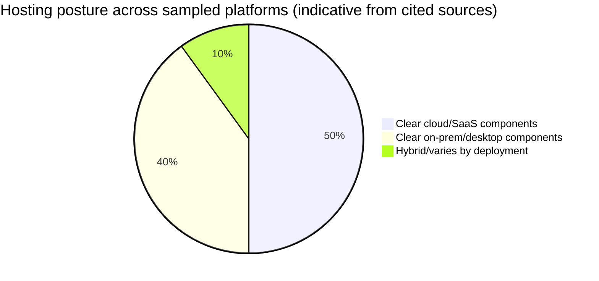
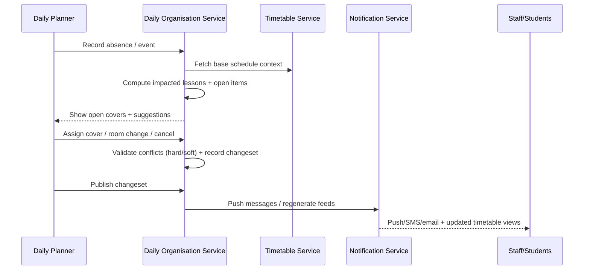

# Timetabling and Daily Operations Features Across Scheduling Platforms

## Executive summary

Across education and enterprise scheduling, a consistent product split emerges: (a) **timetable construction** (cyclical, high‑constraint, optimisation-heavy) and (b) **daily organisation** (exceptions, absences, substitutions, room changes, real-time communications). This division is explicit in several major school platforms that ship separate (or clearly delineated) products/modules for daily cover, while still drawing from the “base” timetable: examples include **Edval Timetable vs Edval Daily** (daily overlay + cover workflows), **Untis vs WebUntis substitution planning**, and **aSc timetabling vs substitutions/cover**. citeturn17view1turn18view1turn7view0

In **constraint modelling**, most school and academic timetabling platforms expose a library of domain constraints (availability, spread, adjacency, non-consecutive rules, room feasibility) with **weights/criteria** rather than a general-purpose modelling language. For example, Untis describes a generator where the scheduler **defines and weights criteria** and the system generates multiple candidate timetables using a “unique algorithm”, while aSc documents both “default distribution” rules and configurable constraints plus an explicit “constraint relaxation” mechanism (i.e., allow partial violation to produce a complete timetable). citeturn18view0turn6search0turn6search3 By contrast, **UniTime/CPSolver** is unusually transparent: it is an open solver framework using constraint-programming primitives and local-search style methods (including Iterative Forward Search and related heuristics documented in CPSolver literature). citeturn27search1turn27search22

For **daily changes**, mature platforms typically provide (1) an “open work” view (open covers / unassigned items / conflicts), (2) a suggestion engine based on availability and suitability, and (3) rapid publishing to mobile/web and notifications. WebUntis substitution planning explicitly describes automatic derivation of “open substitutions” from absences and activities, suitability criteria (availability, class familiarity, subject capability), and push notifications via mobile. citeturn18view1turn18view4 aSc’s substitutions documentation shows explicit conflict indicators (“red cross”), drill-down explanations, and resolution paths (change the substitution, change the conflicting entity, or override). citeturn8view2

**Calendar integration** is dominated by **iCalendar subscription** patterns rather than full bidirectional sync. WebUntis and aSc both support iCal-based export/subscription; WebUntis additionally documents an iCal-based “Calendar API” for ingesting external calendar data (HTTP POST with JSON request body returning iCal). citeturn4view2turn19search4turn18view3 A notable operational edge case is explicitly documented: iCal limitations around *exceptions to recurring events* (single-instance moved/deleted occurrences may not propagate), which has direct implications for “daily operations overlay” design. citeturn18view2

For **integration and APIs**, the sampled market spans from file-based exchange (CSV/XML/flat files) to mature REST + webhooks. Coursedog publishes API endpoints and guidance (REST, token-based sessions with expiry constraints) and emphasises bidirectional SIS integration practices; UKG publishes formal webhook documentation for near-real-time event delivery with HMAC signing. citeturn23view2turn25search8turn26search2 These observations strongly support a **two-service reference architecture**: a “Timetable Service” owning versioned base schedules and a “Daily Organisation Service” owning overlays, approvals, audit, and real-time distribution, with integrations designed for failure tolerance and eventual consistency.

## Methodology and platform selection

This report focuses on **timetabling + daily operations** (education) and **scheduling + operational changes** (enterprise workforce scheduling). Platforms were chosen to be representative across K‑12, higher education, and enterprise workforce management, and to enable evidence-based comparison using **primary vendor documentation**, product pages, and publicly available guides/papers.

Evidence quality varies by platform. Some vendors publish detailed technical docs (e.g., WebUntis iCal API; UKG webhooks; UniTime/CPSolver); others describe capabilities but do not disclose solver internals or hard scale limits. Where solver type/constraint languages are not published, this is stated explicitly and the conclusion is bounded to the cited sources.

Platforms compared (10 total, exceeding the requested minimum 8): aSc, Edval, Untis/WebUntis, TimeTabler, CELCAT, Scientia, Ad Astra, Coursedog, UKG, UniTime.

## Comparative feature matrix

The matrix below uses the requested feature groups as columns. “Native engine” means the platform appears to ship its own timetabling/scheduling solver capability (not merely a calendar UI on top of another system). Where a feature is outside the platform’s scope (e.g., “room capacity” in workforce scheduling), it is marked **N/A**.

| Platform | Timetable creation & constraint modelling | Rooming & room allocation | Staff allocations & qualifications | Calendar integration (Google/Exchange/ICS) | Daily changes (real-time edits, versioning/audit) | Substitutions/relief workflows | Room swaps & resource booking | Conflict detection & automated resolution | UI patterns (editing + daily dashboards) | Export/import formats | APIs & integration patterns | Licensing/hosting + native engine notes |
|---|---|---|---|---|---|---|---|---|---|---|---|---|
| **entity["company","aSc","school scheduling vendor"]** (aSc TimeTables + Online + Substitutions) | Constraint library includes subject distribution rules and configurable constraints; supports **constraint relaxation** (partial violations to complete generation). Solver internals not disclosed in referenced docs. citeturn6search0turn6search3turn6search4 | Supports room booking and classroom changes; timetable + substitutions consume shared room occupancy. citeturn6search17turn8view0turn19search3 | Substitute suggestions based on “many criteria” (tunable); teacher availability and clashes are core constraints. Formal qualification model not explicitly documented in cited pages. citeturn7view0turn8view2 | Timetables Online supports **ICS download** and **Webcal subscription** for external calendars. citeturn19search4 | Online substitutions support multi-user work, publish/review before release, and immediate visibility after publishing; collision drill-down exists. Explicit “versioning” terminology not used, but operational workflow is publish-gated. citeturn7view0turn8view2 | Explicit cover workflow: entering absences → system lists impacted lessons → select substitute candidates → publish + notify. citeturn7view0 | Documented classroom change publication into substitution feed; supports moving/swapping lessons as a cover strategy. citeturn8view0turn8view1 | “Red cross” conflict indicator with explanation; supports override and chained changes. Automation appears suggestion-based rather than full auto-repair. citeturn8view2 | Substitution UI patterns include conflict icons and right-click change actions; knowledge base indicates structured tasks (move/swap/replace). citeturn8view1turn8view2turn7view2 | **XML export** (default and configurable schema) for integration; ICS/Webcal for calendars. citeturn4view1turn19search4 | Primarily file/config-driven export; no webhook/REST API described in the cited aSc docs (beyond calendar links). citeturn4view1turn19search4 | Mixed desktop + web extension model; Online features emphasise no-install access for published timetables/substitutions. Native timetabling engine implied by generation/constraint relaxation docs. citeturn19search7turn6search3 |
| **entity["company","Edval","school timetabling vendor"]** (Edval Timetable + Edval Daily) | Timetable built using “business rules” + automated processes; algorithms can fix clashes and optimise lesson spread; supports auto-staffing/auto-rooming and rostering. Solver type not disclosed. citeturn17view1 | Auto-rooming in base timetable; Daily explicitly manages room changes/bookings. citeturn17view1turn17view3 | Daily covers can be staffed via casuals/extras/in‑lieus/underloads/teacher swaps; Daily records staff absences and can merge classes. Qualification metadata not described in cited docs, but cover options are explicit. citeturn17view1turn17view3 | Calendar sync specifics (Google/Exchange/ICS) not described in the cited Edval pages. (Integration focus is SIS/LMS). citeturn17view1turn17view4 | Daily is explicitly an overlay of day-to-day variations on the cyclical timetable; produces bulletins and day sheets; cloud-based multi-user access with role-based access. citeturn17view1turn17view3 | Strong relief workflow: automatic or manual cover; can merge/cancel classes; includes exam block scheduling with auto staff/rooming. citeturn17view1turn17view3 | Daily: room changes & bookings as first-class daily operations. citeturn17view3 | Conflict handling implied via “fix clashes” in core engine and cover generation in Daily; auto-resolution details not publicly specified. citeturn17view1 | Daily operations emphasise morning control-room functions (cover, swaps, bulletins); base product oriented to construction and audits. citeturn17view0turn17view3 | Integration via web services sync (LISS/SIF) or flat-file export/import; specific schemas not enumerated in cited docs. citeturn17view1 | Integration emphasises multi-system sync; API style is described as web services + file exchange (not webhooks/GraphQL). citeturn17view1 | Edval Timetable is not cloud-based; Edval Daily/Choice are cloud-based; annual renewable licensing. Native engine is core product. citeturn17view1turn17view0 |
| **entity["company","Untis","school timetabling vendor"]** (Untis + WebUntis) | Untis generator: scheduler “defines and weights criteria”; system generates multiple timetables via a “unique algorithm”; includes diagnosis tool; supports multi-week timetables/terms. Solver type not disclosed. citeturn18view0 | Models room availability/time; room feasibility part of weighted criteria; substitution workflows create new calendar entries and can cancel periods for events. citeturn18view0turn18view4 | Substitution planning uses availability + suitability incl. class familiarity and subject suitability; policy tags/labels support reasoning about availability. citeturn18view1turn18view4 | Supports iCal subscription for timetable; calendar import/export includes private calendar integration (limited to two) and iCal feed export; provides iCal Calendar API for ingest (JSON request → iCal response). citeturn4view2turn18view2turn18view3 | Web-based substitution planning for short-notice changes; updates published so “everybody involved will see the changes” and can be notified. Formal audit/versioning terminology not in cited pages. citeturn18view1 | Explicit relief workflow: teacher reports ill → open substitutions computed → choose cancellation/supervision/substitution; push notification + optional pre-approval request. citeturn18view1 | Substitution module supports creating calendar entries directly; activities create absences; room changes supported as part of daily planning. citeturn18view4turn4view3 | Integrated diagnosis tool for discrepancies; substitution planning maintains open substitution list and labelling; auto-suggestions exist but full automatic repair not described. citeturn18view0turn18view1turn18view4 | Documented UI patterns: “open substitutions visible”, suggestion list, labels/filters; timetable view includes external calendar overlays and a three-dot menu controls. citeturn18view1turn18view2turn18view4 | iCal feeds; Calendar API uses JSON request body and iCal VEVENT response fields; other export formats not detailed in cited pages. citeturn18view3turn18view2 | Calendar API (HTTP POST, signed) for integration partners; otherwise integration details not enumerated here. citeturn18view3 | Modular suite (desktop + web). Native timetabling engine implied by generator and multi-week capabilities; daily operations strongly web/mobile. citeturn18view0turn18view1 |
| **entity["company","TimeTabler","school timetabling software vendor"]** | Emphasis on interactive, user-driven scheduling (“drive” the timetable; override control). Constraint/solver internals not described in cited sources; constraint entry exists in training materials. citeturn20search3turn20search1 | Rooms assigned during scheduling: default assignment uses up to three “Favourite Rooms” per teacher. citeturn20search4 | Staff allocation details not deeply specified in cited sources; platform supports teacher-based room favourites and presumably teacher availability constraints (training materials). citeturn20search1turn20search4 | Supports exporting teacher timetable data to Outlook via CSV import workflow. (This is export/import rather than live sync.) citeturn20search14 | Daily-change workflows (cover/substitutions) not evidenced in the cited TimeTabler sources; primary focus appears to be construction + exports. citeturn20search3turn20search2 | Not evidenced in cited documentation. | Room assignment support is clear; broader resource booking not evidenced in cited sources. citeturn20search4turn20search2 | Conflict checking referenced via “checks” and constraint lessons; automated conflict resolution not evidenced. citeturn20search0turn20search1 | UI described as step-driven and “friendly screens”; scheduling is interactive rather than “optimizer-first”. citeturn20search3 | Exports to MIS partners; calendar export via CSV for Outlook. Other formats not confirmed here. citeturn20search2turn20search14 | Integration appears export/import oriented (MIS export menu); no published REST/webhook evidence in cited sources. citeturn20search2turn20search14 | Desktop-style product posture; native “engine” appears user-driven with checks/constraint entry materials. citeturn20search3turn20search1 |
| **entity["company","CELCAT","academic timetabling vendor"]** (Timetabler suite/Celcat AI) | Supports interactive + automated timetabling; high-level “auto-scheduling” is described, but solver type not disclosed in cited vendor/market docs. citeturn21search15turn22view0 | Strong room booking ecosystem: Room Booker Live; explicit integration with room booking + availability; supports utilisation reporting. citeturn22view0turn21search15 | Primarily academic scheduling; staff portals and notifications exist; explicit qualification modelling not described in cited docs. citeturn21search15turn22view0 | Documented Exchange/Outlook outputs and iCalendar feeds; notification service for timetable changes. citeturn22view0turn21search4 | “Real time change notification” is explicit; operational publishing stack includes web publisher + calendar views + notifications. citeturn21search15turn22view0 | K‑12-style “teacher substitution” is not the core focus; daily changes are handled as event changes + communications. citeturn21search15turn22view0 | Room swaps and booking changes are explicit (room booking feature + notifications triggered by e.g. room change). citeturn22view0 | “Clash-free schedules” and change notifications are described; details of automatic resolution strategies are not specified in the cited public docs. citeturn21search15turn22view0 | Suite includes calendar-style publishing and web portals; multi-user and fine-grained permissions described in UAL deployment. citeturn22view0 | Publishes web-ready timetables in HTML/PDF; iCalendar feeds. Broader import/export likely via integration manager but schemas not enumerated. citeturn22view0 | Integration: Systems Integration Manager schedules frequent imports; APIs for integration are referenced in service definition, but technical details not exposed in cited sources. citeturn22view0turn21search15 | Historically includes Windows client apps + web components; newer “Celcat AI” described as cloud-based. Native engine is inherent to product line. citeturn22view0turn21search8 |
| **entity["company","Scientia","timetabling software vendor"]** (Syllabus Plus / Enterprise Timetabler) | Timetabling uses soft constraints with a **score/suitability** notion; schedulers can examine suggested day/time with bars and see whether a first-level resolution is possible, indicating constraint-driven optimisation. Solver internals not disclosed in cited training docs. citeturn2view3 | Room selection is capacity-informed (planned size drives required location capacity); preferred rooms can be defined and feasibility checked. citeturn2view3turn2view0 | Staff allocation present (lecturer assignment) but formal qualification schemas not described in cited documents. citeturn2view3 | Calendar integration not evidenced directly in cited Scientia docs; many deployments integrate via downstream timetable apps/read models. Example: a MyTimetable integration references reading Scientia Enterprise reporting DB (integration evidence). citeturn1search24 | Supports mid-cycle changes via rescheduling logic and conflict analysis (“first level resolution possible” indicators). Explicit audit/versioning not detailed in cited docs. citeturn2view3 | Not a primary feature focus (higher-ed context). | Handles ad-hoc events and complex room/slot search; details depend on deployment. citeturn2view3 | Conflict workflows are present (problem lists; feasibility checks); automated resolution extent not fully specified in cited docs. citeturn2view3 | UI: heatmap/score visualisations and “suggested day/time” panels are explicit; supports guided resolution indicators. citeturn2view3 | Export/import formats not enumerated in cited docs; integration commonly via reporting DB/ETL patterns in practice. citeturn1search24 | Integration details not disclosed in cited core docs; reporting DB integration evidence exists. citeturn1search24 | Typically enterprise deployment (institution-specific). Native engine: yes, implied by rescheduling/suitability optimisation UI and timetabling workflow. citeturn2view3 |
| **entity["company","Ad Astra Information Systems","academic scheduling vendor"]** (Astra Schedule) | Described as all-in-one scheduling with “automatic optimisation” and conflict-free validation; solver details not disclosed in cited product pages. citeturn1search10turn1search2 | Emphasis on facilities: manage buildings, rooms, resources; room utilisation and scheduling are core. citeturn1search10turn1search2 | Academic scheduling focus: section scheduling and resource assignment; formal “qualification/certification” model not described in cited sources. | Calendar integration can be implemented via Calendar API providing activity data to third-party programs; Exchange/Google specifics not described in cited docs. citeturn1search30 | Supports “real-time updates” and workflow approvals are implied by operational usage; a Banner integration example references multiple daily deliveries of section changes (near-real-time operational sync). citeturn1search34turn1search18 | Not a K‑12 substitution planner; focuses on academic activities and changes. | Resource booking and work-order-like facilities workflows are part of product narrative; specific “room swap” UX not detailed in cited pages. citeturn1search10 | Conflict detection emphasised (“conflict free validation”); automated resolution approach not specified in cited sources. citeturn1search10 | UI patterns include campus-wide scheduling + optimisation emphasis; third-party guides suggest portal and operational editing. citeturn1search18turn1search10 | Import/export formats not enumerated here; Calendar API provides activity data access (API-mediated exchange). citeturn1search30 | Calendar API is documented; broader integration exists (SIS sync examples). Webhooks/GraphQL not evidenced in cited Ad Astra sources. citeturn1search30turn1search34 | Offered as a cloud package (market listings exist); may also be deployed institutionally. Native solver implied by optimisation claims. citeturn1search14turn1search10 |
| **entity["company","Coursedog","academic operations software vendor"]** | Academic scheduling platform enforcing rules/timelines; conflict prevention via validation, rule exceptions, and optimisers for assignments (e.g., room assignments, optimiser features described in admin guide). Solver internals not disclosed; focus is policy enforcement + optimisation tooling. citeturn23view3turn24view1turn24view0 | Explicit goal: “automatically make the perfect room assignments”; supports buildings/rooms and block-outs. citeturn23view3 | Collects instructor preferences; integrations can support real-time consistency with SIS; explicit “skills/qualifications” schemas not described in cited guides. citeturn24view2turn24view0 | Public integration page references sharing events to Outlook and Google Calendar via event feeds/invites; scope appears focused on events feeds and notifications. citeturn23view4 | Strong workflow/audit posture: phases, validation, submission, request workflows; requests are centrally stored and tracked, supporting auditability and governed changes. citeturn24view1turn24view0turn23view3 | Not K‑12 cover-focused; “requests” act as the operational change mechanism rather than “relief teacher” substitution. citeturn24view1 | Event scheduling integration exists; room/event changes are handled through editing + requests + feeds rather than “swap period” semantics. citeturn23view4turn24view1 | Conflict indicators: yellow warning triangles; Validate Schedule modal aggregates conflicts; rule exceptions allow submission with approved conflicts. citeturn24view1 | UI patterns: timeline/phases gating; dashboards; validate modal; requests portal; preference forms via shared links. citeturn23view3turn24view2turn24view1 | Export/reporting is supported; API-based data extraction is described for bulk operations (e.g., token-based API usage). Precise file formats for data interchange depend on integration. citeturn25search8turn23view2 | Integration methodology includes staging → validation → bidirectional testing; API usage docs show REST session endpoints and token expiry semantics. citeturn23view2turn25search8 | Cloud service with environments (staging/production) implied by integration workflow. Native scheduling engine is policy+optimisation tooling rather than a published general solver. citeturn23view2turn24view0 |
| **entity["company","UKG","workforce management software company"]** (UKG Pro WFM / Dimensions scheduling) | Workforce scheduling (shift-based) rather than academic timetabling; advanced scheduling uses rule checking, shift coverage, and “algorithms” (not disclosed). citeturn26search5turn26search4 | Rooms typically N/A (workforce scheduling); resources are people/roles/coverage. | Explicit skills/certifications support: visibility into employee availability, skills, and certifications; scheduling rules can account for proficiency levels; formal skill/certification definitions include expiry (certifications). citeturn26search5turn26search17turn26search35 | Calendar integration exists in UKG Learning (subscribe by URL to external calendars) and Outlook-based time-off confirmation patterns are documented; this is not necessarily full schedule-to-calendar for WFM shifts in cited sources. citeturn26search3turn26search19 | Daily changes: employees can submit swap/open-shift/availability change requests; My Schedule includes daily list and request actions. citeturn26search37turn26search5 | Shift swaps and cover requests are first-class (swap/open shift/self-schedule/cover). citeturn26search37turn26search5 | Room swaps N/A; resource = shift coverage. | Conflict detection includes labour rules + skill/cert coverage; automated resolution is typically best-fit schedule generation within constraints (details not disclosed). citeturn26search4turn26search17turn26search5 | UI patterns include mobile-first scheduling and “My Schedule” calendar + daily events list + request button. citeturn26search5turn26search37 | Export/import formats not characterised in cited UKG sources (WFM integrations often API-mediated). | Has formal developer hub and **UKG Webhooks** for near-real-time event delivery with HMAC security; REST/SOAP APIs referenced broadly, webhook docs are explicit. citeturn26search2turn26search25 | Enterprise SaaS posture; native scheduling engine with advanced rule checking/algorithms implied. citeturn26search5turn26search27 |
| **entity["organization","UniTime","open-source academic scheduling project"]** (UniTime + CPSolver) | Full academic timetabling and exams plus event management and managing changes; CPSolver provides constraint programming primitives with local-search based framework; published research indicates hybrid/metaheuristic solver combinations (IFS + hill climbing + great deluge + simulated annealing). citeturn27search0turn27search1turn27search22 | Includes room/event management features (room timetables as a variant of events; supports shared rooms with other events). citeturn27search0turn27search3 | Focus is academic resources (instructors, rooms); “qualifications/certifications” model not core; allocation is by availability, constraints, and optimisation metrics. citeturn27search0turn27search1 | Calendar integration not evidenced directly in cited UniTime sources in this dataset; UniTime strongly supports event/timetable views internally. | Explicitly supports “managing changes” to timetables; distributed system for multiple managers to coordinate schedule modifications. citeturn27search0 | Not K‑12 relief-specific; supports event changes and scheduling adjustments. | Event management includes multi-resource timetables; room bookings are part of event concepts. citeturn27search3 | Solver is transparent; modelling/constraints are explicit; automatic resolution is solver-driven. Scale evidence from ITC work includes large instances (thousands of classes). citeturn27search2turn27search1 | UI patterns include room/subject/curriculum/personal timetable views; supports filtering and permissions for lookup. citeturn27search3 | Integration formats vary; open architecture allows extensions; solver library and APIs are open-source. Specific OneRoster/IMS formats not evidenced here. citeturn27search0turn27search1 | Open-source code and solver library on GitHub; integration is developer-driven. (Webhooks not core; REST depends on deployment extensions). citeturn27search1turn27search9 | Open-source under licence; deployable on-prem. Native engine is CPSolver. citeturn27search1turn27search21 |

### Exportable matrix data (CSV)

```csv
Platform,TimetableCreation_Constraints,Rooming,StaffAllocations_Qualifications,CalendarIntegration,DailyChanges_Substitution,ConflictDetection_AutoResolution,ExportsImports,APIs_Integration,LicensingHosting_NativeEngine
aSc,"Constraint library + relaxation; solver not disclosed","Room booking + classroom changes","Substitute candidates; qualifications not specified","ICS download + Webcal subscription","Online substitutions; publish workflow","Conflict indicator + override; suggestions","XML export (configurable); ICS/Webcal","File/config export; calendar links","Desktop + web extension; native engine implied"
Edval,"Business rules + algorithms; auto-staff/room; solver not disclosed","Auto-room + daily room changes/bookings","Cover via casuals/extras/swaps; qualifications not specified","Not evidenced in cited docs","Daily overlay; auto/manual cover; bulletins","Clash fixing implied; details not specified","Web services (LISS/SIF) or flat files","Web services + file exchange","Edval desktop; Daily cloud; native engine"
Untis/WebUntis,"Weighted criteria; multiple timetable generation; solver not disclosed","Room availability; events create absences","Suitability criteria include subject/class familiarity","iCal subscription; calendar import; iCal Calendar API","Online substitutions; push notifications","Diagnosis + open substitutions + suggestions","iCal feeds; iCal API fields","HTTP POST JSON -> iCal; partner docs","Modular suite; native engine implied"
TimeTabler,"Interactive scheduling; constraints entry lessons","Favourite-room assignment","Teacher allocation implied; qualifications not specified","CSV export to Outlook (import workflow)","Not evidenced","Checks/constraints; auto-resolution not evidenced","MIS exports; CSV","Export/import oriented","Desktop posture; native engine limited/unclear"
CELCAT,"Interactive + auto-scheduling; solver not disclosed","Room Booker + utilisation","Academic resources; qualifications not specified","Exchange outputs + iCal feeds + notifications","Real-time change notification","Clash-free claim; auto-resolution not detailed","HTML/PDF publishing; iCal","Integration manager; APIs referenced","Windows + web; cloud evolution; native engine"
Scientia,"Soft constraints scoring; suitability view; solver not disclosed","Capacity-driven locations; preferred rooms","Staff assignment; qualifications not specified","Not evidenced; often via downstream integrations","Rescheduling indicators; mid-cycle change handling","Problem lists; resolution indicators","Not enumerated","Reporting DB integration evidence","Enterprise deployments; native engine implied"
AdAstra,"Automatic optimisation claim; solver not disclosed","Facilities/resources core","Academic scheduling; qualifications not specified","Calendar API for activity data","Operational sync examples","Conflict-free validation claim","Not enumerated","Calendar API + SIS integrations","Cloud listings exist; native engine implied"
Coursedog,"Policy enforcement + optimisers; solver not disclosed","Auto room assignments; buildings/rooms","Instructor preferences; qualifications not specified","Outlook + Google calendar/event feeds","Phases + requests + validation; audit via requests","Warnings + validate modal + exceptions","Reporting + API-based extraction","REST API + integration pipeline","Cloud w/ staging/prod; native optimisation tooling"
UKG,"Workforce scheduling; advanced scheduling algorithms not disclosed","N/A","Skills/certifications + proficiency levels","Learning calendar sync; Outlook time-off patterns","Shift swaps; cover; My Schedule requests","Labour rules + skill/cert coverage","Not characterised","Developer hub + webhooks","Enterprise SaaS; native scheduling engine"
UniTime,"CPSolver (local-search + CP primitives)","Room/event management and timetables","Academic allocations; qualifications not core","Not evidenced in cited dataset","Manages changes; distributed scheduling","Solver-driven optimisation","Varies by deployment","Open-source code; extensions possible","Open-source; on-prem friendly; native engine CPSolver"
```

### Quick comparative chart (hosting posture)



(“Indicative” here reflects whether the cited sources explicitly describe cloud vs desktop/on‑prem aspects; several vendors support multiple deployment models or evolve over time.)

## Reference architecture for a two-service approach

A two-service approach maps well to observed product segmentation in the market: a **Timetable engine** optimises the “base plan”, and a **Daily organisation engine** overlays exceptions, runs substitution workflows, and handles publication/notifications. This mirrors the explicit split seen in Edval (Timetable vs Daily), Untis (Untis vs WebUntis substitution planning), and aSc (TimeTables vs substitutions). citeturn17view1turn18view1turn7view0

### Architectural goals

The architecture should:

Maintain a **versioned, auditable historical record** (base timetable releases + daily overlay changes), because daily changes are operationally frequent and must be explainable (who changed what, when, and why). Cover workflows and request workflows shown in aSc, WebUntis, and Coursedog indicate the operational necessity of publish gates, conflict visibility, and governed overrides. citeturn7view0turn8view2turn18view1turn24view1

Provide **incremental conflict detection** (fast) for daily edits, while reserving **heavy optimisation** (slower) for the base timetable generation and periodic “repair” runs.

Support **multiple integration modes**:
- Pull/batch sync (nightly, hourly) typical of SIS interchange and “clean room” deployments. citeturn23view2  
- Near-real-time event delivery for operational responsiveness (webhooks). citeturn26search2  
- Calendar subscription patterns where external calendars are downstream consumers (iCal/Webcal). citeturn19search4turn4view2  

### Recommended architecture diagram

```mermaid
flowchart LR
  subgraph SourceSystems[Source systems]
    SIS[SIS / Student registry]
    HR[HR / Contracts / Skills]
    Directory[Identity / SSO]
    Facilities[Facilities master data]
    Calendars[External calendars]
  end

  subgraph Core[Core scheduling domain]
    TS[Timetable Service/n(base schedule + optimiser)]
    DS[Daily Organisation Service/n(overlays + workflows + audit)]
    ES[(Event Store / Change Log)]
    RM[(Read Model Store/n(date-materialised views))]
  end

  subgraph Channels[Distribution channels]
    Web[Web portals]
    Mobile[Mobile apps]
    Signage[Signage / displays]
    Export[Exports & integrations]
    Notifications[Email/SMS/Push]
  end

  SIS -->|courses, enrolments, groups| TS
  HR -->|availability, skills/quals| TS
  Facilities -->|rooms, capacity, resources| TS

  TS -->|Publish BaseSchedule vN| DS
  TS -->|Schedule snapshots| RM

  DS -->|Absences, events, bookings, substitutions| ES
  DS -->|Materialise EffectiveSchedule by date| RM

  Calendars <-->|iCal subscribe / import overlays| DS

  Directory -->|SSO/RBAC| Web
  Directory -->|SSO/RBAC| Mobile
  RM --> Web
  RM --> Mobile
  RM --> Signage
  DS --> Notifications
  DS --> Export
```

### Core data model

A practical model is to treat the timetable as immutable “base” plus mutable overlays:

**Base domain (Timetable Service ownership)**
- `Term`, `Cycle`, `WeekPattern` (A/B weeks, multi-week rotations)
- `Timeslot` (day + period block), `BellSchedule` (time mapping)
- `Resource`: `Staff`, `StudentGroup`, `Room`, `Equipment`
- `ActivityDefinition`: course/lesson template (duration, recurrence, required resources)
- `BaseScheduleVersion`: a complete candidate schedule, with metadata: `{version, status: draft|approved|published, objectiveScores, constraintViolationsSummary}`

**Overlay domain (Daily Organisation Service ownership)**
- `Absence` (staff/student/room unavailable time ranges)
- `ExceptionEvent` (excursion, exam, assembly)
- `Booking` (ad-hoc room booking / meeting)
- `ChangeRequest` and `Approval` (where governance is needed; similar to Coursedog request workflows). citeturn24view1
- `Substitution` (replacement staff assignment; can include “supervision” or “cancellation” types as in WebUntis). citeturn18view1turn18view4
- `ChangeSet` (atomic group of overlay edits)
- `Publication` (push to channels; regenerate iCal feeds; trigger notifications)

This structure directly accommodates iCal limitations: single-instance modifications in a recurring event can be lossy in iCal subscription workflows, so the system should **not** treat iCal as an authoritative bidirectional store of truth. citeturn18view2

### API surface and integration patterns

A service split also creates a clean API boundary:

**Timetable Service APIs**
- `POST /solve` (submit a problem definition + constraints + objectives; return job id)
- `GET /solve/{id}` (progress, candidate scores)
- `POST /schedules/{id}/publish` (emit immutable “BaseScheduleVersion vN”)
- `GET /constraints/catalog` (supported constraint types; recommended weights defaults)

**Daily Organisation Service APIs**
- `POST /overlays/absences`
- `POST /overlays/events`
- `POST /overlays/bookings`
- `POST /overlays/substitutions`
- `POST /changesets/{id}/publish` (publish-gated operational release)
- `GET /effectiveSchedule?date=YYYY-MM-DD&resourceId=...`

**Sync/connectors**
- Batch: periodic import (SIS → TS; TS/DS → analytics). Coursedog explicitly describes a staging setup and bidirectional testing methodology. citeturn23view2
- Webhooks: DS emits events to downstream systems for “near real-time” updates using an outbox pattern; UKG’s webhook documentation illustrates signed delivery and subscription management patterns worth emulating. citeturn26search2
- Calendar:
  - Downstream subscription: DS publishes iCal/Webcal feeds (aSc, WebUntis, CELCAT deployments). citeturn19search4turn4view2turn22view0
  - Controlled ingestion: DS can ingest external calendar data if needed; WebUntis documents an iCal Calendar API with a JSON request and iCal response semantics (VEVENT, DTSTART/DTEND etc.). citeturn18view3
  - “No true bi-directional truth”: treat external calendars as *views* or *auxiliary constraints*, not the authoritative schedule store.

### Failure modes and mitigations

**Integration drift / partial writes**
- *Mode*: SIS batch import succeeds for courses but fails for rooms → solver schedules against stale room inventory.
- *Mitigation*: schema-level validation + “minimum viable dataset” gating; reject solution publish if critical reference data is inconsistent; use staging environment and validation steps (as described in Coursedog integration methodology). citeturn23view2

**Race conditions in daily edits**
- *Mode*: two planners assign the same relief teacher simultaneously; conflict discovered late.
- *Mitigation*: optimistic concurrency on the overlay store + instant conflict checks and hard locks on “unique resources per timeslot”; surface conflicts immediately (pattern matches aSc collision indicators and drill-down). citeturn8view2

**Calendar sync ambiguity**
- *Mode*: a single occurrence of a recurring event is moved; iCal subscriber doesn’t reflect it.
- *Mitigation*: publish daily overlays as “single-instance events” in the feed for the next N days (rolling window), and avoid modelling daily exceptions as iCal recurrence exceptions; explicitly document calendar limitations (WebUntis does). citeturn18view2

**Over-automation risk**
- *Mode*: auto-cover assigns a teacher who is technically free but not appropriate; staff trust collapses.
- *Mitigation*: show scored suggestions with reasons (availability/subject/class familiarity as in WebUntis) and allow request/approval gates for higher-impact changes (Coursedog request patterns). citeturn18view1turn24view1

### Scalability considerations

Base timetable solving is computationally heavy; daily overlays are high-frequency reads/writes:

- Run the solver (Timetable Service) as a **job system** (queue + workers), with cancellation, checkpoints, and reproducible “inputs → outputs”.
- Materialise daily read models (“EffectiveSchedule per date/resource”) in a read-optimised store to serve dashboards/signage without recomputing overlays per request.
- Consider a transparent solver approach if you need inspectability and reproducibility: UniTime/CPSolver provides evidence that local-search frameworks can model constraints explicitly and scale to large academic instances (e.g., ITC datasets with thousands of classes). citeturn27search1turn27search2turn27search22

## Edge-case catalogue

The following catalogue focuses on edge cases that commonly break naïve designs. Each entry includes an example, user impact, and mitigation.

| Edge case | Example | Impact | Mitigation |
|---|---|---|---|
| Recurrence exception loss in iCal | A weekly lesson is moved once due to excursion; subscribed iCal calendar does not reflect the moved/deleted single instance (documented limitation). citeturn18view2 | Staff/students follow wrong room/time; high operational friction | Publish near-term schedule as explicit single-instance VEVENTs; treat iCal as a downstream view, not bidirectional truth; add “refresh” mechanics (aSc notes calendar refresh concepts). citeturn19search4turn18view2 |
| Overlapping absence with event staffing | A teacher scheduled for an excursion event becomes ill; system must remove them from the event and show “missing teacher” in the event line. citeturn4view3 | Hidden understaffing risk; safety/compliance issue | Model events as first-class activities; absences should generate missing-resource alerts for both lessons and events; provide per-event staffing requirement checks. citeturn4view3 |
| Chained substitution edits causing secondary conflicts | Fixing one cover creates another clash; aSc documents “chain of changes” and collision drill-down. citeturn8view2 | Planners get stuck; accidental double-booking | Support multi-step change graphs; show dependency chain; provide a rollback-friendly changeset model with preview before publish. citeturn8view2 |
| “Emergency override” of conflicts | A planner intentionally assigns a teacher despite a conflict (override supported in aSc collisions doc). citeturn8view2 | Normalises rule-breaking; risk of silent systemic failures | Require justification + higher permission level; audit log; highlight overridden conflicts in dashboards and reports. citeturn8view2 |
| Partial attendance / split cohorts | Part of a class attends an event while the rest continue normal lessons (aSc substitution docs include temporary reassignment scenarios). citeturn7view2 | Incorrect registers, wrong room allocation, supervision gaps | Allow “group split” overlays with derived sub-groups; ensure registers, room capacity, and teacher coverage recompute per subgroup. citeturn7view2 |
| Multi-week (A/B) rotations + mid-year terms | Timetable changes after exams or in a new term; Untis supports multi-week and term ranges. citeturn18view0 | Incorrect effective schedule if date→cycle mapping fails | Put cycle/term resolution in a single authoritative service; test boundary days; store explicit term and cycle calendars, not inferred. citeturn18view0 |
| Room capacity vs enrolment drift | Course enrolment increases after timetable published; originally valid room becomes under-capacity. | Overcrowding; safety; poor student experience | Re-run room feasibility checks nightly; treat capacity as a hard/alert constraint; support automatic re-room suggestions (Coursedog and Scientia emphasise room assignment optimisation/capacity). citeturn23view3turn2view3 |
| Teacher suitability constraints in cover | Substitute must know subject/class; WebUntis uses criteria such as availability, class familiarity, subject match. citeturn18view1 | Poor lesson quality; staff dissatisfaction | Maintain structured skills/qualification tags (and expiry if relevant), and score suggestions with explanations. (UKG’s skills/certifications model is an enterprise analogue.) citeturn18view1turn26search35 |
| Skills/certifications with proficiency levels | Certain work requires certification at a proficiency level; schedule rule handling includes proficiency matching modes. citeturn26search17turn26search35 | Compliance breach if mis-scheduled | Represent skills/certifications as time-bounded attributes; enforce in hard constraints for regulated roles; alert before schedule publish. citeturn26search17turn26search35 |
| Governance/approval requirements | Department submits schedule, then requests changes; Coursedog supports requests with statuses and approvals. citeturn24view1 | Shadow edits via email; no audit trail | Build change requests as first-class objects; keep immutable history of approvals and outcomes; reflect in read models immediately after approval. citeturn24view1 |
| High-frequency real-time notifications overload | Many changes (room swaps) trigger notification storms; CELCAT describes notification service for changed events; UAL implemented opt-in preferences. citeturn22view0 | Alert fatigue; ignoring critical updates | Notification batching windows; priority tiers; per-user preference controls; digest mode; channel throttling. citeturn22view0 |
| Token/session expiry affecting integrations | API tokens expire after 24 hours and may invalidate if user logs in (Coursedog API guidance). citeturn25search8 | Scheduled exports silently fail | Use service accounts for integrations; refresh-token or client-credential flows; monitor and alert on auth failures; implement retry with backoff. citeturn25search8 |
| Signed webhook delivery and replay | Webhook receiver exposed; UKG webhooks support HMAC signing. citeturn26search2 | Data tampering, replay attacks | HMAC signatures + nonce/timestamp checks; idempotency keys; strict schema validation; dead-letter queue. citeturn26search2 |
| Publishing gate vs “live edits” tension | Planners want draft edits but staff need stable view; aSc supports preparing substitutions and publishing when satisfied. citeturn7view0 | Staff see half-finished plans; confusion | Implement “draft changesets” and a publish action; show effective schedule only from published overlays; separate planner workspace. citeturn7view0 |
| Multiple timetablers, fine-grained permissions | CELCAT UAL case required many users with editing rights but scoped access; CELCAT described as multi-user with configurable access controls. citeturn22view0 | Accidental cross-department edits; data leakage | RBAC by department/course; “resource ownership” boundaries; audit per edit; per-team sandboxes and merge policies. citeturn22view0 |

## UI pattern catalogue

This section highlights recurring UI approaches that support both complex timetable construction and rapid daily changes. Where helpful, diagrams are included.

image_group{"layout":"carousel","aspect_ratio":"16:9","query":["WebUntis substitution planning interface screenshot","aSc EduPage substitutions red cross conflict screenshot","Edval Daily bulletin dashboard screenshot","Coursedog validate schedule modal screenshot"],"num_per_query":1}

### Construction and optimisation UIs

**Grid-first “card placement” editors (education)**  
Many education timetabling tools represent lessons as “cards” placed into a cycle grid. aSc’s help content and substitutions workflow show right-click actions and explicit move/swap/replace operations, consistent with a card/grid mental model. citeturn8view1turn7view2 This pattern supports:
- Fast manual repairs after generation.
- Visibility of “occupied” resources by timeslot.
- Direct manipulation (drag/drop or contextual actions).

**Score/heatmap guided placement (higher-ed, optimisation oriented)**  
Scientia’s training guide shows “suggested day/time” behaviours and suitability scoring, including visual indicators (bars/score) and feasibility hints like “first level resolution possible.” citeturn2view3 This is a powerful pattern when:
- Constraints are numerous and soft constraints must be traded off transparently.
- You want planners to understand why a placement is “good” or “bad”.

**Rule-weight configuration → candidate comparison**  
Untis explicitly frames generation as weighted criteria leading to multiple generated timetables from which the scheduler chooses the best. citeturn18view0 A practical UI pattern is:
- A “constraints/criteria” panel (weights, toggles)
- A candidate list with objective summaries (conflicts, gap metrics, preference satisfaction)
- A diff view between candidates

### Daily operations UIs

**Open-work queue + suggestion panel**  
WebUntis substitution planning describes open substitutions computed automatically and a suggestion mechanism based on availability, class familiarity, and subject suitability. citeturn18view1turn18view4 Effective UI elements include:
- “Open items” list sorted by urgency/time.
- Candidate list with reason tags (available, teaches subject, knows class).
- One-click publish and notification triggers.

**Conflict iconography + explainability drill-down**  
aSc explicitly documents conflict markers (“red cross”), explanations on double-click, and resolution options including override. citeturn8view2 This pattern generalises well:
- Use severity levels (hard conflict vs warning vs informational).
- Provide a deterministic “why” view (which constraint was violated, which resources are involved).
- Provide a “suggest fix” action that proposes minimal-change alternatives.

**Governed change workflow UI**  
Coursedog’s guides show Validate → Submit flows, a Validate Schedule modal aggregating issues, and request workflows for exceptions/changes after (or during) submission. citeturn24view1turn23view3 This pattern is critical for higher education:
- Prevents spreadsheet/email “side channels”.
- Creates a durable audit trail of exceptions.

### Workflow mockups

**Daily substitution workflow (generic, based on common vendor patterns)**



**Daily control-room dashboard (textual mockup)**

```
TODAY: Mon 01 Mar 2026
Open items (12) | Conflicts (3 hard / 5 warn) | Published updates (2)

[Open Covers]
- P2 10B Maths (Teacher ill)  | Suggested: T.Smith (free, teaches Maths), J.Lee (free, not Maths)
- P3 7A Science (excursion split) | Suggested: supervision + room change
...

[Room Issues]
- Room R12 over capacity (32>28) | Suggested: swap to Lab2 (cap 36) available
...

[Publish]
Draft changeset #184 (6 actions)  -> [Publish] [Schedule for 06:45] [Discard]
```

### Calendar integration UI considerations

A practical UI checkbox model is documented by WebUntis: calendar integration is controlled via admin settings plus per-user controls in the timetable UI, and iCal subscription remains available for external calendars. citeturn18view2turn4view2 The UI should make it explicit whether a calendar is:
- **Authoritative** (rare; typically internal only)
- **Read-only overlay** (common: external personal calendars displayed alongside timetable)
- **Downstream subscription view** (most iCal/Webcal feeds)

This reduces user confusion when external calendars do not fully reflect last-minute changes—an issue WebUntis explicitly attributes to iCal limitations for moved/deleted single occurrences in recurring events. citeturn18view2


